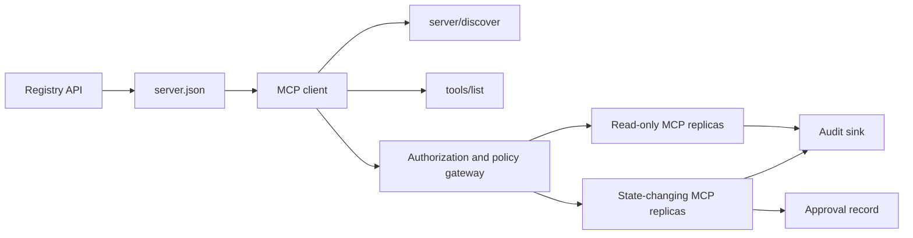

# 综合项目 13——带 Registry 与治理能力的无状态 MCP 服务器

> 生产级 MCP 并非单一服务器进程，而是一条契约链：可发布元数据、实时发现、无状态请求封装、授权、策略、审计与部署证据。

**Type:** 综合项目
**Languages:** Python 与 TypeScript 参考模型；生产实现可使用任意语言
**Prerequisites:** 第 11 阶段、第 13 阶段、第 14 阶段、第 17 阶段和第 18 阶段
**Required MCP deep dives:** [第 28 课：工具契约](../../../13-tools-and-protocols/28-mcp-tool-contracts-and-content/docs/zh.md)、[第 29 课：可靠性](../../../13-tools-and-protocols/29-mcp-reliability-cancellation-and-flow-control/docs/zh.md)、[第 30 课：Registry 供应链](../../../13-tools-and-protocols/30-mcp-registry-supply-chain-and-drift/docs/zh.md)和[第 31 课：一致性运维](../../../13-tools-and-protocols/31-mcp-conformance-versioning-and-operations/docs/zh.md)
**Protocol target:** MCP `2026-07-28`
**Time:** 约 25 小时

## 学习目标

- 实现无状态 MCP 请求与结果封装。
- 将 Registry 元数据与实时协议发现分开。
- 构建具备确定性且支持缓存的工具发现机制。
- 为每次工具调用强制执行签发方、受众、权限范围与审批策略。
- 部署无需会话亲和性的 Streamable HTTP。
- 为线协议、授权、策略、Registry 与审计边界提供行为证据。

## 必修 MCP 前置路径

在把这个综合项目视为可用于生产之前，请按顺序完成以下四节第 13 阶段课程：

1. [第 28 课](../../../13-tools-and-protocols/28-mcp-tool-contracts-and-content/docs/zh.md)定义本服务器必须公开的工具、模式、内容、分页、补全、路由与错误契约。
2. [第 29 课](../../../13-tools-and-protocols/29-mcp-reliability-cancellation-and-flow-control/docs/zh.md)定义取消竞态、截止时间、幂等性、背压、重试与重连行为。
3. [第 30 课](../../../13-tools-and-protocols/30-mcp-registry-supply-chain-and-drift/docs/zh.md)定义命名空间、来源、准入固定值、Registry 状态、漂移、台账与回滚证据。
4. [第 31 课](../../../13-tools-and-protocols/31-mcp-conformance-versioning-and-operations/docs/zh.md)定义黄金与负向交互记录、严格的协议版本分界、SDK 差异检查、代理证据、脱敏、健康检查与发布门控。

这个综合项目会集成这些工件，而不是用仅覆盖正常路径的 SDK 测试取代它们。

## 问题

某内部平台需要提供只读数据工具和少量状态变更工具。开发者必须能够发现服务器、了解如何连接、检查其实时能力，并且只能调用自己有权使用的操作。

难点并不是注册一个函数，而是让六种不同的事实始终保持一致：

1. `server.json` 说明可以从哪里安装或访问服务器。
2. `server/discover` 说明当前运行进程现在支持什么。
3. 每个请求说明自己使用的协议修订版和客户端能力。
4. 授权将调用方绑定到正确的签发方、资源与权限范围。
5. 策略决定当前这项具体操作能否运行。
6. 审计证据记录跨越边界的数据，同时不泄漏秘密或敏感负载。

任何一项发生漂移，平台都可能列出无法访问的服务器、把请求路由给不兼容的客户端、接受签发给其他资源的令牌，或在没有经过预期审查的情况下暴露破坏性操作。

## 两层发现机制

Registry 与实时 MCP 服务器回答的是不同问题。

| 层级 | 合约 | 回答的问题 |
|---|---|---|
| 发布 | `server.json` 与 Registry API | 这是什么服务器？其软件包或远程端点位于何处？如何配置？ |
| 运行时 | `server/discover` | 当前进程支持哪些协议版本、能力、扩展和服务器身份？ |

官方 Registry 使用带版本的 `server.json` 模式。远程条目可以指定 Streamable HTTP URL：

```json
{
  "$schema": "https://static.modelcontextprotocol.io/schemas/2025-12-11/server.schema.json",
  "name": "com.example/internal-readonly",
  "title": "Internal Read-Only Tools",
  "description": "Read-only incident and data lookup tools.",
  "version": "1.0.0",
  "remotes": [
    {
      "type": "streamable-http",
      "url": "https://mcp.internal.example.com/readonly"
    }
  ]
}
```

Registry 模式版本与 MCP 协议修订版彼此独立。不要为了让日期相同而改写其中任何一个；应分别按照各自契约验证两份文档。

模式有效并不能证明命名空间所有权。通过 `example.com` 验证的发布者应使用反向 DNS 命名空间 `com.example/*` 或其子命名空间。Registry 认证流程会证明该所有权。若按常规顺序排列域名标签，表示的就是另一个命名空间。

标准库模型中的 `validate_registry_document` 函数有意只实现远程配置档的部分验证。它检查官方要求的 `name`、`description` 和 `version` 字段、可选的 `title`、发布名称与长度约束、具体版本格式，以及每个 `streamable-http` 或 `sse` 远程端点的 HTTP(S) URL 格式。因为这个综合项目总会实时探测远程端点，它还额外要求 `remotes` 列表不能为空。`validate_publisher_namespace` 单独检查名称是否属于已验证的发布者域；`validate_runtime_alignment` 则比较发布名称和版本是否与实时 `serverInfo` 一致。官方模式还支持只有软件包的记录和更多远程端点字段。发布前，应使用固定版本的官方 JSON Schema 或 `mcp-publisher` 验证整份文档；不要把这个无依赖子集说成完整的模式验证。

服务器必须实现 `server/discover`，客户端可以在调用其他方法前调用它。这个综合项目的客户端会在解析端点后执行发现，取得当前协议修订版与实时能力：

```json
{
  "resultType": "complete",
  "supportedVersions": ["2026-07-28"],
  "capabilities": {
    "tools": {
      "listChanged": false
    }
  },
  "_meta": {
    "io.modelcontextprotocol/serverInfo": {
      "name": "com.example/internal-readonly",
      "version": "1.0.0"
    }
  },
  "ttlMs": 3600000,
  "cacheScope": "public"
}
```

私有目录可以索引额外的所有权、审查或生命周期数据，但不得把这些数据杜撰成 MCP 线协议字段或 `server.json` 根字段。组织策略应保存在发布记录旁边。确实需要公开自定义元数据时，使用 Registry 的 `_meta.io.modelcontextprotocol.registry/publisher-provided` 扩展，并遵守其 4 KB 上限。

## 无状态 MCP 核心

MCP 修订版 `2026-07-28` 移除了协议会话以及 `initialize` / `notifications/initialized` 握手，也移除了 `Mcp-Session-Id`。

每个请求都在 `params._meta` 中携带协议上下文：

```json
{
  "io.modelcontextprotocol/protocolVersion": "2026-07-28",
  "io.modelcontextprotocol/clientCapabilities": {},
  "io.modelcontextprotocol/clientInfo": {
    "name": "internal-platform-client",
    "version": "1.0.0"
  }
}
```

版本与能力是请求事实，而不是连接事实。负载均衡器可以把连续请求发送到不同的健康副本，因为任一副本都能只依据消息本身验证请求。

普通结果包含 `resultType: "complete"`。服务器应在每个结果的 `_meta.io.modelcontextprotocol/serverInfo` 中提供自身身份。协议版本缺失或不是字符串属于无效参数 `-32602`。错误 `-32022` 仅用于已提供字符串但该版本不受支持的情况，其数据必须精确为 `{"supported": ["2026-07-28"], "requested": "..."}`。

### 可缓存的发现

在有效工具集相同时，`tools/list` 必须具有确定性。结果包含：

- `ttlMs`，向客户端提示结果的有效期；
- `cacheScope`，取值为 `public` 或 `private`；
- 稳定的工具顺序，使相同列表可以复用提示缓存；
- `resultType: "complete"` 与服务器身份元数据。

逐用户授权通常应产生 `cacheScope: "private"`。不要把用户特定的工具可见性放在共享公共缓存之后。

## Streamable HTTP

网络服务器公开一个接受 POST 的 MCP 端点。每个 JSON-RPC 请求或通知都使用独立的 POST。

对于请求，服务器返回一个 JSON 对象，或返回仅属于该请求的 SSE 流。长期运行的 `subscriptions/listen` 请求承载客户端订阅的变更通知。当前传输方式没有独立的 GET 流、用于会话的 DELETE、会话请求头或 `Last-Event-ID` 重放机制。

每个请求包含：

- `MCP-Protocol-Version`，与正文元数据一致；
- `Mcp-Method`，与 JSON-RPC 方法一致；
- `Mcp-Name`，用于 `tools/call`、`resources/read` 与 `prompts/get`；
- `Accept: application/json, text/event-stream`。

镜像请求头不匹配时，应返回指定的 `-32020` 错误并拒绝请求。还要验证 `Origin`，把本地开发服务器绑定到环回地址，认证远程客户端；请求范围内的 SSE 响应关闭时，应将其视为取消。



```figure
cf-mcp-gate
```

## 授权与策略

传输元数据并不是授权。每次调用都必须验证授权。

对于远程服务器：

1. 发现受保护资源元数据。
2. 为该资源选择授权服务器。
3. 客户端注册优先使用 Client ID Metadata Documents，Dynamic Client Registration 仅用于兼容。
4. 在授权期间发送资源指示符。
5. 对照本次流程记录的授权服务器，验证返回的 `iss` 值。
6. 以签发方为键存储客户端凭据。绝不能跨签发方复用注册数据。
7. 在 MCP 服务器上验证令牌的签发方、受众或资源、过期时间与权限范围。
8. 针对具体工具和参数再执行一次策略决策。

`readOnlyHint` 和 `destructiveHint` 等工具注解可以帮助客户端呈现风险，但不能充当可信的授权控制。

### 审批是一条记录，不是万能的权限范围

状态变更调用需要一条审批记录，并将其绑定到操作主体、工具、规范化参数或摘要、目标环境、过期时间，以及一次性或可重复使用策略。单条聊天消息不能作为审批凭证。

Python 模型对键已排序的规范 JSON 计算哈希，再把该摘要与令牌主体、工具名称、服务器 URL 和过期时间绑定。只要改变一个参数，重放该记录就会在处理程序运行前失败。审批是独立证据，不是附加到访问令牌中的权限范围。

当把高风险工具放在可独立审查的界面上确实能减小爆炸半径时，应进行这种隔离。只有当凭据、策略、部署身份与审计控制也彼此分离时，隔离才有意义。

## 动手构建

### 1. 对发布元数据建模

创建 `server.json` 并按模式验证。在发布者已认证的命名空间内提供稳定名称；适用时，还要加入版本、描述、官方 `repository` 或 `packages` 元数据，以及远程或 stdio 传输配置。秘密信息应声明为环境变量输入，绝不能写成字面值。

### 2. 实现实时发现

在任何功能 RPC 之前实现 `server/discover`。声明支持的协议版本、能力、扩展与服务器身份，并增加用 `-32022` 拒绝不支持版本的测试用例。

### 3. 实现无状态封装

要求每个请求都带协议版本和客户端能力。每个结果都返回 `resultType` 和服务器身份。移除初始化状态、连接范围内的能力缓存与会话标识符。

### 4. 构建工具界面

从两个只读工具与一个状态变更工具开始。为每个工具提供有明确边界的 JSON Schema、准确描述、确定的结果结构和如实反映风险的注解。当客户端依赖结构化结果时，应添加输出模式。

### 5. 添加支持缓存的列表

以稳定顺序返回工具，并带上 `ttlMs` 和 `cacheScope`。分别演练缓存过期与列表变更通知行为。

### 6. 添加授权与策略

验证签发方、受众、过期时间和权限范围。每次工具调用都执行策略决策，并将审批绑定到精确的高风险操作。审批缺失或过期时，应在处理程序执行前拒绝。

### 7. 分离 Registry 与运行时验证

验证静态 `server.json` 记录，然后使用 `server/discover` 探测远程端点。当已发布的远程端点、身份、版本或必需能力与实时进程不一致时，报告漂移。

### 8. 添加审计证据

记录操作主体、签发方、资源、工具、策略决策、请求标识符、跟踪上下文（Trace Context）、延迟和结果。持久化前对敏感参数与结果进行脱敏或摘要处理。审计接收端必须位于模型可见上下文之外。

### 9. 演练水平扩展

在负载均衡器后部署两个无状态副本，至少发送 100 个并发请求。证明正确性不依赖亲和性。如果工具需要跨调用状态，应签发显式的不透明句柄，并将状态保存在共享持久系统中。

### 10. 通过真实传输链路验证

对真实服务器二进制文件运行一致性检查。捕获请求头和 JSON 正文，而不只是 SDK 对象。演练版本错误、请求头不匹配、缺少权限范围、受众错误、参数格式错误、处理程序失败、取消与缓存过期。

## 必需证据包

提交物必须包含以下五类证据，否则视为不完整：

| 证据 | 最低证明要求 | 来源课程 |
|---|---|---|
| 线协议 | 黄金与负向用例的脱敏原始请求头和 JSON-RPC 正文，包括元数据类型失败、请求头不匹配、不支持的版本、`resultType` 缺失或未知、通知无响应，以及响应 ID 匹配 | [第 31 课](../../../13-tools-and-protocols/31-mcp-conformance-versioning-and-operations/docs/zh.md) |
| 代理 | 同一个稳定用例分别直连和经已部署中间组件运行，并记录入口、源站与出口状态及正文摘要；证明协议错误未被折叠为通用 500 响应，流式传输也未被缓冲 | [第 29 课](../../../13-tools-and-protocols/29-mcp-reliability-cancellation-and-flow-control/docs/zh.md)和[第 31 课](../../../13-tools-and-protocols/31-mcp-conformance-versioning-and-operations/docs/zh.md) |
| 准入 | 已验证的发布者命名空间、不可变 Registry 记录摘要、工件或远程端点来源、实时 `server/discover` 身份与能力观察、描述符固定值、当前 Registry 状态，以及准入台账事件 | [第 30 课](../../../13-tools-and-protocols/30-mcp-registry-supply-chain-and-drift/docs/zh.md) |
| 重试 | 取消与完成竞态、显式超时、安全读取重试、变更操作的幂等键、重连后重新获取，并证明请求取消不会静默变成持久任务取消 | [第 29 课](../../../13-tools-and-protocols/29-mcp-reliability-cancellation-and-flow-control/docs/zh.md) |
| 回滚 | 上一个确切版本、准入摘要与工件摘要、描述符固定值、当前 Registry 状态、当前健康窗口、路由恢复结果，以及脱敏的决策证据 | [第 30 课](../../../13-tools-and-protocols/30-mcp-registry-supply-chain-and-drift/docs/zh.md)和[第 31 课](../../../13-tools-and-protocols/31-mcp-conformance-versioning-and-operations/docs/zh.md) |

随发布版本保存脱敏证据包的摘要。缺少任何一类证据，都应暂停发布。不得根据进程内调度器推断代理行为，不得仅因 Registry 中存在记录就推断已完成准入，不得根据新的 JSON-RPC ID 推断重试安全，也不得根据“上一次部署”推断已具备回滚条件。

## 本地参考模型

Python 模型演示 Registry 元数据、反向 DNS 发布者命名空间验证、发布信息与运行时身份的一致性检查、实时发现、确定性工具列表、逐请求元数据、可信签发方、受众、过期时间与权限范围检查、绑定具体操作的审批、文档中明确说明的部分 Registry 验证器、策略和审计，而且不会打开网络套接字：

```bash
cd phases/19-capstone-projects/13-mcp-server-with-registry
python3 code/main.py
python3 -m unittest discover -s code/tests -v
```

TypeScript 项目不使用 MCP SDK，而是通过 stdio 公开无状态 JSON-RPC 结构。它的 `tools/call` 路径强制执行与 `tools/list` 声明相同的有界输入模式；已知工具的参数无效时，它不会调用执行器，而是返回带 `isError: true` 的完整结果：

```bash
cd phases/19-capstone-projects/13-mcp-server-with-registry/code/ts
npm install
npm run typecheck
npm test
npm run demo
```

这些模型可以证明本地契约逻辑，但不能证明 HTTP 请求头、OAuth 交换、Registry 发布、OPA 集成、负载均衡或采集端接收行为。

## 线协议示例

```http
POST /mcp HTTP/1.1
Host: mcp.internal.example.com
Content-Type: application/json
Accept: application/json, text/event-stream
MCP-Protocol-Version: 2026-07-28
Mcp-Method: tools/call
Mcp-Name: postgres.readonly
Authorization: Bearer REDACTED

{
  "jsonrpc": "2.0",
  "id": 42,
  "method": "tools/call",
  "params": {
    "name": "postgres.readonly",
    "arguments": {"sql": "SELECT 1"},
    "_meta": {
      "io.modelcontextprotocol/protocolVersion": "2026-07-28",
      "io.modelcontextprotocol/clientCapabilities": {},
      "io.modelcontextprotocol/clientInfo": {
        "name": "internal-platform-client",
        "version": "1.0.0"
      }
    }
  }
}
```

## 交付成果

交付一个包含以下内容的代码仓库：

- 模式有效的 `server.json`；
- 只读与状态变更服务器界面；
- `server/discover`、确定性的 `tools/list` 和受策略门控的 `tools/call`；
- 带两个可互换副本的 Streamable HTTP 部署；
- 授权与审批集成；
- Registry 发布工具或私有 Registry API 适配器；
- 策略定义与绑定操作的审批记录；
- 脱敏审计输出与链路跟踪信息传播；
- 线协议与代理失败证据；
- 准入、重试、健康检查、回滚证据，以及脱敏证据包的摘要。

| 权重 | 标准 | 证据 |
|---:|---|---|
| 25 | 协议正确性 | 无状态请求元数据、发现、结果、请求头与负向用例 |
| 20 | 授权 | 签发方、受众、过期时间、权限范围与绑定操作审批用例 |
| 15 | Registry 完整性 | 有效的 `server.json`、发布记录、实时发现探测与漂移报告 |
| 15 | 策略与安全 | 允许、拒绝、格式错误、过期审批与敏感数据用例 |
| 15 | 规模与可靠性 | 两个副本、不依赖亲和性、取消、超时与恢复 |
| 10 | 可审计性 | 接收方脱敏审计与链路跟踪证据 |

## 练习

1. 更改已发布的远程 URL，但保持实时服务器不变。让 Registry 验证报告精确的漂移内容。
2. 使用相同输入发送两次 `tools/list`，证明工具顺序在字节层面稳定；然后让 `ttlMs` 过期并刷新。
3. 发送有效正文，但使用不同的 `MCP-Protocol-Version` 请求头。返回 `-32020`，且不要调用策略或工具。
4. 为只读服务器签发令牌，再将其提交给状态变更服务器。证明受众验证会在处理程序运行前失败。
5. 将审批绑定到一份规范化参数摘要。更改一个字段，证明审批无法重放。
6. 将连续调用交替路由到不同副本。凡工作流需要持久化的地方，都用显式共享句柄替换隐藏的进程内存。
7. 中断请求作用域 SSE 连接，并使用新的 JSON-RPC 请求 ID 重试。确认没有使用 `Last-Event-ID` 恢复路径。

## 关键术语

| 术语 | 常见说法 | 实际含义 |
|---|---|---|
| 无状态 MCP | “任何地方都没有状态” | 没有协议会话；跨调用状态由服务器显式管理 |
| `server.json` | “工具清单” | 用于命名、打包、配置与传输的 Registry 元数据 |
| `server/discover` | “握手” | 获取实时版本和能力的普通必需 RPC，而非会话初始化器 |
| 缓存作用域 | “可以缓存吗？” | 可缓存结果是否可以共享复用或只能私有复用 |
| 策略决策 | “令牌允许它” | 针对操作主体、工具、目标、参数和上下文作出的独立决策 |
| 审批记录 | “有人点了同意” | 在过期策略下绑定到一个操作主体与一项重大操作的证据 |
| 显式句柄 | “会话 ID” | 指向具名、由服务器管理状态的普通应用数据，而非协议连接状态 |

## 延伸阅读

- [MCP 2026-07-28 关键变更](https://modelcontextprotocol.io/specification/2026-07-28/changelog)
- [Streamable HTTP](https://modelcontextprotocol.io/specification/2026-07-28/basic/transports/streamable-http)
- [Server 发现](https://modelcontextprotocol.io/specification/2026-07-28/server/discover)
- [MCP 授权](https://modelcontextprotocol.io/specification/2026-07-28/basic/authorization)
- [官方 Registry server.json 要求](https://github.com/modelcontextprotocol/registry/blob/main/docs/reference/server-json/official-registry-requirements.md)
- [官方 Registry OpenAPI 合约](https://registry.modelcontextprotocol.io/openapi.yaml)
