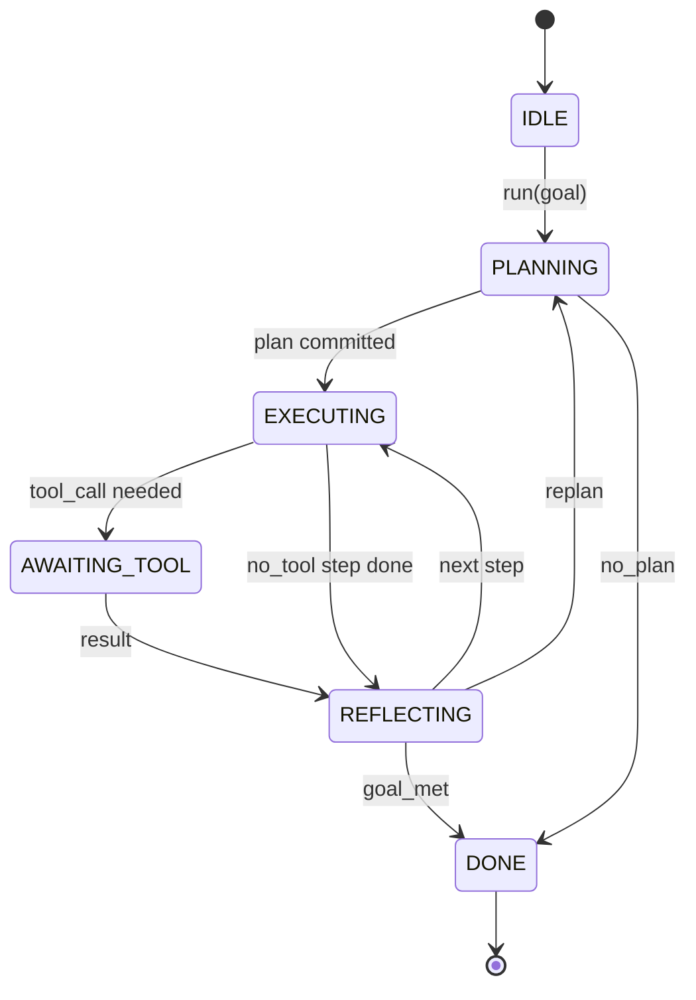

# 智能体 Harness 循环契约

> harness 才是智能体，模型只是它的协处理器。这一课把循环契约固定下来，让你之后可以把任何模型接进同一个 loop。

**Type:** 构建
**Languages:** Python
**Prerequisites:** 第 13 阶段第 01-07 课，第 14 阶段第 01 课
**Time:** 约 90 分钟

## 学习目标
- 把智能体 harness loop 明确定义成一个 deterministic state machine，并写清楚每条 transition。
- 实现十个 lifecycle hook topic，让 operator 能把 policy、telemetry 和 guardrails 挂进去。
- 定义两个 pull point，使 loop 在固定位置把控制权交还调用方，并在拿到新输入后恢复。
- 执行每个 session 的预算约束，包括 turns、tool calls 和 wall-clock，且在超限时不泄露部分状态。
- 发出一个包含十一种 event type 的 typed stream，让下游 UI 和 tracer 无需直接读取 loop 内部也能订阅执行过程。

```figure
cf-loop-contract
```

## 这个框架

一个可以无人值守跑四十轮的 coding agent，不再是聊天循环，而是一个状态机：operator 可以拦截它的节点，也可以审计它的边。一旦你把这份 contract 写清楚，之后再替换模型、工具或 policy，就不再是一次“重构”，而只是一次注册动作。

这一课的目标，就是把这份 contract 定下来。我们会给出六个状态、十个 hook topic、两个 pull point、十一种 event type，以及一个 budget envelope。此后 harness 中的其他部分，例如 tool registry、JSON-RPC transport、dispatcher、planner，都会往这个固定形状里插。

## 状态

整个 loop 有六个状态，其中五个是 active state，一个是 terminal state。



`IDLE` 是唯一合法入口。`DONE` 是唯一合法出口。`AWAITING_TOOL` 是唯一一个会产生 pull point 的状态。其他 transition 全都属于内部跳转。

这个状态机必须是 deterministic 的。也就是说，只要给定相同的 event log，harness 就必须重回同一个 state。正是这个性质，才让你能够在调试时重放 session，而不必重新调用模型。

## Hook 主题

hook 是 operator 切入 loop 的缝。harness 一共会触发十个 topic。每个 topic 都允许有任意多个 subscriber，按注册顺序执行。subscriber 可以修改 payload、抛出异常中止 turn，或者返回一个 sentinel 来跳过下一步。

```text
before_plan         after_plan
before_tool_call    after_tool_call
before_step         after_step
on_error
on_pause
on_budget_exceeded
on_complete
```

这组 hook 形状，与 Claude Code、Cursor 和 OpenCode 到 2025 年中期收敛出的形态非常接近。名字都是功能性的，不是品牌性的。一个用来拦截 `rm -rf` 的 hook 应该挂在 `before_tool_call`。一个负责发 OpenTelemetry span 的 hook 应该挂在 `after_step`。一个负责暂停后恢复 session 的 hook 应该挂在 `on_pause`。

## 控制权交还点

loop 一共会把控制权交还两次。第一次是在 `AWAITING_TOOL`，也就是它在没有工具结果时无法继续推进。第二次是在 `on_pause`，即预算耗尽，或者某个 hook 显式要求人工复核。

pull point 不是异常，而是 return。调用方拿到返回后，会检查当前 harness state，取来 loop 所请求的外部信息，然后调用 `resume(payload)`。harness 会从上次停住的地方继续。这种形状和 Python generator 很像。至于 pull point 上层的 transport 用什么，是你的自由：在 TUI 里可以是按键，在 MCP 里可以是 `tools/call`，在队列系统里则可以是 job poll。

## 事件流

loop 会在 contract 规定的位置把事件追加到一个 typed stream 中。这个 stream 是 append-only 的，而且订阅者可以从任意 offset 重新 replay。当前实现的十一种 event type 是：

- `session.start`：在调用 `run(goal)` 时触发一次
- `plan.draft`：planner 返回草案计划时触发
- `plan.commit`：草案被确认成 active plan 后触发
- `step.start`：每个 executing step 开始时触发
- `step.end`：每个 executing step 结束时触发
- `tool.call`：某个 step 需要工具，因此 loop 把控制权交还调用方时触发
- `tool.result`：在恢复时带着工具结果回来时触发
- `tool.error`：在恢复时带着错误回来，或 hook 直接中断工具调用时触发
- `budget.warn`：达到预算阈值时触发
- `session.pause`：loop 因预算或 hook 而暂停并产生 yield 时触发
- `session.complete`：loop 进入 `DONE` 时触发一次

event 不应该复制 hook payload。hook 是 imperative 的，用于修改、阻断和分流；event 是 observational 的，用于记录、下发和回放。两者要保持正交。

## 预算边界

一个 session 有三个限制：turn count、tool call count、wall-clock seconds。每执行一轮，turns 加一；每发生一次工具调用，tool calls 加一；wall-clock 则在每次状态切换时检查。任何一个限制被触发时，loop 都会先触发 `on_budget_exceeded`，再发出 `budget.warn`，然后在下一个 pull point 上以 budget-exceeded 的原因回到 `IDLE`。

预算不是 kill switch，而是 yield。是由调用方来决定：延长预算并恢复，还是直接关闭这个 session。

## 本课不做什么

它不会真的调用模型。不会注册真实工具。也不会实现 transport。这些会在后面四课里补上。这一课要钉死的是 contract，好让后面四课可以直接往上接，而不用重新定义 loop。

`main.py` 里的 deterministic planner 只是一个占位实现。它会返回一个写死的三步计划，其中两步需要 tool result。重点不是 plan，而是 loop 本身。

## 如何阅读代码

`HarnessLoop` 是核心类。它保存 state，触发 hooks，并发出 events。`Budget` 负责追踪预算限制。`Event` 是 stream 中的 typed envelope。`HookRegistry` 是 dispatch table。`_transition` 是唯一一个允许修改 state 的函数，因此状态机的不变量都集中在这一处。

先从头到尾读 `main.py`，然后再读 `code/tests/test_loop.py`。测试会钉住每一条 transition，以及每一个 hook 的触发顺序。

## 继续深入

在生产里，构建 harness 最难的部分通常不是状态机本身，而是让 contract 真正具有可执行性。它必须能在 planner 热重载后继续存活；必须能顶住某个工具返回 malformed JSON；也必须能顶住某个 hook 在四十轮 session 的三分之二处、也就是 `before_tool_call` 阶段抛异常。测试已经覆盖了这些失败模式。把它们跑起来，故意弄坏，再继续补例子。

下一课会加入 tool registry。再下一课会加入 JSON-RPC transport。之后是 dispatcher。到第二十四课时，这个文件里的 loop 就会开始用真实工具、真实预算去执行真实计划。
