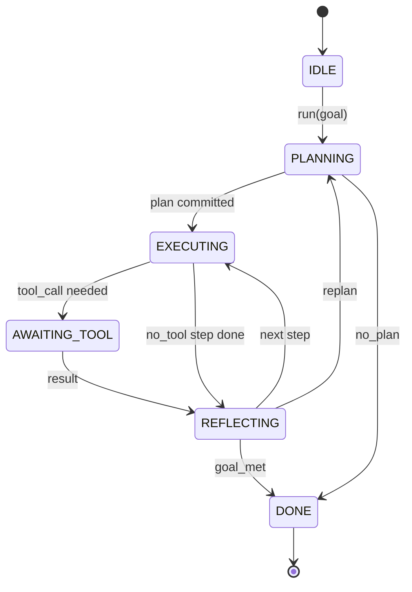

# 智能体执行框架循环契约

> 执行框架才是智能体，模型只是它的协处理器。这一课把循环契约固定下来，让你之后可以把任何模型接进同一个循环。

**Type:** 构建
**Languages:** Python
**Prerequisites:** 第 13 阶段第 01-07 课，第 14 阶段第 01 课
**Time:** 约 90 分钟

## 学习目标
- 把智能体执行框架循环明确定义成一个确定性状态机，并写清楚每条状态转移。
- 实现十个生命周期钩子主题，让操作者能把策略、遥测和防护规则挂进去。
- 定义两个控制权交还点，使循环在固定位置把控制权交还调用方，并在拿到新输入后恢复。
- 执行每个会话的预算约束，包括轮数、工具调用次数和墙钟时间，且在超限时不泄露部分状态。
- 发出一个包含十一种事件类型的带类型事件流，让下游 UI 和追踪器无需直接读取循环内部也能订阅执行过程。

```figure
cf-loop-contract
```

## 这个框架

一个可以无人值守跑四十轮的编码智能体，不再是聊天循环，而是一个状态机：操作者可以拦截它的节点，也可以审计它的边。一旦你把这份契约写清楚，之后再替换模型、工具或策略，就不再是一次“重构”，而只是一次注册动作。

这一课的目标，就是把这份契约定下来。我们会给出六个状态、十个钩子主题、两个控制权交还点、十一种事件类型，以及一个预算外壳。此后执行框架中的其他部分，例如工具注册表、JSON-RPC 传输层、分发器、规划器，都会往这个固定形状里插。

## 状态

整个循环有六个状态，其中五个是活动状态，一个是终止状态。



`IDLE` 是唯一合法入口。`DONE` 是唯一合法出口。`AWAITING_TOOL` 是唯一一个会产生控制权交还点的状态。其他状态转移全都属于内部跳转。

这个状态机必须是确定性的。也就是说，只要给定相同的事件日志，执行框架就必须重回同一个状态。正是这个性质，才让你能够在调试时重放会话，而不必重新调用模型。

## 钩子主题

钩子是操作者切入循环的接缝。执行框架一共会触发十个主题。每个主题都允许有任意多个订阅者，按注册顺序执行。订阅者可以修改负载、抛出异常中止当前轮，或者返回一个哨兵值来跳过下一步。

```text
before_plan         after_plan
before_tool_call    after_tool_call
before_step         after_step
on_error
on_pause
on_budget_exceeded
on_complete
```

这组钩子的形状，与 Claude Code、Cursor 和 OpenCode 到 2025 年中期收敛出的形态非常接近。名字都是功能性的，不是品牌性的。一个用来拦截 `rm -rf` 的钩子应当挂在 `before_tool_call`。一个负责发 OpenTelemetry span 的钩子应当挂在 `after_step`。一个负责暂停后恢复会话的钩子应当挂在 `on_pause`。

## 控制权交还点

循环一共会把控制权交还两次。第一次是在 `AWAITING_TOOL`，也就是它在没有工具结果时无法继续推进。第二次是在 `on_pause`，即预算耗尽，或者某个钩子显式要求人工复核。

控制权交还点不是异常，而是一次返回。调用方拿到返回后，会检查当前执行框架状态，取来循环所请求的外部信息，然后调用 `resume(payload)`。执行框架会从上次停住的地方继续。这种形状和 Python 生成器很像。至于交还点上层用什么传输方式，由你决定：在 TUI 里可以是按键，在 MCP 里可以是 `tools/call`，在队列系统里则可以是任务轮询。

## 事件流

循环会在契约规定的位置把事件追加到一个带类型的事件流中。这个事件流是只追加的，而且订阅者可以从任意偏移重新回放。当前实现的十一种事件类型是：

- `session.start`：在调用 `run(goal)` 时触发一次
- `plan.draft`：规划器返回草案计划时触发
- `plan.commit`：草案被确认成当前活动计划后触发
- `step.start`：每个执行中步骤开始时触发
- `step.end`：每个执行中步骤结束时触发
- `tool.call`：某个步骤需要工具，因此循环把控制权交还调用方时触发
- `tool.result`：在恢复时带着工具结果回来时触发
- `tool.error`：在恢复时带着错误回来，或 hook 直接中断工具调用时触发
- `budget.warn`：达到预算阈值时触发
- `session.pause`：循环因预算或钩子而暂停并产生让出控制权时触发
- `session.complete`：循环进入 `DONE` 时触发一次

事件不应该复制钩子负载。钩子是命令式的，用于修改、阻断和分流；事件是观察性的，用于记录、下发和回放。两者要保持正交。

## 预算边界

一个会话有三个限制：轮数、工具调用次数、墙钟秒数。每执行一轮，轮数加一；每发生一次工具调用，工具调用次数加一；墙钟时间则在每次状态切换时检查。任何一个限制被触发时，循环都会先触发 `on_budget_exceeded`，再发出 `budget.warn`，然后在下一个控制权交还点上以“预算超限”的原因回到 `IDLE`。

预算不是硬杀开关，而是一种让出控制权的机制。是由调用方来决定：延长预算并恢复，还是直接关闭这个会话。

## 本课不做什么

它不会真的调用模型。不会注册真实工具。也不会实现传输层。这些会在后面四课里补上。这一课要钉死的是契约，好让后面四课可以直接往上接，而不用重新定义循环。

`main.py` 里的确定性规划器只是一个占位实现。它会返回一个写死的三步计划，其中两步需要工具结果。重点不是计划，而是循环本身。

## 如何阅读代码

`HarnessLoop` 是核心类。它保存状态，触发钩子，并发出事件。`Budget` 负责追踪预算限制。`Event` 是事件流中的带类型事件封装。`HookRegistry` 是分发表。`_transition` 是唯一一个允许修改状态的函数，因此状态机的不变量都集中在这一处。

先从头到尾读 `main.py`，然后再读 `code/tests/test_loop.py`。测试会钉住每一条状态转移，以及每一个钩子的触发顺序。

## 继续深入

在生产里，构建执行框架最难的部分通常不是状态机本身，而是让契约真正具有可执行性。它必须能在规划器热重载后继续存活；必须能顶住某个工具返回格式错误的 JSON；也必须能顶住某个钩子在四十轮会话的三分之二处、也就是 `before_tool_call` 阶段抛异常。测试已经覆盖了这些失败模式。把它们跑起来，故意弄坏，再继续补例子。

下一课会加入工具注册表。再下一课会加入 JSON-RPC 传输层。之后是分发器。到第二十四课时，这个文件里的循环就会开始用真实工具、真实预算去执行真实计划。
