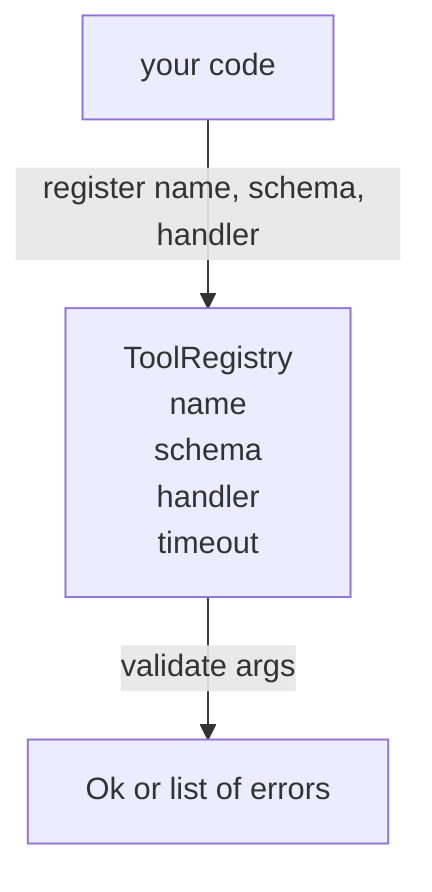

# 工具注册表与 Schema 验证

> 代理无法验证的工具，代理就不该调用。先把注册表和模式检查器搭好，再去造工具本身。

**Type:** 构建
**Languages:** Python
**Prerequisites:** 第 13 阶段第 01-07 课，第 14 阶段第 01 课
**Time:** 约 90 分钟

## 学习目标
- 维护一个带类型的注册表，把工具名、模式和处理函数绑定在一起，让分发器只查询一次就能长期信任。
- 实现一个 JSON Schema 2020-12 子集，覆盖九成工具调用真正会用到的关键字。
- 返回精确到 JSON Pointer 的错误路径，让模型在下一轮就能自行修正参数。
- 默认拒绝重复注册，除非显式要求覆盖，避免生产环境里的静默覆盖。
- 保持验证器纯净，不依赖 I/O、时间或全局状态，使其能在回放日志上重复执行。

```figure
cf-registry-validate
```

## 为什么要先做注册表

到了 2026 年，一个编码代理注册的工具数量，往往已经超过模型单个上下文窗口能够稳定容纳的规模。一个稍微复杂一点的执行框架可能会注册两百个工具，而在某一轮对话里只向模型暴露其中十到四十个。注册表就是那份权威事实来源，用来回答三个问题：有哪些工具、这些工具的参数长什么样、真正要调用哪个处理函数。只要这三件事先钉死，执行框架其余部分就不必再靠猜。

我们要避免的错误，是只把处理函数发出去却没有模式，或者只有模式却没有验证。这两种情况都很常见，也都会把下一层系统，也就是第二十三课里的分发器，变成一场猜谜游戏；而它唯一的失败信号，往往只剩处理函数里抛出来的栈追踪。

## 工具记录长什么样

```text
ToolRecord
  name        : str          (unique, lowercase alphanumeric and underscore segments separated by dots, e.g., snake_case.segment.case)
  description : str          (one line, shown to the model)
  schema      : dict         (JSON Schema 2020-12 subset)
  handler     : Callable     (async or sync, returns Any)
  idempotent  : bool         (dispatcher uses this for retry decisions)
  timeout_ms  : int          (override per-tool dispatcher default)
```

验证器真正接触的只有模式这一项，处理函数对它来说是黑盒。这里故意把两者分开。模式是数据，处理函数是代码；一旦把它们混在一起，你就很容易把验证逻辑偷塞进处理函数里，而这正是本课要阻止的设计失误。

## JSON Schema 2020-12 子集

完整的 2020-12 规范本身就像一篇论文。我们这里只需要八个关键字。

```text
type           string / number / integer / boolean / object / array / null
properties     map of property name -> schema
required       list of property names
enum           list of allowed primitive values
minLength      integer, applies to strings
maxLength      integer, applies to strings
pattern        ECMA-262-compatible regex, applies to strings
items          schema applied to every array element
```

对于真实的工具 API 来说，这已经足够。我们暂时不引入的那些关键字，比如 `oneOf`、`anyOf`、`allOf`、`$ref` 和条件分支，在生产模式里当然是合法的，但它们会把验证器复杂化成一台带环的模式树遍历引擎。我们当前要造的是注册表，不是完整的 JSON Schema 解释器。

## JSON Pointer 错误路径

验证失败时，验证器返回的是一组错误。每条错误都附带一条指向输入参数的 JSON Pointer 路径。所谓指针路径，就是由属性名和数组下标组成、以斜杠开头的路径序列。

```text
{"a": {"b": [1, 2, "x"]}}
                    ^
                    /a/b/2
```

模型读错误路径，往往比读整段自然语言说明更有效。如果 schema 要求的是 `args.user.email`，而模型传进来一个整数，那么错误就该明确落在 `/user/email`，并附带 `expected_type: string`。这样模型通常能在下一次调用里直接修正，而不用再走一轮解释性对话。

## 注册与覆盖

`register(name, schema, handler, **opts)` 默认拒绝重复注册。调用方如果真要替换同名工具，必须显式传入 `override=True`。这是一条运行时卫生规则。代码库里两个不同模块如果悄悄注册了同一个工具名，往往就是那种会在生产环境里查上一周的缺陷。

注册表暴露三个读取接口。`get(name)` 返回对应记录，不存在就抛错；`validate(name, args)` 返回 `Ok` 或一组错误；`names()` 则按注册顺序返回全部工具名。

## 验证器能做什么，不能做什么

它是一次递归的模式树遍历，而且必须保持纯净。它不会调用处理函数，也不会做类型强转；字符串 `"42"` 不会因为看起来像数字就通过 number 模式。它同样不会偷偷截断输入。

但它也不是安全边界。即便验证通过，恶意处理函数仍然可能在之后做坏事。第二十三课的分发器会补上超时和沙箱层；注册表解决的只是“参数形状是否正确”这一层问题。

## 结构示意



## 如何阅读代码

`code/main.py` 里定义了 `ToolRegistry`、`ToolRecord`、`ValidationError` 以及八个类型验证函数。验证器会根据 `schema["type"]` 分发，或者在只有 `enum` 时把它当作无类型的枚举检查。每个类型验证器要么返回空列表，要么返回一组 `ValidationError`。最外层遍历器负责把这些错误拼起来，并在递归下降时给它们补上路径前缀。

`code/tests/test_registry.py` 则覆盖了注册、覆盖、验证成功、带路径的验证失败，以及这个子集里的每一个关键字。

## 继续扩展

等这一课落地以后，最值得补上的两个扩展通常是：对本地定义块的 `$ref` 解析，以及 `additionalProperties: false` 这种严格形状约束。它们都不大，也都很常见，尤其是在工具目录增长到五十个以上之后。这里只是为了把课程控制在一遍能读完的规模里，先故意留白。

下一课，也就是第二十二课，会实现把这个注册表暴露给模型客户端的 JSON-RPC stdio 传输层。再下一课，第二十三课，会在它外面包上一层带超时和重试的分发器。
