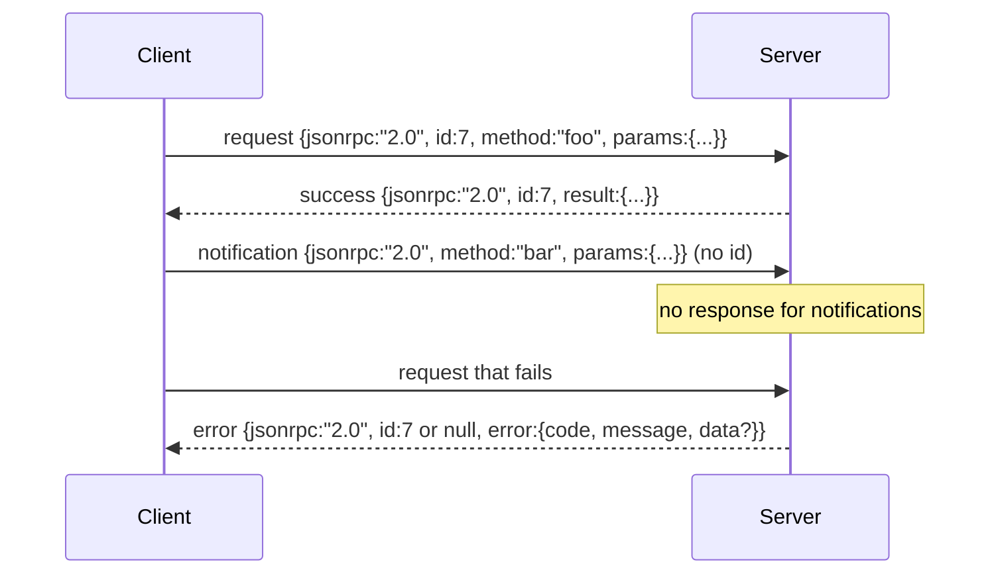

# 通过换行分隔 stdio 传输 JSON-RPC 2.0

> 模型客户端与工具服务器之间的传输层，就是跑在 stdio 上的 JSON-RPC。你亲手实现一次，才能真正明白每一层 framing 到底在为哪些事情付费。

**Type:** 构建
**Languages:** Python
**Prerequisites:** 第 13 阶段第 01-07 课，第 14 阶段第 01 课
**Time:** 约 90 分钟

## 学习目标
- 掌握把 JSON-RPC 2.0 以换行分隔 JSON 的形式封装在 stdin 和 stdout 上的方法。
- 理清五个标准错误码（-32700、-32600、-32601、-32602、-32603），并按正确语义返回它们。
- 区分 request、response、notification 和 batch，而不是自创新的 envelope keys。
- 在不污染后续流的前提下，对每一行分别处理 parse error。
- 用 io.BytesIO 构建一个会自行结束的 demo，让本课无需真的启动子进程也能跑通。

```figure
cf-jsonrpc-frames
```

## 为什么 JSON-RPC 依然是通用语

到 2026 年，一个编码代理在单次会话里很可能要和十几个工具服务器对话。每个服务器可能是独立进程，也可能是远程端点。自 2013 年以来，线上协议格式几乎没有变过。JSON-RPC 2.0 规范只有短短两页，却一直活着，因为它避开了其他方案的代价：gRPC、每次请求都走 HTTP、或者自定义二进制协议，都会迫使你在流式、批量、传输耦合这些维度上做出取舍。JSON-RPC 则可以同时适用于 stdio、sockets、websockets 和 HTTP；只要双方都遵守规范，客户端甚至可以驱动一个自己从未见过的服务器。

本课实现的是 stdio 变体：newline-delimited JSON。每条 request 一行，每条 response 一行，传输边界就是 `\n`。

## 线上的消息形状

一共只有四种 envelope。两种由客户端发出，两种由服务端发出。



notification 没有 `id`。服务端绝不能对 notification 回包。如果服务端真的对通知发了响应，客户端也无法把它关联回原始调用点。正是这条单一规则，让 framing 的计算始终保持简单。

batch 则是一个 JSON 数组，里面可以混合 request 和 notification。服务端返回一个响应数组，顺序可以任意，但只针对其中的非 notification 项逐一返回。如果整个 batch 全是 notification，服务端就什么都不发。

## 五个错误码

```text
-32700  Parse error      JSON could not be parsed
-32600  Invalid Request  Envelope shape is wrong
-32601  Method not found
-32602  Invalid params
-32603  Internal error
```

-32000 到 -32099 这一段保留给服务端自定义错误，其余则留给应用自己扩展。本课只处理这五个标准码。如果 handler 抛出异常，传输层会把它包装成 -32603，并把异常类名放进 `data.exception`。

parse error 还有一条特殊规则：返回中的 `id` 必须是 `null`，因为这个请求连解析都没完成，自然不可能可靠地取出 id。

## 换行 framing 与 BytesIO 演示

传输层每次只读取一行。所谓一行，就是读到并包含 `\n` 的一段字节。如果某一行无法解析，传输层就写回一个 -32700 响应，且 `id: null`，然后继续处理下一行。整条流不会因此中毒，下一行会被当作全新的消息重新解析。

在本课里，我们用一对 `io.BytesIO` 来模拟 stdin 和 stdout。服务端持续读取 request 直到 EOF，为每条请求写出响应，然后返回。客户端再把响应读回来。没有真正的进程启动，也没有 timeout，但行为与真实的子进程管道是等价的，因为 Python 的 `io` 接口暴露的 `.readline()` 和 `.write()` 契约完全一致。

## 方法分发

传输层本身并不知道有哪些方法存在。它只会把调用交给外部提供的 `handler(method, params)`。这个 handler 要么返回结果，要么抛出异常。我们约定三种异常映射到特定错误码。

```text
MethodNotFound -> -32601
InvalidParams  -> -32602
Anything else  -> -32603 with exception name in data
```

传输层永远不会直接看到 tool registry。registry 藏在 handler 后面。这正是我们想要的 layering：transport 只会说 JSON-RPC，registry 只会说 tool shape，dispatcher（第二十三课）负责把两者缝起来。

## 出错时的流行为

```text
client writes              server reads             server writes
---------------            -----------              -------------
{...valid request...}      parses ok                {...response, id matches...}
{...broken json...         parse fails              {id:null, error: -32700}
{...valid request...}      parses ok                {...response, id matches...}
{...missing method...}     invalid envelope         {id:X, error: -32600}
```

一行损坏的 JSON 不会停止循环。缺少 `method` 字段也不会停止循环。handler 抛异常也不会停止循环。传输层会持续读取，直到真正遇到 EOF。

## 通知与不对称流

notification 是 fire-and-forget。harness 会用 notification 发送进度事件、取消信号和日志行。对于长时间运行的工具来说，notification 是一种很自然的方式，可以在请求尚未完成时把状态流式推送出去，而不用为每次更新都额外走一个往返。

本课会实现一个出站 notification helper，叫做 `write_notification`。服务端可以在 request 处理中间调用它发送进度。demo 会展示这一模式：请求先进入，handler 连续发出两个 progress notification，最后再写出最终 response。

## 如何阅读代码

`code/main.py` 里会定义 `StdioTransport`、解析辅助函数 `parse_request`、三个写出 helper（`write_response`、`write_error`、`write_notification`），以及主 dispatch loop `serve`。错误码常量都放在模块顶层。

`code/tests/test_transport.py` 会覆盖五个错误码、notification（不写 response）、batch（数组输入、数组输出、跳过 notification）、损坏 JSON（parse error 后继续处理），以及 handler 在请求处理中途写出 notification 的不对称流场景。

## 往前走

这个 transport 已经足够支撑后续课程。生产级 transport 通常还会再加三样东西。第一，是能跨多跳转发存活的 correlation id 字段；你当前的 `id` 已经承担了一部分作用，但一旦进入 mesh，你还需要外层 trace id。第二，是取消通道，例如用 `$/cancelRequest` 这种 notification，携带正在执行中的请求 id。第三，是 content-type negotiation handshake，这样同一条 socket 既能说 JSON-RPC，也能说 Streamable HTTP。不过注意，这三者都不会改变 wire 本身，它们只是往上叠加元数据。
