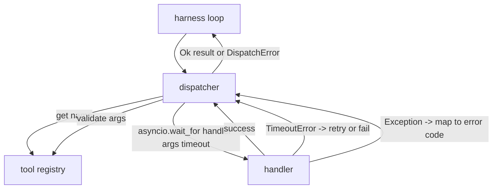
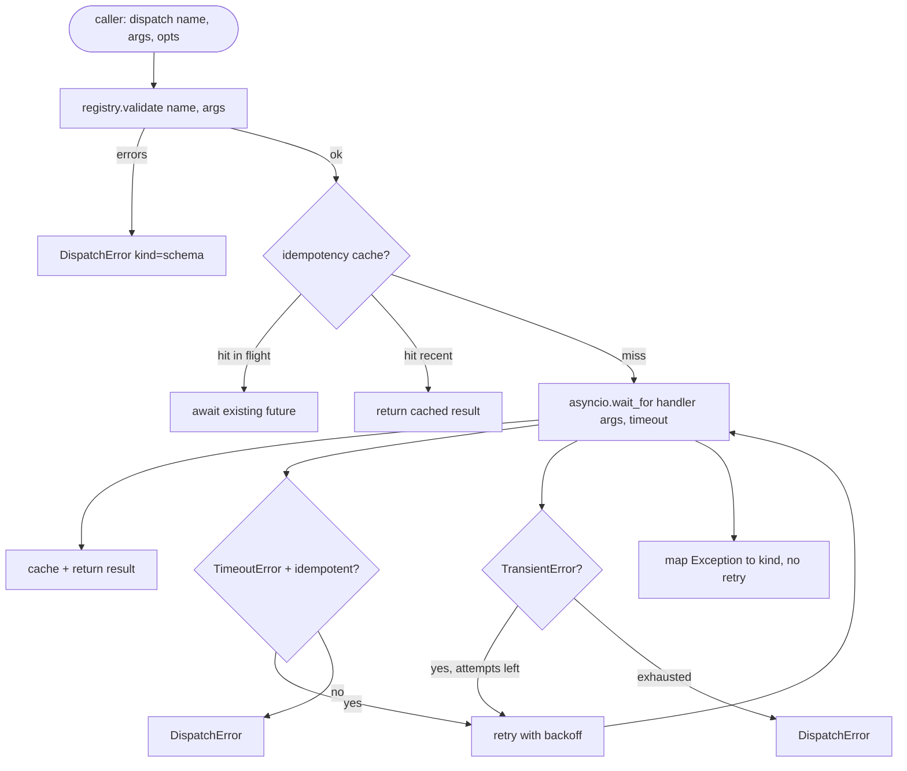

# 函数调用分发器

> 分发器是执行框架为模式中每一条承诺真正付费的地方。超时、重试、去重、错误映射，全都落在这一条缝上。

**Type:** 构建
**Languages:** Python
**Prerequisites:** 第 13 阶段第 01-07 课，第 14 阶段第 01 课
**Time:** 约 90 分钟

## 学习目标
- 给工具处理函数套上一层按调用计的超时限制，让它返回带类型的错误，而不是把整个循环挂死。
- 使用指数退避加抖动，再配上最大尝试次数来做重试。
- 基于幂等键做重试去重，避免一个慢原始调用和一次重试并发时被实际执行两次。
- 把处理函数异常与传输故障统一映射到执行框架循环已经能理解的同一种错误封装。
- 为并行分发设定并发上限，避免一次扇出四十个工具调用就把事件循环吃空。

```figure
cf-dispatch-retry
```

## 分发器位于哪里

它位于执行框架循环（第二十课）与工具注册表（第二十一课）之间。传输层（第二十二课）把请求送进循环。循环再把工具调用交给分发器。分发器调注册表、执行处理函数，最后返回成功结果，或者一个 JSON-RPC 形状的错误封装。



只有分发器知道计时器、重试和幂等性。循环不知道，注册表不知道，处理函数也不知道。这种隔离本身就是设计重点。

## 超时

每个工具都有默认超时。注册表记录上会携带 `timeout_ms`。当执行框架传入单次调用覆盖值时，分发器会用它覆盖默认值。具体实现使用 `asyncio.wait_for`。一旦超时，处理函数任务会被取消，分发器返回 `DispatchError(kind="timeout")`。

对非幂等工具来说，超时默认不是可重试错误。一个 `db.write` 超时了，并不代表它没有提交；如果重试，就可能变成重复写入。分发器会尊重注册表记录里的 `idempotent` 标记。幂等工具允许重试，非幂等工具则不重试。

## 带指数退避的重试

重试策略最多三次。退避间隔采用指数增长并带有抖动。

```text
attempt 1  -> delay 0
attempt 2  -> delay 0.1s * (1 + random[0..0.5])
attempt 3  -> delay 0.4s * (1 + random[0..0.5])
```

只有 `timeout` 与 `transient` 错误会重试。`schema` 错误、`not_found` 错误和 `internal` 错误都不会重试。因为 schema 错误是确定性的，重试不会改变结果，只会白白烧掉预算。

重试循环还要尊重执行框架提供的预算。如果调用方剩余的工具调用预算已经为零，分发器会在第一次尝试前直接快速失败，并返回 `kind="budget_exceeded"`。

## 基于幂等键的去重

一个很典型的生产事故是：原始调用还在进行中，重试却已经发出。第一次调用在 4.9 秒时还挂着，正好低于超时阈值；到了 5 秒，重试触发。于是两个请求开始同时竞争同一个后端。如果工具是 `payments.charge`，你就真的扣了两次款。

分发器接受一个可选的 `idempotency_key`。如果同一个键对应的调用仍在进行中，当新调用到达时，分发器不会再发一遍，而是等待那条已有 future 完成，然后直接复用它的结果。调用完成后，这个键还会在缓存里保留 60 秒，用来吸收那些更晚才到的重试。

键的生成责任在调用方。执行框架会从规划器导出：`f"{step_id}:{tool_name}:{hash(args)}"`。分发器不会自己发明键，因为如果仅靠参数来推导键，两个语义上不同但参数相同的调用就会被错误地当成同一次。

## 错误封装

一次失败的 dispatch 只返回一种统一形状：

```text
DispatchError
  kind        : "timeout" | "transient" | "schema" | "not_found" | "internal" | "budget_exceeded"
  message     : str
  attempts    : int
  jsonrpc_code: int   (one of -32601, -32602, -32603)
```

执行框架循环会根据 `kind` 来决定后续状态。`schema` 和 `not_found` 会进入 `on_error`，并触发一次重新规划。`timeout` 与 `transient` 也会走 `on_error`，但是否重新规划还取决于尝试次数。`budget_exceeded` 则直接触发 `on_budget_exceeded`。

## 扇出时的并发上限

`gather(*calls)` 会一次性把所有协程同时跑起来。四十个工具调用，就意味着四十条 socket 或四十个子进程管道。大多数后端都不喜欢一个客户端同时开出四十个并发连接。

分发器会在 `gather` 外面包一层信号量。默认的并发上限是八。每个调用在分发之前先获取，结束后再释放。调用方表面上看到的还是 `gather` 风格结果，但实际调度是被限制住的。

## 单次调用的流程



## 如何阅读代码

`code/main.py` 会定义 `Dispatcher`、`DispatchError` 和 `TransientError`。分发器在构造时接收一个注册表。异步方法 `dispatch(name, args, ...)` 是唯一入口。每次尝试的超时都在 `_run_with_retries` 内部通过 `asyncio.wait_for` 直接施加。`gather_bounded(calls)` 则负责在并发限制下批量运行分发。

`code/tests/test_dispatcher.py` 会覆盖超时触发、瞬时错误的重试、模式错误不重试、幂等键去重（两个相同键的并发调用合并成一次处理函数调用），以及并发限制（验证信号量的确在生效）。

测试会用 `asyncio.sleep(0)` 和确定性的 `Counter` 型处理函数，因此几毫秒内就能结束，不依赖墙钟时间。

## 往前走

生产级分发器还会多两样东西。第一，是在每个状态转移点打结构化日志。循环的事件流已经给了你一部分，但分发器还应该额外发出 `dispatch.attempt` 和 `dispatch.retry` 这类事件。第二，是断路器：如果某个工具在一段时间窗口里连续失败 N 次，就进入冷却期；在这段时间里，分发器不再真的尝试运行处理函数，而是直接返回 `kind="circuit_open"`。这两个增强都能叠加在当前分发器之上，而不需要改动已有契约。

第二十四课会把分发器接到一个“先规划再执行”的代理上，让你看到这几块如何真正协同运转。
