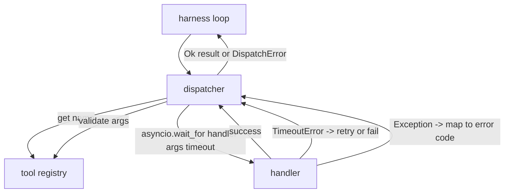

# 函数调用分发器

> 分发器是 harness 为 schema 中每一条承诺真正付费的地方。超时、重试、去重、错误映射，全都落在这一条缝上。

**Type:** 构建
**Languages:** Python
**Prerequisites:** 第 13 阶段第 01-07 课，第 14 阶段第 01 课
**Time:** 约 90 分钟

## 学习目标
- 给 tool handler 套上一层按调用计的 timeout，让它返回 typed error，而不是把整个循环挂死。
- 使用 exponential backoff + jitter + 最大尝试次数来做 retry。
- 基于 idempotency key 做 retry 去重，避免一个慢原始调用和一次重试并发时被实际执行两次。
- 把 handler exception 与 transport fault 统一映射到 harness loop 已经能理解的同一种 error envelope。
- 为并行 dispatch 设定 concurrency limit，避免一次 fan-out 四十个 tool call 就把 event loop 吃空。

```figure
cf-dispatch-retry
```

## 分发器位于哪里

它位于 harness loop（第二十课）与 tool registry（第二十一课）之间。transport（第二十二课）把请求送进 loop。loop 再把 tool call 交给 dispatcher。dispatcher 调 registry、执行 handler，最后返回成功结果，或者一个 JSON-RPC 形状的错误 envelope。



只有 dispatcher 知道 timer、retry 和 idempotency。loop 不知道，registry 不知道，handler 也不知道。这种隔离本身就是设计重点。

## 超时

每个工具都有默认 timeout。registry record 上会携带 `timeout_ms`。当 harness 传入 per-call override 时，dispatcher 会用它覆盖默认值。具体实现使用 `asyncio.wait_for`。一旦超时，handler task 会被取消，dispatcher 返回 `DispatchError(kind="timeout")`。

对非 idempotent 工具来说，timeout 默认不是 retryable error。一个 `db.write` 超时了，并不代表它没有提交；如果重试，就可能变成重复写入。dispatcher 会尊重 registry record 里的 `idempotent` 标记。idempotent 工具允许重试，非 idempotent 工具则不重试。

## 带 exponential backoff 的重试

重试策略最多三次。backoff 采用指数增长并带有 jitter。

```text
attempt 1  -> delay 0
attempt 2  -> delay 0.1s * (1 + random[0..0.5])
attempt 3  -> delay 0.4s * (1 + random[0..0.5])
```

只有 `timeout` 与 `transient` 错误会重试。`schema` 错误、`not_found` 错误和 `internal` 错误都不会重试。因为 schema 错误是确定性的，重试不会改变结果，只会白白烧掉预算。

重试循环还要尊重 harness 提供的 budget。如果调用方剩余的工具调用预算已经为零，dispatcher 会在第一次尝试前直接快速失败，并返回 `kind="budget_exceeded"`。

## 基于 idempotency key 的去重

一个很典型的生产事故是：原始调用还在飞，重试却已经发出。第一次调用在 4.9 秒时还挂着，正好低于 timeout；到了 5 秒，重试触发。于是两个请求开始同时竞争同一个后端。如果工具是 `payments.charge`，你就真的扣了两次款。

dispatcher 接受一个可选的 `idempotency_key`。如果同一个 key 对应的调用仍在 in-flight，当新调用到达时，dispatcher 不会再发一遍，而是等待那条已有 future 完成，然后直接复用它的结果。调用完成后，这个 key 还会在缓存里保留 60 秒，用来吸收那些更晚才到的 retry。

key 的生成责任在调用方。harness 会从 planner 导出：`f"{step_id}:{tool_name}:{hash(args)}"`。dispatcher 不会自己发明 key，因为如果仅靠 args 来推导 key，两个语义上不同但参数相同的调用就会被错误地当成同一次。

## 错误 envelope

一次失败的 dispatch 只返回一种统一形状：

```text
DispatchError
  kind        : "timeout" | "transient" | "schema" | "not_found" | "internal" | "budget_exceeded"
  message     : str
  attempts    : int
  jsonrpc_code: int   (one of -32601, -32602, -32603)
```

harness loop 会根据 `kind` 来决定后续状态。`schema` 和 `not_found` 会进入 `on_error`，并触发一次 replan。`timeout` 与 `transient` 也会走 `on_error`，但是否 replan 还取决于 attempts。`budget_exceeded` 则直接触发 `on_budget_exceeded`。

## 扇出时的并发上限

`gather(*calls)` 会一次性把所有 coroutine 同时跑起来。四十个 tool calls，就意味着四十条 socket 或四十个 subprocess pipes。大多数后端都不喜欢一个客户端同时开出四十个并发连接。

dispatcher 会在 `gather` 外面包一层 semaphore。默认的 concurrency limit 是八。每个调用 dispatch 之前先 acquire，结束后再 release。调用方表面上看到的还是 `gather` 风格结果，但实际调度是被限制住的。

## 单次调用的流程


## 如何阅读代码

`code/main.py` 会定义 `Dispatcher`、`DispatchError` 和 `TransientError`。dispatcher 在构造时接收一个 registry。异步方法 `dispatch(name, args, ...)` 是唯一入口。每次尝试的 timeout 都在 `_run_with_retries` 内部通过 `asyncio.wait_for` 直接施加。`gather_bounded(calls)` 则负责在并发限制下批量运行 dispatch。

`code/tests/test_dispatcher.py` 会覆盖 timeout 触发、transient 错误的 retry、schema 错误不重试、idempotency dedupe（两个相同 key 的并发调用合并成一次 handler invocation），以及 concurrency limiting（验证 semaphore 的确在生效）。

测试会用 `asyncio.sleep(0)` 和确定性的 `Counter` 型 handler，因此几毫秒内就能结束，不依赖 wall-clock timing。

## 往前走

生产级 dispatcher 还会多两样东西。第一，是在每个状态转移点打 structured logging。loop 的 event stream 已经给了你一部分，但 dispatcher 还应该额外发出 `dispatch.attempt` 和 `dispatch.retry` 这类事件。第二，是 circuit breaker：如果某个工具在一段时间窗口里连续失败 N 次，就进入冷却期；在这段时间里，dispatcher 不再真的尝试运行 handler，而是直接返回 `kind="circuit_open"`。这两个增强都能叠加在当前 dispatcher 之上，而不需要改动已有 contract。

第二十四课会把 dispatcher 接到一个 plan-and-execute agent 上，让你看到这几块如何真正协同运转。
