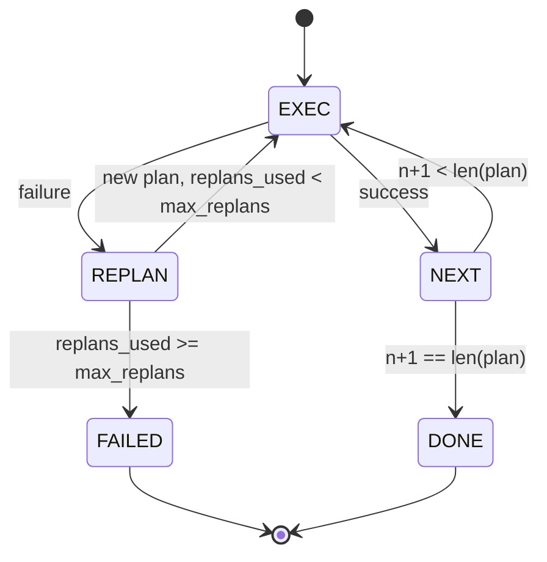

# 规划与执行控制流

> 一个无法经受失败的计划，只是脚本。一个会在失败后重新规划的脚本，才是代理。先把重新规划器做出来。

**Type:** 构建
**Languages:** Python
**Prerequisites:** 第 13 阶段第 01-07 课，第 14 阶段第 01 课
**Time:** 约 90 分钟

## 学习目标
- 把计划表示成一个有序的带类型步骤列表，让执行器能够推理进度与结果。
- 按顺序执行步骤，并在失败时受控地把控制权移交回规划器。
- 以当前游标为起点，带着上一次错误上下文重新规划，让下一版计划真正基于失败信息调整。
- 每次修订都发出计划差异，让下游追踪器或 UI 能解释“为什么计划变了”。
- 同时强制执行两类预算：硬性的步骤上限与重新规划上限。

```figure
cg-plan-replan
```

## 计划并执行，而不是思维链

思维链代理会先吐出一串 token，再让循环去猜工具调用到底在什么地方结束。先规划再执行的代理则先给出一个结构化计划，然后再逐步、确定性地执行每一步。计划是执行框架可检查的数据；执行则是执行框架把这些数据交给分发器去运行。

整个系统只有两块：规划器负责产出计划，执行器负责执行计划。真正有意思的是，执行器遇到失败之后怎么办。一共只有三种选择：

```text
1. Abort         (return failed, surface the error)
2. Skip          (mark step failed, continue with the rest)
3. Replan        (hand the error to the planner, get a new plan from the cursor)
```

正是重新规划这一条，把脚本变成了代理。

## 步骤的形状

```text
Step
  id              : int           (monotonic within a plan revision)
  tool_name       : str
  args            : dict
  expected_outcome: str           (planner's stated success condition)
  result          : Any | None
  error           : str | None
```

`expected_outcome` 是规划器在每个步骤旁边附带的一句简短成功条件。执行器不会真的去强制验证它。它存在的意义有两个：一是重新规划器在修改计划时会读取它；二是事件流会把它发出去，这样追踪器才能展示“这个步骤原本应该完成什么”。

## 规划器的形状

```python
def planner(goal: str, history: list[Step], last_error: str | None) -> list[Step]:
    ...
```

它是一个纯函数。`goal` 是用户目标，`history` 是已经执行过的步骤列表（其中 result 和 error 已经被填上），`last_error` 在第一次调用时为 None，之后每次调用则携带最近一次失败信息。规划器返回的是从当前游标往后的下一版计划。

规划器不知道执行器的存在，不知道重试，也不知道超时。它只负责产出计划，仅此而已。

## 执行器

执行器本质上是一个很小的状态机。每一步都通过分发器来执行。结果只有三类：成功、可重规划的失败、致命失败。可重规划的失败会把控制权交还给规划器；致命失败（例如预算耗尽、重新规划上限撞线）则直接返回 `FAILED` 会话结果。



## 计划修订的差异

当规划器在失败后返回一份新计划时，执行器会发出一个 `plan.diff` 事件，其中包含三项字段：

```text
removed: list of step ids that were in the old plan and are not in the new
added  : list of step ids in the new plan that were not in the old
revised: list of step ids whose tool_name or args changed
```

追踪器或 UI 可以把它渲染成：被删掉的步骤显示删除线，新加的步骤高亮出来。重点不在差异的具体格式，而在于修订必须是可见事件，而不是一次静默重写。

## 两类预算，而且都必须是硬上限

`max_steps` 限制的是整个会话里总共能执行多少步，包括重新规划之后新增的步骤。默认值是十二。比如一个线性的五步计划，若中途重新规划两次，每次又新加三步，总执行步数就会达到十六，超过预算。此时执行器会拒绝这次重新规划并返回 FAILED。

`max_replans` 限制的是第一次计划之后，规划器最多还能被重新调用几次。默认值是五。这个限制其实更重要。因为如果规划器一连五次都返回同一份坏掉的计划，而没有重新规划上限，系统就只能等步骤预算去兜底。限制重新规划次数，可以更快失败，也能让失败原因更清晰。

## 本课里的确定性规划器

本课不会真的调用模型。我们提供一个确定性规划器，它根据 `last_error` 来决定产出哪一版计划。

```text
last_error is None    -> emit a four-step plan
last_error matches X  -> emit a three-step plan that routes around X
last_error matches Y  -> emit a two-step plan that gives up gracefully
otherwise             -> return [] (signals nothing to replan)
```

这已经足够测试执行器在所有关键状态转移路径上的行为：成功、重新规划一次、重新规划两次、重新规划耗尽，以及步骤预算耗尽。

## 结果形状

```text
SessionResult
  status      : "completed" | "failed"
  reason      : str     ("goal_met" | "step_budget" | "replan_budget" | "no_plan")
  history     : list[Step]
  revisions   : list[PlanDiff]
  events      : list[Event]
```

第二十课里的执行框架循环可以直接消费这个结果。第二十三课的分发器负责执行每个步骤。第二十一课的注册表负责验证每一步的参数。第二十二课的传输层则可以把整条流程通过 JSON-RPC 暴露给模型客户端。

## 如何阅读代码

`code/main.py` 会定义 `PlanExecuteAgent`、`Step`、`PlanDiff`、`SessionResult` 以及确定性规划器。执行器只有一个 `run(goal)` 方法，返回一个 `SessionResult`。计划差异的计算逻辑很直接：比较步骤 ID，以及 `(tool_name, args)` 元组是否变化。

`code/tests/test_agent.py` 会覆盖线性成功路径、中途失败后重新规划一次、重新规划耗尽后返回 `failed:replan_budget`、步骤预算耗尽，以及计划差异事件格式。

## 往前走

接入真实模型之后，你会很自然地想加两样东西。第一，是部分计划缓存：如果一个六步计划前面三步已经成功，第四步才失败，你并不想在重新规划后把前面三步重跑。执行器已经保存了历史，规划器只要学会读它就行。第二，是并行分支：当前执行器完全是串行的。如果规划器能发出独立分支，比如用 `gather_step` 而不是 `next_step`，那它就可以通过分发器并发跑多个工具调用。

这两项都会带来真实复杂度。但等你先把线性执行器钉稳之后，再加它们就容易得多。这正是本课的目的。
