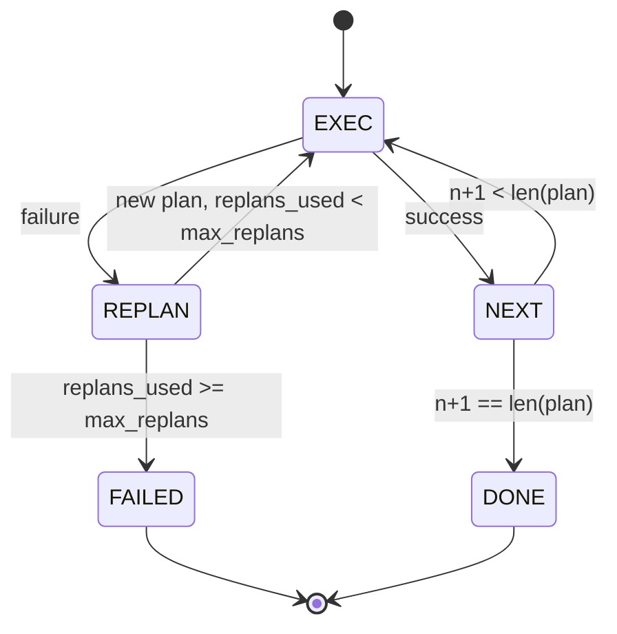

# 规划与执行控制流

> 一个无法经受失败的计划，只是脚本。一个会在失败后重新规划的脚本，才是代理。先把 replanner 做出来。

**Type:** 构建
**Languages:** Python
**Prerequisites:** 第 13 阶段第 01-07 课，第 14 阶段第 01 课
**Time:** 约 90 分钟

## 学习目标
- 把 plan 表示成一个有序的 typed steps 列表，让 executor 能够推理进度与结果。
- 按顺序执行步骤，并在失败时受控地把控制权移交回 planner。
- 以当前 cursor 为起点，带着上一次错误上下文重新规划，让下一版 plan 真正基于失败信息调整。
- 每次 revision 都发出 plan diff，让下游 tracer 或 UI 能解释“为什么计划变了”。
- 同时强制执行两类预算：硬性的 step ceiling 与硬性的 replan ceiling。

```figure
cg-plan-replan
```

## 计划并执行，而不是 chain-of-thought

chain-of-thought agent 会先吐出一串 tokens，再让 loop 去猜工具调用到底在什么地方结束。plan-and-execute agent 则先给出一个结构化 plan，然后再逐步、确定性地执行每一步。plan 是 harness 可检查的数据；execution 是 harness 把这些数据交给 dispatcher 去运行。

整个系统只有两块：planner 负责产出 plan，executor 负责执行 plan。真正有意思的，是 executor 遇到失败之后怎么办。一共只有三种选择：

```text
1. Abort         (return failed, surface the error)
2. Skip          (mark step failed, continue with the rest)
3. Replan        (hand the error to the planner, get a new plan from the cursor)
```

正是 replan 这一条，把脚本变成了代理。

## 步骤的形状

```text
Step
  id              : int           (monotonic within a plan revision)
  tool_name       : str
  args            : dict
  expected_outcome: str           (planner's stated success condition)
  result          : Any | None
  error           : str | None
```

`expected_outcome` 是 planner 在每个步骤旁边附带的一句简短成功条件。executor 不会真的去强制验证它。它存在的意义有两个：一是 replanner 在修改计划时会读取它；二是 event stream 会把它发出去，这样 tracer 才能展示“这个步骤原本应该完成什么”。

## 规划器的形状

```python
def planner(goal: str, history: list[Step], last_error: str | None) -> list[Step]:
    ...
```

它是一个纯函数。`goal` 是用户目标，`history` 是已经执行过的步骤列表（其中 result 和 error 已经被填上），`last_error` 在第一次调用时为 None，之后每次调用则携带最近一次失败信息。planner 返回的是从当前 cursor 往后的下一版 plan。

planner 不知道 executor 的存在，不知道 retry，也不知道 timeout。它只负责产出计划，仅此而已。

## 执行器

executor 本质上是一个很小的状态机。每一步都通过 dispatcher 来执行。结果只有三类：成功、可重规划的失败、致命失败。可重规划的失败会把控制权交还给 planner；致命失败（例如预算耗尽、replan ceiling 撞线）则直接返回 `FAILED` 会话结果。



## 计划 revision 的 diff

当 planner 在失败后返回一份新 plan 时，executor 会发出一个 `plan.diff` 事件，其中包含三项字段：

```text
removed: list of step ids that were in the old plan and are not in the new
added  : list of step ids in the new plan that were not in the old
revised: list of step ids whose tool_name or args changed
```

tracer 或 UI 可以把它渲染成：被删掉的步骤显示删除线，新加的步骤高亮出来。重点不在 diff 的具体格式，而在于 revision 必须是可见事件，而不是一次静默重写。

## 两类预算，而且都必须是硬上限

`max_steps` 限制的是整个 session 里总共能执行多少步，包括 replan 之后新增的步骤。默认值是十二。比如一个线性的五步计划，若中途 replan 两次，每次又新加三步，总执行步数就会达到十六，超过预算。此时 executor 会拒绝这次 replan 并返回 FAILED。

`max_replans` 限制的是第一次 plan 之后，planner 最多还能被重新调用几次。默认值是五。这个限制其实更重要。因为如果 planner 一直五次都返回同一份坏掉的计划，而没有 replan ceiling，系统就只能等 step budget 去兜底。限制 replan 次数，可以更快失败，也能让失败原因更清晰。

## 本课里的 deterministic planner

本课不会真的调用模型。我们提供一个 deterministic planner，它根据 `last_error` 来决定产出哪一版计划。

```text
last_error is None    -> emit a four-step plan
last_error matches X  -> emit a three-step plan that routes around X
last_error matches Y  -> emit a two-step plan that gives up gracefully
otherwise             -> return [] (signals nothing to replan)
```

这已经足够测试 executor 在所有关键状态转移路径上的行为：成功、replan 一次、replan 两次、replan 耗尽，以及 step-budget 耗尽。

## 结果形状

```text
SessionResult
  status      : "completed" | "failed"
  reason      : str     ("goal_met" | "step_budget" | "replan_budget" | "no_plan")
  history     : list[Step]
  revisions   : list[PlanDiff]
  events      : list[Event]
```

第二十课里的 harness loop 可以直接消费这个结果。第二十三课的 dispatcher 负责执行每个步骤。第二十一课的 registry 负责验证每一步的 args。第二十二课的 transport 则可以把整条流程通过 JSON-RPC 暴露给模型客户端。

## 如何阅读代码

`code/main.py` 会定义 `PlanExecuteAgent`、`Step`、`PlanDiff`、`SessionResult` 以及 deterministic planner。executor 只有一个 `run(goal)` 方法，返回一个 `SessionResult`。plan diff 的计算逻辑很直接：比较 step ids，以及 `(tool_name, args)` 元组是否变化。

`code/tests/test_agent.py` 会覆盖线性成功路径、中途失败后 replan 一次、replan 耗尽后返回 `failed:replan_budget`、step-budget 耗尽，以及 plan-diff 事件格式。

## 往前走

接入真实模型之后，你会很自然地想加两样东西。第一，是 partial-plan caching：如果一个六步计划前面三步已经成功，第四步才失败，你并不想在 replan 后把前面三步重跑。executor 已经保存了 history，planner 只要学会读它就行。第二，是 parallel branches：当前 executor 完全是串行的。如果 planner 能发出独立分支，比如用 `gather_step` 而不是 `next_step`，那它就可以通过 dispatcher 并发跑多个工具调用。

这两项都会带来真实复杂度。但等你先把线性 executor 钉稳之后，再加它们就容易得多。这正是本课的目的。
