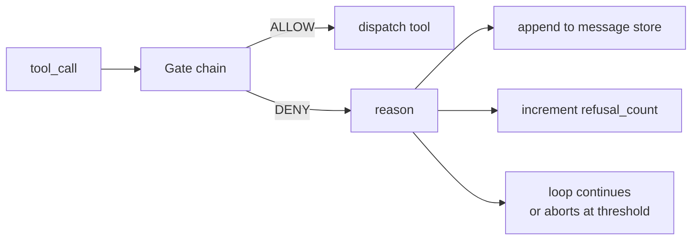
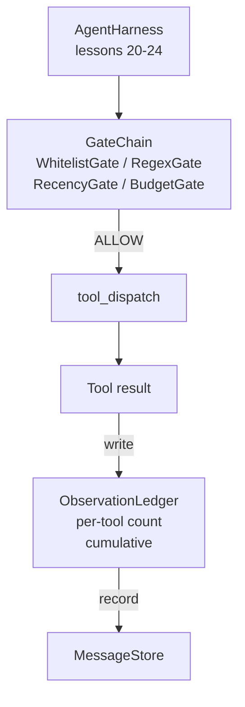

# 综合项目第 25 课：验证门与观察预算

> 一个没有验证层的智能体执行框架，本质上只是披着外套的愿望。本课会构建一条确定性的门链，用来决定某次工具调用是否允许执行、智能体允许看到多少输出，以及当智能体已经读得太多时循环何时必须停止。这条链由一组小而具名的 gate 再加上一个记录模型看过所有 token 的 observation ledger 组成。

**Type:** 构建
**Languages:** Python（标准库）
**Prerequisites:** 第 19 阶段 · 20-24（A1 路线：智能体循环、工具注册表、消息存储、提示构建器、模型路由器），第 14 阶段 · 33（将指令视为约束），第 14 阶段 · 36（作用域契约），第 14 阶段 · 38（验证门）
**Time:** 约 90 分钟

## 学习目标

- 构建一个 `VerificationGate` 协议，并提供确定性的 `evaluate(call)` 方法。
- 把 budget、recency、whitelist 和 regex gate 组合成一条具有短路语义的链。
- 使用按工具与轮次索引的 `ObservationLedger` 跟踪每一次 observation。
- 当累计 observation budget 将被超出时，拒绝工具调用。
- 生成结构化的 `GateDecision` 记录，供下游可观测性系统摄取。

## 问题

当一个智能体执行框架允许模型自由调用工具时，通常在真实使用的第一个小时内就会出现三类问题。

第一类是无界观察。一次对 20 万行仓库执行 grep，会把几十万 token 的输出直接灌进下一轮。模型每千字节只真正用到一个匹配，其余上下文全部被浪费。token 成本变高了，智能体在任务上的表现反而更差。

第二类是过期新鲜度。一个长任务积累了五十次工具调用，模型却还在把第三轮里最早那次 read_file 当成当前状态来读。第四十七轮做出的编辑之所以没有出现，只是因为 prompt builder 按时间顺序优先序列化了最早的 observation。

第三类是权限蔓延。一个研究任务从调用 `web_search` 开始，最后却 somehow 跑到了 `shell`，因为模型臆造了一个工具名，而执行框架默认采取宽松策略。等有人去翻 trace 时，/tmp 里已经躺着垃圾文件，还对私有 API 跑了一次 curl。

验证门就是那个负责说“不”的组件。它不是模型，也不是裁判。它是 `(call, history, ledger)` 的确定性函数，返回的结果只有 ALLOW 或 DENY，并附带原因。这个原因会被记录，会被告诉模型，而循环则决定继续还是中止。

## 概念



一个 gate 可以是任何实现了 `evaluate(call, ctx) -> GateDecision` 方法的对象。整条链是一个有序列表，并在遇到第一个 deny 时短路。顺序很重要：廉价的结构性 gate 应该先于昂贵的 token 计数 gate 运行。

本课提供四种 gate：

- `WhitelistGate`。允许的工具名必须来自一个显式集合。集合外的任何名字都会被拒绝。这是最便宜的 gate，因此第一个执行。
- `RegexGate`。把工具参数与正则表达式进行匹配。它适合拒绝包含 `rm -rf` 的 shell 调用，或指向内部 IP 的 HTTP 调用。这一层完全基于调用载荷本身。
- `RecencyGate`。模型只允许看到最近 N 轮的 observation，更早的 observation 会被屏蔽。当某次工具调用的结果会把 observation window 延长到一个已经过期的范围时，这个 gate 会拒绝它。
- `BudgetGate`。模型在整个会话中可读取的累计 token 有硬上限。当 ledger 表明预算已经触顶时，后续所有工具调用都被拒绝。

observation ledger 负责记账。每次成功的工具调用都会写入一行：工具名、轮次、输出 token 数、累计值。ledger 要回答两个问题：模型总共已经看过多少内容，以及它从某个具体工具 X 看过多少内容。budget gate 读取前者。按工具分预算的 gate 会在练习里由你自己实现，它读取后者。

```figure
cg-gate-chain
```

## 架构



执行框架先询问 gate chain。链要么点头，要么拒绝。若点头，工具就执行，ledger 递增，结果被追加到 message store。若拒绝，模型会收到一条系统消息形式的 refusal，而 loop 决定接下来是重试还是中止。

## 你将构建什么

实现由单个 `main.py` 和测试组成。

1. `Observation` 和 `ToolCall` 数据类，定义线路上的数据形状。
2. `ObservationLedger`，记录 `(turn, tool, tokens)` 行，并提供 `cumulative()` 与 `per_tool(name)`。
3. `GateDecision`，承载 `(allow, reason, gate_name)`。
4. `VerificationGate` 协议。每个 gate 都实现 `evaluate(call, ctx)`。
5. `GateChain`，包装一个有序列表。它依次调用各个 gate，返回第一个 deny；如果所有 gate 都通过，则返回 allow。
6. 一个 demo，运行极小的合成智能体循环，共三轮。第三轮会触发 budget gate，循环以一次干净的 refusal 和非零 refusal_count 收尾。

token 计数器故意采用一个很傻的启发式：`len(text) // 4`。本课关注的是 gate plumbing，不是 tokenizer。生产环境里可以再换成真实分词器。

## 为什么链的顺序很重要

deny 比 allow 更便宜。`WhitelistGate` 是 O(1) 的哈希查找。`RegexGate` 大致是 O(pattern * argv)。`RecencyGate` 读取 message store 的一个小切片。`BudgetGate` 则需要读取整本 ledger。把它们按成本递增排序，才能让被拒绝的调用在最早的廉价位置就被短路掉，而不是先做完所有昂贵工作。

同时还要按影响半径排序。whitelist 是最强的判断：这个工具根本不在契约里。regex 排第二：这个参数不在契约里。recency 在后面：调用本身结构合法，但执行框架已经关心窗口是否过期。budget 最后，因为它从定义上只会在其他条件都已经通过时才触发。

## 如何与 Track A 的其他部分组合

前几课已经给了你 loop、tool registry、message store、prompt builder 和 model router。本课补上的，是位于模型与工具之间的那一层。第 26 课会交付一个 sandbox：当 gate chain 返回 ALLOW 后，dispatcher 就把工具调用交给它。第 27 课会交付 eval harness，把 refusal count 作为一个质量信号记录下来。第 28 课会把 gate decision 接到 OpenTelemetry spans 里。第 29 课则把这一整套东西织进一个可工作的编码智能体。

## 运行方法

```bash
cd phases/19-capstone-projects/25-verification-gates-observation-budget
python3 code/main.py
python3 -m pytest code/tests/ -v
```

demo 会打印逐轮 trace，包括每一个 gate decision，并以零退出。测试覆盖 ledger、每个 gate 的独立行为、链的短路逻辑，以及合成 loop 的端到端运行。
