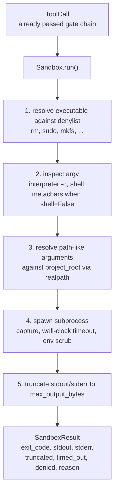
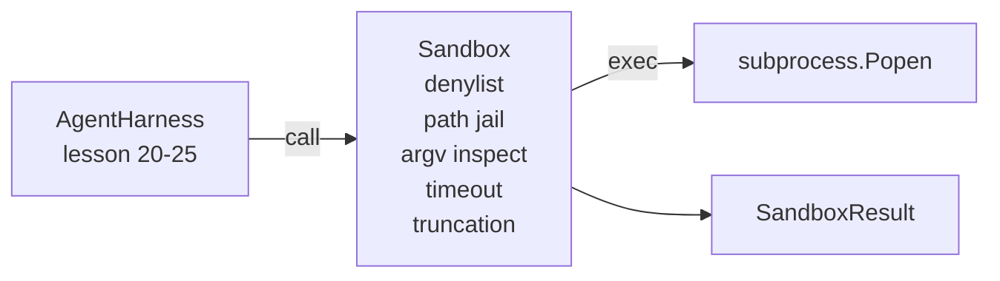

# 综合项目第 26 课：带拒绝列表与路径牢笼的沙箱运行器

> 验证门决定某次工具调用是否应该执行。沙箱决定它一旦执行会发生什么。本课会交付一个子进程运行器：它会拒绝危险可执行文件、拒绝危险的 argv 形状、把所有文件路径都关进项目根目录、截断过大的输出，并在墙钟超时后杀掉失控进程。它是模型与操作系统之间两层防线中的第二层。

**Type:** 构建
**Languages:** Python（标准库）
**Prerequisites:** 第 19 阶段 · 25（验证门与观察预算），第 14 阶段 · 33（将指令视为约束），第 14 阶段 · 38（验证门）
**Time:** 约 90 分钟

## 学习目标

- 构建一个 `Sandbox` 类，对 `subprocess.run` 提供 timeout、capture 和 truncation 封装。
- 基于 denylist 按命令名拒绝调用，并通过 argv inspector 按结构拒绝调用。
- 拒绝任何解析后落在声明项目根之外的路径参数。
- 在 shell 模式关闭时拒绝 shell 元字符。
- 返回结构化的 `SandboxResult`，供下游可观测性与评估框架摄取。

## 问题

一个可以直接调用 shell 的编码智能体，完全可以在单轮里装后门、外泄密钥、把开发者笔记本搞坏，或者顺手刷出一笔云账单。成本最低的防御当然是根本不给它 shell。次低成本的防御，就是一个对精确危险模式说“不”的沙箱。

在真实的智能体 trace 里，反复出现的失败模式主要有三类。

第一类是危险可执行文件。一个在修路径问题时被逼急的模型，往往会尝试 `sudo`、`chmod -R 777`、`rm -rf`、`mkfs`、`dd`。这些都不该出现在智能体运行里。denylist 既按名字，也按别名，把这些东西拦下来。

第二类是 argv 花招。模型如果被告知“不能用 shell”，就会试图把攻击塞进解释器里：`python3 -c "import os; os.system('rm -rf /')"`、`bash -c '...'`、`node -e '...'`、`perl -e '...'`。沙箱必须知道：任何带着 `-c` 这类旗标运行的解释器，本质上都只是多拐了一道弯的 shell 调用。

第三类是路径逃逸。模型被要求读取 `./src/main.py`，结果却去读 `../../etc/passwd`。沙箱会把每一个路径参数都通过 `os.path.realpath` 解析后关进项目根目录前缀之下。

这个沙箱并不是操作系统意义上的安全边界。一个有任意代码执行能力的坚定攻击者，依然可能逃逸。它的定位是开发期护栏：让最常见的失误模式变得响亮可见，并阻止智能体仅仅因为笨拙就做出破坏性操作。

## 概念



沙箱有四条拒绝轴：名称、argv、路径、结构。每一条轴在子进程真正启动之前，都是对调用对象的纯函数判断。只有所有轴都通过之后，子进程才会被真正拉起。

`SandboxResult` 的退出码采用约定俗成的形式：0 表示成功，非零表示失败，此外再额外保留三个哨兵语义：拒绝为 -100，超时为 -101，而截断则保留真实退出码并额外打一个标志。后续课程会直接读取这个结构化结果，而不是去解析 stderr。

```figure
cg-path-jail
```

## 架构



denylist 是一个可执行文件 basename 的 frozenset。别名路径如 `/bin/rm` 与 `/usr/bin/rm` 最终都会解析为同一个 basename。argv inspector 识别解释器形状：只要 argv[0] 是解释器，并且后续任意参数以 `-c` 或 `-e` 开头，就直接拒绝。shell 元字符 `;`、`|`、`&`、`>`、`<`、反引号以及 `$()`，在调用没有显式要求 shell 时也会触发拒绝。

路径牢笼是最微妙的一块。沙箱在构造时接收一个 `project_root`。任何看起来像路径的参数，只要包含 `/` 或者匹配到现有文件，都会先经过 `os.path.realpath` 规范化，再与项目根的 realpath 做前缀比对。如果解析结果不在根目录下，就拒绝。通过检查 realpath 而不是字面路径，连“项目根里有一个指向外部的符号链接”这种逃逸也能被挡住。

## 你将构建什么

实现由 `main.py` 和一个测试目录组成。

1. `SandboxResult` 数据类：exit_code、stdout、stderr、truncated、timed_out、denied、reason、duration_ms。
2. `SandboxConfig` 数据类：project_root、max_output_bytes、timeout_seconds、denylist、interpreter_block。
3. `Sandbox` 类：`run(argv, *, shell=False, cwd=None)` 返回一个 `SandboxResult`。
4. 内部拒绝辅助函数：`_check_executable_denylist`、`_check_argv_interpreter`、`_check_shell_metachars`、`_check_path_jail`。
5. 输出截断逻辑：既设置清晰的 `truncated` 标志，也在捕获流中插入标记行。
6. 底部 demo：混合一组合法调用与对抗性调用，并逐一展示其结果。

沙箱默认使用 `subprocess.run`，并设置 `shell=False` 与 `capture_output=True`。墙钟超时依赖 `timeout` 参数；若抛出 `TimeoutExpired`，沙箱会杀掉进程组并合成一个 SandboxResult。

## 为什么这不是真正的沙箱

本课的沙箱不会用到 namespaces、cgroups、seccomp、gVisor、Firecracker 或任何内核级隔离。子进程能做的事，沙箱本身理论上也能做。它提供的是结构性保护：拒绝最常见的危险调用，并把这类高声量拒绝送进可观测性系统，而不是悄悄让它执行。

生产级智能体还需要继续往上叠层：跑在无特权 Docker 容器里，或者放进 microVM；去掉 capabilities；把项目根挂成只读，把 scratch 目录挂成可写；对内存和 CPU 设定 ulimit；再把环境变量收缩成已知安全白名单。第 29 课会做其中一部分。操作系统级隔离不在本课范围内。

## 运行方法

```bash
cd phases/19-capstone-projects/26-sandbox-runner-denylist
python3 code/main.py
python3 -m pytest code/tests/ -v
```

demo 会创建一个临时目录，往里放一份干净文件，然后执行一组调用。合法调用应成功；被拒绝的调用会返回 `denied=True` 的 SandboxResult 和原因；超时调用会返回 `timed_out=True`；输出被截断时会设置 `truncated=True`。demo 会打印一张 JSON 结果表，并以零退出。

## 如何与 Track A 的其他部分组合

第 25 课交付了 gate chain。第 26 课就是在 gate 返回 ALLOW 后真正执行调用的执行层。第 27 课的 eval harness 会把 sandbox 结果与每项任务预期的退出码进行对比。第 28 课会在每一次 `gen_ai.tool.execution` 调用外包裹一个 `Sandbox.run` span。第 29 课的端到端 demo 则会让一个真实编码智能体穿过这两层防线。
