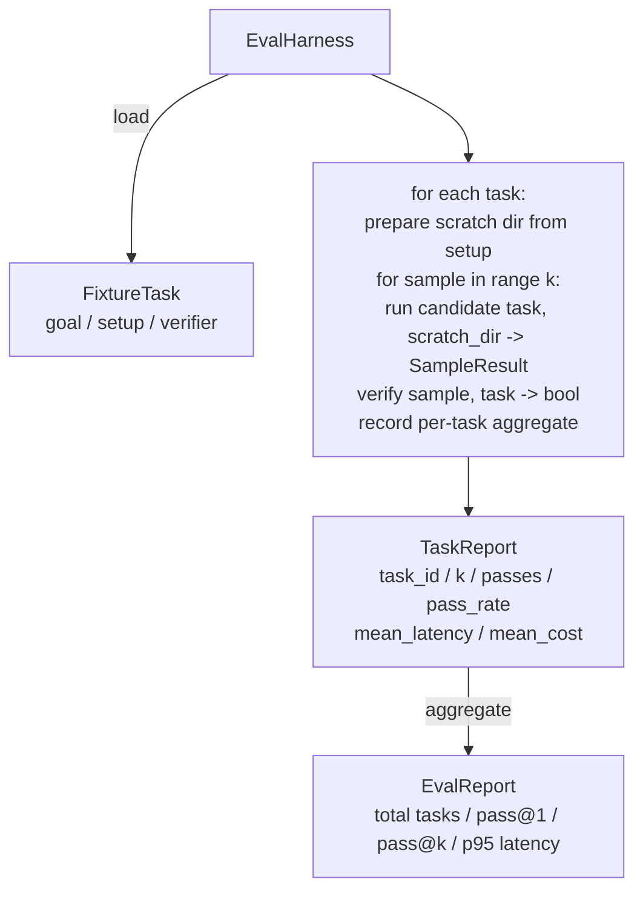

# 综合项目第 27 课：使用夹具任务构建评估框架

> 编码智能体的质量，取决于你用来衡量它的任务套件。本课会构建一个评估框架：读取一组夹具任务，通过候选智能体运行每项任务，使用确定性验证器判定通过或失败，再把结果汇总为 pass@1、pass@k、平均延迟与平均成本。这个框架是真相来源，让你能够区分真正的回归与单纯的重构。

**Type:** 构建
**Languages:** Python（标准库）
**Prerequisites:** 第 19 阶段 · 25（验证门），第 19 阶段 · 26（沙箱运行器），第 14 阶段 · 30（评估驱动的智能体开发），第 14 阶段 · 19（SWE-bench 与 GAIA 基准）
**Time:** 约 90 分钟

## 学习目标

- 将夹具任务定义为目标、设置与验证器组成的三元组。
- 为每项任务评估多次采样运行，并计算 pass@1 与 pass@k。
- 将延迟与成本汇总为均值和第 95 百分位指标。
- 把确定性验证器（文件差异、退出码、正则匹配）接入可复用函数。
- 输出可供回归追踪脚本读取的结构化 JSON 报告。

## 问题

缺少评估框架的智能体基准通常会受到三种失败模式困扰。

第一种是未经验证的通过。智能体声称已经修复缺陷，人类粗略扫了一眼 diff，测试套件就被标记为绿色；三周后，回归测试再次暴露同一个缺陷。智能体只是给出了听起来合理的推理，并没有真正解决问题。

第二种是未被发现的回归。提示模板的一项改动，让智能体在显眼任务上提升 4%，却在不显眼的任务上下降 14%。没有黄金测试集和逐任务分数时，回归会混入主分支，直到客户投诉才暴露。

第三种是逐任务漂移。周一使用 100 项任务运行评估，周五却只运行了其中 95 项，因为有人重命名了五个夹具。通过率看起来提高了 5%，其实并没有。

评估框架会把这些失败转化为事实。它每次都以可复现顺序运行所有夹具，并使用能通过确定性检查返回真或假的验证器进行判断。

## 概念

```mermaid
flowchart LR
  F1[fixtures/task_001/<br/>task.json + expected/] --> Harness
  F2[fixtures/task_002/<br/>...] --> Harness
  Harness[Harness<br/>for each task:<br/>setup / run agent k samples /<br/>verify each sample /<br/>record latency, cost]
  Harness --> Report[EvalReport<br/>pass@1 / pass@k<br/>mean ms / p95 ms<br/>mean cost]
```

一个 `FixtureTask` 由小型 JSON 文件和可选的 `expected/` 目录组成。JSON 会声明 `id`、`goal`（交给智能体的提示）、`setup` 块（放入临时目录的文件），以及 `verifier` 块。验证器块指定评估框架验证器注册表中的一个函数，并提供其参数。

三种验证器形态可以覆盖大多数有用任务。

第一种是 `file_equals`。智能体运行后，把指定文件与预期内容比较。它适用于“以这种确切方式修复此缺陷”的任务。

第二种是 `regex_match`。使用正则表达式匹配指定文件的内容。它适用于“必须存在此函数并返回 X”这类允许多种解法的任务。

第三种是 `shell_exit_zero`。评估框架通过第 26 课的沙箱运行 shell 命令，只有命令以零退出时才判定任务通过。它适用于“测试必须通过”的任务。

评估框架会把每项任务运行 `k` 次。Pass@k 等于 `1 - (1 - p)^k`，其中 p 是经验通过率；框架还会报告原始计数，以便发现方差。延迟是每个样本的实际耗时。成本采用智能体自报的数值（token 数、美元，或二者同时提供）；框架会对各样本求和，并展示逐任务及汇总数值。

```figure
pass-at-k
```

## 架构



候选项是一个可调用对象：`Callable[[FixtureTask, str], SampleResult]`。评估框架通过 `tempfile.mkdtemp()` 创建临时目录，并将路径作为普通字符串传入。框架不关心候选项内部如何工作：它可以是确定性补丁应用器（适合框架自测）、真实 LLM 智能体或模糊测试器。双方约定的契约是 SampleResult。

## 你将构建什么

`main.py` 提供：

1. `FixtureTask` 数据类。
2. `SampleResult` 数据类：success_self_reported、latency_ms、cost_units、edits。
3. `TaskReport`、`EvalReport` 数据类，二者都带有 `to_dict()`。
4. 把验证器名称映射到函数的 `VerifierRegistry`。内置验证器包括：file_equals、regex_match、shell_exit_zero。
5. `EvalHarness` 类。它针对候选项运行一个任务目录，并返回 EvalReport。
6. `tasks/` 中附带的五项夹具任务：
   - `fizzbuzz` 中的差一错误
   - `factorial` 中缺少返回值
   - 错误消息中的拼写错误
   - 空函数体
   - 链表遍历中的差一错误
7. 确定性参考候选项（`apply_known_fixes`），供框架演示干净的 pass@1 = 1.0。
8. 演示打印 EvalReport JSON，并以零退出。

夹具任务以 JSON 文件形式放在 `tasks/` 中，并在 `tasks/<id>/buggy/` 与 `tasks/<id>/expected/` 中配有成对源文件。评估框架把 buggy 内容复制到临时目录，交给候选项，再对照 expected 验证。

## 为什么不仅看 pass@1，还要看 pass@k

真实 LLM 智能体具有随机性。pass@1 为 0.6 看起来像失败；pass@5 为 0.95 则说明智能体大多数时候能得到正确答案，只是在早期样本中经常选错。修复方向应是采样与排序，而不一定是增加训练。Pass@k 让这一点可见。

同时报告 pass@k 与 pass@1，是因为 pass@k 可能掩盖真实故障：如果模型尝试二十次才答对一次，你并没有一个实用的智能体。评估框架会同时展示两者。

## 如何与路线 A 的其余部分组合

第 25 课生成了门链，第 26 课生成了沙箱。对于任何 `shell_exit_zero` 验证器，本框架都会使用该沙箱。第 28 课会把每次框架运行包装进一条 OTel 追踪；第 29 课则针对其中一项随附夹具运行端到端演示，并断言参考候选项的 pass@1 = 1.0。

## 运行方法

```bash
cd phases/19-capstone-projects/27-eval-harness-fixture-tasks
python3 code/main.py
python3 -m pytest code/tests/ -v
```

演示会以 JSON 打印 EvalReport，其中包括 pass@1、pass@5、平均延迟和逐任务明细，并以零退出。测试涵盖验证器函数、pass@k 计算、夹具加载，以及框架使用随附参考候选项的端到端运行。
