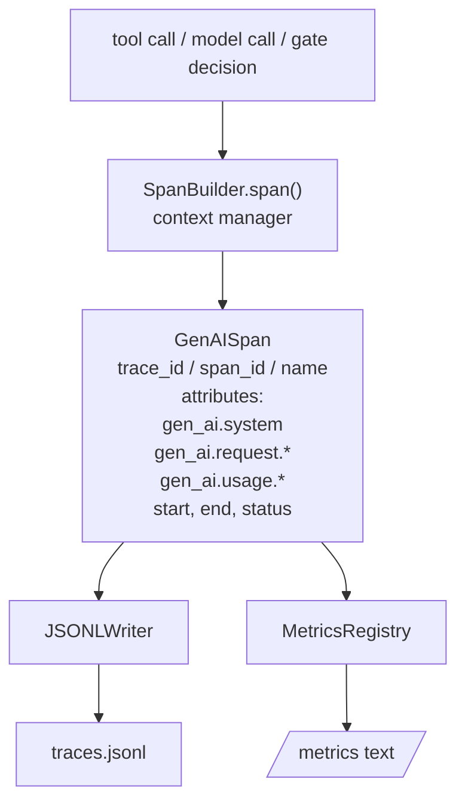
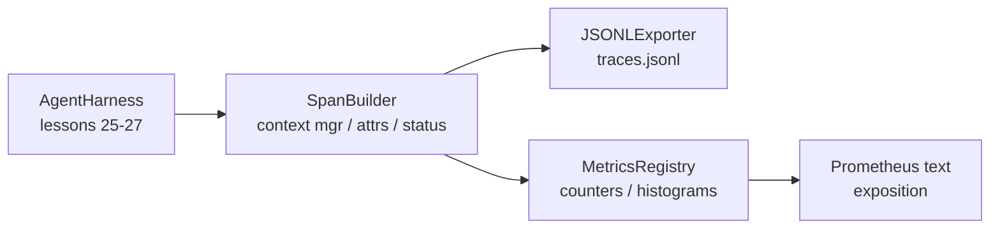

# 综合项目第 28 课：使用 OTel GenAI Span 与 Prometheus 指标实现可观测性

> 缺少可观测性的智能体执行框架，就是一个不断花钱的黑箱。本课会手工实现一个 span 构建器：它生成符合 OpenTelemetry GenAI 语义约定的记录，以每行一个 span 的形式写入 JSON Lines 文件，并用 Prometheus 文本格式公开计数器与直方图。整个实现只使用 Python 标准库，并且可以离线运行。

**Type:** 构建
**Languages:** Python（标准库）
**Prerequisites:** 第 19 阶段 · 25（验证门），第 19 阶段 · 26（沙箱），第 19 阶段 · 27（评估框架），第 13 阶段 · 20（OpenTelemetry GenAI），第 14 阶段 · 23（OTel GenAI 约定）
**Time:** 约 90 分钟

## 学习目标

- 构建符合 OpenTelemetry GenAI 语义约定形态的 span 数据类。
- 实现一个 JSONL 导出器，每行写入一条自包含 span。
- 构建带标签的计数器与直方图，并以 Prometheus 文本格式公开。
- 使用 span 上下文管理器包装任意可调用对象，记录持续时间、状态和异常。
- 验证生成的 span 能够通过 `json.loads` 往返解析，并符合规范形态。

## 问题

生产环境中的编码智能体每轮都会产生三类产物：模型调用、工具执行和验证门决策。如果没有结构化遥测，这些产物都无法发挥作用。

第一种失败模式是缺少追踪。周二发生了故障，但唯一记录是一份 500 行的聊天日志。没有记录哪个工具运行过、耗时多久、提示中包含多少 token，也不知道验证门是否拒绝过什么。智能体作者只能猜测。

第二种失败模式是无法解析的追踪。执行框架虽然写出了 span，却使用了自创的临时字段名。Grafana、Honeycomb、Jaeger 和本地 CLI 都无法读取。团队技术栈中已有的工具全部因为 span 不符合标准而派不上用场。

第三种失败模式是指标未聚合。你可以在追踪中看到一次缓慢的工具调用，却无法回答“过去一小时内 read_file 调用的 p95 延迟是多少？”，因为系统只有追踪，没有指标。

OpenTelemetry GenAI 语义约定正是为此而存在。它定义了一小组由各类 LLM 框架 span 发射器共同使用的标准属性。只要执行框架写入这些属性，任何兼容 OTel 的后端都能读取。

## 概念



执行框架中的每项操作都会生成一个 span。Span 包含 trace ID（整个智能体调用）、span ID（本次操作）、名称（例如 `gen_ai.chat`、`gen_ai.tool.execution`）、遵循 GenAI 约定的属性、开始与结束时间，以及状态。

GenAI 约定标准化了以下属性键：`gen_ai.system`（提供方，例如 `anthropic`、`openai`）、`gen_ai.request.model`（模型 ID）、`gen_ai.request.max_tokens`、`gen_ai.usage.input_tokens`、`gen_ai.usage.output_tokens`、`gen_ai.response.model`、`gen_ai.response.id`、`gen_ai.operation.name`，以及工具专用键 `gen_ai.tool.name` 和 `gen_ai.tool.call.id`。

导出器写入 JSONL，每行一个 JSON 对象。这是下游工具可以流式读取、使用 grep 搜索并导入的最简单格式。真实 OTel 导出器会使用 OTLP gRPC；本课的 JSONL 导出器是离线等价物，并能在每台工作站上以零退出。

指标与追踪并存。每次工具调用都会让计数器 `tools_called_total{tool="read_file"}` 递增。直方图则记录观察到的延迟：`tool_latency_ms{tool="read_file"}`。二者都会序列化为 Prometheus 文本公开格式，这是拉取式指标事实上的标准。

```figure
trace-spans
```

## 架构



Span 构建器是一个小型类，其 `span(name, attrs)` 方法返回上下文管理器。上下文管理器在进入时记录开始时间，在退出时记录结束时间；如果抛出异常，就把异常附加到记录中；最后把完成的 span 推送给导出器。

指标注册表由两个字典组成。计数器形式为 `{(name, frozen_labels): int}`。直方图把原始样本保存在列表中，并在公开指标时计算各个 Prometheus 直方图桶的计数。

## 你将构建什么

`main.py` 提供：

1. `GenAISpan` 数据类：trace_id、span_id、parent_span_id、name、attributes、start_unix_nano、end_unix_nano、status、status_message、events。
2. `SpanBuilder` 类，带有 `span(name, attrs, parent=None)` 上下文管理器。
3. `JSONLExporter` 类，包含每次追加一行的 `export(span)`。
4. `Counter` 与 `Histogram` 类，以及 `MetricsRegistry`。
5. 生成文本格式输出的 `prometheus_exposition(registry)`。
6. 生成 span 并更新指标的 `wrap_tool_call(name)` 装饰器。
7. 演示：合成一次完整智能体调用（在工具 span 外包裹 gen_ai.chat span），写入 traces.jsonl、打印 Prometheus 输出并以零退出。

Span ID 与 trace ID 都是由 `os.urandom` 生成的 16 字节十六进制字符串，与 OTel 的 W3C trace context 一致。导出器绝不抛出异常；IO 错误会暴露出来，但执行框架会继续运行。

直方图采用固定的桶集合（OTel 针对毫秒延迟的默认值：5、10、25、50、100、250、500、1000、2500、5000、10000、+Inf）。样本以列表形式存储，公开指标时再按需计算每个桶的计数。

## 为什么手工实现，而不使用 opentelemetry-sdk

OTel Python SDK 是一个真实依赖。它也包含数千行代码，OTLP 导出器需要多个进程，而且运行成本远超一节课程的预算。手工版本教授的是报文格式。生产环境中，可以把相同属性接入真实 SDK，从而直接获得 OTLP 导出、批处理和资源检测能力。

这些约定是稳定的。本课生成的报文格式到 2030 年仍能被解析，因为 OTel 不会破坏 GenAI 属性名称，只会新增属性。

## 如何与路线 A 的其余部分组合

第 25 课生成门链，第 26 课生成沙箱，第 27 课生成评估框架，第 28 课让三者全部具备可观测性。第 29 课会把端到端演示的每一步包装进 span，并在最后打印 Prometheus 文本。

## 运行方法

```bash
cd phases/19-capstone-projects/28-observability-otel-traces
python3 code/main.py
python3 -m pytest code/tests/ -v
```

演示会在课程工作目录生成 `traces.jsonl`（结束时清理），然后打印三条 span 样本，再输出计数器与直方图的 Prometheus 公开文本。测试会验证 span 能够往返序列化、规范 GenAI 属性齐全、计数器正确递增，以及直方图输出包含预期桶计数。
