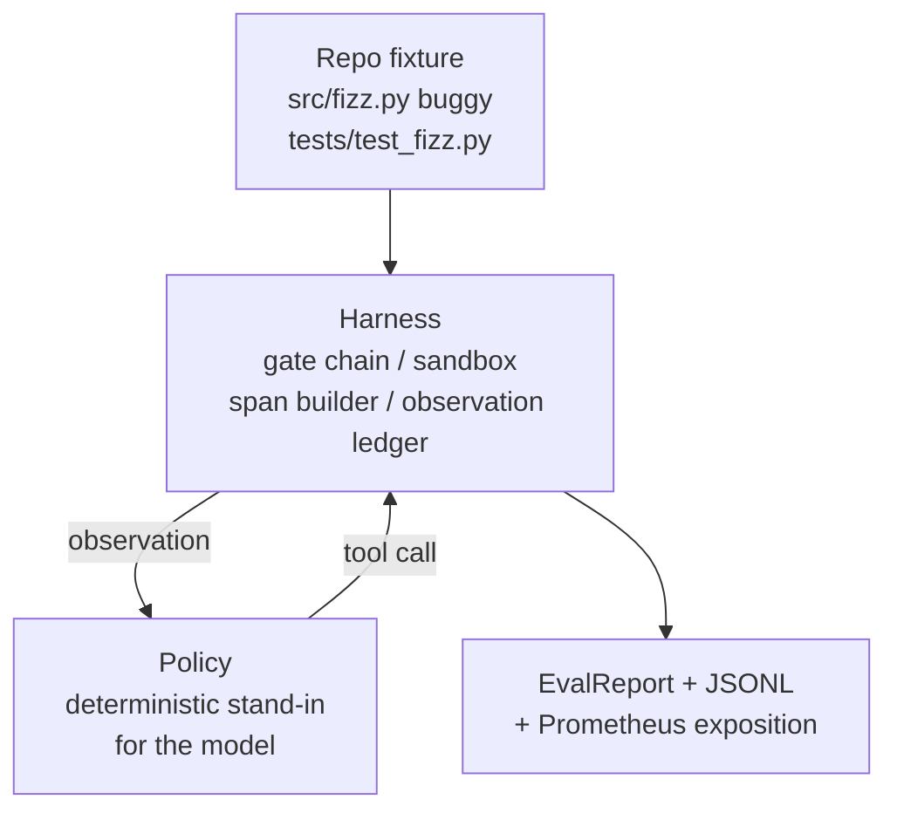
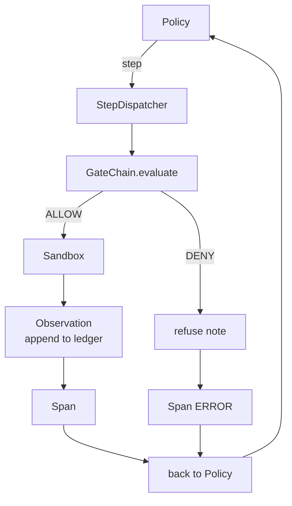

# 综合项目第 29 课：在执行框架上运行端到端编码智能体

> 这是路线 A 的最终成果。本课会把门链、沙箱、评估框架和 OTel span 串成一个可工作的编码智能体，在一个多文件 Python 项目中修复真实但规模较小的夹具缺陷。这个智能体使用确定性策略，而不是 LLM；这种替代让课程可复现，也表明执行框架一直才是最值得关注的部分。二者契约完全相同：真实模型只需接入策略接缝。

**Type:** 构建
**Languages:** Python（标准库）
**Prerequisites:** 第 19 阶段 · 25（验证门），第 19 阶段 · 26（沙箱），第 19 阶段 · 27（评估框架），第 19 阶段 · 28（可观测性），第 14 阶段 · 38（验证门），第 14 阶段 · 41（真实仓库工作台），第 14 阶段 · 42（智能体工作台综合项目）
**Time:** 约 90 分钟

## 学习目标

- 把门链、沙箱、评估框架和 span 构建器组合成一个智能体循环。
- 实现一个确定性策略，使用 read_file、run_tests 和 write_file 修复夹具缺陷。
- 在一次端到端运行中强制执行全局步骤预算与观察 token 预算。
- 为完整运行生成完整的 OTel GenAI 追踪与 Prometheus 指标。
- 验证智能体能在少于 12 步内解决夹具，而且对合法工具不会触发任何门禁拒绝。

## 问题

大多数智能体演示都孤立运行：单独展示沙箱、单独展示评估框架、单独展示 span 发射器。它们各自看起来都没有问题，但组合起来后，接缝就会暴露。

门链给出 ALLOW，沙箱却因为门链没有预料到的原因拒绝操作。评估框架记录任务通过，OTel span 却显示门禁拒绝了智能体声称已经使用的工具。Prometheus 计数器本应增加一次，却增加了两次。观察预算已经超限，但智能体仍继续运行，因为预算只在门链中追踪，沙箱并不知道。

本课是整个路线的集成测试。智能体必须依次完成四类工作：读取项目、运行测试、根据测试失败定位缺陷、写入修复、重新运行测试并停止。每项操作都经过门链，每次工具执行都通过沙箱，每一步都包装在 span 中，最后由评估框架为整个过程评分。

## 概念



智能体策略是一台包含五种状态的状态机。

`SURVEY`：智能体读取项目文件列表。下一状态是 RUN_TESTS。

`RUN_TESTS`：智能体运行测试命令。如果测试通过，状态机成功停止；否则下一状态是 INSPECT。

`INSPECT`：智能体读取失败的源文件。下一状态是 FIX。

`FIX`：智能体写入修正后的文件。下一状态是 VERIFY。

`VERIFY`：智能体再次运行测试命令。如果测试通过，则成功停止；否则以失败停止。

每种状态对应一次工具调用，每次调用都经过门链。如果工具调用被拒绝，智能体会在追踪中报告拒绝，并停止运行。

夹具缺陷是 `fizz.py` 中的差一错误。确定性策略通过正则表达式从测试失败消息中识别缺陷，并生成修正后的文件。把策略换成 LLM，也不会改变执行框架契约。

```figure
cg-harness-weave
```

## 架构



本课是自包含的。`main.py` 以最小规模重新实现前几课的各项原语（门禁、沙箱、账本、span），因此无需导入同级课程即可运行。其名称与第 25–28 课完全一致，使概念映射不会产生歧义。

## 你将构建什么

`main.py` 提供：

1. 最小执行框架原语，名称与第 25–28 课相同：`GateChain`、`Sandbox`、`ObservationLedger`、`SpanBuilder`、`MetricsRegistry`。
2. `CodingAgentPolicy` 类：包含五种状态的状态机。
3. `Repo` 辅助类：创建包含随附缺陷夹具的临时目录。
4. `AgentRun` 类：驱动策略、通过执行框架分派，并返回 `AgentRunReport`。
5. 随附夹具（`fixture_repo/`），包含 src/fizz.py、tests/test_fizz.py 和供评估框架使用的 expected/ 目录树。
6. 演示：端到端运行策略、打印逐步追踪、断言通过，并输出指标。

随附夹具与第 27 课的任务结构相同：一个有缺陷的文件与一个测试文件。测试失败消息包含足够的信息，让确定性策略能够识别修复方式。真实 LLM 会完成相同工作，只是速度更慢、召回范围更广；它不会改变执行框架的预期。

## 为什么策略不是 LLM

真实 LLM 需要 API 密钥、网络调用，并带来无法验证的随机性。执行框架才是本课关注的部分。使用确定性策略替代，可以让课程在任何开发者笔记本上以零外部依赖运行，也能让测试套件断言准确步骤数。

本课策略是 LLM 智能体行为的严格子集。它读取仓库、看到失败测试、识别错误行并生成修复。LLM 会通过同一套执行框架契约运行相同循环；记录机制完全一致。

## 演示会断言什么

端到端演示会在退出时断言五件事，测试套件也会以编程方式再次断言。

策略在少于 12 步内解决夹具。

观察预算从未超限。

合法工具触发的门禁拒绝次数为零。（智能体从未虚构被拒绝的工具名称。）

追踪文件 traces.jsonl 中，每一步都有对应的 span。

Prometheus 输出包含一项 `tools_called_total{tool="read_file"}` 记录，以及一个 `tool_latency_ms` 直方图。

## 如何与路线 A 的其余部分组合

第 25 课编写门链，第 26 课编写沙箱，第 27 课编写评估框架，第 28 课编写可观测性，第 29 课则证明它们能够作为一个系统工作。真实智能体执行框架可以由此扩展：把确定性策略替换为模型，把随附夹具替换为真实仓库任务，再把 JSONL 导出器替换为 OTLP。

## 运行方法

```bash
cd phases/19-capstone-projects/29-end-to-end-coding-task-demo
python3 code/main.py
python3 -m pytest code/tests/ -v
```

演示会打印逐步追踪、最终评估报告和 Prometheus 输出，并以零退出。测试涵盖策略状态转移、合成工具调用上的门禁拒绝、针对随附夹具的端到端运行，以及步骤预算不变量。
