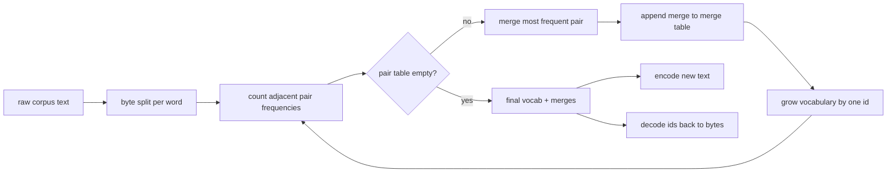
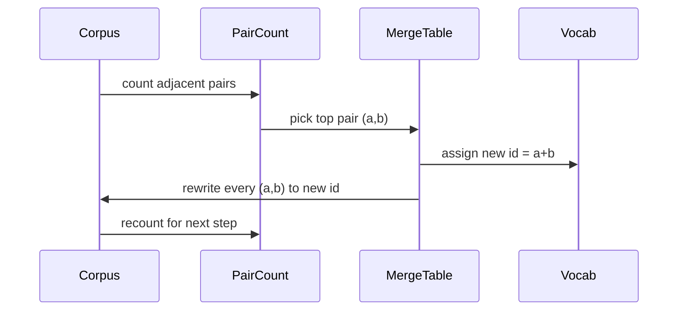

# 从零构建 BPE 分词器

> 输入字节，输出 ID，再把 ID 还原为完全相同的字节。亲手构建每个现代文本模型仍赖以起步的分词器。

**Type:** 构建
**Languages:** Python
**Prerequisites:** 第 04 阶段的课程、第 07 阶段的 Transformer 课程
**Time:** 约 90 分钟

## 学习目标
- 从原始文本语料训练字节对编码词表，方法是反复合并出现频率最高的相邻符号对。
- 实现确定性的合并表，并将其应用到新文本，产生子词 ID 流。
- 将任意 UTF-8 输入编码为 ID 再解码回来，且不丢失信息。
- 保留并保护特殊 token（`<|endoftext|>`、`<|pad|>`），使其在训练和解码过程中保持不变。
- 解释为什么字节级字母表是通用分词器合理的最低层表示。

```figure
cap-bpe-merge
```

## 整体框架

语言模型从来不会直接看到文本，它看到的是整数。从字符串映射到整数列表、再映射回字符串的组件就是分词器。如果这一层出错，训练过程中的每条损失曲线都在衡量错误的对象。

面向通用文本模型的子词分词器中，主流家族是字节对编码（Byte-Pair Encoding，BPE）。其思想很简单：从一个已知字母表开始，找出训练语料中出现最频繁的相邻符号对，将其合并为一个新符号，再重复这个过程，直到词表达到目标大小。编码新文本时，按照相同顺序复用同一份合并列表。

本课会构建字节级变体。字母表由 256 个原始字节组成，而不是 Unicode 码点。正是这个选择，让分词器能够处理任意 UTF-8 输入，而无需退回到未知 token。

## 流水线



训练侧与推理侧共享同一份合并表。这种共享就是契约。如果在推理时改变合并顺序，得到的 ID 流也会改变。

## 字节字母表

前 256 个 ID 保留给从 0x00 到 0xFF 的原始字节。这能保证任何输入字符串在进行任何合并之前，就已经可以用词表表示。字节区块之后，我们再为少量特殊 token 预留一段范围。训练循环会把这些 token 完全排除在预分词流之外，因此永远不会提议把其 ID 作为合并目标。

预分词器会在训练前，按照空白与标点边界切分语料。如果不做这种切分，BPE 合并步骤会直接学习跨词边界的合并，词表很快就会被常见完整短语填满。切分之后，合并会留在单词内部，结果也更容易泛化。

## 训练循环

每个训练步骤会做三件事。首先遍历语料中的每个单词，统计当前符号中每个相邻对的出现频率，并按单词本身的出现频率加权。然后选择计数最高的符号对。最后，把该符号对的每次出现都重写为一个新符号，其 ID 是词表中的下一个空闲位置，并记录本次合并。



每一步的成本，与表示为符号序列列表的语料大小呈线性关系。对于一百万个单词和一万个 ID 的目标词表，循环可以在数秒内完成，因为随着合并发生，符号序列会不断缩短。

## 编码新文本

推理阶段不会调用合并计数器，而是按照学习时的相同顺序应用合并表。对于一个新单词，编码器先从字节切分开始，然后扫描当前序列，寻找排名最低的可应用合并（即最早学到、当前可用的合并）。执行该次合并后重新扫描；当合并表中没有任何规则可应用于当前序列时，循环结束。

按排名确定顺序，既保证编码具有确定性，也让同一输入上的推理行为与训练行为一致。越早学到的合并越靠近表格顶部，也会越早应用。如果两个合并都可以作用于同一位置，排名更低者优先。

## 特殊 token

特殊 token 使用字节流永远无法产生的 ID。我们手动保留它们。本课只需要两个。

- `<|endoftext|>` 用于在预训练期间分隔文档。它告诉模型：“一篇新文档从这里开始，不要让上一篇文档的上下文泄漏进来。”
- `<|pad|>` 用于填充较短序列，使一个批次可以组成矩形张量。训练时由损失掩码将其隐藏。

编码器接受一个标志，用于决定是否允许输入中出现特殊 token。关闭标志时，字符串 `<|endoftext|>` 与 `<|pad|>` 会被分解为拼写这些字符串的字节；打开标志时，这些字面字符串会映射到保留 ID，且不参与任何合并。

## 往返保证

先编码再解码，必须准确还原输入字节。解码器按顺序拼接每个 ID 对应的字节展开。由于每个 ID 要么是原始字节，要么由两个先前已知的 ID 拼接而成，所以递归展开最终一定会终止于原始字节。最后，解码返回这些字节所表示的 UTF-8 字符串。

本课测试套件会在一条未见过的句子、一条包含 Unicode emoji 的句子，以及一条包含字面 `<|endoftext|>` token 的句子上检查该性质。

## 本课不做什么

本课不会构建大型生产分词器所采用的正则驱动预分词器。这里的预分词器只进行简单的空白与标点切分，足以在小型训练语料上生成合理合并，而且与课程链其他部分的契约保持相同。下一课会把分词器视为黑箱，并在其上构建滑动窗口数据集。

本课也不会并行化符号对计数器。使用 Python 循环遍历几千个单词的语料，不到一秒即可完成。对于更大语料，显然可以按单词并行统计符号对，再归约结果。

## 如何阅读代码

`main.py` 定义四个对象。`BPETokenizer` 保存词表、合并表和特殊 token 表。`train` 是训练循环，`encode` 是推理路径，`decode` 负责拼接字节。文件底部的演示会在内置语料上训练一个小型分词器，对一条留出句子编码，把 ID 解码回来，并打印二者。`code/tests/test_bpe.py` 中的测试会固定往返性质、特殊 token 保留规则与合并顺序。

运行演示，然后把演示中的目标词表大小从 300 改为 600，观察留出句子的编码长度如何下降。这条曲线就是 BPE 压缩曲线。
