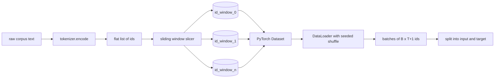
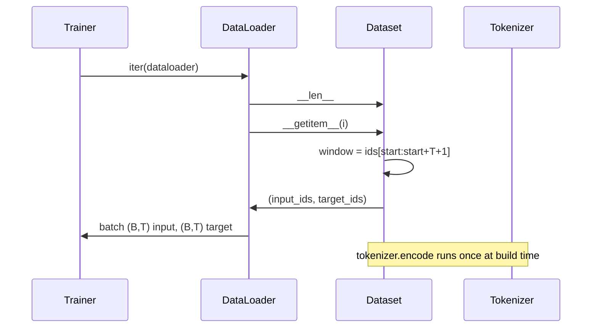

# 使用滑动窗口构建已分词数据集

> 一次预训练运行，就是从 token ID 到梯度的函数。本课会构建把这些 ID 持续送入模型的传送带。

**Type:** 构建
**Languages:** Python
**Prerequisites:** 第 04 阶段的课程、第 07 阶段的 Transformer 课程，以及本阶段第 30 课
**Time:** 约 90 分钟

## 学习目标
- 只调用一次分词器，把原始语料转换为 token ID 流。
- 使用可配置的重叠步长，把 ID 流切分为固定长度窗口。
- 构建一个 PyTorch Dataset，为下一 token 预测返回输入张量与目标张量。
- 使用按 epoch 设定的确定性随机种子，把数据集包装进 DataLoader 并执行 shuffle。
- 理解步长、冗余与有效数据集大小之间的权衡。

```figure
cap-sliding-window
```

## 整体框架

预训练每次读取一批 token ID，然后更新模型。每个批次的形状由训练契约固定。对于因果语言模型，批次包含形状为 `(B, T)` 的输入 ID 和形状为 `(B, T)` 的目标 ID，其中目标是输入向左移动一位。数据流水线的工作，是从可能包含数 GB 原始文本的语料中，以确定、可复现的方式按需生成这一契约。

本课会构建这条流水线。上一课的分词器把文本转换为一个扁平的长 ID 列表；滑动窗口把该列表切成训练样本；自定义 Dataset 把样本公开为张量；DataLoader 再使用已知随机种子组成批次并打乱顺序。

## 形状契约

因果语言模型接收形状为 `(B, T)` 的 ID，其中 `B` 是批次大小，`T` 是上下文长度。位置 `t` 的目标是输入中位置 `t+1` 的 token。因此，每个训练样本覆盖 `T+1` 个原始 ID。窗口步长决定相邻样本之间有多少重叠。



切片器绝不会越过语料边界。如果最后一个窗口没有足够的 ID 填满 `T+1` 个位置，就将其丢弃。使用 `<|pad|>` 填充尾部同样是合法选择，但会让损失掩码变得更复杂；本课选择直接丢弃。

## 为什么使用滑动窗口

预训练语料是一条很长的 ID 流。如果模型只看到彼此不重叠的窗口，每个训练样本都会反复使用相同的 `T` 边界。调整步长可以移动这些边界，让模型看到更多样的下一 token 预测任务。

步长为 `T` 时，窗口互不重叠。步长为 `T // 2` 时，重叠率为 50%，有效数据集大小翻倍。步长为 `1` 时，重叠达到最大，数据集规模会扩大 `T` 倍。代价是每个 epoch 需要更多计算，收益是边界更加多样。大多数预训练使用与上下文长度相同的步长，因为语料通常已经大到模型无法在一个 epoch 内处理完，此时边界多样性的收益较弱。

## 数据集类

PyTorch Dataset 有两个必需方法：`__len__` 返回样本数量，`__getitem__` 返回由两个张量组成的单个样本。本课的 Dataset 保存编码后的 ID 流与步长；索引时即时计算窗口起点，因此无论步长生成多少样本，内存成本都只有一份 ID 流。



向后错移一位的操作发生在 `__getitem__` 内部。Dataset 返回 `(input, target)`，其中 `input = window[:-1]`，`target = window[1:]`。二者都是 PyTorch long 张量，训练循环会把它们视为真值。

## 确定性打乱

设置 `shuffle=True` 的 DataLoader 会从 PyTorch 随机生成器读取顺序。每个 epoch 都传入显式设置种子的 `torch.Generator`，就能让每次重新启动运行时得到相同的打乱顺序。比较两个只相差一个超参数的运行时，这个性质非常重要。没有种子，两次运行看到的数据顺序不同，损失曲线会因为与目标改动无关的原因产生分歧。

本课的种子契约很简单：`epoch_seed = base_seed + epoch_index`。构建时传入基础种子，训练器在每个 epoch 开始时递增 epoch 索引。使用同一个基础种子重新运行时，每个 epoch 都会看到相同顺序。

## 批次采样器

PyTorch 默认采样器会均匀随机选择索引，且不进行有放回采样，这正是预训练需要的行为。小型数据集微调采用相同契约。DataLoader 通过调用 `__getitem__` `B` 次并堆叠结果来组成批次。由于所有样本在构造时已经保证长度相同，因此不需要填充逻辑。

为简化实现，本课保持 `num_workers=0`。生产运行中，worker 会并行调用 `__getitem__`。对于本课流水线，这几乎不会带来收益，因为工作只是从内存张量切片；但相同 Dataset API 可以自然支持 worker。

## 计算样本数

对于长度为 `N` 的 ID 流、上下文长度 `T` 和步长 `S`，样本数量为 `max(0, 1 + (N - (T + 1)) // S)`。本课把这一计算公开为 Dataset 的静态方法，让训练器无需迭代即可计算每个 epoch 的总步数。

## 本课不做什么

本课不会从磁盘流式读取。语料会一次性完整编码到内存中，并保存为单个张量。包含几百万个 ID 的语料占用远低于 100 MB，适合本课。磁盘流式读取是另一个独立关注点，只需替换存储实现，同时保持 Dataset 契约即可接入。

本课也不处理多文档。语料被视为一条连续 ID 流。由多篇文档构建语料时，可以插入 `<|endoftext|>` ID 表示下一文档边界，模型会学习边界附近的预测行为。

## 如何阅读代码

`main.py` 定义两个类和一个辅助函数。`SlidingWindowDataset` 是 PyTorch Dataset；`make_dataloader` 返回带有已设种子生成器的 DataLoader；`_encode_corpus_to_ids` 是一次性分词器调用。文件底部的演示会在进程内构建一个小型分词器、编码内置语料、创建数据集与 dataloader、打印一个批次，并断言形状契约。`code/tests/test_dataset.py` 中的测试会固定窗口计数公式、逐一移位性质、确定性打乱和步长权衡。

运行演示，然后把上下文长度从 16 改为 32，观察每个 epoch 的样本数如何下降。这个数字就是每个 epoch 的步骤预算。
