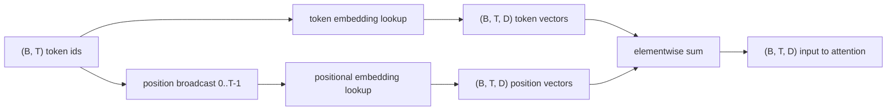
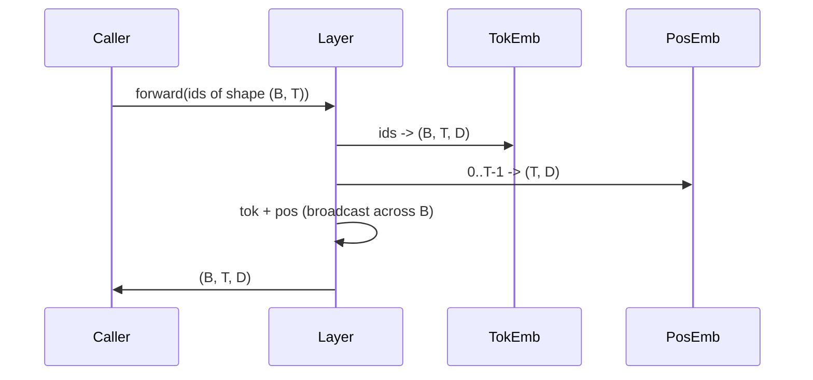

# 词元嵌入与位置嵌入

> 标识符是整数，模型真正要处理的是向量。两张查询表连接了这两者，而位置编码表的选择会直接影响模型能学到什么。

**Type:** 构建
**Languages:** Python
**Prerequisites:** 第 04 阶段的课程、第 07 阶段的 Transformer 课程，以及本阶段第 30 和 31 课
**Time:** 约 90 分钟

## 学习目标
- 构建词元嵌入查询表，把词表标识符映射成稠密向量。
- 构建按位置索引的可学习位置嵌入查询表。
- 构建按位置索引且不含参数的固定正弦位置嵌入。
- 将词元嵌入与位置嵌入组合成 Transformer 模块的统一输入。
- 对比可学习嵌入与正弦嵌入在长度泛化和参数量上的差异。

```figure
cc-embedding-lookup
```

## 基本框架

模型第一次接触词元标识符，是在词元嵌入矩阵中做一次按行查找。这个矩阵的每一行对应一个词表标识符，每一列对应一个模型维度。查找结果是一个向量，后续网络都会把它当作该标识符的语义表示。反向传播只会更新本次前向传播真正用到的那些行。随着训练推进，这些行向量的几何结构会逐渐学会用方向来表达相似性。

但词元标识符本身不携带顺序。模型还需要第二个信号来告诉它，位置 1 和位置 17 并不相同。这个信号最常见的两种做法是可学习位置嵌入，也就是每个位置占一行的第二张查询表；以及固定正弦位置嵌入，也就是一个不含参数的数学公式。这个选择会带来实际后果。可学习表是参数的一部分，因此受训练时最大上下文长度限制。正弦表理论上不含参数，公式也可以扩展到任意位置；但本课的 `SinusoidalPositionalEmbedding` 会按 `max_context_length` 预先计算一张固定表，并且它的 `forward` 在超出这个边界时会抛错，所以在这里两种模块都会强制遵守最大上下文长度。即便表本身足够大，模型在超出训练长度之后仍然可能表现不稳。

这一课会同时构建这两种位置编码，并把它们和词元嵌入组合成下一课注意力模块的输入。

## 形状约定

嵌入阶段的输入，是一批形状为 `(B, T)` 的词元标识符。输出是形状为 `(B, T, D)` 的张量，其中 `D` 是模型维度。批次里的每个样本都具有相同的上下文长度 `T`，每个位置的向量维度也都统一为 `D`。



组合方式是求和，而不是拼接。求和可以让整个网络中的 `D` 保持不变，同时允许模型按特征维度自行决定：在某一层里，到底是词元语义还是位置信号占主导。

## 词元嵌入矩阵

词元嵌入是一个形状为 `(V, D)` 的参数张量，其中 `V` 是词表大小。PyTorch 里通常直接写成 `nn.Embedding(V, D)`。初始化时，参数一般来自一个方差较小的高斯分布，传统做法是均值为零、标准差约为 `0.02`，这在 Transformer 规模的模型里很常见。具体数值没有“唯一正确答案”，但跨运行保持一致非常重要。

前向传播本质上就是一次索引操作。PyTorch 会按行取值，把 `(B, T)` 的 int64 标识符映射成 `(B, T, D)` 的浮点向量。反向传播只会把梯度累计到本次前向传播真正访问过的那些行。没有出现在当前批次中的行，在这一步拿到的梯度就是零。

还有一个容易被忽略的细节：词元嵌入和模型末端的输出投影往往会共享权重，也就是权重绑定。一旦这么做，每次反向传播都会因为输出端的梯度而触及嵌入矩阵的每一行。本课为了教学清晰，把它们拆成独立模块；但在完整模型中，同一张矩阵完全可以同时承担这两个角色。

## 学习式位置嵌入

可学习位置嵌入是另一张 `nn.Embedding`，形状为 `(max_context_length, D)`。它以位置标识符作为查询键，也就是 `0, 1, 2, ..., T-1`。前向传播会把这些位置向量沿批次维度广播出去。

它的缺点也很直接：如果模型想查询位置 `T`，但训练其实只覆盖到位置 `T-1`，那这一行根本就不存在。现实中，采用这套方案的仅解码器模型通常会把最大上下文长度直接固化在架构中，并且拒绝处理超长输入。

## 正弦位置嵌入

正弦位置嵌入是一个从位置到向量的函数。位置 `p` 与特征维度 `i` 会生成

```python
angle = p / (10000 ** (2 * (i // 2) / D))
emb[p, 2k]     = sin(angle)
emb[p, 2k + 1] = cos(angle)
```

这个函数没有参数。每个位置都会对应一个唯一向量。不同特征维度上的波长按几何级数变化，所以低维特征编码的是粗粒度位置，高维特征编码的是细粒度位置。

同时选用 `sin` 和 `cos` 的一个重要性质是：位置 `p + k` 处的向量，可以表示为位置 `p` 处向量的线性函数。这让注意力层更容易学出相对位置偏移。模型不需要额外再学一个参数去表达“向前看五个词元”。

本课的实现会在构造阶段一次性算出完整的正弦表，前向传播时只负责索引。

## 组合

这个输入管道的顺序很简单，只有三步：读取词元标识符、查询词元向量、叠加位置向量，然后返回二者之和。



在求和步骤里，广播会把 `(T, D)` 的位置张量沿批次维度复制展开。PyTorch 会自动处理这件事，因为位置张量在执行 unsqueeze 之后的形状是 `(1, T, D)`。

## 对比分析

本课会在同一组输入上同时运行这两种方案，并打印两个诊断量。

第一个是参数量。可学习版本会在词元嵌入之外额外引入 `max_context_length * D` 个参数。正弦版本则不会新增任何参数。

第二个是相邻位置嵌入之间的余弦相似度。正弦版本因为底层函数连续，所以这种相似度会呈现平滑、可预期的衰减。可学习版本在初始化时，相邻行之间通常接近随机相似，因为每一行是独立采样出来的。训练之后，可学习版本往往也会形成类似的平滑结构，但那是它通过数据自己学出来的，不是公式天然保证的。

## 本课不做什么

这节课不会实现旋转位置编码（RoPE）或 AliBi。它们才是现代生产级 Transformer 更常见的做法。它们与本课嵌入的形状约定一致，也就是都会对形状为 `(B, T, D)` 的向量施加与位置有关的变换；但真正发生的位置是在注意力投影阶段，而不是输入端。下一课会构建注意力模块，其中一个可选扩展就是把旋转位置编码整合到查询—键投影里。

这节课也不会真正训练嵌入。训练需要损失函数，损失函数需要模型输出，而模型输出又需要注意力机制和语言模型头。这正是下一课和再下一课要接上的部分。

## 如何阅读代码

`main.py` 定义了三个模块。`TokenEmbedding` 封装 `nn.Embedding(V, D)`。`LearnedPositionalEmbedding` 封装 `nn.Embedding(L, D)`。`SinusoidalPositionalEmbedding` 会预计算整张表，并把它注册成缓冲区。`EmbeddingComposer` 负责把词元嵌入和位置嵌入接在一起。文件底部的演示会打印形状、参数量，以及相邻位置相似度诊断。`code/tests/test_embeddings.py` 会固定形状、广播行为、参数量和正弦公式。

先运行演示。然后把模型维度 `D` 从 64 改成 32，观察正弦波长带会怎么变化。
