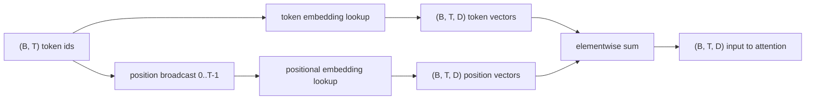
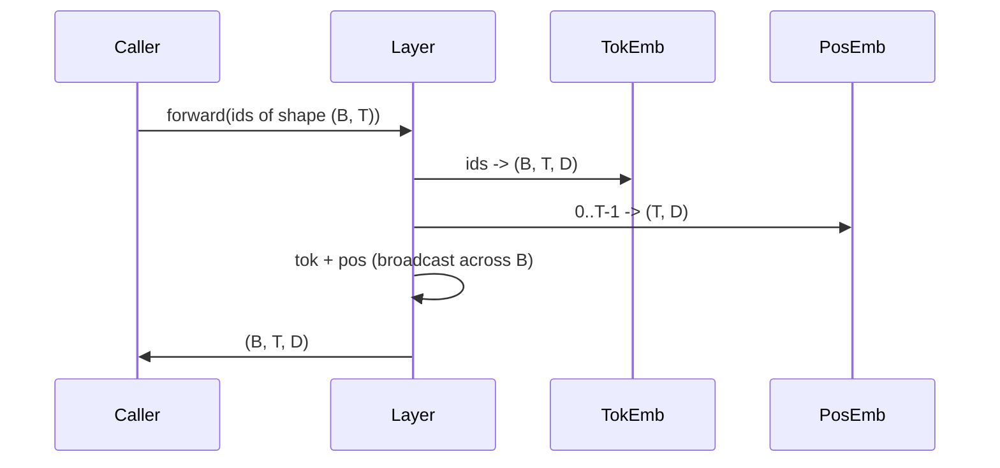

# 词元嵌入与位置嵌入

> Id 是整数，模型真正要处理的是向量。两张 lookup table 夹在这两者之间，而位置编码表的选型会直接影响模型能学到什么。

**Type:** 构建
**Languages:** Python
**Prerequisites:** 第 04 阶段的课程、第 07 阶段的 Transformer 课程，以及本阶段第 30 和 31 课
**Time:** 约 90 分钟

## 学习目标
- 构建一个 token-embedding lookup table，把 vocabulary id 映射成 dense vector。
- 构建一个按位置索引的 learned positional-embedding lookup table。
- 构建一个按位置索引、且不含参数的 fixed sinusoidal positional embedding。
- 将 token embedding 与 positional embedding 组合成 transformer block 的统一输入。
- 对比 learned embedding 与 sinusoidal embedding 在长度泛化和参数量上的差异。

```figure
cc-embedding-lookup
```

## 基本框架

模型第一次接触 token id，是在 token-embedding matrix 中做一次按行查找。这个矩阵的每一行对应一个 vocabulary id，每一列对应一个 model dimension。查找结果是一个向量，后续网络都会把它当作该 id 的语义表示。反向传播只会更新本次 forward pass 真正用到的那些行。随着训练推进，这些行向量的几何结构会逐渐学会用方向来表达相似性。

但 token id 本身不携带顺序。模型还需要第二个信号来告诉它，位置 1 和位置 17 并不相同。这个信号最常见的两种做法是 learned positional embedding，也就是第二张 lookup table，每个位置一行；以及 fixed sinusoidal positional embedding，也就是一个不含参数的数学公式。这个选择会带来实际后果。learned table 是参数的一部分，因此受训练时最大上下文长度限制。sinusoidal table 理论上不含参数，公式也可以扩展到任意位置；但本课的 `SinusoidalPositionalEmbedding` 会在 `max_context_length` 处预先计算一张固定表，并且它的 `forward` 在超出这个边界时会抛错，所以在这里两种模块都会强制遵守最大上下文长度。即便表本身足够大，模型在超出训练长度之后仍然可能表现不稳。

这一课会同时构建这两种位置编码，并把它们和 token embedding 组合成下一课 attention block 的输入。

## 形状约定

embedding 阶段的输入，是一个形状为 `(B, T)` 的 token id batch。输出是形状为 `(B, T, D)` 的 tensor，其中 `D` 是模型维度。batch 里的每个样本都具有相同的上下文长度 `T`，每个位置的向量维度也都统一为 `D`。



组合方式是求和，而不是拼接。求和可以让整个网络中的 `D` 保持不变，同时允许模型按特征维度自行决定：在某一层里，到底是 token 语义还是位置信号占主导。

## 词元嵌入矩阵

token embedding 是一个形状为 `(V, D)` 的参数 tensor，其中 `V` 是词表大小。PyTorch 里通常直接写成 `nn.Embedding(V, D)`。初始化时，参数一般来自一个较小的 Gaussian 分布，传统做法是均值为零、标准差约为 `0.02`，这在 transformer 规模模型里很常见。具体数值没有“唯一正确答案”，但跨运行保持一致非常重要。

forward pass 本质上就是一次索引操作。PyTorch 会把 `(B, T)` 的 int64 id 映射成 `(B, T, D)` 的浮点向量，方式是按行 gather。backward pass 只会把梯度累计到本次 forward 真正访问过的那些行。没有出现在当前 batch 中的行，在这一步拿到的梯度就是零。

还有一个容易被忽略的细节：token embedding 和模型末端的 output projection 往往会共享权重，也就是 weight tying。一旦这么做，每次 backward pass 都会因为输出端的梯度而触及 embedding matrix 的每一行。本课为了教学清晰，把它们拆成独立模块；但在完整模型中，同一张矩阵完全可以同时承担这两个角色。

## 学习式位置嵌入

learned positional embedding 是另一张 `nn.Embedding`，形状为 `(max_context_length, D)`。它的 lookup key 是位置 id，也就是 `0, 1, 2, ..., T-1`。forward pass 会把这些位置向量沿 batch 维度广播出去。

它的缺点也很直接：如果模型想查询位置 `T`，但训练其实只覆盖到位置 `T-1`，那这一行根本就不存在。现实中，采用这套方案的 decoder-only 模型通常会把最大上下文长度直接烘焙进架构里，并且拒绝处理超长输入。

## 正弦位置嵌入

sinusoidal positional embedding 是一个从位置到向量的函数。位置 `p` 与特征维度 `i` 会生成

```python
angle = p / (10000 ** (2 * (i // 2) / D))
emb[p, 2k]     = sin(angle)
emb[p, 2k + 1] = cos(angle)
```

这个函数没有参数。每个位置都会对应一个唯一向量。不同特征维度上的波长按几何级数变化，所以低维特征编码的是粗粒度位置，高维特征编码的是细粒度位置。

同时选用 `sin` 和 `cos` 的一个重要性质是：位置 `p + k` 处的向量，可以表示为位置 `p` 处向量的线性函数。这让 attention layer 更容易学出相对位置偏移。模型不需要额外再学一个参数去表达“向前看五个 token”。

本课的实现会在构造阶段一次性算完整张 sinusoidal table，forward 时只负责索引。

## 组合

这个输入管道的顺序很简单，只有三步：读取 token id，查 token vector，叠加 position vector，然后返回二者之和。



在求和步骤里，broadcast 会把 `(T, D)` 的位置张量沿 batch 维度复制展开。PyTorch 会自动处理这件事，因为 positional tensor 在 unsqueeze 之后的形状是 `(1, T, D)`。

## 对比分析

本课会在同一组输入上同时运行这两种方案，并打印两个诊断量。

第一个是参数量。learned 版本会在 token embedding 之外额外引入 `max_context_length * D` 个参数。sinusoidal 版本则不会新增任何参数。

第二个是相邻位置 embedding 之间的 cosine similarity。sinusoidal 版本因为底层函数连续，所以这种相似度会呈现平滑、可预期的衰减。learned 版本在初始化时，相邻行之间通常接近随机相似，因为每一行是独立采样出来的。训练之后，learned 版本往往也会长出类似的平滑结构，但那是它通过数据自己学出来的，不是公式天然保证的。

## 本课不做什么

这节课不会实现 rotary positional encoding（RoPE）或 AliBi。它们才是现代生产级 transformer 更常见的做法。它们与本课 embedding 的 shape contract 一致，也就是都会对形状为 `(B, T, D)` 的向量施加与位置有关的变换；但真正发生的位置是在 attention projection 阶段，而不是输入端。下一课会构建 attention block，其中一个可选扩展就是把 rotary 折叠到 query-key projection 里。

这节课也不会真正训练 embedding。训练需要 loss，loss 需要模型输出，而模型输出又需要 attention 和 LM head。这正是下一课和再下一课要接上的部分。

## 如何阅读代码

`main.py` 定义了三个模块。`TokenEmbedding` 包装 `nn.Embedding(V, D)`。`LearnedPositionalEmbedding` 包装 `nn.Embedding(L, D)`。`SinusoidalPositionalEmbedding` 会预计算整张表，并把它注册成 buffer。`EmbeddingComposer` 负责把 token embedding 和 positional embedding 接在一起。文件底部的 demo 会打印 shape、parameter count，以及相邻位置相似度诊断。`code/tests/test_embeddings.py` 会钉住 shape、broadcast 行为、参数量和 sinusoidal 公式。

先运行 demo。然后把模型维度 `D` 从 64 改成 32，观察 sinusoidal wavelength bands 会怎么变化。
