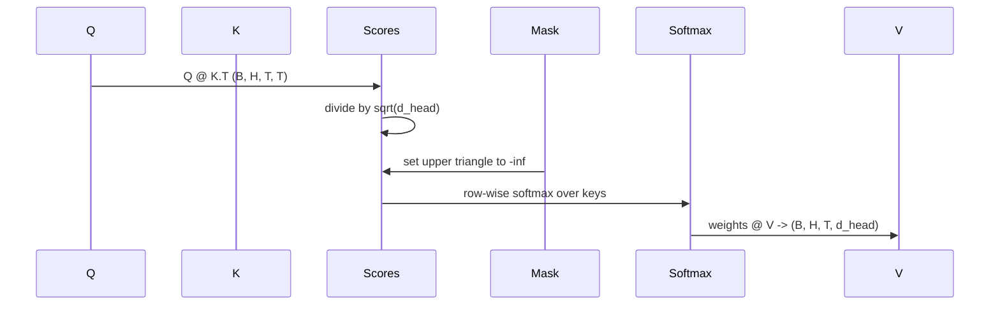

```mermaid
flowchart LR
    A["(B, T, D) input"] --> B[Linear D -> 3D]
    B --> C["split into Q, K, V"]
    C --> D["reshape to (B, H, T, d_head)"]
    D --> E["scores = Q @ K.T / sqrt(d_head)"]
    E --> F[apply causal mask]
    F --> G[softmax over keys]
    G --> H["context = weights @ V"]
    H --> I["reshape to (B, T, D)"]
    I --> J[output Linear D -> D]
    J --> K["(B, T, D) output"]
```

# 多头自注意力

> 一次线性投影，切成三个视图，分成 H 个并行注意力头，再配上一张掩码。这就是模型里真正使用的注意力模块。

**Type:** 构建
**Languages:** Python
**Prerequisites:** 第 04 阶段的课程、第 07 阶段的 Transformer 课程，以及本阶段第 30 到 32 课
**Time:** 约 90 分钟

## 学习目标
- 实现批量查询/键/值投影，用一层线性层完成并拆成 H 个注意力头。
- 计算缩放点积注意力，并正确处理归一化与数据类型。
- 应用因果掩码，确保当前位置无法关注未来词元。
- 查看固定输入下每个注意力头的注意力权重，并分析各个头在关注什么。
- 在玩具任务上训练一个小型注意力模块，观察损失如何随着注意力头的专门化而下降。

```figure
cap-multihead-attention
```

## 基本框架

注意力机制允许一个词元的表示从同一序列里的其他词元中提取信息。自注意力是指查询、键和值都来自同一个输入。多头是指把投影拆成 H 个并行的注意力子问题，最后再把各个输出拼接起来并投影回原始维度。

高效实现的标准模式是：先用一层线性层把 `D` 投影到 `3 * D`，再把结果切成三个视图，然后重塑成 H 个注意力头，每个头的维度是 `D // H`。矩阵乘法、softmax 和加权求和都以批量张量运算的方式完成，这样所有注意力头都能在加速器上并行运行。

本课会从零搭建这个模块，同时加入因果掩码，使同一份代码可以直接作为仅解码器语言模型里的注意力层。下一课会把它堆叠成完整的 Transformer，再下一课则会真正训练它。

## 形状约定

输入形状是 `(B, T, D)`，输出形状也是 `(B, T, D)`。掩码的形状是 `(T, T)`，或者至少能广播到这个形状。模块内部的中间张量形状是 `(B, H, T, d_head)`，其中 `d_head = D // H`。因此必须满足 `D % H == 0`。



这个模块里真正带参数的只有两层线性层，也就是 QKV 投影和输出投影。掩码、softmax、矩阵乘法和形状重塑都不含参数。

## QKV 拆分

最朴素的实现会为 Q、K、V 各写一层线性层。更高效的写法是只用一层线性层，输出 `3 * D` 个特征，然后再把结果切开。两者在数学上完全等价，因为三个 `(D, D)` 权重矩阵分别做矩阵乘法，本质上就等于用一张堆叠后的 `(3D, D)` 权重矩阵做一次矩阵乘法。

高效版本更快，因为加速器只需要发起一次矩阵乘法，而不是三次。它也更容易初始化，因为三个子矩阵都位于同一个参数张量里，可以统一初始化。

## 注意力头重排

拆分之后，Q、K、V 的形状都是 `(B, T, D)`。为了把它们变成 H 个并行注意力子问题，需要先重塑成 `(B, T, H, d_head)`，再转置成 `(B, H, T, d_head)`。此时注意力头维度紧挨着批次维度，PyTorch 就会把每个头的注意力计算视为 `B * H` 个独立实例上的批量运算。

最后一维会保留注意力头内部宽度，这样分数矩阵的计算 `Q @ K.transpose(-2, -1)` 才能沿该维收缩。结果形状会变成 `(B, H, T, T)`，也就是每个注意力头的注意力分数。

## 缩放

在 softmax 之前，注意力分数需要先除以 `sqrt(d_head)`。如果不做这个缩放，点积会随着 `d_head` 增大而变大，把 softmax 推进到“一个位置几乎占据全部概率质量、其他位置都接近零”的区域。在那个区域里，梯度会变得非常小，学习就会停滞。除以 `sqrt(d_head)` 的作用，就是让分数的方差在不同注意力头维度下都保持大致稳定。

## 因果掩码

仅解码器语言模型在预测下一个词元时，只能依赖过去，不能偷看未来。掩码的作用就是强制执行这条约束。具体来说，在 softmax 之前，`(T, T)` 分数矩阵中所有位于主对角线以上的元素都会被替换成负无穷。这样经过 softmax 以后，这些未来位置的权重就会变成零。



我们会在构造阶段把掩码注册成缓冲区，这样它会和模型一起移动到相同设备上，同时又不会参与梯度图。掩码覆盖的是该模块允许看到的最大上下文长度；前向传播时只需切出左上角的 `(T, T)` 子块。

## 输出投影

拿到按注意力头分组的上下文向量 `(B, H, T, d_head)` 之后，我们会先转置回 `(B, T, H, d_head)`，再重塑成 `(B, T, D)`，最后通过一层 `(D, D)` 的线性投影。这个输出投影让模型能够在当前层内混合各个注意力头的结果。没有它的话，H 个注意力头只能等到更后面的层才重新耦合，模块的表达能力就会受到人为限制。

## 注意力权重检查

本课会在前向传播中提供一个 `return_weights=True` 标志。打开后，模块除了返回输出，还会一并返回形状为 `(B, H, T, T)` 的逐头注意力权重。演示会在一个短输入上打印某个注意力头的热力图，让你直接看到因果三角结构，以及不同位置究竟在关注哪里。

训练好的模型里，不同注意力头往往会学出不同模式。有的头会关注前一个词元，有的头会频繁关注序列开头，也有的头几乎把注意力平均铺开。这个检查钩子就是后续做可解释性分析的入口。

## 训练演示

`main.py` 底部的演示会把注意力模块接上一个很小的语言模型头，然后在重复任务上训练整个模型。输入的每一行，都是同一个随机标识符在整个上下文里重复出现。目标是向右平移一位后的输入，所以模型必须学会“下一个词元和上一个词元相同”。损失函数使用交叉熵。在 H=4、D=32、T=12、词表大小为 64 的配置下，损失会从随机水平（大约 `log(64) ~ 4.16`）下降到远低于 `1.0`，即使只在 CPU 上训练三个轮次也能看到这个趋势。

这个演示的目标不是训练出一个有用的模型，而是确认梯度确实能流经模块的每一个部件，并且各个注意力头能在一个答案非常明显的问题上学到一些东西。

## 本课不做什么

这节课不会加入前馈模块。真实 Transformer 层的结构是：注意力层后面再接一个两层 MLP，并且每个子层外面都有残差连接和层归一化。下一课会把这些都补齐。

这节课也不会实现旋转位置编码或 AliBi 位置编码。它们虽然都发生在同一个模块的 QKV 投影阶段，但那是一个独立教学单元。当前实现与这两种方案兼容，只要在矩阵乘法之前先变换 Q 和 K 即可。

这节课还不会实现推理阶段的 KV 缓存。跨多次前向传播缓存键和值，是加速自回归解码的关键优化。它会改变 K 和 V 的形状约定，但不会改变 Q 的形状约定。这部分应当放在推理课程里讲。

## 如何阅读代码

`main.py` 定义了 `MultiHeadSelfAttention`。这个类内部只有两层线性层和一个注册好的掩码缓冲区。前向传播的步骤依次是：投影、重塑、打分、应用掩码、softmax、加权、再次重塑，最后再次投影。底部演示会构建一个小模型：前面接词元嵌入和位置嵌入，后面接语言模型头，在复制任务上训练三轮，并打印损失曲线与某个注意力头的注意力热力图。`code/tests/test_attention.py` 会固定形状约定、因果性、softmax 性质、注意力头拆分性质以及梯度流。

先运行演示。然后把 `n_heads` 从 4 提高到 8，同时保持 `d_model=32`，这样 `d_head=4`，再观察热力图会发生什么变化。
