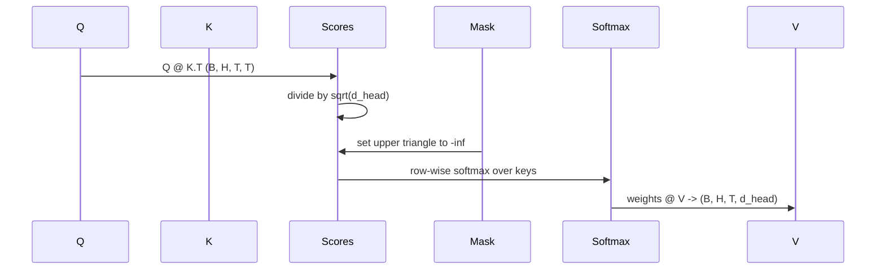

# 多头自注意力

> 一次线性投影，切成三个视图，分成 H 个并行 head，再配上一张 mask。这就是模型里真正使用的 attention block。

**Type:** 构建
**Languages:** Python
**Prerequisites:** 第 04 阶段的课程、第 07 阶段的 Transformer 课程，以及本阶段第 30 到 32 课
**Time:** 约 90 分钟

## 学习目标
- 实现 batched Query/Key/Value projection，用一层线性层完成并拆成 H 个 head。
- 计算 scaled dot-product attention，并正确处理归一化与 dtype。
- 应用 causal mask，确保当前位置无法关注未来 token。
- 查看固定输入下每个 head 的 attention weights，并分析各个 head 在看什么。
- 在 toy task 上训练一个小 attention block，观察随着 head 专门化，loss 如何下降。

```figure
cap-multihead-attention
```

## 基本框架

attention 这件事，允许一个 token 的表示从同一序列里的其他 token 中拉取信息。self-attention 的意思是，queries、keys 和 values 都来自同一个输入。multi-head 的意思是，这个投影会被拆成 H 个并行的 attention 子问题，最后再把各个输出拼接起来并投影回原始维度。

高效实现的标准模式是：先用一层线性层把 `D` 投影到 `3 * D`，再把结果切成三个视图，然后 reshape 成 H 个 head，每个 head 的维度是 `D // H`。matmul、softmax 和加权求和都以 batched tensor operation 的方式完成，这样所有 head 都能在加速器上并行运行。

本课会把这个 block 从零搭出来。同时还会加上 causal mask，这样同一份代码就能直接作为 decoder-only language model 里的 attention layer。下一课会把它堆成完整 transformer，再下一课则会真正训练它。

## 形状约定

输入形状是 `(B, T, D)`。输出形状也是 `(B, T, D)`。mask 的形状是 `(T, T)`，或者至少要能 broadcast 到这个形状。block 内部的中间 tensor 形状是 `(B, H, T, d_head)`，其中 `d_head = D // H`。因此必须满足 `D % H == 0`。

```mermaid
flowchart LR
    A["(B, T, D) input"] --> B[Linear D -> 3D]
    B --> C["split into Q, K, V"]
    C --> D["reshape to (B, H, T, d_head)"]
    D --> E["scores = Q @ K.T / sqrt(d_head)"]
    E --> F[apply causal mask]
    F --> G[softmax over keys]
    G --> H["context = weights @ V"]
    H --> I["reshape to (B, T, D)"]
    I --> J[output Linear D -> D]
    J --> K["(B, T, D) output"]
```



这个 block 里真正带参数的，只有两层线性层，也就是 QKV projection 和 output projection。mask、softmax、matmul 和 reshape 都不含参数。

## QKV 拆分

最朴素的实现会为 Q、K、V 各写一层线性层。更高效的写法是只用一层线性层，输出 `3 * D` 个特征，然后再把结果切开。两者在数学上完全等价，因为三个 `(D, D)` 权重矩阵分别做矩阵乘法，本质上就等于用一张堆叠后的 `(3D, D)` 权重矩阵做一次矩阵乘法。

高效版本更快，因为加速器只需要发起一次 matmul，而不是三次。它也更容易初始化，因为三个子矩阵都住在同一个参数 tensor 里，可以统一初始化。

## 注意力头重排

split 之后，Q、K、V 每一个的形状都是 `(B, T, D)`。为了把它变成 H 个并行 attention 子问题，需要先 reshape 成 `(B, T, H, d_head)`，再 transpose 成 `(B, H, T, d_head)`。此时 head 维度紧挨着 batch 维度，PyTorch 就会把每个 head 的 attention 当作 `B * H` 个独立实例上的 batched operation。

最后一维会保留 head 内部宽度，这样分数矩阵的计算 `Q @ K.transpose(-2, -1)` 才能沿该维收缩。结果形状会变成 `(B, H, T, T)`，也就是每个 head 的 attention scores。

## 缩放

在 softmax 之前，attention scores 需要先除以 `sqrt(d_head)`。如果不做这个缩放，dot product 会随着 `d_head` 增大而变大，把 softmax 推进到“一个位置几乎吃掉全部概率质量、其他位置都接近零”的区域。在那个区域里，梯度会变得非常小，学习就会停滞。除以 `sqrt(d_head)` 的作用，就是让 scores 的方差在不同 head size 下都保持大致稳定。

## 因果 mask

decoder-only language model 在预测下一个 token 时，只能依赖过去，不能偷看未来。mask 的作用就是强制执行这条约束。具体来说，在 softmax 之前，`(T, T)` score matrix 中所有位于主对角线以上的元素都会被替换成负无穷。这样经过 softmax 以后，这些未来位置的权重就会变成零。



我们会在构造阶段把 mask 注册成 buffer，这样它会和模型一起移动到相同设备上，同时又不会参与梯度图。mask 覆盖的是该 block 允许看到的最大上下文长度；forward 时只需切出左上角的 `(T, T)` 子块。

## 输出投影

拿到按 head 分组的 context vectors `(B, H, T, d_head)` 之后，我们会先 transpose 回 `(B, T, H, d_head)`，再 reshape 成 `(B, T, D)`，最后通过一层 `(D, D)` 的线性投影。这个 output projection 的作用，是让模型能够在当前层内就把各个 head 的结果混合起来。没有它的话，H 个 head 只能等到更后面的层才重新耦合，block 的表达能力就会被人为限制住。

## Attention 权重检查

本课会在 forward pass 上暴露一个 `return_weights=True` 标志。打开后，block 除了返回输出，还会一并返回形状为 `(B, H, T, T)` 的 per-head attention weights。demo 会在一个短输入上打印某个 head 的 heatmap，让你直接看到 causal triangle 的结构，以及不同位置究竟在关注哪里。

训练好的模型里，不同 head 往往会学出不同模式。有的 head 会盯着前一个 token，有的 head 会频繁看序列开头，也有的 head 几乎把注意力平均铺开。这个 inspection hook 就是后续做可解释性分析的入口。

## 训练 demo

`main.py` 底部的 demo 会把 attention block 接上一个很小的 LM head，然后在一个 repeat task 上训练整个模型。输入的每一行，都是同一个随机 id 在整个上下文里重复出现。目标是向右平移一位后的输入，所以模型必须学会“下一个 token 和上一个 token 相同”。loss 使用 cross-entropy。在 H=4、D=32、T=12、vocabulary=64 的配置下，loss 会从随机水平（大约 `log(64) ~ 4.16`）下降到远低于 `1.0`，即使只在 CPU 上训练三个 epoch 也能看到这个趋势。

这个 demo 的目标不是训练出一个有用的模型，而是确认梯度确实能穿过 block 的每一个部件，并且 heads 在一个答案非常明显的问题上学到一些东西。

## 本课不做什么

这节课不会加入 feed-forward block。真实 transformer layer 的结构是：attention 后面再接一个两层 MLP，并且每个子层外面都有 residual connection 和 layer norm。下一课会把这些都补齐。

这节课也不会实现 rotary 或 AliBi positional encoding。它们虽然都发生在同一个 block 的 QKV projection 阶段，但那是一个独立教学单元。当前实现与这两种方案兼容，只要在 matmul 之前先变换 Q 和 K 即可。

这节课还不会实现 inference 里的 KV cache。跨多次 forward pass 缓存 keys 和 values，是 autoregressive decoding 能变快的关键优化。它会改变 K 和 V 的 shape contract，但不会改变 Q 的 shape contract。这部分应当放在 inference lesson 里讲。

## 如何阅读代码

`main.py` 定义了 `MultiHeadSelfAttention`。这个类内部只有两层线性层和一个注册好的 mask buffer。forward pass 的步骤依次是：投影、reshape、打分、mask、softmax、加权、再 reshape、最后再投影。底部 demo 会构建一个小模型：前面接 token embedding 和 positional embedding，后面接 LM head，在 copy task 上训练三轮，并打印 loss curve 与某个 head 的 attention heatmap。`code/tests/test_attention.py` 会钉住 shape contract、causality、softmax 性质、head split 性质以及 gradient flow。

先运行 demo。然后把 `n_heads` 从 4 提高到 8，同时保持 `d_model=32`，这样 `d_head=4`，再观察 heatmap 会发生什么变化。
