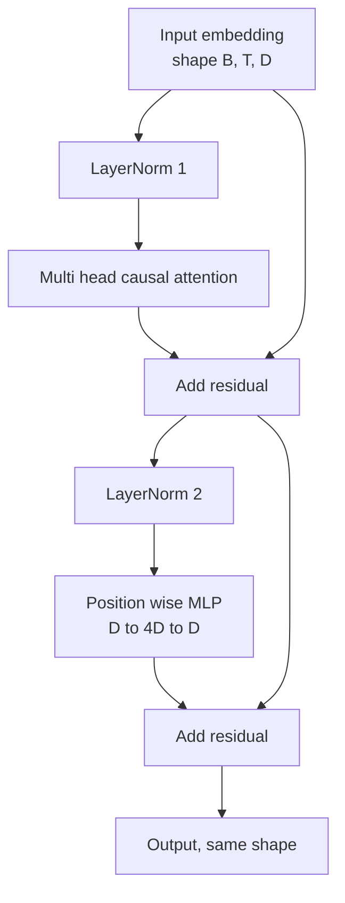
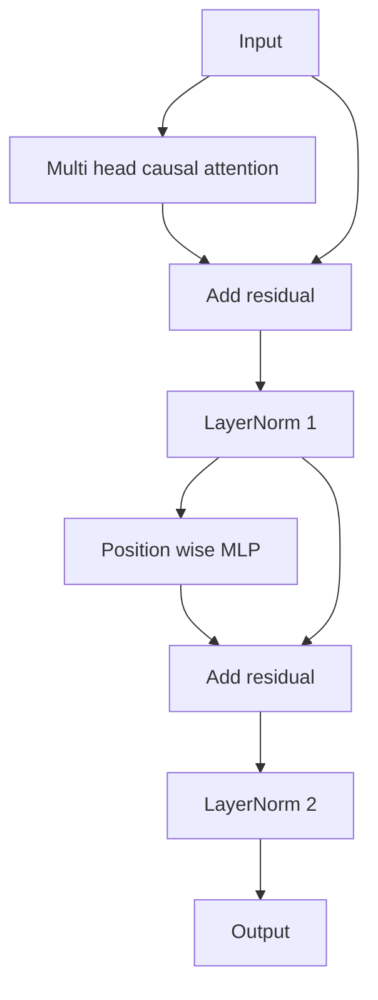

# 从零实现 Transformer 模块

> 一个 block 是每个现代 decoder LLM 的基本单元。LayerNorm、多头注意力、residual、MLP、residual。pre-LN 变体在没有 warmup 的情况下也能稳定训练；post-LN 变体则是原始论文采用的形式。本课会把两者并排搭出来，并展示在常见学习率下，哪个能扛住 12 层堆叠。

**Type:** 构建
**Languages:** Python
**Prerequisites:** 第 19 阶段第 30 到 33 课（分词器、嵌入、注意力计算与批量数据加载器）
**Time:** 约 90 分钟

## 学习目标

- 在 PyTorch 中从四个核心部件构建一个 transformer block：LayerNorm、多头因果注意力、residual connection、position-wise MLP。
- 分别放置两套 LayerNorm 结构（pre-LN 和 post-LN），并解释为什么其中一种在没有 warmup 时更稳定。
- 在多头注意力内部实现 causal masking，让 token `i` 无法看到 token `j > i`。
- 跟踪 12 层堆叠下两种变体的梯度流，并对结果做出不靠空话的解释。
- 在下一课组装 1.24 亿参数 GPT 时，把这个 block 直接复用进去。

## 问题

transformer 本质上就是一个 block 被重复多次。一个 block 如果第一次就接错了，重复 12 次之后，你得到的模型要么在第一个 epoch 就发散，要么不得不靠 warmup 技巧勉强维持。这节课里你会看到的两个失败模式并不奇怪，而是学习者第一次天真地堆 block 时最常见的错误。一个是注意力层看到了未来。另一个是 LayerNorm 放在了无法约束深层 residual signal 的位置。

一旦你看清结构，修复方法其实非常机械。一个 block 里只有两条 residual path，也只有两个 normalization 的放置点。位置放对了，后面的堆叠基本只剩工程账务工作。

## 概念

每个 decoder-only transformer block 都是一个把形状为 `(batch, sequence, embedding)` 的 tensor 映射回同样形状 tensor 的函数。内部真正做事的，只有两个子层。



上图是 pre-LN 变体。LayerNorm 放在 residual branch 内部，也就是子层之前。residual connection 则会把未经归一化的信号直接一路带下去。

post-LN 变体会把 LayerNorm 挪到 residual add 之后。



二者的形状完全一样，训练行为却不一样。对 post-LN 来说，沿 residual path 回传的梯度必须穿过 LayerNorm。在 12 层深度、学习率 `3e-4` 的设置下，这条梯度会衰减得足够快，以至于通常需要 warmup schedule。pre-LN 则保留了未归一化的 residual path，因此梯度能更干净地一路传播回 embedding layer。这也是 GPT-2 之后主流实现普遍采用 pre-LN 的原因。

### 因果多头注意力

attention 子层会把输入分别投影成 query、key、value 三个 tensor。它们会从 `(B, T, D)` reshape 成 `(B, H, T, D/H)`，其中 `H` 是 head 数量。sc​​aled dot-product attention 会按 head 计算 `softmax(Q K^T / sqrt(d_k))`，把上三角区域 mask 成负无穷，通过 softmax 应用这个 mask，再与 `V` 相乘。最后，各个 head 会被拼回一个 `(B, T, D)` tensor，并再做一次输出投影。真正让模型具有因果性的，只有这个 mask。忘掉 mask，你训练出的就是一个会作弊的模型。

### MLP

position-wise MLP 会对每个 token 独立应用同一套两层网络。隐藏层宽度是 embedding 宽度的四倍，激活函数用 GELU，第二层线性之后再跟一个 dropout。MLP 内部没有 token 之间的交互；所有 token mixing 都发生在 attention 里。

### 残差连接会做两件事

第一，它让梯度路径在深度方向上变成加性结构，因此 12 层堆叠时梯度范数仍能维持在合理尺度。第二，它让每个 block 学习的是对当前表示的增量更新，而不是完整替换。transformer block 能够扩展到深层，很大程度上就依赖这两个效果。

```figure
cc-transformer-block
```

## 建立它

`code/main.py` 会实现：

- `class LayerNorm`：带可学习 scale 和 shift，带数值稳定项，按 token 向量逐个应用。
- `class MultiHeadAttention`：包含 `num_heads`、`head_dim = d_model // num_heads`、融合的 QKV projection、注册好的 causal mask，以及 attention dropout 与 residual dropout。
- `class FeedForward`：两层线性层、GELU 激活、dropout。
- `class TransformerBlock`：带一个 `pre_ln` 标志，用来在两种变体间切换。
- 一个 demo：构建一个 6 层 pre-LN 堆栈和一个 6 层 post-LN 堆栈，输入完全相同，并打印 (a) 输出形状，(b) 一次 backward 之后 embedding 上的梯度范数。

运行它：

```bash
python3 code/main.py
```

输出会包括：两种堆栈的形状检查、并排展示的梯度范数。在相同学习率下，pre-LN 堆栈的 embedding gradient 往往会比 post-LN 大一个数量级左右，这就是“pre-LN 不依赖 warmup 也更稳”的经验信号。

## 技术栈

- `torch`：负责 tensor math、autograd，以及 `nn.Module` 的模块拼装。
- 不使用 `transformers`，不使用预训练权重。整个 block 完全从底层原语实现。

## 真实世界里的生产模式

三个模式会把教科书里的 block 变成真正能上线的东西。

**融合 QKV projection。** 三个独立线性层意味着三次 kernel launch 和三次 matmul。一层宽度为 `3 * d_model` 的线性层能在一次 launch 里完成同样工作，然后再沿最后一维切开。这种融合路径在所有加速器上都更快，也符合 GPT-2、LLaMA、Mistral 等参考实现的做法。

**把 causal mask 注册成 buffer。** mask 只依赖最大上下文长度。用 `register_buffer` 在构造时分配一次，forward 时只切当前窗口，就能避免长上下文下的反复分配开销。忘了这件事，mask 很容易变成长上下文训练里的 allocator hot spot。

**dropout 放两处，不放三处。** dropout 应该放在 attention softmax 之后（attention dropout）以及 MLP 第二层线性之后（residual dropout）。如果把 dropout 打在 residual 自身上，就会破坏支撑深层梯度流动的加性恒等结构。早期有些实现就在这里犯过错，最后只能得到非常脆弱的训练行为。

## 用它

- 本课实现的 block 可以不做修改，直接接到 lesson 35 的 GPT 组装里。
- pre-LN 变体是现代开源权重 LLM 的主流结构；post-LN 则是 2017 年原始 attention 论文使用的形式。理解这两种变体，基本就够你读懂大多数 decoder 架构。
- 把 GELU 换成 SiLU，你就得到 LLaMA 家族的激活；把 LayerNorm 换成 RMSNorm，你就得到 LLaMA 家族的归一化。骨架本身并不变。

## 练习

1. 给 block 中每个线性层都增加一个 `bias=False` 标志。现代开源权重 LLM 往往都不用线性层 bias。测一下在一个 12 层、768 维模型里能省下多少参数。
2. 用手写的 RMSNorm 替换 `nn.LayerNorm`，并验证输出形状不变。
3. 增加一个开关，返回第一头的 attention weights，形状为 `(B, T, T)`。把上三角画出来，确认 softmax 之后它仍然是零。
4. 写一个 sanity check：把形状为 `(2, 16, 384)`、`H=6` 的 tensor 分别喂给两种变体，并在相同初始化、dropout 为零时断言两者的 forward 输出不同（例如 `not torch.allclose`）。

## 关键词

| 术语 | 常见说法 | 实际含义 |
|------|-----------------|------------------------|
| Pre-LN | "Pre norm" | LayerNorm 位于 residual branch 内、每个子层之前；residual 携带的是未经归一化的信号 |
| Post-LN | "Post norm" | LayerNorm 位于 residual add 之后；这是 2017 年论文的做法，也更依赖 warmup |
| Causal mask | "Triangle mask" | attention logits 的上三角被设为负无穷，因此 token i 不能读取 j 大于 i 的 token |
| Fused QKV | "Combined projection" | 用一层宽度 3D 的线性层替代三层宽度 D 的线性层；一次 kernel，一次 matmul |
| Residual stream | "Skip connection" | 自上而下穿过每个 block 的未归一化 tensor；每个 block 都是在这条流上做增量更新 |

## 进一步阅读

- Phase 7 lesson 02（从零实现 self attention）：对应本 block 底层的 attention 数学。
- Phase 7 lesson 05（完整 transformer）：同一骨架的 encoder-decoder 版本。
- Phase 10 lesson 04（预训练 mini GPT）：这个 block 接入训练后的完整过程。
- Phase 19 lesson 35（本轨道）：把 12 个这样的 block 堆成 GPT 模型。
