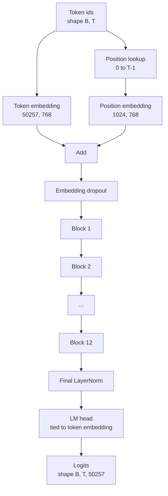
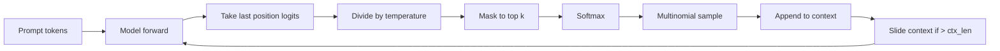

# GPT 模型组装

> 12 个模块堆叠起来，再加上 token embedding、可学习的位置 embedding、最后一层 LayerNorm，以及与输入 embedding 绑定权重的语言模型头，就构成了完整的 1.24 亿参数 GPT 模型。本课会把这些部件组装成一个可运行的类，统计参数量以确认它与参考的 124M 配置一致，并用 multinomial sampling、temperature 和 top-k 生成文本。

**Type:** 构建
**Languages:** Python
**Prerequisites:** 第 19 阶段第 30 到 34 课
**Time:** 约 90 分钟

## 学习目标

- 把第 34 课的 Transformer block 组装成完整 GPT 模型：token embedding、position embedding、N 个 block、最终 LayerNorm 和 language model head。
- 复现 124M 参数配置：词表 50257、上下文 1024、embedding 维度 768、12 个头、12 层。
- 将 language model head 与 token embedding 做权重绑定，并解释为什么在这个规模下能节省约 3800 万参数。
- 从提示词生成文本，使用 multinomial sampling、temperature scaling 和 top-k truncation，并用滑动窗口维持上下文长度。
- 对照 124M 目标测量参数量与前向传播成本。

## 问题

单个 Transformer block 本身什么也做不了。你得先把 token id 变成向量，加入位置信息，送进整条堆叠，再投影回词表 logits。四步里少任何一步，模型不是无法前向传播，就是位置感混乱，或者根本无法输出语言。

模型的形状同样关键。参考版 GPT-2 small 在上述配置下正好是 1.24 亿参数，这些数字并不神秘。50257 乘 768 是 token embedding 表；1024 乘 768 是位置 embedding 表；12 个 block 每个大约 700 万参数，总计约 8400 万。最终输出头通过权重绑定复用 token embedding 表。把这些部分加起来，就会落在 124M 左右。如果你搭出来的模型参数量对不上参考值，通常说明接线接错了。

## 概念



token id 会变成 token 向量，position id 会变成位置向量。两者相加后送入整个堆叠。最终的 LayerNorm 是 block 之外仍然保留在大多数现代变体中的部件。LM head 复用 token embedding 矩阵，这就是所谓的权重绑定。

### 权重绑定

token embedding 的形状是 `(vocab, d_model)`。语言模型头需要把 `d_model` 投影回 `vocab`，这正好是前者的转置。把两者绑定，意思就是同一个参数张量被使用两次。在词表大小为 50257、模型维度为 768 时，这个矩阵大约有 3800 万参数。不绑定就要付两份，绑定后只保留一份，而且梯度信号也更干净，因为 embedding 和输出头会一起更新。

### 位置 embedding 是可学习的，不是正弦式的

GPT-2 使用的是可学习的位置 embedding。这个位置表本身就是一个形状为 `(1024, 768)` 的参数张量。模型每次前向传播时，都会查找从 0 到 T-1 的位置，并把查到的位置向量加到 token embedding 上。这是最直接的位置编码方案，替代方案包括 RoPE、ALiBi 和 T5 relative bias，而 124M 参考配置用的就是这种可学习表。

### 生成：temperature、top-k、multinomial

生成是自回归的。每一步里，模型都会给出每个位置对整张词表的 logits。你只取最后一个位置的 logits，用 temperature 去缩放，按需把 top-k 以外的 logits 全部屏蔽成负无穷，再做 softmax 得到概率分布，最后从这个分布里采样一个 token。



这三个旋钮会显著改变行为。temperature 接近 0 时会退化成贪心解码；temperature 为 1 时保持模型原始分布；top-k 等于 1 也等同贪心；top-k 取 40 则会过滤掉长尾候选。不同组合的效果很重要，因为下一课会把生成结果当作训练过程中的定性评估信号。

```figure
cc-gpt-assembly
```

## 动手实现

`code/main.py` 会实现：

- `class GPTConfig` 数据类，默认就是 124M 配置：`vocab_size=50257`、`context_length=1024`、`d_model=768`、`num_heads=12`、`num_layers=12`、`mlp_expansion=4`、`dropout=0.1`、`use_bias=True`、`weight_tying=True`。
- `class GPTModel`，包含 token embedding、position embedding、embedding dropout、12 个 `TransformerBlock`、最终 LayerNorm，以及在启用标志时与 token embedding 绑定的 `lm_head`。
- `count_parameters` 辅助函数，返回去重后的参数数量，因此统计时会正确处理权重绑定。
- `generate` 函数，实现 temperature、top-k、multinomial，以及滑动窗口上下文。
- 一个 demo：构建模型，打印参数量并与参考 124M 对照，再从固定提示出发生成一段短序列，证明整条流水线已经打通。

运行：

```bash
python3 code/main.py
```

输出包括：与 124M 参考值并列显示的参数总量、从固定提示生成的 token id，以及在启用权重绑定时 LM head 与 token embedding 共享底层存储的确认信息。

为了让演示足够快，脚本还会用一个小配置（`d_model=64`、`num_layers=2`）完整跑通端到端生成，并直接打印生成出的 token 序列。124M 配置会被实例化，但只执行参数统计和一次前向传播。

## 技术栈

- `torch` 负责张量计算、autograd 和模块拼装。
- `code/main.py` 在本地复用了第 34 课的 block 结构模式。

## 真实生产中的常见模式

下面三个模式，决定了模型只是“能跑”，还是“能稳定交付”。

**把残差分支上的投影初始化得更小。** 注意力输出投影和 MLP 的第二个线性层都会直接进入残差相加。如果它们和其他线性层用同样的标准差初始化，残差流会随着层数加深不断膨胀，把最后的 LayerNorm 推进过热区。把这两个投影的初始化标准差按 `1 / sqrt(2 * num_layers)` 缩放，12 层时残差流会稳定得多。

**缓存 position id 张量，不要每次重算。** `torch.arange(T)` 每次前向都会新分配内存。更好的做法是在 `__init__` 中一次性为最大 context 准备好 position id，再在每次调用时切出前 T 个元素，这样可以省掉分配器往返。

**在参数层面做权重绑定，而不是简单复制。** 写成 `lm_head.weight = token_embedding.weight` 才是真共享张量；复制一份不是。优化器应当只更新一个参数，autograd 图也只应累计一份梯度。如果你只是复制，输出头会和 embedding 渐行渐远，所谓的 weight tying 就失去意义了。

## 用它

- 本课的模型类就是下一课训练时要直接使用的结构。
- 把可学习的位置 embedding 换成 RoPE，就能走向 LLaMA 系列的路线，而无需改 block 或 head。
- 再把 GELU 换成 SiLU、把 LayerNorm 换成 RMSNorm，就覆盖了 LLaMA 家族的另一批关键改动。
- 生成函数并不依赖本模型本身，只要能给出 logits 就能复用。第 37 课里你可以从预训练 GPT-2 权重得到 logits，并继续使用同一套生成循环。

## 练习

1. 取消 LM head 与 token embedding 的绑定，重新统计参数量。验证增量是否为 50257 乘 768，也就是约 3800 万。
2. 把可学习的位置 embedding 换成构造时计算好的正弦表，确认模型仍可前向传播，并验证参数量减少了 786,432。
3. 给生成函数增加 `greedy=True` 标志，跳过采样，直接选择 argmax。确认输出序列在多次运行间完全确定。
4. 增加 `repetition_penalty` 参数，在 softmax 前把提示词或已生成历史中出现过 token 的 logit 除以某个常数。用固定提示验证，大于 1 的值会减少重复。
5. 添加 `top_p`（核采样），与 `top_k` 并列使用。用两行代码检查保留 token 的概率总和大于 `top_p`。

## 关键术语

| 术语 | 常见说法 | 实际含义 |
|------|-----------------|------------------------|
| Weight tying | "Tied embeddings" | LM head 与 token embedding 共享同一个参数张量；可节省词表大小乘以模型维度这么多参数，并与 GPT-2 参考实现一致 |
| Position embedding | "Learned positions" | 一个形状为 context length 乘模型维度的独立表，会加到 token 向量上，并通过端到端训练学习 |
| Sliding window context | "Context cap" | 当提示词加生成结果超过 context length 时，丢弃最老的 token，让活动窗口重新落回上限以内 |
| Top-k sampling | "K truncation" | 保留数值最大的 K 个 logits，其余全部屏蔽为负无穷，然后只在保留下来的候选上做 softmax |
| Temperature | "Sampling temperature" | 在 softmax 前用温度系数去除 logits；小于 1 会锐化分布，等于 1 保持原分布，大于 1 会拉平分布 |

## 延伸阅读

- Phase 19 lesson 34，讲的是本模型堆叠使用的 block。
- Phase 19 lesson 36，讲的是驱动本模型训练的训练循环。
- Phase 19 lesson 37，讲的是如何把预训练 GPT-2 权重加载进这套完全一致的架构。
- Phase 7 lesson 07（GPT causal language modeling），补的是下一个 token 预测的数学基础。
- Phase 10 lesson 04（pre training mini GPT），讲的是同一架构最初的训练流程。
