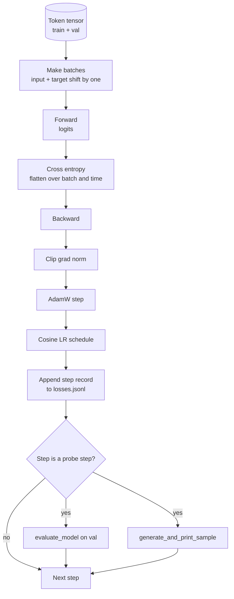

# 训练循环与评估

> 不做测量的循环，就是会撒谎的循环。本课会构建驱动 GPT 模型训练的完整训练循环：带权重衰减分组的 AdamW、预热加余弦学习率调度、`calc_loss_batch` 辅助函数、在留出数据上运行的 `evaluate_model`、每隔 K 步执行一次的 `generate_and_print_sample` 定性探针，以及可供后续绘图的 JSONL 损失日志。同一套骨架，几乎适用于你之后会训练的所有 decoder-only LLM。

**Type:** 构建
**Languages:** Python
**Prerequisites:** 第 19 阶段第 30 到 35 课
**Time:** 约 90 分钟

## 学习目标

- 构建训练循环，并用正确的输入与目标对齐方式为 next-token prediction 计算 cross entropy loss。
- 配置 AdamW，使 weight decay 只作用于权重张量，而不施加到 LayerNorm 或 bias 张量上。
- 实现带线性 warmup 和 cosine decay 的学习率调度，并能读懂学习率随时间的变化。
- 用 `evaluate_model` 在留出验证集上评估，让 eval loss 可以在不同运行之间直接比较。
- 每隔 K 步用 `generate_and_print_sample` 生成一个定性样本，在 loss 曲线暴露问题之前就抓到发散迹象。
- 把每一步的 loss 持久化到 JSONL，以便后续重新加载、绘图，并把训练日志作为交付物输出。

## 问题

一个训练脚本如果只打印 loss，却不做别的事情，会在三个地方失效。第一，它无法告诉你 loss 下降是不是因为正确的原因，模型可能只是过拟合训练集而没有真正学会泛化。第二，它无法告诉你发散是否已经开始，loss 可能某一步突然飙升后恢复，也可能只飙一步就直接崩掉。第三，它无法告诉你模型到底学到了什么，loss 只是一个标量，而生成样本是一整段文本。这三类失败模式，只有在循环里做测量时才会暴露出来。

本课的循环会从三个角度做测量：每一步记录训练 batch 的 loss；每隔 K 步在留出验证 batch 上算一次 loss；每隔 K 步从固定提示词生成一段续写。训练日志最终落到 JSONL 文件里，这个产物就是训练循环留下的证词。

## 概念



其中最容易接错的两处，是损失对齐和 AdamW 的衰减分组。

### 损失对齐

模型会在每个位置预测“下一个 token”。如果输入 batch 是 token `[t0, t1, t2, t3]`，那目标 batch 就必须是 `[t1, t2, t3, t4]`。Cross entropy 要在展平后的 `(batch * seq, vocab)` 上计算，对应的目标也要展平成 `(batch * seq,)`。如果忘了这个位移，你训练出来的就是一个“预测自己”的模型，它可能收敛到很低的 loss，却没有学到任何真正有用的东西。

### AdamW 衰减分组

weight decay 应该作用在权重张量上，但不该作用在 normalization 的 scale 参数或 bias 上。把衰减施加到 LayerNorm 的 scale，会慢慢把这个缩放量压向零，最后破坏归一化；把衰减施加到 bias，在数学上问题不大，但纯属浪费计算。标准做法是：矩阵形状的张量，例如线性层权重和 embedding 表，进入 decay 组；看起来像 scale 或 shift 的参数，则不衰减。

### 预热加余弦调度

warmup 会在前几百步里把学习率从零线性拉升到目标值，让优化器状态有时间稳定下来。cosine decay 则会在剩余训练过程中把学习率慢慢降回接近零，让最后阶段用更小步长细调权重。这个组合是开放权重 LLM 训练里最常见的调度方式，因为它能显著减少前一千步和最后一千步里最脆弱的时刻。

### 留出集评估

`evaluate_model` 会从验证集切分中取固定数量的 batch，累计 loss，再除以 batch 数后返回。整个过程不算梯度，也不启用 dropout。只要随机种子和数据切分不变，这个数字在不同运行之间就是可复现的。把留出集 loss 和训练集 loss 并排报告，是识别过拟合最直接的办法。

### 把定性采样当作早期信号

如果一个模型的训练 loss 在下降，但生成样本全是同一个 token，那它其实已经坏了。反过来，一个 loss 曲线看起来还不够漂亮的模型，如果生成样本已经开始出现连贯词语，它其实可能正在学习。定性探针比盯完整条曲线更快，也能捕捉标量 loss 漏掉的模式。

```figure
cap-training-loop
```

## 动手实现

`code/main.py` 会实现：

- `make_batches(token_ids, batch_size, context_length)`，把一长段 token 张量切成输入和目标配对。
- `calc_loss_batch(model, inputs, targets)`，执行前向传播、展平输出，并返回标量 cross entropy。
- `evaluate_model(model, val_loader, max_batches)`，在无梯度模式下遍历固定数量的验证 batch，返回平均 loss。
- `generate_and_print_sample(model, prompt, max_new_tokens)`，调用第 35 课的生成函数，用固定提示生成样本并打印。
- `build_param_groups(model, weight_decay)`，构造 AdamW 需要的两组参数列表。
- `cosine_with_warmup(step, warmup_steps, total_steps, max_lr, min_lr)`，返回某一步对应的学习率。
- `train(...)`，运行整个训练循环，把日志写入 `outputs/losses.jsonl`，并且每隔 `eval_every` 步打印一次 eval loss 和生成样本。
- 一个 demo：在合成数据上训练一个很小的模型若干步，写出 JSONL 日志，并在探针步打印 eval loss 和样本。整个演示在 CPU 上不到一分钟就能跑完。

运行：

```bash
python3 code/main.py
```

输出包括：每一步的 loss、每个探针步上的 eval loss、每个探针步上的生成样本，以及最后产出的 `outputs/losses.jsonl`，你可以逐行用 `json.loads` 读回。

## 技术栈

- `torch` 负责 autograd、优化器和模块系统。
- `main.py` 在本地重新实现了第 35 课的 `GPTModel` 及其支撑模块。

## 真实生产中的模式

下面三个模式，会把“教科书上的循环”变成一个你敢整夜挂着跑的训练脚本。

**梯度范数裁剪不是可选项。** 一个坏 batch，不管是异常数据、学习率尖峰，还是数值边界问题，都可能产生一个巨大的梯度，直接抹掉几个小时的训练结果。调用 `torch.nn.utils.clip_grad_norm_(params, max_norm=1.0)` 的位置应该在 `backward` 之后、`step` 之前，这样才能把优化器保持在安全范围内。裁剪阈值本身可以调，但 1.0 是多数设置下都够稳的默认值。

**用可恢复的 JSONL 日志，而不是 pickled state。** 把每步 loss 记录成 `{"step": int, "train_loss": float, "lr": float}` 这样的 JSONL 行有几个好处：任何崩溃都会留下可读产物；你可以直接 grep；可以用几十行代码画图；还可以通过读取最后一步来恢复训练。pickle 状态会把你绑死在生成文件时的模块布局上，一旦后续重构就很脆弱。

**eval batch 要来自固定切片。** 验证 token 张量应该在脚本启动时就切好 batch，而不是每次评估时临时切。可复现性的前提，是每次运行看到的 eval batch 完全一致；否则你比较的就不只是模型差异，还混入了 batch shuffle 带来的噪声。

## 用起来

- 本课的循环骨架，同样可以拿去训练真实数据上的 124M 模型。把合成 token 张量换成 `datasets` 风格的数据加载器，主循环本身不需要改。
- JSONL 日志是把训练跑法转化成证据的交付物。下一课会用这类记录去比较新训练出来的 checkpoint 和预训练 checkpoint。
- 定性样本探针，是任何标量 loss 都替代不了的兜底观测面。

## 练习

1. 给 `weight_decay_groups()` 增加单元测试，确认 scale 和 bias 参数进入 no-decay 组，而线性层和 embedding 权重进入 decay 组。
2. 把合成随机 token 换成一个小文本文件的字节流，让 demo 在可读文本上训练。验证生成样本只会使用文件中真实出现过的字符。
3. 给余弦调度增加一个 `min_lr` 下限，设为 `max_lr` 的 10%，然后重新画图观察变化。
4. 除了 JSONL 日志外，再每隔 `eval_every` 步保存一次 checkpoint。增加一个 `resume_from` 标志，用于重新加载模型状态和优化器状态。
5. 除了 loss 之外，再记录每一步的吞吐量，也就是每秒处理的 token 数，并确认它保持在稳定区间里。

## 关键词

| 术语 | 常见说法 | 实际含义 |
|------|-----------------|------------------------|
| Loss alignment | "Shift by one" | 输入 token 位于位置 0..T-1，目标 token 位于位置 1..T；cross entropy 在展平后的张量形状上计算 |
| Decay split | "Two groups" | AdamW 接收两组参数：矩阵形状的张量带 weight decay，scale 或 bias 参数不带衰减 |
| Warmup | "Ramp" | 学习率在固定步数内从零上升到目标值，让优化器状态有时间稳定下来 |
| Eval batches | "Held out batches" | 来自验证 token 张量固定切片的一组 batch，在脚本启动时切好，并在每次探针时重复使用 |
| Qualitative probe | "Sample print" | 每隔 K 步从固定提示生成一段短样本，用来捕捉仅靠 loss 看不见的失败模式 |

## 延伸阅读

- Phase 19 lesson 35，讲的是这个训练循环要驱动的模型。
- Phase 19 lesson 37，讲的是如何把预训练权重加载到同一套模型里。
- Phase 10 lesson 04（pre training mini GPT），补的是在真实数据上训练的完整流程。
- Phase 10 lesson 10（evaluation），补的是 cross entropy loss 之外更完整的评估面。
