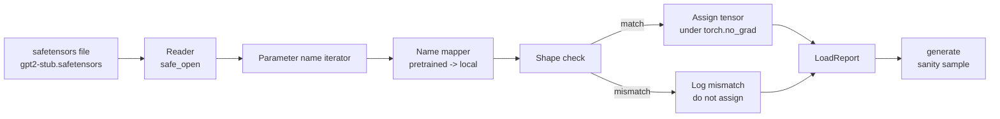

# 加载预训练权重

> 从零训练一个 1.24 亿参数模型，是预算决策；把一个公开 checkpoint 加载进来，则只是个周二下午的工程活。本课会把 GPT-2 风格的预训练权重，从一个 safetensors 文件中加载到 lesson 35 的同款架构里，逐段解释参数名映射如何对应，并通过一次 sanity generation 来证明权重确实加载成功。没有网络、没有第三方 loader、没有不透明魔法。

**Type:** 构建
**Languages:** Python
**Prerequisites:** 第 19 阶段第 30 到 36 课
**Time:** 约 90 分钟

## 学习目标

- 用 `safetensors` Python 库读取一个 safetensors 文件，并检查 tensor 名称与形状。
- 把每个预训练参数名映射到 lesson 35 GPT 模型中的对应参数。
- 处理公开 GPT-2 权重与本课程本地模型之间的两套命名约定差异：`wte/wpe/h.N.attn.c_attn/c_proj` 和 `mlp.c_fc/c_proj`，对应本地的 `tok_embed/pos_embed/blocks.N.attn.qkv/out_proj` 与 `mlp.fc1/fc2`。
- 在任何权重赋值发生前，检测并拒绝 shape mismatch，并给出明确错误。
- 用加载后的权重生成一小段续写，并确认 token 分布来自已加载模型，而不是随机初始化。

## 问题

公开发布的权重并不是按你的架构打包好的。它们携带的是原始实现使用的参数名。比如预训练文件里有 `transformer.h.0.attn.c_attn.weight`，形状是 `(2304, 768)`；而你的模型可能期待的是 `blocks.0.attn.qkv.weight`，形状同样是 `(2304, 768)`，只是命名与布局约定不同；又或者你的模型内部用的是 `nn.Linear`，矩阵存储方向还会再反一次。同一个参数因此会有三种略微不同的身份：名字、shape、以及字节布局。loader 必须同时把这三件事对齐。

一个盲目复制 tensor 的 loader，会把“对的值”放到“错的位置”，最后得到一个只会胡言乱语的模型。一个在 shape 不匹配时直接拒绝赋值、却又不打印任何日志的 loader，则会让你只能靠猜测定位失败点。本课里的 loader 是显式的：每次赋值都会被记录，每个 shape 都会先检查，并最终由一个 `LoadReport` 汇总命中、缺失和 shape mismatch，让你能真正读懂发生了什么。

## 概念



名字映射器本质上只是一个从字符串到字符串的函数。shape check 也只是一个普通的条件分支。真正的赋值过程放在 `torch.no_grad()` 里执行，以免 autograd 把加载行为记成训练图的一部分。最终 report 负责保存每个参数名的处理结果。

### GPT-2 的命名约定

公开发布的 GPT-2 权重通常使用如下名字：

| 预训练名字 | 形状 | 意思 |
|-----------------|-------|---------|
| `wte.weight` | (50257, 768) | Token embedding |
| `wpe.weight` | (1024, 768) | Position embedding |
| `h.N.ln_1.weight` | (768,) | 第 N 个 block 的 LayerNorm 1 scale |
| `h.N.ln_1.bias` | (768,) | 第 N 个 block 的 LayerNorm 1 shift |
| `h.N.attn.c_attn.weight` | (768, 2304) | 融合 QKV 线性层权重 |
| `h.N.attn.c_attn.bias` | (2304,) | 融合 QKV 线性层偏置 |
| `h.N.attn.c_proj.weight` | (768, 768) | 注意力输出投影 |
| `h.N.attn.c_proj.bias` | (768,) | 注意力输出投影偏置 |
| `h.N.ln_2.weight` | (768,) | LayerNorm 2 scale |
| `h.N.ln_2.bias` | (768,) | LayerNorm 2 shift |
| `h.N.mlp.c_fc.weight` | (768, 3072) | MLP fc1 weight |
| `h.N.mlp.c_fc.bias` | (3072,) | MLP fc1 bias |
| `h.N.mlp.c_proj.weight` | (3072, 768) | MLP fc2 weight |
| `h.N.mlp.c_proj.bias` | (768,) | MLP fc2 bias |
| `ln_f.weight` | (768,) | Final LayerNorm scale |
| `ln_f.bias` | (768,) | Final LayerNorm shift |

这里有两个必须提前规划的坑。第一，`c_attn`、`c_proj`、`c_fc` 这些线性层的权重，存储方向与 `nn.Linear.weight` 期待的方向是转置关系，因此 loader 在赋值时必须做 transpose。第二，LM head 根本不在文件中；模型依赖的是与 `wte` 的 weight tying，所以一旦 `wte` 落地，head 需要通过 alias 的方式与它共享权重。

### 本地命名约定

本课程里的模型使用的是更描述性的名字：

| 地方名称 | 意思 |
|------------|---------|
| `tok_embed.weight` | Token embedding |
| `pos_embed.weight` | Position embedding |
| `blocks.N.ln1.scale` | 第 N 个 block 的 LayerNorm 1 scale |
| `blocks.N.ln1.shift` | LayerNorm 1 shift |
| `blocks.N.attn.qkv.weight` | Fused QKV |
| `blocks.N.attn.qkv.bias` | Fused QKV bias |
| `blocks.N.attn.out_proj.weight` | 注意力输出投影 |
| `blocks.N.attn.out_proj.bias` | 输出投影偏置 |
| `blocks.N.ln2.scale` | LayerNorm 2 scale |
| `blocks.N.ln2.shift` | LayerNorm 2 shift |
| `blocks.N.mlp.fc1.weight` | MLP fc1 |
| `blocks.N.mlp.fc1.bias` | MLP fc1 bias |
| `blocks.N.mlp.fc2.weight` | MLP fc2 |
| `blocks.N.mlp.fc2.bias` | MLP fc2 bias |
| `final_ln.scale` | Final LayerNorm scale |
| `final_ln.shift` | Final LayerNorm shift |

这张映射表本质上是一个固定函数。课程里会把它实现成一个 dict，由 loader 逐项迭代。

### Stub 测试夹具

真正的 GPT-2 权重大约有 0.5 GB。本课的 demo 不会下载它们；相反，它会在首次运行时生成一个小型 safetensors fixture，它完全复用了 GPT-2 的命名约定，但 shape 对应的是一个 12-block、d_model 为 192 的小模型，而不是 768。这个 fixture 足以触发 loader 中的所有关键代码路径。把它换成真实文件后，loader 本身无需改动。

```figure
cc-weight-remap
```

## 建立它

`code/main.py` 会实现：

- 一个 lesson 35 `GPTModel` 的小型复刻版本，使本课可以自包含运行。
- `make_pretrained_to_local(num_layers)`，把每层对应的参数名展开成完整映射。
- `load_safetensors(model, path)`，它会迭代文件中的名字、做映射、检查 shape、对 conv1d 风格权重做转置，并在 `torch.no_grad()` 下完成赋值；返回一个 `LoadReport`。
- `make_stub_safetensors(path, cfg)`，生成一个具备完整预训练命名约定的 fixture 文件。
- 一个 demo：首次运行时创建 `outputs/gpt2-stub.safetensors`，构建一个新模型，先记录随机初始化下的一次续写，再加载 stub，记录第二次续写，打印两者，并验证它们不同，以证明加载确实改变了模型。

运行它:

```bash
python3 code/main.py
```

输出会包括：fixture 路径、逐参数加载日志、`LoadReport` 汇总、加载前的续写、加载后的续写，以及一个故意注入 fixture 的坏 tensor 所触发的 shape mismatch，用来覆盖失败路径。

## 技术栈

- `safetensors` 用于磁盘格式与流式读取。
- `torch` 用于模型与赋值计算。
- 不使用 `transformers`，不使用 `huggingface_hub`，也不做任何网络调用。

## 真实世界里的生产模式

有三种模式，会决定这个 loader 在面对“不是你自己产出的权重”时是否还能稳住。

**在任何赋值前先完整验证文件。** 先打开文件，列出每个 tensor 的名字、dtype 和 shape，跑完整个映射与 shape check，只有全部通过后才开始真正赋值。半加载的模型，是最危险的静默失败机器。

**记录每一次赋值，并写清源名字与目标名字。** 当结果不对时，日志能告诉你“哪个 tensor 落到了哪里”；否则你只能去读 hexdump。课程里的 `LoadReport` dataclass 会维护 `loaded`、`missing`、`unexpected` 和 `shape_mismatch` 四类结果列表，并在最后打印摘要。

**LM head 应该是权重绑定 alias，而不是单独复制。** 在 token embedding 加载完成后，再执行 `model.lm_head.weight = model.tok_embed.weight` 才是标准做法；此时 `tok_embed` 会与输出 head 共享同一块存储。把 embedding matrix 复制到一个新的 `lm_head.weight` 参数，会悄悄打破 tying，并把参数量无声翻倍。

## 用它

- 这个 loader 适用于任何使用同样预训练命名约定的 safetensors 文件。真实 GPT-2（small / medium / large / xl）不需要改代码，只需要换模型配置。
- 同样的模式也能扩展到 LLaMA、Mistral、Qwen 等权重；你只需要更新 name map，shape check 与 report 逻辑完全不变。
- 加载后的 sanity generation 是一个很快的闸门：如果 post-load 的样本看起来和 pre-load 一样，那几乎可以断定这次加载没有真正改变模型，也就是说映射静默漏掉了所有 tensor。

## 练习

1. 给 loader 增加一个 `dtype` 参数，在赋值时把每个 tensor cast 到目标 dtype（`bfloat16`、`float16`、`float32`）。验证一个 `float32` 模型被下转到 `bfloat16` 后仍能正常生成。
2. 增加一个 `expected_layers` 参数：如果 checkpoint 中的 `h.N` 索引与模型的 `num_layers` 不一致，就拒绝加载。
3. 把这个 loader 接到 lesson 35 的 generation 函数里，产出两个并排样本：一个来自随机初始化，一个来自已加载 fixture。
4. 增加导出路径：把当前模型状态按预训练命名约定重新写回一个新的 safetensors 文件。然后 round trip 一次，确认 report 中 shape mismatch 为零。
5. 扩展 `NAME_MAP` 去处理 LLaMA 的命名约定（无 bias、RMSNorm、不同的 fused qkv 布局），然后在你自己生成的 LLaMA stub fixture 上重跑 loader。

## 关键词

| 术语 | 常见说法 | 实际含义 |
|------|-----------------|------------------------|
| Name map | “Key remapping” | 从预训练 tensor 名到本地参数名的函数；通常是一个字典，再对每层索引展开 |
| Shape mismatch | “形状不对” | 预训练 tensor 的目标名字能映射上，但 shape 与本地参数不一致；loader 会拒绝赋值并记录这一对 |
| Transpose-on-load | “Conv1d 布局” | GPT-2 公开权重中的 attention / MLP projection 存储方向与 nn.Linear 期望方向相反；加载时要转置 |
| 权重绑定别名 | “共享 LM head” | 通过设置模型的 LM head 权重与 token embedding 共享存储，实现 head 与 embedding 共用参数；因此 head 不单独出现在文件里 |
| Load report | “覆盖摘要” | 一个小 dataclass，跟踪 loaded、missing、unexpected、shape_mismatch；判断加载是否成功主要靠它 |

## 进一步阅读

- Phase 19 lesson 35：本课权重最终要落入的架构。
- Phase 19 lesson 36：会产出同形状 checkpoint 的训练循环。
- Phase 10 lesson 11（quantization）：内存紧张时如何处理已加载权重。
- Phase 10 lesson 13（完整 LLM pipeline）：围绕加载与推理的完整生命周期。
