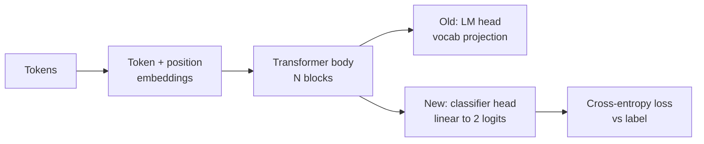
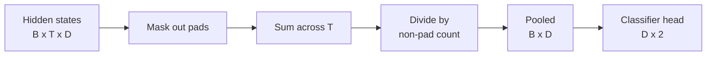
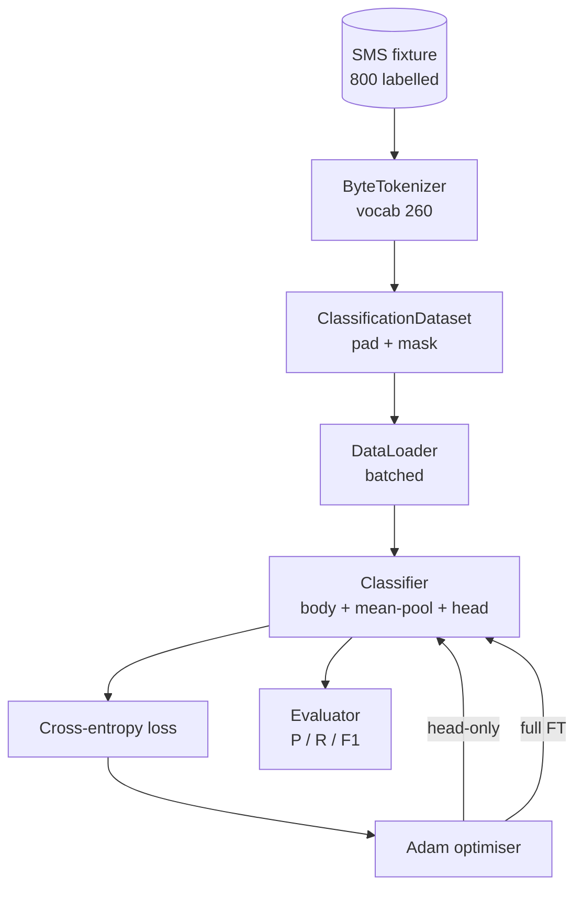

# 通过替换头部进行分类器微调

> Track B 的第一个综合课题。预训练语言模型本质上是一叠 self-attention block，末端接着一个做 token 预测的输出头。当你的任务从“预测下一个 token”变成“垃圾短信还是正常短信”时，问题往往不在模型主体，而在输出头已经不适用了。本课会拆掉原来的语言模型头，把一个输出两类 logits 的线性分类头接到池化后的表示上，并分别训练两种方案：只训练最后一层，以及全量微调。评估指标是留出测试集上的 precision、recall 和 F1。你会看清每种策略各自换来了什么，又付出了什么。

**Type:** 构建
**Languages:** Python (torch, numpy)
**Prerequisites:** 第 19 阶段第 30 到 37 课（NLP LLM 路线：分词器、嵌入表、注意力模块、Transformer 主体、预训练循环、检查点、生成与困惑度）
**Time:** 约 90 分钟

## 学习目标

- 在不重新初始化模型主体的前提下，把语言模型头替换成分类头。
- 实现两种训练范式：冻结主体只训头部，以及全量微调，并共用同一个训练循环。
- 构建一个理解 tokenizer 的数据管线，完成 padding、padding mask 和 attention output pooling。
- 从原始 logits 计算 precision、recall、F1 和 confusion matrix。
- 理解参数规模、训练时间和可提升空间之间的权衡。

## 问题

你已经在通用语料上预训练了一个小型 transformer。它的输出头会把最后一层 hidden state 投影到一个 1000-token 的词表上。现在你手头有 800 条标注为 spam 或 ham 的短信，希望做一个二分类器。这里其实有三种思路。

错误的思路，是在这 800 条样本上从零训练一个全新的分类器。预训练模型的主体已经学到了很多有用结构：词身份、位置信息、简单共现关系。把这些全扔掉，等于把之前为它付出的算力一起扔掉。

正确的两条路，是替换头部但冻结主体，以及替换头部并允许主体继续训练。只训头部速度快、显存几乎不花钱，而且在这么小的数据集上通常不容易过拟合。全量微调会更慢，也更可能在小数据上过拟合，但如果下游任务和预训练语料分布差得比较远，它往往能拿到更高准确率。

本课会把这两种方案都搭出来，让你能在同一份 fixture 上直接对比。

## 概念



模型主体可以写成函数 `f_theta(tokens) -> hidden_states`。头部则是函数 `g_phi(hidden) -> logits`。所谓“换头”，就是保留 `theta`，只替换 `g_phi`。模型里真正昂贵的是主体参数；头部通常只是单层 linear。

这里有两组关键的可训练参数：

- `theta`（主体）：每个 attention block 里都有成千上万的权重。
- `phi`（头部）：`hidden_dim * num_classes` 个权重，再加一个 bias。

在只训头部时，你只对 `phi` 计算梯度，而对 `theta` 把梯度关掉。PyTorch 的做法是把主体参数的 `requires_grad=False`。这样 optimiser 只能“看见”头部，主体就保持冻结。

在全量微调时，梯度会一路回流整个网络堆栈。主体参数会朝分类目标继续漂移。代价是：在小数据上，模型可能发生 catastrophic forgetting，也就是预训练时学到的泛化结构被过拟合噪声一点点洗掉。

## 池化问题

分类器需要的是“每条序列一个向量”，而不是“每个 token 一个向量”。常见的三种做法是：

- **Mean pool**：对整条序列上的 hidden states 求平均，并用 attention mask 对有效 token 加权。
- **CLS pool**：在输入最前面加一个特殊 token，只取它最后的输出。这是 BERT 的常见做法。
- **Last-token pool**：取最后一个非 padding token 的输出。很多 GPT 风格分类器会这样做。

本课采用带显式 attention-mask 加权的 mean pooling。它最简单，在不同序列长度下也能给出稳定信号，而且不需要在预训练阶段额外引入 CLS token。



## 数据

`code/main.py` 会确定性地生成 800 条短信数据，其中 400 条垃圾短信、400 条正常短信。生成器使用固定随机种子，先挑模板，再替换槽位内容，最终产出长度在 5 到 25 个 token 之间的消息。真实数据集会有这个 fixture 没有的噪声；这里坚持使用固定夹具，目的是让实验结果可复现。

数据按 80/20 切分：640 条训练，160 条测试。切分是 stratified 的，因此测试集仍维持 50/50 的类别平衡。有一个类别比例已知、分布稳定的留出集，precision 和 recall 才是可信数字。

## 指标

这是一个二分类问题，并且把 class 1 视为正类（spam）。四个基本计数是：

- `TP`: 预测为 spam，且真实也是 spam。
- `FP`: 预测为 spam，但真实是 ham。
- `FN`: 预测为 ham，但真实是 spam。
- `TN`: 预测为 ham，且真实也是 ham。

三个最核心的指标是：

- `precision = TP / (TP + FP)`。所有被模型标成 spam 的短信里，真正是 spam 的占多少？
- `recall = TP / (TP + FN)`。所有真实 spam 里，模型成功抓出来多少？
- `F1 = 2 * P * R / (P + R)`。precision 和 recall 的调和平均数。

混淆矩阵会把这四个计数打印成一个 2x2 网格。demo 会为两种训练方案都把它打印到 stdout。

```figure
cap-classifier-head-swap
```

## 架构



主体是一个刻意做得很小的 transformer：词表 260、hidden 维度 64、4 个 attention head、2 个 block、最大序列长度 32。它足够小，能在 CPU 上于九十秒内把两种训练方案都跑到收敛。课程里不会直接提供一个预训练好的主体；相反，`pretrain_quick` 这个辅助函数会先在同一份 fixture 文本上做五个 epoch 的 LM 训练，给主体一个不至于太随机的起点。这样整课就能保持自包含。

## 你将构建什么

实现由一个 `main.py` 和一个测试模块（`code/tests/test_main.py`）组成。

1. `ByteTokenizer`：把 byte 映射成 id，并预留一个 pad id。
2. `Block`：带 multi-head attention 和 feed-forward layer 的 transformer block，采用 pre-norm。
3. `LMBody`：token embedding、position embedding，再加上一叠 block，输出 hidden states。
4. `MeanPool`：沿序列轴做带 mask 权重的平均。
5. `Classifier`：主体、pool 和 linear 头部。两种训练范式共用同一个主体实例。
6. `freeze_body` 和 `unfreeze_body`：切换主体参数的 `requires_grad`。
7. `train_classifier`：共用的一套训练循环。它接收模型，以及一个只包含当前可训练参数组的 optimiser。
8. `evaluate`：在测试集上跑推理，并返回 `Metrics(precision, recall, f1, confusion)`。
9. `run_demo`：先对主体做一次短预训练，再训练并评估只训头部方案，接着训练并评估全量微调方案，打印两份报告，然后正常退出。

## 为什么这个比较重要

只训头部方案通常训练更快，也更容易以一种“欠拟合但不失控”的方式收敛。在这个 fixture 上，你通常会看到：只训练头部 20 个 epoch 后，precision 大约接近 0.9，recall 大约接近 0.85。全量微调则大概要花三倍左右的时间，最终结果通常只是在这附近上下浮动几个点，具体取决于随机种子。

本课不会替你宣布谁是赢家。它要教的是：如何同时读懂数字和成本。在 800 条样本、模型主体又很小的情况下，只训头部往往就是正确选择；如果换成 80,000 条样本，主体也更大，那么全量微调才开始显出价值。你真正要从本课带走的是那个 API 契约：同一个 `train_classifier` 函数可以同时服务两种方案，而两者的切换只是一行调用。

## 延伸练习

- 加入第三种方案：只解冻最后一个 block。这通常叫 partial fine-tuning。它比 full FT 成本低，但通常比只训头部学得更多。
- 加入 learning-rate scheduler。生产环境里，头部走 cosine schedule、主体走更小的恒定学习率，是一种常见配置。
- 把 mean pooling 换成 learned attention pool：加一个带单个 learned query 的小 attention layer。对更长序列来说，它经常会比 mean pool 表现更好。

实现已经把这些扩展点预留好了。测试会把契约钉住。剩下的指标空间，就交给你自己去推。
