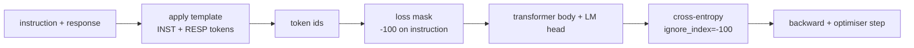
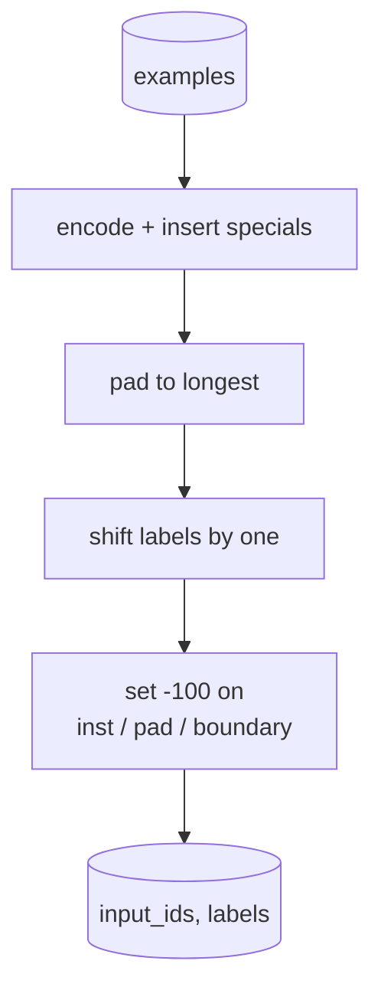
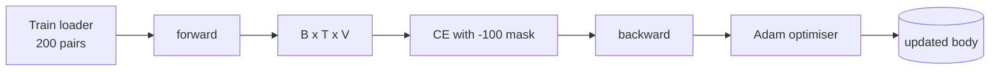

# 用监督微调做指令跟随

> 预训练好的 base model 会续写序列，但不会“听指令”。监督微调是修复这个问题的最小改动：把指令和期望回答配成样本喂给模型，让模型去预测回答部分的 token。关键细节在于，loss 只应该统计回答，不应该统计指令。本课会搭一个 Alpaca 风格的 SFT 训练循环，写一个自定义 collate function，用 `ignore_index=-100` 把 instruction token mask 掉，在 200 组 instruction-response pair 上训练，并用留出集上的 exact-match 做评估。

**Type:** 构建
**Languages:** Python（torch、numpy）
**Prerequisites:** 第 19 阶段第 30 到 37 课（NLP LLM 路线：分词器、嵌入表、注意力模块、Transformer 主体、预训练循环、检查点、生成与困惑度）
**Time:** 约 90 分钟

## 学习目标

- 把成对的 instruction-response 数据格式化成单条 causal sequence，并显式插入边界 token。
- 构建一个 collate function，对 instruction token 做 mask，让 cross-entropy 只统计 response token。
- 在 SFT 目标下训练一个小型 transformer body，并观察评估指标如何变化。
- 实现尊重 response-start 边界的 greedy generation 和 temperature sampling。
- 在生成出的 completion 上计算留出集 exact-match。

## 问题

一个只在 next-token prediction 上训练出来的 base model，并不知道“instruction”是什么。你给它看字符串 `"What is the capital of France?"`，它大概率只会继续补全这个问题，或者另起一句话。模型掌握了语言本身，却没掌握交互格式的契约。

SFT 的核心契约，本质上就是一个字符串模板。每个训练样本都会被改写成一条带三个区域的单序列：

```text
<INST> What is the capital of France? <RESP> The capital of France is Paris.
```

这些边界 token 是训练时预留的 special token。模型会学到：`<RESP>` 之后的部分才是回答，而真正要被打分的也是回答。base model 原本的 next-token objective 并没有变；它只是被放到了一个“每条样本都长成这个样子”的语料上继续训练。

但这里有个陷阱。如果你把整条序列原样送进一个普通的 cross-entropy loss，模型也会被训练去预测 instruction token。可 instruction 本来就是用户给定的，不应该产生梯度。修复办法就是加 mask。

## 概念



`ignore_index` 是 `torch.nn.functional.cross_entropy` 自带的一个特性。任何 target 位置只要等于 `ignore_index`，就会贡献零 loss 和零 gradient。PyTorch 里默认约定这个值是 `-100`。因此 collate function 需要为每个样本构造两份张量：`input_ids`（完整序列）和 `labels`（`input_ids` 的一个副本，但把 instruction 区域改写成 `-100`）。

模型在 forward pass 时会看到整条序列；attention 当然可以 attend 到 instruction。只是 loss 只会计算 response token。这个行为正是你想要的：以 instruction 为条件，去预测 response。

## 数据

`main.py` 会确定性地生成 200 组 instruction-response pair，覆盖六种任务类型：

- 单项事实问答（X 的首都）
- 算术
- 列表提取
- 单句摘要
- 代码（打印、排序）
- 定义

每类任务都由模板化 instruction 和确定性的 response 组成。这里刻意把问题做得很简单。exact-match 本身很脆弱，因此课程故意使用一个“正确答案就是某个确定字符串”的 fixture。真实 SFT 数据集往往需要更模糊的指标；但核心原理是一样的。

数据切分为 160 条训练、40 条测试。测试集覆盖全部六类任务，因此可以报告按类别拆分的 exact-match。

## 分词与补齐

tokenizer 采用 byte-level，并预留三个 special id：

- `INST_ID = 256`：标记 instruction 区域开始。
- `RESP_ID = 257`：标记 instruction 和 response 之间的边界。
- `PAD_ID = 258`：用于变长 batch 的 padding。

每条序列的结构是 `[INST] inst_bytes [RESP] resp_bytes [PAD]*`。collate function 需要做三件事：

1. 对每个样本做 tokenisation。
2. 把 batch 中的每条样本 pad 到当前 batch 的最长长度。
3. 构造 `labels` = `input_ids` shifted by one（即 causal LM target），并额外处理：
   - instruction 区域替换成 `-100`。
   - padding 区域替换成 `-100`。
   - `RESP_ID` 自己所在的边界位置也替换成 `-100`（你不训练模型去预测边界 token；模型真正要预测的是边界之后的回答内容）。



这个 shift 是标准的 causal 技巧：位置 `i` 的 `input_ids` 负责预测位置 `i+1`，所以 `labels[i] = input_ids[i+1]`（输入最后一个位置会被截掉，目标最开始一个位置也会被截掉）。mask 必须在 shift 之后再打，才能落到正确的位置上。

## 训练



训练循环就是一套标准的 PyTorch SFT 训练循环。优化器用 Adam，学习率大致落在 3e-4 到 1e-3 之间，在这份 fixture 上训练十到二十个 epoch，不上 scheduler。模型很小，配置大致是 hidden 96、2 个 block、最大长度 64，因此在 CPU 上两分钟内就能收敛。

每五个 epoch，循环会在留出集上做一次小评估，并打印 exact-match。看着 exact-match 从 epoch 1 的 0.0，一路涨到 epoch 15 左右的 0.85，正是这课的回报点：你能直观看到模型同时学会了“该怎么回答”和“答案本身是什么”。

## 生成

评估时，模型拿到的前缀是 `[INST] inst_bytes [RESP]`，然后开始继续生成，直到满足下面任意一个条件：

- 序列长度达到 `max_len`，或者
- 模型触发一个特殊的停止启发式：连续输出两个句末字节（`.`、`!`、`?`）。

课程会同时提供 greedy decoding 和可选的 temperature sampler。exact-match 评估使用 greedy，因为 temperature 会让指标变成随机量。真实系统里通常会做 sampling，再用更模糊的判分器去评估；那条流水线会在 lesson 41 里出现。

## Exact-Match 评估

exact-match 是最严格的文本指标。预测出来的 response string 会先做归一化处理（lowercase、strip whitespace、collapse double spaces），参考答案也做同样归一化。每个样本的结果只有 1 或 0，整体指标就是它们的平均值。

真实 SFT 流水线往往还会配合 token-level F1（lesson 41）和 judge model 一起看，但 exact-match 仍然有价值，因为它没有解释空间。如果它是 0.7，那意思就是：测试集中恰好有 70% 的 instruction 得到了与 gold response 字符级完全一致的输出。

```figure
cc-sft-loss-mask
```

## 你将构建什么

实现由一个 `main.py` 和一组测试组成。

1. `InstructionTokenizer`：带预留 special token 的 byte-level encoder；既能编码 instruction prefix，也能编码完整 pair。
2. `make_dataset`：用固定随机种子生成覆盖六类任务的 200 组 pair。
3. `SFTDataset`：每次返回一个 `(input_ids, labels)`，并且已经把 mask 准备好。
4. `sft_collate`：做动态 padding，构造 batch tensor，并在 instruction 和 padding 位置写入 `-100`。
5. `TinyGPT`：transformer body，加一个 tied 或 untied 的 LM head。
6. `train_sft`：SFT 训练循环，并带有每个 epoch 的 eval hook。
7. `generate`：从某个 prefix 开始做 causal decode，支持 greedy 和 sampled 两种模式，并带停止启发式。
8. `exact_match`：对字符串做归一化比较，返回 `[0, 1]` 范围内的 float。
9. `run_demo`：构建数据，训练 20 个 epoch，评估结果，打印按类别拆分的报告，并在成功时以零退出。

## 为什么 mask 很重要

如果没有这个 mask，loss 就会把 instruction token 也当成 target。模型最终学会的是“预测 instruction”。这会把目标函数带偏，而且会从两个方向把结果做坏。第一，模型容量会被浪费在重建用户本来就会提供的输入上。第二，在大多数 batch 里，instruction token 的数量通常多于 response token，因此 response loss 在梯度总和里的占比会被冲淡，等于 optimiser 在你真正关心的那部分上使用了比预期更低的有效学习率。mask 不是锦上添花，它本身就是目标函数的一部分。

## 延伸练习

- 加入 learning-rate warmup，再接 cosine decay。SFT 往往比 pretraining 对学习率更敏感。
- 增加 per-token loss logging，并把整个训练过程中的 loss curve 画出来。你会注意到，早期 epoch 主要由模板 token（比如 `<RESP>`、常见前缀）主导，后期才逐渐转向真正的答案 token。
- 把评估扩展到 BLEU-1 或 chrF。exact-match 会低估那些“答案相同但换了一种说法”的模型。
- 加一个支持 multi-turn formatting 的 chat template，再用包含 follow-up 的 fixture 继续训练。

这份实现会把格式契约、mask 和训练循环都交给你。从 base model 变成 instruction follower，本质上只改了一件事：collate function。
