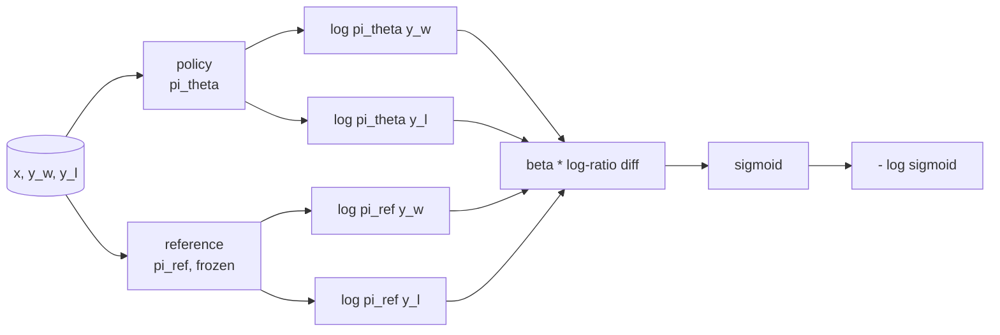
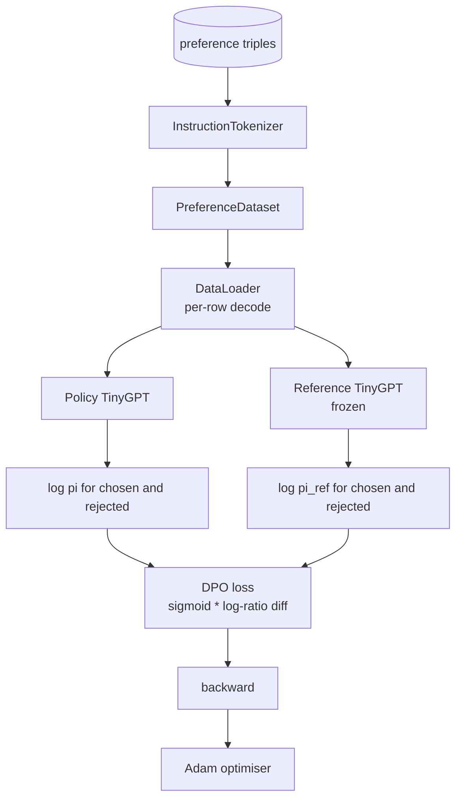

# 从零实现 Direct Preference Optimization

> Reward models 和 PPO 构成了经典 RLHF 堆栈。DPO 则把这套流程压缩成一个单独的监督式 loss，直接在 preference pair 上拟合 policy。本课会从 reward-difference identity 推导 DPO loss，交付一个可运行的 reference model 与 policy model，计算逐 token 的 log-probability，并在一份由 chosen completion 和 rejected completion 组成的偏好 fixture 上训练一个小型 transformer。测试会把 loss 数学、梯度方向和 reference 不变性钉死，确保实现和论文一致。

**Type:** 构建
**Languages:** Python (torch, numpy)
**Prerequisites:** 第 19 阶段第 30 到 37 课（NLP LLM 路线：分词器、嵌入表、注意力模块、Transformer 主体、预训练循环、检查点、生成与困惑度）
**Time:** 约 90 分钟

## 学习目标

- 把 DPO loss 推导成一个对缩放后 log-ratio difference 取 sigmoid 的形式，并理解它和隐式 reward 的关系。
- 构建 reference model + policy model 这一对模型，其中 reference 冻结、policy 可训练。
- 在两个模型下计算序列级 log-probability，并对 prompt token 做 mask。
- 在 `(prompt, chosen, rejected)` 三元组上训练 policy，并观察 chosen log-prob 相对 rejected 上升。
- 用测试固定住 loss 数学、gradient sign 和 reference invariance。

## 问题

你已经有一个 SFT model。它会按指令回答问题，但输出质量并不均匀；有些 completion 清晰，有些却啰嗦或者错误。你手里还有一份小型 preference pair 数据集：针对同一个 prompt，人类在两个 completion 之间选了一个 chosen，另一个则是 rejected。

经典 RLHF 的答案，是一个两阶段流水线。先根据偏好训练 reward model，再用 PPO 让 policy 朝 reward 更高的方向优化。这套做法有效，但成本很高：PPO 期间显存里要同时摆两个模型，要用 KL control 把 policy 约束在 reference 附近，而且一旦 reward model 很脆弱，就容易出现 reward hacking。

DPO 把这两步合并成了一个监督式 loss。reward model 不再显式存在。policy 直接在 preference pair 上训练，同时通过朝 SFT reference 收缩的 KL 结构保持稳定。在 Bradley-Terry preference model 下，它与 RLHF 共享同一个最优解，但代码量小得多。

## 概念

从 Bradley-Terry model 出发。给定一个 prompt `x`，以及两个 completion，`y_w` 表示 chosen，`y_l` 表示 rejected，那么人类偏好 `y_w` 的概率是：

```text
P(y_w > y_l | x) = sigmoid( r(x, y_w) - r(x, y_l) )
```

这里的 `r` 是某个潜在 reward function。RLHF 先从偏好里拟合 `r`，然后训练一个 policy `pi` 去最大化 `r`，同时用 KL 项把它锚定在 reference 上：

```text
max_pi   E_{x, y~pi} [ r(x, y) ] - beta * KL(pi || pi_ref)
```

DPO 的关键观察是：在这个目标下，最优 policy `pi*` 可以直接写成 `r` 的 closed form：

```text
pi*(y | x) = (1/Z(x)) * pi_ref(y | x) * exp( r(x, y) / beta )
```

把这个式子反解回 `r`：

```text
r(x, y) = beta * ( log pi*(y | x) - log pi_ref(y | x) ) + beta * log Z(x)
```

其中 `log Z(x)` 对 `y_w` 和 `y_l` 来说是一样的，因为它只依赖 `x`，不依赖 `y`。所以当你计算 preference difference 时，这一项会被抵消掉：

```text
r(x, y_w) - r(x, y_l) = beta * ( log pi_theta(y_w|x) - log pi_ref(y_w|x)
                                - log pi_theta(y_l|x) + log pi_ref(y_l|x) )
```

把这个结果代回 Bradley-Terry 的 sigmoid，再对 preference pair 取 negative log likelihood，就得到：

```text
L_DPO(theta) = - E_{(x, y_w, y_l)} [
  log sigmoid( beta * ( log pi_theta(y_w|x) - log pi_ref(y_w|x)
                       - log pi_theta(y_l|x) + log pi_ref(y_l|x) ) )
]
```

这就是 DPO loss。它对每个样本只计算一个标量，这个标量来自四个 log-probability，然后过一次 sigmoid。没有单独的 reward model，没有 PPO，loss 里也没有显式 KL 项；KL 约束已经被烘进 closed-form 推导里。



## 梯度方向

训练前可以先做一个很有价值的 sanity check。对 `log pi_theta(y_w | x)` 求梯度：

```text
d L_DPO / d log pi_theta(y_w | x) = - beta * (1 - sigmoid(z))
```

其中 `z` 是 sigmoid 的输入。这个值对所有 `z` 都是负的。这意味着：提高 policy 对 chosen completion 的 log-probability，会降低 loss。对称地，`log pi_theta(y_l | x)` 的梯度是正的，所以提高 rejected completion 的 log-probability 会增大 loss。训练的方向，就是把 chosen 往上推，把 rejected 往下压。reference 是冻结的，它不会动。

## 数据

课程内置了 12 个 preference triple。每条都是 `(prompt, chosen, rejected)`。chosen completion 短而准确；rejected completion 则冗长、跑题或错误。这些 pair 覆盖的任务家族和 lesson 39 类似，比如 capital、arithmetic、list，因此一个从 SFT base 出发的 policy 会有一个合理起点。

这个 fixture 故意很小。生产环境中的 DPO 往往会处理成千上万条 pair；而本课只关心一件事：让 loss 数学和训练循环在一个微型数据集上端到端跑起来，并且让 chosen-versus-rejected 的 log-prob 差距能明显变大。

## 参考模型不变性

DPO 实现必须非常小心地处理 reference model。reference 是冻结在原地的 SFT model。下面三个性质必须始终成立：

- reference 参数永远不会收到梯度。
- reference 的 log-probability 在不同 epoch 之间永远不变。
- policy 的初始权重必须和 reference 一模一样。（最优的 `theta` 可以看成 reference 加上一段学习到的更新，所以把 policy 初始化成 reference 的副本，才是定义清晰的起点。）

实现里会通过下面三条来保证这些性质：

- 在 reference 的 forward pass 周围包上 `torch.no_grad()`。
- 把每个 reference 参数的 `requires_grad=False`。
- 在 reference 构建完成后，通过 `policy.load_state_dict(reference.state_dict())` 初始化 policy。

```figure
cap-dpo-preference
```

## 架构



模型仍然使用 lesson 39 里的 TinyGPT：decoder-only、causal、byte tokeniser。reference 和 policy 共享同一套架构；训练时，policy 的权重会逐渐偏离 reference，而 reference 始终保持固定。

## 你将构建什么

实现由一个 `main.py` 和测试组成。

1. `InstructionTokenizer`：带 `INST` 和 `RESP` special token 的 byte tokeniser。接口形状与 lesson 39 一致。
2. `TinyGPT`：decoder-only transformer。形状和 lesson 39 相同，所以即使你跳过了 39，这一课也能自包含运行。
3. `make_preferences`：返回 12 个 `(prompt, chosen, rejected)` 三元组。
4. `sequence_log_prob`：给定模型、prompt prefix 和 completion，返回 completion 上 next-token log-probability 的总和，不包含 prompt 位置的贡献。
5. `dpo_loss`：接收四个 log-probability 和 `beta`，返回逐样本 loss tensor，以及一个用于日志输出的隐式 reward delta。
6. `train_dpo`：按 epoch 运行，分别计算 policy 和 reference 下 chosen / rejected 的 log-prob，应用 loss，然后用 Adam 更新。
7. `evaluate_margins`：在任意时刻返回 policy 下 chosen-rejected log-probability margin 的平均值。
8. `run_demo`：先做一个小型 warm-up pretrain，再构建 reference 和 policy，复制权重，训练 30 步，打印每一步的 loss 和 margin，并在成功时零退出。

## 为什么 DPO 有效

在 Bradley-Terry preference model 下，DPO 在数学上等价于 RLHF，只不过 reward 被换成了隐式参数化。这个隐式 reward 写成 `r(x, y) = beta * (log pi(y|x) - log pi_ref(y|x))`。它可以从 preference 中被识别出来，但只精确到一个关于 `x` 的函数；而这一项在 preference difference 里会被抵消。由于 closed-form policy 的存在，你可以跳过显式 reward model。KL 约束则通过结构本身来实现：任何 `pi` 相对 `pi_ref` 的偏离，都会让 log-ratio 变大，而 sigmoid 会逐渐饱和，这会在 policy 走得太远时自动抑制梯度。reference 就是你的安全绳。

## 延伸练习

- 给 log-probability 的求和增加长度归一化：除以 completion 长度。长度偏置是 DPO 的已知失效模式之一，模型会偏好更短的 completion，因为它们的 log-probability 绝对值往往更大。
- 加入 IPO 版本的 loss：把 sigmoid + log 改成 `(z - 1)^2`，比较它在这份 fixture 上的收敛表现。
- 增加一个 label-smoothing 参数，在硬性的 chosen-rejected 标签与均匀 0.5 之间做插值。
- 把 reference 换成更小、更便宜的模型，做一点 knowledge distillation 风格的实验。

这份实现会把 loss、reference invariance 和训练循环都交给你。数学本身就是这课的主体；代码只是把这些数学变成可运行的事实。
