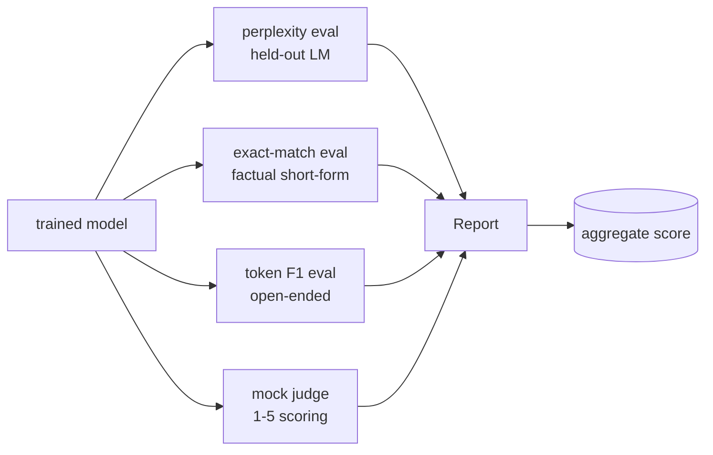
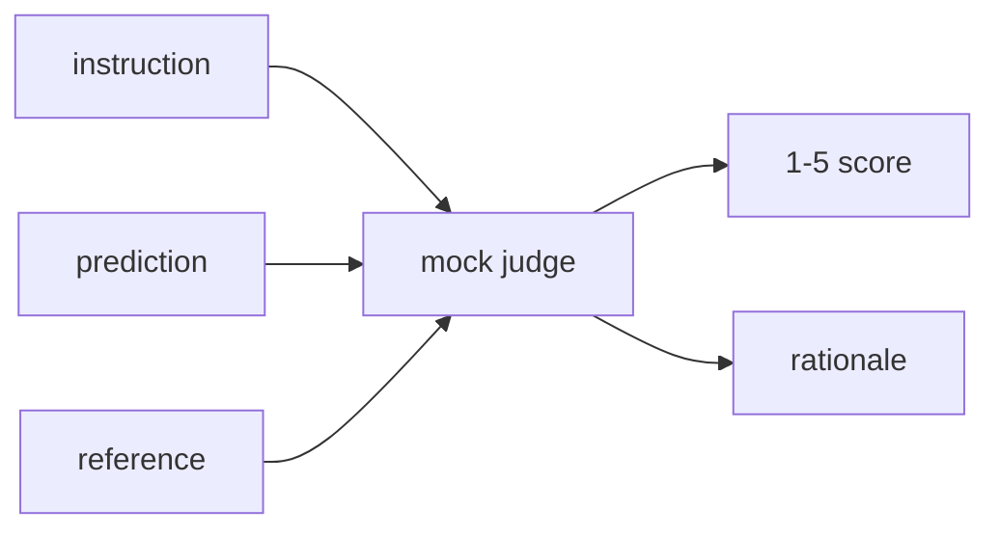
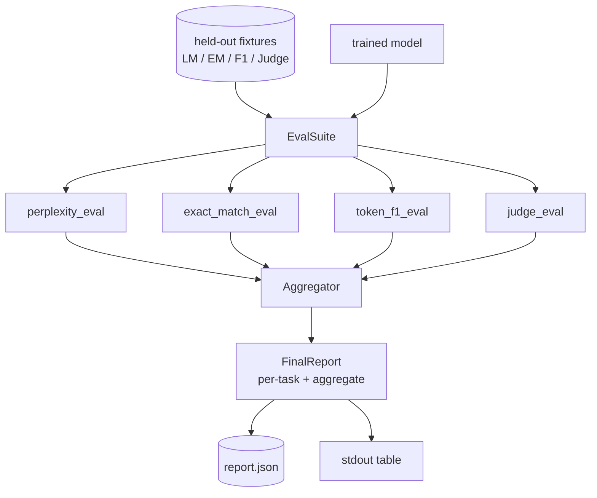

# 完整评估流水线

> 训练是你可以用 loss curve 直接盯住的部分，评估则是你必须自己设计的部分。本课会构建一条统一的评估流水线，它接收任意一个训练好的语言模型，在其上运行四种异构评估，把结果聚合成一份按任务拆分的报告，并额外附带一个本地 mock LLM-as-judge，这样整个闭环无需联网也能跑通。四项评估覆盖了任何真正要交付的模型都需要面对的维度：language modelling（perplexity）、短答案正确性（exact-match）、开放式相似度（token F1），以及定性打分（judge）。

**Type:** 构建
**Languages:** Python（torch、numpy）
**Prerequisites:** 第 19 阶段第 30 到 37 课（NLP LLM 路线：分词器、嵌入表、注意力模块、Transformer 主体、预训练循环、检查点、生成与困惑度）
**Time:** 约 90 分钟

## 学习目标

- 在一个小型 transformer 上用 masked-token accounting 计算留出集 perplexity。
- 在短形式 factual prompt 上运行 exact-match 评估。
- 对 prediction 和 reference string 计算标准化后的 token-level F1。
- 构建一个本地 mock LLM-as-judge，用 1-5 的分数给模型输出打分。
- 把四项评估聚合成一份带 per-task breakdown 的加权报告。

## 问题

单一指标永远不足以描述一个语言模型。perplexity 说明模型对语言分布拟合得怎么样，但完全不能回答“它会不会答题”；exact-match 会告诉你模型有没有生成 gold string，但会惩罚正确的改写；token F1 对 paraphrase 更宽容，却又很容易被词汇重叠但语义错误的输出欺骗；LLM-as-judge 能覆盖定性维度，但成本高而且带随机性。

真正想要的评估流水线，必须同时拥有这四种视角。每项评估都补上了其他指标看不到的那一块。每项评估都在为它量身设计的 held-out 数据子集上运行。最终报告把每项任务的数字并排展示，再给出一个 aggregate，让 reviewer 一眼就能看出模型到底是在做什么权衡。

本课会把这条流水线从头到尾搭出来，而且全部写在一个文件里。

## 概念



每个评估都是一个从 `(model, dataset) -> EvalResult` 的函数。返回结果会携带指标值、用于排查问题的 per-example 细节，以及供聚合器使用的名称。整条 pipeline 再通过一份 config 把它们串起来，决定要跑哪些评估，以及它们的权重分别是多少。

## 困惑度（Perplexity）：正确计数

perplexity 的定义是 `exp(mean negative log-likelihood per token)`。实现里有两个常见陷阱：

- 平均数必须只在真实 token 位置上取，而不是在整个 batch * sequence 上取。padding token 必须从分母里剔除，否则 perplexity 会被虚假地“改善”。
- 模型预测的是下一个 token，所以位置 `i` 的 logits 预测的是位置 `i+1` 的 token。这里的 off-by-one 一旦出错，loss 仍然会算出来，但指标就彻底失去意义。

这份评估会在每个 batch 内先累计非 padding 位置上的 `-log p(token)` 总和，再累计 token 总数，最后统一相除。相比“先算每个 batch 的 perplexity 再做平均”，这种写法数值上更稳，也不会低估短序列的权重，并且与教科书定义一致。

## 精确匹配（Exact-match）：加入归一化

harness 在比较 prediction 和 reference 之前，会先对两边做同样的 normalisation：

- 转为小写。
- 去掉首尾空白。
- 把内部连续空白折叠成单个空格。
- 如果双方只在结尾标点上不同，就去掉尾部句末标点（`.`、`!`、`?`）。

做完这些 normalisation，exact-match 在实践中才真正有用。一个输出 `"Paris"` 的模型是对的；输出 `"Paris."` 的模型也应该算对；输出 `"  paris  "` 的模型同样应该算对。归一化之后，这个指标依然要求两边必须成为完全相同的字符串。

## 词元级 F1（Token F1）：按正确方式计算

token F1 是在 bag-of-tokens 上计算 precision 和 recall 后得到的调和平均。步骤是：

1. 对 prediction 和 reference 做归一化处理，规则与 exact-match 相同。
2. 把两边都切成 token 列表，使用 whitespace tokenisation。
3. 计算它们的 multiset intersection。
4. Precision = `intersection_count / len(pred_tokens)`。Recall = `intersection_count / len(ref_tokens)`。F1 = 调和平均。

如果 prediction 和 reference 都是空字符串，那么 F1 视为 1，因为这是一个真空匹配；如果只有一边为空，F1 就是 0。这个约定与 SQuAD 的评估参考一致，也能在 paraphrase 场景下给出更稳定的数字。

## 本地模拟评审器（Mock LLM-as-Judge）

真正的 judge 往往是一个挂在 API 后面的 frontier model。但这节课要求整个流程离线可跑，所以 judge 也必须本地化。这里的 mock judge 是一个确定性打分器：输入 instruction、模型 prediction 和 reference，输出一个分数，分值属于 `{1, 2, 3, 4, 5}`，外加一句简短 rationale。规则完全显式：

- 如果 normalised prediction 与 normalised reference 完全相等，给 5。
- 如果 prediction 与 reference 的 token F1 至少是 0.8，给 4。
- 如果 token F1 落在 `[0.5, 0.8)`，给 3。
- 如果 token F1 落在 `[0.2, 0.5)`，给 2。
- 否则给 1。

它当然不是真正的 judge，但接口是对的。以后如果你要换成真实模型，只需要替换一个函数；整个 pipeline 本身完全不需要知道这件事。



## 聚合

aggregate score 是对归一化后评估分数做加权平均。每个评估都先把自己的结果映射到 `[0, 1]`：

- Perplexity：归一化方式是 `1 / (1 + log(perplexity))`。perplexity 为 1 时映射到 1；趋近无穷时映射到 0。
- Exact-match：天然就在 `[0, 1]`。
- Token F1：天然就在 `[0, 1]`。
- Judge：直接除以 5。

权重是可配置的。默认配比是 0.2 perplexity、0.3 exact-match、0.3 token F1、0.2 judge。权重怎么选，本质上是一个产品决策；这节课把这个旋钮暴露出来，就是为了让你能自己试。

```figure
cg-eval-quadrant
```

## 架构



`EvalSuite` 是一个很薄的协调器。每个单独的评估都是一个自由函数，接收 `(model, tokenizer, dataset, config)`，返回一个 `EvalResult`。`Aggregator` 负责收集结果并产出最终报告。demo 会把表格打印到 stdout，并同时写出一份 JSON 副本，供下游 CI 直接消费。

## 你将构建什么

实现由一个 `main.py` 和测试组成。

1. `TinyGPT`：沿用 lessons 38-40 的同款 decoder-only 架构，这样本课可以单独成立。
2. `InstructionTokenizer`：带 INST / RESP / PAD special token 的 byte tokeniser。
3. 四份 fixture：一个 LM corpus、一个 EM 集、一个 F1 集、一个 judge 集，每份 20 个确定性样本。
4. `perplexity_eval`：返回 `EvalResult`，包含 perplexity 数值和 per-token loss histogram。
5. `exact_match_eval`：返回平均 EM，以及每个样本的记录。
6. `token_f1_eval`：返回平均 token F1，以及每个样本的记录。
7. `mock_judge` 和 `judge_eval`：返回每个样本的分数与 rationale，以及整个集合上的平均分。
8. `Aggregator.normalise`：定义每种 eval 的归一化规则。
9. `Aggregator.aggregate`：计算加权平均并组装完整报告。
10. `run_demo`：先简单训练一个小模型，再运行四项评估，打印报告表，写出 JSON，并在成功时零退出。

## 如何读报告

报告分三层。最上面是 aggregate score。下一层是四个单独的评估数字。再往下则是用于诊断的 per-example breakdown。CI 失败时通常只关心 aggregate，但一个正在追回归的 reviewer 会需要 per-example 细节，才能知道模型到底错在了哪些输入上。

JSON dump 使用稳定键名，因此 CI dashboard 可以基于它画跨版本趋势线。pretty-printed table 则是给训练跑完后盯着终端看结果的人准备的。

## 延伸练习

- 加一个 calibration eval：模型 softmax 概率和真实准确率是否匹配？可以按 confidence 分桶，并报告每个桶里的经验准确率。
- 加一个 robustness eval：给每个样本打上 perturbation 标签（typo、paraphrase、distractor），并报告每种扰动下的指标下降。
- 把 mock judge 替换成一个通过 HTTP 调用的真实模型。函数签名不需要变。
- 加入 per-task weight learning：不再使用固定权重，而是根据一组目标模型偏好顺序去拟合权重。

这份实现会把四项评估、聚合器和报告机制都交给你。真实世界里的评估流水线会在此基础上叠更多维度，但模式不会变：每项评估一个函数，一个聚合器，一份报告。
