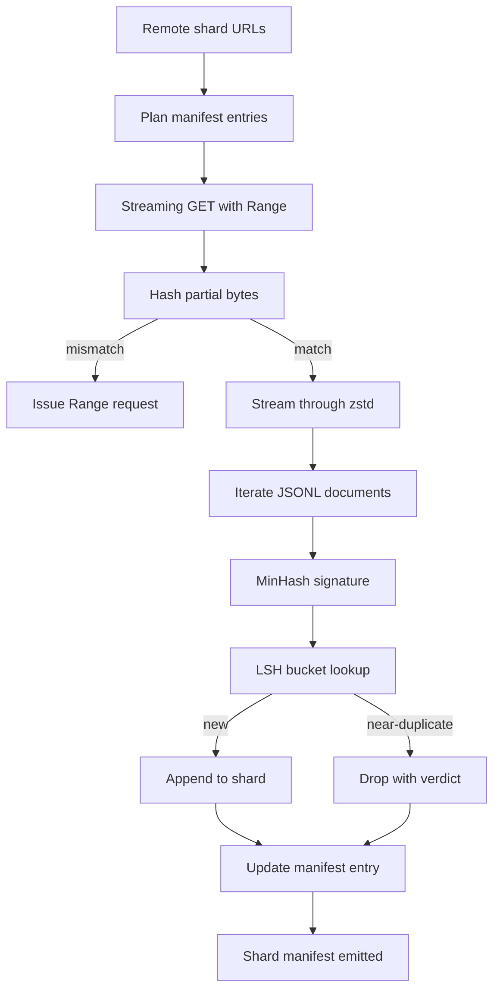

# 大型语料下载器

> 训练语言模型，远在第一次 forward pass 之前就已经开始了。语料必须先落盘、解压、去重，并且能够被后续阶段稳定寻址；更重要的是，在下载到 4% 时网络中断之前，resume 机制就必须已经设计好。本课会构建一个 streaming downloader：它能拉取压缩 shard、用 Zstandard 一边下载一边解压、通过 MinHash 加 locality-sensitive hashing 识别近重复文档，并写出一份后续流水线可以信任的 shard manifest。

**Type:** 构建
**Languages:** Python
**Prerequisites:** 第 19 阶段第 30 到 37 课
**Time:** 约 90 分钟

## 学习目标

- 使用 `urllib` 流式拉取远程 shard，并配合 `zstandard` 解压，同时避免把整个文件缓冲进内存。
- 通过向 HTTP 服务器发送 `Range` 请求，从经过验证的字节偏移恢复部分下载。
- 为每个文档构建 MinHash signature，并借助 LSH 做 bucket 化，使 near-duplicate 文档发生碰撞。
- 产出 shard manifest，记录内容哈希、字节大小、文档数量以及 dedup 裁决。

## 问题

第一次拿 200 GB 语料训练时，网络会在 41% 时断掉，脚本以一个 `urllib` 异常退出。第二次它会在 78% 时断。等你下载到 99% 时，下载循环已经被你重写了三遍。从第一分钟起就必须正面设计的两个问题，是 partial-download resume 和 duplicate document removal。它们都有成熟解法，但往往会被跳过，因为流水线一开始只是一个单行的 `requests.get`，后来才慢慢长出了尖牙。

resume 本质上是一个 HTTP 问题。服务器必须支持 `Range`，客户端必须维护“已经验证过的 offset”和磁盘上的局部文件记录，而且这个 verified offset 还得能在进程死亡后保留下来。只要 offset 和实际文件内容相差哪怕 1 个字节，resume 后续写入的就会是垃圾，语料会被静默破坏，而这个问题通常要到 tokenization 时才显现出来。

deduplication 本质上则是一个 signature 问题。精确 hash 去重抓不到 near-duplicates：同一篇 Wikipedia 文章可能只是在页脚多了三种不同模板，同一份代码文件可能只是换了 license header，同一篇博客文章可能只是每个链接都带了 tracking parameter。MinHash 加 LSH 可以用次线性成本抓住这些。代价是：每个文档都要生成一份 signature，每个 signature 都要做一次 bucket lookup。

## 概念



### 使用 `urllib` 流式处理

标准库里的 `urllib.request.urlopen` 会返回一个 file-like object。把它包进 `zstandard.ZstdDecompressor().stream_reader` 之后，字节流就会从网络直接流进解压器，再流向文档迭代器，整个过程中既不会把压缩后的 shard 整体放进内存，也不会把解压后的 shard 整体放进内存。内存成本只包括：当前行的缓冲区、当前文档的 MinHash signature，以及 LSH index。

### 使用 `Range` 实现恢复

下载器会为每个 shard 写出两个文件：一个是真正的 shard 文件，另一个是 `.partial.json` checkpoint。checkpoint 记录 `verified_bytes`、`expected_size`、`sha256_prefix`（对前 `verified_bytes` 个字节计算得到）以及源 URL。启动时，下载器先读取 checkpoint，再对磁盘上的已有字节重新计算 `sha256_prefix`，只有哈希一致时才允许继续 resume。如果哈希不对，就丢弃这个 partial，从 byte zero 重新开始。静默损坏在这个设计里是不可能的，因为系统检查的是“已验证字节”，不是“假定已经正确的字节”。

### MinHash 加 LSH

MinHash 会在固定空间里估计两个集合之间的 Jaccard similarity。对一个文档来说，这个集合就是它文本中的 shingles，也就是重叠的 n-gram。signature 由 `k` 个最小 hash 值组成，每个值对应一组独立 hash function。若两篇文档的 Jaccard similarity 是 `s`，那么它们在 signature 任一单个分量上相同的概率就是 `s`。

接着，LSH 会把这 `k` 个分量分成 `b` 个 band，每个 band 包含 `r` 行，其中 `k = b * r`。两篇文档至少在一个 band 中发生碰撞的概率是 `1 - (1 - s^r)^b`。这个函数会在某个 `s` 附近形成一个很陡的阈值，而你正是通过 `(b, r)` 去调这个阈值。对于常见的语料去重，研究文献里常见的目标阈值是 `s = 0.8`，对应的典型参数是 `k = 128`、`b = 32`、`r = 4`。

### 把 shard manifest 当作契约

下载器唯一真正持久、可依赖的输出，就是 manifest。manifest 会为每个 shard 记录 URL、解压后的字节数、文档数、去重后的唯一文档数，以及最终 shard 文件的 sha256。下游 tokenization 阶段读 manifest，而不是扫目录。如果某个 shard 丢了，或者它的 sha256 不匹配，manifest 会明确告诉下个阶段拒绝启动。manifest 就是“数据已经下载”和“数据已经下载且可验证”之间的分水岭。

```figure
cap-corpus-downloader
```

## 动手构建

`code/main.py` 实现了：

- `ShardPlanner`：读取 shard URL 列表，并生成计划中的 manifest entry。
- `StreamingDownloader`：使用可选 `urllib` 流与 `Range` 请求，写入临时文件，在每个 chunk 后更新 `.partial.json` checkpoint，并在 resume 时验证 sha256 prefix。
- `ZstdDocIterator`：把 file-like stream 包进 `zstandard.ZstdDecompressor`，按行产出文档。
- `MinHasher`：使用固定 hash seed family，为字符串生成一个 `k` 分量的 signature。
- `LSHIndex`：按 band 对 signature 分桶，并报告碰撞。
- `Dedup`：把 hasher 与 index 组合起来，为每个文档打上 `keep` 或 `near_duplicate` 标记，并记录匹配的 shard id。
- `ManifestWriter`：聚合每个 shard 的统计信息，写出 `manifest.json`。

文件底部的 demo 会在本地磁盘构造一个小型 synthetic corpus，用 `zstandard` 压缩，再通过 `file://` URL 走完整下载流程，随后做 dedup 并打印 manifest。

运行它:

```bash
python3 code/main.py
```

脚本会以 0 退出，并打印 manifest 摘要。

## 生产模式

有四个做法，能把本课内容扩展到真实大语料场景。

**先持久化检查点，再写入数据。** `.partial.json` 必须先 `fsync`，再把新字节追加进 shard。否则一旦掉电，顺序可能反过来：磁盘上已经有了 shard bytes，但 checkpoint 里却还没有记录它们；下一次 resume 会误以为 verified bytes 更少，从而把后缀重复写一遍，直接破坏文件。先 checkpoint，后写入。这和 write-ahead log 是同一种纪律。

**对 LSH 索引做分片。** 在 200 GB 量级上，对整份语料维护一个单一的 LSH index，内存根本放不下。正确做法是按第一个 band hash 对 LSH index 分区，把各分区存到磁盘上；新文档到来时，只查询自己会落入的那个分区。代价是每个文档多一次磁盘读取，收益是 LSH index 不再被 RAM 容量卡死。

**记墓碑，不直接删除。** 被丢弃的重复文档，不应该直接删除，而应当在 manifest 中记录 verdict `near_duplicate`，并标出它碰撞到的 keeper shard id。直接删掉会丢失“这个 duplicate 对应哪个 keeper”的链路。tombstone 则保留了审计轨迹，也给下游重新调整阈值留下余地。

**既校验每个 shard，也校验 manifest 本身。** manifest 本身也要有内容哈希。下游阶段在信任每个 shard entry 之前，先验证 manifest 自身的哈希。否则 manifest 就成了沉默攻击面：攻击者只要改一个文件，就能污染整个流水线。

## 实际使用

生产上通常还会这样使用它：

- **每次 CI 运行都要支持恢复。** CI runner 是短命的。下载器必须假设每次跑起来都是一块新磁盘，并能够从 cache 或远端恢复。`--cache-dir` 应该是一级参数，而不是附属选项。
- **先去重，再做 tokenization。** tokenization 很贵。对同一份文档跑两次 tokenization，只会让成本翻倍，而 loss curve 并不会因此更好。dedup 必须在 tokenization 上游，而不是下游。
- **把 manifest 当作合并门禁。** 训练运行读取的是某个 pinned commit 对应的 manifest sha256。新的数据集版本，就要伴随新的 manifest commit。代码与数据之间的绑定关系应由 git 管，不该靠口口相传。

## 交付成果

`outputs/skill-corpus-downloader.md` 在真实项目里会描述：哪些 URL 供给下载器、checkpoint 目录如何布局、dedup 使用什么 shingle width 与 `(k, b, r)` 参数组合，以及 manifest 存在版本库的哪个位置。本课交付的是引擎本身。

## 练习

1. 加一个 `--shingle-width` 参数，并比较宽度为 3、5、9 时 dedup verdict 的变化。说明你为什么选择最终默认值。
2. 除了 zstd 外，再加上 gzip 支持，并通过 magic bytes 自动识别压缩格式。下载器不应该要求调用方手动指定 codec。
3. 增加一个 `--resume-only` 模式：如果找不到 checkpoint，就拒绝开始新的下载。这在 CI 里很有用，可以避免某次 run 意外重新拉取 200 GB。
4. 把 LSH index 搬到 shelf 或 sqlite 文件里，比较它与纯内存版本的吞吐差异。
5. 在启动时增加 manifest sha256 校验。如果磁盘上的 manifest 与 `manifest.lock` 里的哈希不一致，下载器应当 fail closed。

## 关键术语

| 术语 | 常见说法 | 实际含义 |
|------|----------|----------|
| Shard | "A file" | 一份自包含的语料切片，拥有自己的 sha256，是 resume 与 dedup 的基本单位 |
| MinHash signature | "Fingerprint" | 一个由 `k` 个分量组成的集合 sketch，每个分量都是对应独立 hash 下的最小值 |
| LSH band | "Bucket" | 一组 `r` 个 signature 分量，被拼成单个 bucket key 用于碰撞检测 |
| Verified bytes | "Resume offset" | 磁盘上已经经过 sha256 prefix 验证的字节；这是唯一安全的 resume 起点 |
| Manifest | "The index" | 下载器真正持久的记录，汇总它最终产出了哪些 shard，以及它们的内容哈希 |

## 延伸阅读

- [RFC 7233](https://datatracker.ietf.org/doc/html/rfc7233) - HTTP Range requests，也就是 resume 协议本身
- [Zstandard format specification](https://datatracker.ietf.org/doc/html/rfc8478) - 保证流式解压安全的 frame format
- [MinHash](https://en.wikipedia.org/wiki/MinHash) - 本课使用的 signature family
- [Locality-sensitive hashing](https://en.wikipedia.org/wiki/Locality-sensitive_hashing) - dedup 阈值背后的分 band 机制
- 第 19 阶段第 43 课 - 下载器的输出会在这里进入 HDF5 词元化语料流程
- 第 19 阶段第 44 课 - 训练这份语料时使用的余弦学习率调度
- 第 19 阶段第 45 课 - 包裹训练循环的梯度裁剪与 AMP 逻辑
