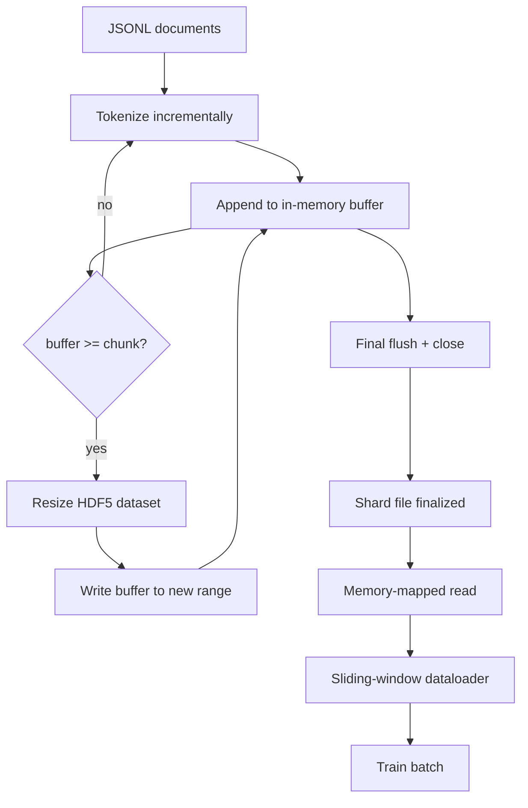

# HDF5 词元化语料

> 下载好的语料必须落到一种 trainer 能以线速持续读取的布局里。磁盘上的 JSONL 扛不住 16 个 dataloader worker 并发读取，而带有 resizable、chunked 整数数据集的 HDF5 可以。本课会构建一条完整路径：把 streaming tokenization 写入 resizable HDF5 dataset、把写入分散到多个 shard 文件、在训练时做 memory-mapped read，并实现一个能按正确 packing 规则产出定长序列的 sliding-window dataloader。

**Type:** 构建
**Languages:** Python
**Prerequisites:** 第 19 阶段第 30 到 37 课
**Time:** 约 90 分钟

## 学习目标

- 以确定性的 chunking 方式，把文档流式写入 resizable 的 HDF5 整数数据集。
- 把写入分散到多个 HDF5 文件，使单点故障范围可控，并允许并行化。
- 利用 HDF5 由 page cache 支持的 chunked layout 把 token 读回来，让 dataloader 只在 batch 时复制进 batch buffer。
- 实现一个 sliding-window dataloader，按明确的 packing 规则产出固定长度训练序列。

## 问题

现代语言模型训练时，会在几十个 worker 上以每秒几十万 sample 的速度读取 token。磁盘上的 JSONL 遇到第一次冷缓存 page fault 就会暴露问题：JSON parser 很慢，文档边界无法被直接寻址，想读取“sample 4,217,884”必须先线性扫描文件。即使是压缩效果不错的 Parquet，也不适合这个场景，因为 trainer 不想要列式数据；它想要的是一个支持 O(1) 随机访问的扁平 token stream。

HDF5 合适，是因为它提供了一个 chunked、resizable、纯整数的数据集格式，而且它的 chunk 在读取时对 page cache 很友好。trainer 只要请求 `tokens[3,200,000 : 3,200,8192]`，HDF5 就会把所需 hyperslab 从 page cache 拷进一个新分配的 NumPy array。对每个 worker 来说，代价只是一个打开的文件句柄和一个 chunk 级别的 page-cache footprint；相比之下，这几乎可以忽略不计，远低于反复解析 JSONL 的代价。

真正难的是把写入端做对。resizable dataset 很容易被误用：如果你一次只写一个文档，HDF5 文件会碎片化到几乎无法使用；如果你等所有文档都准备好再一次性 resize，进程一旦中途死亡，就会丢掉整个 shard。正确纪律是先 buffer，再 extend，而且 buffer 大小要和 chunk size 对齐；同时还要把写入分散到多个文件上，让一次 crash 最多只损失一个 shard。

## 概念



### 正确使用可扩展 HDF5

token dataset 在创建时要设置 `maxshape=(None,)`，并指定固定的 `chunks=(chunk_size,)`。写入流程是：先用一个长度为 `chunk_size` 的 NumPy buffer 暂存 token；当 buffer 填满时，把 dataset 精确地 resize `chunk_size`，再把 buffer 写入新增的那一段区间。到 shard 结束时，剩余 buffer 会被写进最后一个不满的尾部区间。除了最后一次写入，其余写入都是连续且 chunk 对齐的；对于最后一段，reader 会根据 shard HDF5 attributes 里记录的 `token_count` 进行截断。

### 分片写入

单个 HDF5 文件本身就是单点故障，因此流水线会并行地写多个 shard：Phase 19 lesson 42 的每个输入 shard，都会生成一个对应的 HDF5 输出 shard。`shards.json` 会记录每个 shard 的文件路径、token 数量、文档数，以及 token 字节上的 sha256。trainer 会读取 `shards.json` 来计算全局 offset，并验证整份语料。

### 内存映射读取

训练时，每个 worker 会以 `swmr=True` 模式打开自己负责的 HDF5 文件，并请求 `tokens[start:stop]`。一旦目标 chunk 已经变热，HDF5 的 chunked layout 就会让这次读取落到 page-cache-backed read。worker 从来不会把整个文件 materialize 到内存里：那段 slice 只会先被复制进 dataloader 的 batch buffer，再由 dataloader 在 batch time 复制到 pinned-memory 的训练 tensor。热路径上，每次 chunk 切换只需要一次 syscall，其余基本都是 RAM 访问。

### 滑动窗口 dataloader

dataloader 是唯一真正知道训练序列长度的阶段。它会在全局 token stream 中随机挑一个起始位置，读取 `window_size + 1` 个 token，然后返回 `(input, target) = (tokens[:-1], tokens[1:])`。这里并不会强制尊重文档边界：一个 window 可能跨越两个文档，中间通过显式的 `boundary_token_id` 分隔，让模型学会把它当成 separator。这个 packing 规则是行业默认做法，也是初学者最容易忘掉的一点；一旦忘了，最终得到的语料往往会变成 8% 训练边界 token、92% 自然文本的怪异混合物。

```figure
cc-hdf5-corpus
```

## 动手构建

`code/main.py` 实现了：

- `Tokenizer`：一个足够支撑 demo 的 byte-level deterministic tokenizer，接口是 `encode(text) -> list[int]` 和 `vocab_size`。
- `HDF5ShardWriter`：打开 resizable 的整数 dataset，把 token buffer 到 chunk size，按固定步长 resize 并写入，在 close 时把 `token_count` 和 `sha256` 记到 HDF5 attributes 上。
- `ShardedTokenizationPipeline`：遍历输入文档，把它们路由到各个 writer，并输出 `shards.json` 索引。
- `MmapTokenStore`：打开 shard 文件供 memory-mapped read 使用，计算全局 offset，并暴露统一的 `get_slice(start, stop)` API。
- `SlidingWindowDataloader`：从全局 token stream 随机抽取窗口，产出 `(input_ids, target_ids)` 的 NumPy array。

文件底部的 demo 会构建一个很小的内存语料，把它 tokenization 成两个 shard，再通过 memory map 打开，运行 dataloader 10 个 batch，并打印每个 batch 的 shape 和 checksum。

运行它:

```bash
python3 code/main.py
```

脚本会以 0 退出，并打印 batch 校验和。

## 生产模式

有四个做法，能把这节课的设计扩展成真实训练系统。

**chunk size 要贴合典型读取长度。** trainer 每个 sample 会读取 `window_size + 1` 个 token。把 HDF5 chunk size 设成 `window_size` 的整数倍，读取会和 page cache 更对齐。chunk 不匹配时，吞吐往往直接腰斩，因为每个 sample 都会跨两个 chunk。

**把 token 数量记在 attributes，而不是 dataset 末尾。** dataset 尾部最后一个 chunk 可能只填了一部分，因为 chunk size 未必能整除文档边界。真实的 `token_count` 应该存在 dataset attribute 里，让 reader 在这里截断。否则 reader 会一路读进那些零填充 token，模型最终就会学会预测零。

**分片 sha256 要支持并行校验。** 每个 shard 都有自己基于 token bytes 的 sha256。训练开始前，trainer 可以并行验证所有 shard。sha256 一旦错误，run 会在最开始就失败，而不是等到 16 小时后的第三个 epoch 才暴露问题。

**读写两端都要配好 `swmr=True`，writer 还要加 `libver="latest"`。** Single-Writer-Multiple-Reader 模式要求 writer 以 `libver="latest"` 打开文件，先建好所有 dataset，再设置 `file.swmr_mode = True`。之后 writer 每次 resize 后都必须调用 `dataset.flush()`，这样那些以 `swmr=True` 打开的 reader worker 才能看到一致数据。忘了 `libver="latest"`，或者在结构变化后才启用 SWMR，都是 “file is locked” 这类错误的常见来源。

## 实际使用

生产上通常会这样落地：

- **每个源 shard 对应一个 HDF5。** 下载器（lesson 42）对每个 URL 产出一个 shard；tokenization（本课）则为每个源 shard 产出一个 HDF5。1:1 映射会让 resume 和 partial-failure recovery 变得非常直接。
- **明确 boundary token id 的职责。** boundary token 是 tokenizer vocab 的一部分，也是 dataloader 唯一会主动注入的 token。如果模型应该忽略这个 token，训练 loss 就要对它做 mask；否则模型会学着把它当作 sequence separator。
- **把 `shards.json` 当作事实来源。** 增加一个新 shard，意味着写出新的 HDF5、计算对应 sha256，再追加一条记录。trainer 启动时一次性读取这份文件，而不是去扫目录。

## 交付成果

`outputs/skill-hdf5-tokenized-corpus.md` 在真实项目里会描述：哪种 tokenizer 供给这条流水线、什么 chunk size 与 trainer 的 window 最匹配、`shards.json` 存在版本库的哪个位置，以及 dataloader worker 如何按文件分摊 shard。本课交付的是引擎本身。

## 练习

1. 给 HDF5 writer 增加 `--compression gzip` 参数，并测量它在 demo 语料上的吞吐开销。解释你选择的默认值。
2. 给 sliding-window dataloader 增加一个确定性 seed，并验证相同 seed 下两次运行会产生完全一致的 batch。
3. 加一个 `--validate` 模式，读取所有 shard，重新计算 token 上的 sha256，并与 `shards.json` 比较。CI 应在训练开始前先跑它。
4. 比较 chunk size 取窗口大小、窗口大小的一半、窗口大小的两倍时的 dataloader 吞吐，分析 page-cache 效应。
5. 增加一个 `--max-document-tokens` 参数，在写入时截断超长文档。说明这种做法与“在读取时再决定”的取舍。

## 关键术语

| 术语 | 常见说法 | 实际含义 |
|------|----------|----------|
| Resizable dataset | "Append-only" | 一个带有 `maxshape=(None,)` 的 HDF5 dataset，通过 `resize` 以 chunk 步长持续增长 |
| Chunked layout | "How HDF5 stores it" | 固定大小的磁盘页；内核可以对其做 memory-map，dataloader 也可以连续读取 |
| `swmr` mode | "Read-while-write" | Single-Writer-Multiple-Reader 模式，让多个 dataloader worker 安全共享文件 |
| Shard index | "shards.json" | 所有 token shard 的持久索引，包含 offset 与内容哈希 |
| Sliding window | "Training sample" | 从全局 token stream 上切出的固定长度片段，并与其 shift-by-one 目标配对 |

## 延伸阅读

- [HDF5 chunking documentation](https://support.hdfgroup.org/documentation/hdf5/latest/hdf5_chunking.html) - 本课依赖的 chunked、resizable dataset 布局
- [h5py user guide](https://docs.h5py.org/en/stable/) - HDF5 的 Python 绑定
- [NumPy memory mapping](https://numpy.org/doc/stable/reference/generated/numpy.memmap.html) - HDF5 通过 h5py 暴露出来的读侧原语
- 第 19 阶段第 42 课 - 本课会把下载器输出进一步词元化
- 第 19 阶段第 44 课 - 与这个 dataloader 一起演进的余弦学习率调度
- 第 19 阶段第 45 课 - 包裹训练 step 的梯度裁剪与 AMP 循环
