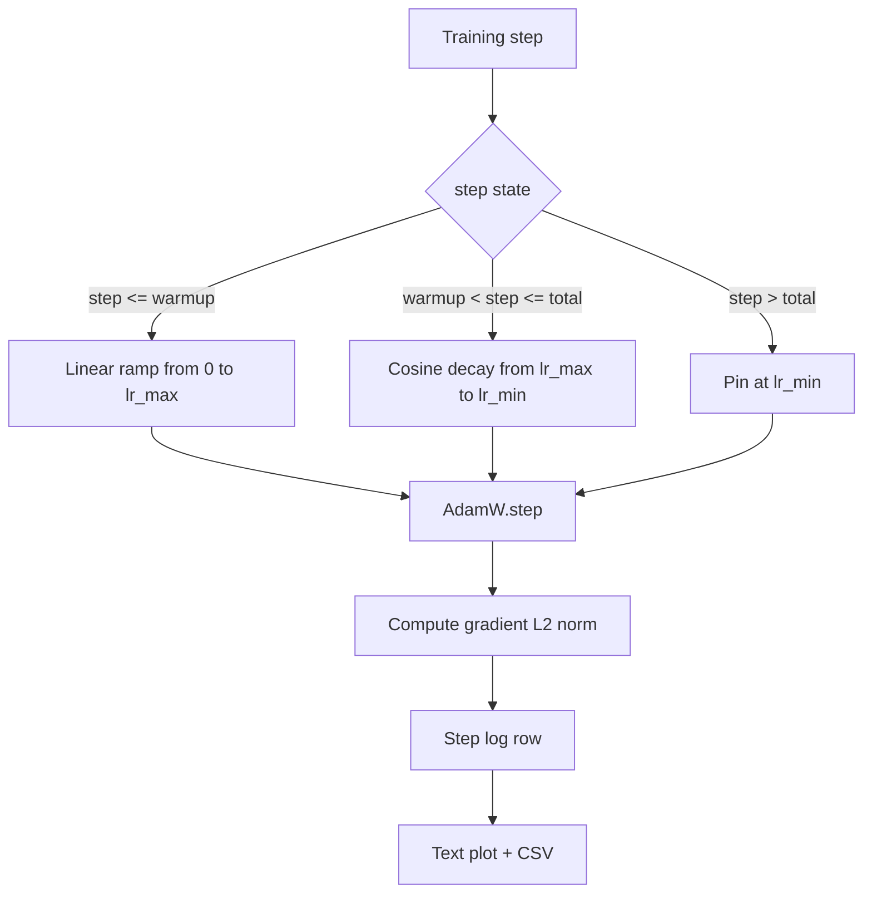

# 带线性预热的余弦学习率

> 在损失函数之后，学习率调度通常是训练里第二重要的决策。AdamW 配合 cosine decay 和 linear warmup，是现代语言模型训练中的默认组合，因为它能让模型在脆弱的前一千次更新里看到一个较小的有效步长，然后平滑地爬升到设定峰值，再逐步衰减回接近零。本课会构建这条 schedule，绘制它随训练 step 变化的曲线，把 gradient norm 和 learning rate 并排记录下来，并证明这条 schedule 在 warmup、peak 和 decay 边界上的行为都正确。

**Type:** 构建
**Languages:** Python
**Prerequisites:** 第 19 阶段第 30 到 37 课
**Time:** 约 90 分钟

## 学习目标

- 实现一个接入带线性预热的余弦学习率调度的 AdamW optimizer。
- 在任意 step 上精确计算 schedule 的值，并避免多次运行间的浮点漂移。
- 把 gradient L2 norm 和 learning rate 并排记录，使训练健康状态可观测。
- 把 schedule 渲染成肉眼可读的文本图，以及任何工具都能消费的 CSV。

## 问题

训练的前一千次更新最嘈杂。模型权重还非常接近初始化状态，优化器的二阶矩估计也还没有稳定下来，gradient norm 既大又噪。如果在这段时间里 learning rate 已经跑到峰值，模型要么直接发散，要么掉进一个再也爬不出来的 loss plateau。这个问题有两个经典修复手段：一个是 gradient clipping，也就是 Phase 19 lesson 45 的主题；另一个就是从小开始、逐步拉升的 learning-rate schedule。

cosine-with-warmup schedule 有三个区域。从 step zero 到 step `warmup_steps`，learning rate 会从 zero 线性增长到设定峰值 `lr_max`。从 step `warmup_steps` 到 step `total_steps`，learning rate 会沿着半个 cosine 曲线从 `lr_max` 衰减到 `lr_min`。在 `total_steps` 之后，learning rate 会固定在 `lr_min`，这样即便 trainer 配错了、跑过了预定训练长度，也不会静默地掉出 schedule。

真正难的是，schedule 这种东西特别容易写出 off-by-one 错误。这类错误不会立刻炸，而是会在训练跑了六小时之后，表现成 learning rate 在模型开始过拟合的时刻高了或低了 1%。如果不专门在边界上做彻底测试，这类问题几乎看不出来。

## 概念



### 预热公式

当 `step` 落在 `[0, warmup_steps]` 且 `warmup_steps > 0` 时，learning rate 的公式是 `lr_max * step / warmup_steps`。而退化情形 `warmup_steps = 0` 会被解释成“没有 warmup”：schedule 在 step zero 直接从 `lr_max` 起步，并立刻进入 cosine decay。有些 test harness 就会故意传入 `warmup_steps = 0`，以确认 schedule 在这种极端输入下仍然能给出一条可用曲线。

### 余弦公式

当 `step` 落在 `(warmup_steps, total_steps]` 时，learning rate 的公式是 `lr_min + 0.5 * (lr_max - lr_min) * (1 + cos(pi * progress))`，其中 `progress = (step - warmup_steps) / max(1, total_steps - warmup_steps)`。在 `step = warmup_steps` 时，cosine 项会变成 `cos(0) = 1`，于是结果正好等于 `lr_max`，与 warmup 的终点无缝衔接。在 `step = total_steps` 时，cosine 项会变成 `cos(pi) = -1`，结果正好等于 `lr_min`，与 decay 的终点也完全对齐。

这两个端点的连续性不是巧合。这也是为什么 schedule 要被实现成一个作用在 `step` 上的单函数，而不是三段不同函数硬拼起来。硬拼的版本往往会在你第一次修改 `lr_max` 时丢掉一个边界。

### 超过总步数后的下限

当 `step > total_steps` 时，learning rate 会保持在 `lr_min`。这个 contract 很明确：schedule 不会报错，也不会继续向外推，而是直接钉在 floor 上，同时让 trainer 去记录 warning。真正需要延长训练时，应该修改 schedule 的 `total_steps`，而不是继续硬跑 loop。

### 与学习率并行记录梯度范数

schedule 只占训练健康的一半，另一半是 gradient norm。训练循环会在每一步把二者一起记下来。一个即将发散的 run，往往会先表现成 gradient norm 暴涨，然后 loss 才崩；一个调得好的 warmup，会让 norm 随着 learning rate 的提升而平滑上升；而一个过于激进的 peak，则会表现成 warmup 结束后 norm 仍然高居不下。最终落盘的数据集 schema 是 `step, lr, grad_l2_norm, loss`。这份 CSV 是唯一持久、可信的训练记录。

```figure
cap-cosine-warmup
```

## 动手构建

`code/main.py` 实现了：

- `CosineWithWarmup`：一个无状态函数，形式为 `lr(step) -> float`，表示给定 schedule 配置下的 learning rate。
- `TrainState`：把模型、`AdamW` optimizer 和 schedule 包成一个统一的 step 函数。
- `TrainState.step`：执行一次 forward、一次 backward，记录 gradient L2 norm，并把 `lr(step)` 应用到 optimizer 上。
- `plot_schedule_ascii`：把 schedule 渲染成一张人眼可读的文本图。
- `write_schedule_csv`：按 step 写出 learning rate 的 CSV。

文件底部的 demo 会构建一个很小的 `nn.Linear` 模型，在固定输入 batch 上训练 20 个 step，并打印每一步的 learning rate、gradient norm 与 loss。schedule 还会被画成一张文本图，方便做视觉 sanity check。

运行它:

```bash
python3 code/main.py
```

脚本会以 zero exit 结束，并打印逐 step 训练日志以及 schedule 图。

## 生产模式

有四个实践，会把这条 schedule 提升为真正的生产资产。

**把 schedule 放进配置，而不是写死在代码里。** trainer 应当从 YAML 或 JSON config 中读取 `warmup_steps`、`total_steps`、`lr_max`、`lr_min`。这样 schedule 才可复现，因为 config 是 content-addressed 的；也才可审计，因为 config 会直接出现在 PR diff 里。

**step 计数器必须单调递增，并且与 epoch 解耦。** 某些框架在数据集分 shard 或 dataloader 重启时，会把 step 和 epoch 搞混。schedule 应该读取 checkpoint 里的 `global_step`，而不是某个局部计数器。只有这样，resume 后的 run 才会继续落在正确的 schedule 位置上。

**把 schedule 图写进 run 目录。** 每次训练都应该把 `outputs/lr_schedule.png`（本课里用文本图代替）写进 run directory。这样 reviewer 只看产物目录，就能做一次 schedule sanity check，而不必重跑整个训练。这类做法能在 PR 阶段就抓住很多 misconfigured-schedule bug。

**日志行 schema 必须固定。** schema 就是 `step, lr, grad_l2_norm, loss`，顺序固定。下游 notebook 或 dashboard 都依赖这套列名；如果你在不 bump version 的情况下改了列名，所有现有 dashboard 都会一起失效。

## 实际使用

生产上一般这样用它：

- **先扫峰值学习率，再扫别的超参数。** `lr_max` 是最敏感的超参数。先在一个小模型上 sweep 它；因为最优 `lr_max` 对模型尺寸的缩放通常很弱，所以小模型上的 sweep 结果会成为一个很强的先验。
- **warmup 应该按总步数比例配置，而不是写死绝对值。** 一个 200-million-step 的 run 如果只 warmup 2,000 步，几乎是一开始就上峰值；而一个 20,000-step 的 run 如果同样 warmup 2,000 步，那就是整个训练前 10%。因此 warmup 更应该按比例配置，典型值是总 step 的 1-3%，这样它才会随着训练长度自然缩放。
- **`lr_min` 非零是有意设计。** 把 floor 设成 `lr_max` 的 10% 左右，可以让 optimizer 在长尾阶段继续学习。如果 `lr_min = 0`，你得到的可能是一条图上很好看的训练曲线，但模型实际上还没真正收敛完。

## 交付成果

`outputs/skill-cosine-warmup.md` 在真实项目里会描述：哪份 config 承载这条 schedule、global counter 从 trainer 的哪个 step 读取，以及最终部署值来自哪次 `lr_max` sweep。本课交付的是这台引擎。

## 练习

1. 加入一个 inverse-square-root 变体，并在 200-step toy training run 上比较它。哪条曲线能得到更低的最终 loss？
2. 增加一个 `--restart` 参数，在 `total_steps / 2` 处再加一次 warmup。说明 warm restarts 在 toy run 上究竟是改善还是伤害。
3. 增加一个 unit test，验证 schedule 是连续的：对 `[0, total_steps]` 内每个 step，都要求 `|lr(step+1) - lr(step)|` 被 `lr_max / warmup_steps` 所界定。
4. 把这条 schedule 包装进一个 `torch.optim.lr_scheduler.LambdaLR`，让它能与框架代码复用。相比本课的 plain step function，这个 wrapper 改变了什么？
5. 增加一个 `--plot-png` 参数，用 `matplotlib` 画出真实图像。说明在 CI 场景下，本课的文本图和 PNG 哪个更适合作为默认输出。

## 关键术语

| 术语 | 常见说法 | 实际含义 |
|------|----------|----------|
| Warmup | "Slow start" | 把 learning rate 从零线性拉升到 `lr_max`，覆盖最开始的 `warmup_steps` 次更新 |
| Cosine decay | "Smooth drop" | 在剩余 step 上，从 `lr_max` 平滑衰减到 `lr_min` 的半个 cosine 曲线 |
| Floor | "After training" | schedule 会钉在固定的 `lr_min` 上，并持续到超过 `total_steps` 之后 |
| Gradient norm | "L2 of grads" | 把所有梯度拼起来后得到的欧几里得范数，每一步都会被记录 |
| Global step | "Schedule axis" | 一个能跨 restart 保留下来的单调 step counter，也是驱动 schedule 的坐标轴 |

## 延伸阅读

- [Loshchilov and Hutter, SGDR: Stochastic Gradient Descent with Warm Restarts (arXiv 1608.03983)](https://arxiv.org/abs/1608.03983) - cosine schedule 的经典论文
- [Loshchilov and Hutter, Decoupled Weight Decay Regularization (arXiv 1711.05101)](https://arxiv.org/abs/1711.05101) - AdamW 的经典论文
- [PyTorch torch.optim.lr_scheduler](https://docs.pytorch.org/docs/stable/optim.html#how-to-adjust-learning-rate) - step function 如何与框架 scheduler 组合
- 第 19 阶段第 42 课 - 这条 schedule 最终服务的语料下载器
- 第 19 阶段第 43 课 - 与这条 schedule 一起演进的 dataloader
- 第 19 阶段第 45 课 - 梯度裁剪与 AMP，也就是训练循环里的下一层防护
