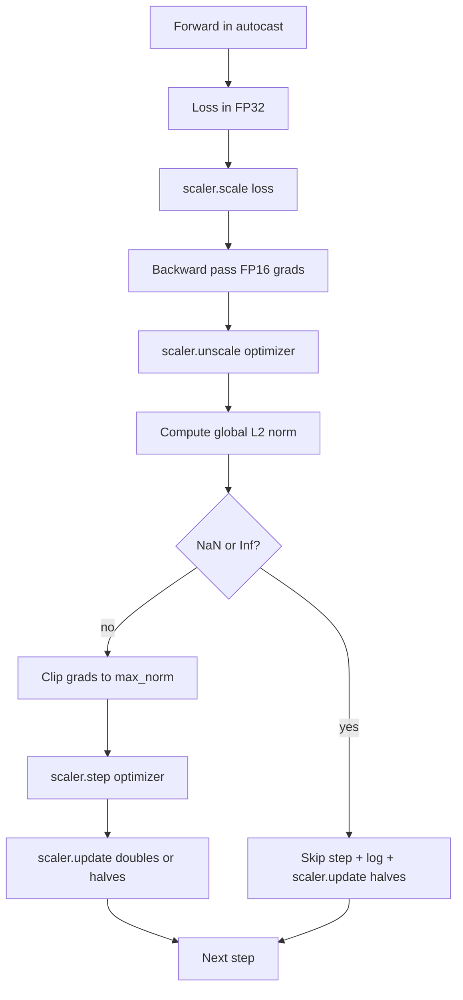

# 梯度裁剪与混合精度

> 上一课里的 optimizer 和 schedule，都默认梯度是“正常的”。现实里通常不是。只要一个坏 batch，就可能把 gradient norm 拉高三个数量级。mixed-precision training 又会进一步放大风险，因为 loss 这一侧会引入 FP16 overflow。本课要构建两条生产训练离不开的安全带：一条是把梯度裁剪到设定的全局 L2 norm，另一条是带 autocast 和 GradScaler 的 mixed-precision loop，它能检测 NaN 和 Inf，干净地跳过这一步，并把 scaling factor 记下来供事后排查。

**Type:** 构建
**Languages:** Python
**Prerequisites:** 第 19 阶段第 30 到 37 课
**Time:** 约 90 分钟

## 学习目标

- 计算所有参数梯度上的 global L2 norm，并在它超过设定阈值时原地裁剪。
- 用 autocast 加 GradScaler 包裹一个训练 step，让 FP16 的 forward / backward 能从 overflow 中存活下来。
- 在 loss 或 gradient 中检测 NaN 和 Inf，跳过 optimizer step，并记录这次 skip。
- 每一步都报告 GradScaler 的 scaling factor，让长时间连续 skip 的情况立刻可见。

## 问题

昨天还正常的训练 run，今天在 step 8,217 处突然垂直起飞。罪魁祸首是某一个 batch，它的 gradient norm 达到了 4,200，是此前峰值的二十倍。如果不做 clipping，optimizer 会执行一个巨大的更新，把模型过去一小时学到的东西全部抹掉。若全局 L2 clip 阈值设为 1.0，同一个 batch 最终只会贡献一个单位范数的更新；loss 还能维持原来的趋势线，run 也能活下来。

mixed-precision training 会把吞吐推高 2-3 倍，因为 forward 和大部分 backward 都会在 FP16 中计算。代价是 FP16 的指数范围很窄。一个在 FP16 中溢出的典型梯度会直接变成 Inf，随后在后续层中传播成 NaN，并在下一次 optimizer step 时把所有权重都写成 NaN。PyTorch 的 GradScaler 通过两步解决这个问题：先在 backward 前把 loss 乘上一个很大的 scaling factor，再在 optimizer step 前用同一个因子把梯度反缩放。如果在 unscale 时发现任何梯度是 Inf 或 NaN，scaler 就会跳过这一步，并把 scaling factor 减半；如果前面连续 N 步都干净，它就会把因子翻倍。随着训练进行，这个因子会自动找到 FP16 能承受的最高安全值。

真正难的是把顺序接对。若在 unscale 之前做 clipping，那么阈值其实落在 scaled gradient 上；若在 unscale 之后再做 clipping，就必须和 GradScaler 的调用顺序严格配合。正确顺序是：`scaler.scale(loss).backward()`，然后 `scaler.unscale_(optimizer)`，然后 `clip_grad_norm_`，然后 `scaler.step(optimizer)`，最后 `scaler.update()`。其他顺序都会得到一个表面能跑、实际上已被静默破坏的训练循环。

## 概念



### 全局 L2 范数

global L2 norm 是把所有梯度拼接成一个大向量后的欧几里得范数，不是逐参数范数。PyTorch 把它实现成 `torch.nn.utils.clip_grad_norm_(parameters, max_norm)`。这个函数会返回裁剪前的范数，因此本课可以同时记录裁剪前和裁剪后的值；这对诊断“我们是不是每一步都在裁剪”至关重要。

### autocast 与 GradScaler 的配合

`torch.amp.autocast(device_type)` 是一个 context manager，用于让符合条件的操作选择性地在 FP16 中执行，最常见的是 matmul 一类算子。`torch.amp.GradScaler(device_type)` 则负责在 backward 前放大 loss，并在 optimizer step 前反缩放梯度。这两个组件是成套设计的；只用其中一个而不用另一个，本身就是配置错误，测试应当能抓住。

本课默认使用 CPU autocast，因为 CI 就跑在这里；同样的模式只需要把 `device_type="cpu"` 改成 `device_type="cuda"`，就能原样迁移到 CUDA。CPU 上的 GradScaler 基本是个 stub，因为 CPU autocast 默认已经走 BF16，通常不需要 loss scaling；但本课仍然把这些调用点完整保留下来，这样 wiring 会和 GPU loop 完全一致。

### NaN 与 Inf 检测

检测会发生在两个位置。第一，loss 本身会先通过 `torch.isfinite` 检查；如果 loss 已经是 Inf 或 NaN，就不值得再继续 backward，这一步会直接被跳过。第二，在 `scaler.unscale_(optimizer)` 之后，本课会用 `has_non_finite_grad(...)` 去扫描未缩放的梯度；任何 Inf 或 NaN 都会被视为 skip。两个检查加起来，分别覆盖了 forward-pass 和 backward-pass 的失效模式。

### 缩放因子诊断

scaling factor 是 GradScaler 的内部状态。每一步，本课都会调用 `scaler.get_scale()`，把它和 learning rate、gradient norm 一起记进日志。一个健康的 run，通常会看到 scaling factor 以 2 的幂不断上升，直到在 `2^17` 或 `2^18` 附近饱和。一个行为异常的 run，则会看到这个因子在高值和低值之间来回震荡，这表明模型的梯度有时在 FP16 范围内，有时又超出了范围。如果不把它显式记录出来，这个诊断信号几乎完全不可见。

```figure
grad-clip-monitor
```

## 动手构建

`code/main.py` 实现了：

- `clip_global_l2_norm`：对 `torch.nn.utils.clip_grad_norm_` 的一层封装，同时返回裁剪前和裁剪后的范数。
- `has_non_finite_grad`：一个扫描梯度中 NaN 与 Inf 的辅助函数。
- `AmpTrainState`：把模型、`AdamW` optimizer、GradScaler 和 autocast device 包进一个对象，对外暴露 `step(inputs, targets)`，执行完整的 scaling、clipping 和 skip-on-NaN 流程。
- `StepLog` 和 `SkipLog`：结构化的逐 step 记录。
- 一个 demo：训练一个小 `nn.Linear` 模型 20 个 step，并在第 5 步向梯度里注入一个 Inf，以强制走 skip 路径，然后打印最终日志。

运行它:

```bash
python3 code/main.py
```

脚本会以 zero exit 结束，并打印逐 step 日志；每一行都会标记为 `STEP` 或 `SKIP`，其中至少会有一行是 `SKIP`。

## 生产模式

有四个做法，能把这个 loop 提升为真正的生产训练 step。

**把 skip 计数当作告警，而不是普通日志。** 一次训练里偶尔跳过几步是健康现象；但如果每个 epoch 都跳过几百步，那就是硬告警，说明模型已经进入 FP16 根本承受不住的区域，而 loop 正在静默失败。本课会跟踪一个 1,000-step 的 rolling skip rate；放到生产里，通常会在 skip rate 超过 5% 时触发告警。

**把裁剪阈值写进配置。** `max_norm = 1.0` 是现代语言模型训练中最常见的默认值。它应当先在小模型上 sweep：更大的阈值能让模型更容易从真正困难的 batch 中恢复；更小的阈值则用更抖的 loss curve 换来对最坏情况的更强控制。这个阈值和 lesson 44 的 schedule 一样，都应放在同一份 YAML 或 JSON config 里。

**把范数日志和 schedule 一起写进 CSV。** CSV 列应固定为 `step, lr, grad_l2_pre_clip, grad_l2_post_clip, loss, skipped, skip_reason, scaler_scale`。reviewer 只看一行，就能同时看到 schedule、梯度走势、scaling factor 和 skip 结果及其原因。把这些列拆到多个文件里，只会制造错位分析。

**`scaler.update()` 每一步都要执行，包括 skip。** 在干净 step 上，scaler 会读取 no-inf counter，给它加一，并在条件满足时把 scaling factor 翻倍；在 skipped step 上，它会把因子减半并重置计数器。忘了在 skip 路径里调用 `update()`，就会产生那种“scaling factor 从来没变过”的经典 bug。

## 实际使用

生产上通常会这样落地：

- **autocast 设备必须与 optimizer 所在设备一致。** GPU 训练用 `torch.amp.autocast(device_type="cuda")`；CPU 训练用 `torch.amp.autocast(device_type="cpu")`。设备混用会制造一种很阴险的 silent type error：loss curve 看着正常，但模型其实没有在学。
- **在 backward 前先检查 loss。** `torch.isfinite(loss).all()` 只是一次很便宜的 tensor reduction，却能在 loss 已经 NaN 时省掉整整一个训练 step 的浪费。应当始终执行。
- **使用 `set_to_none=True` 调用 `zero_grad`。** 这会把梯度置为 `None` 而不是 zero，使 optimizer 能跳过某些无需更新的 parameter group。它既是免费的吞吐提升，也能略微减少 bug surface。

## 交付成果

`outputs/skill-clip-amp.md` 在真实项目里会描述：训练 step 使用的 clip threshold 与 autocast device、逐 step CSV 存在版本库的哪个位置，以及生产环境里的 skip-rate 告警阈值。本课交付的是这台引擎。

## 练习

1. 把合成的 Inf 注入替换成真实的 loss spike，例如把一个 batch 的 target 乘上 1e8，并验证 skip 路径会被触发。
2. 加一个 `--bf16` 模式，把 autocast 从 FP16 切到 BF16。BF16 的指数范围比 FP16 更宽，通常不太需要 loss scaling；在同一 demo 上验证 skip rate 是否会降到零。
3. 增加一个 unit test，验证在不需要 clipping 时，梯度裁剪封装仍能正确返回 pre-clip 和 post-clip norm。
4. 加一个 rolling-window skip-rate 计算，再配一个 CLI 参数：如果 skip rate 连续 100 个 step 都高于阈值，就让 run 失败。
5. 把 loop 接到 canonical CSV 输出上，即 `step, lr, grad_l2_pre_clip, grad_l2_post_clip, loss, skipped, skip_reason, scaler_scale`，并在每一行后 flush，确认文件在 Ctrl-C 后仍能保住。

## 关键术语

| 术语 | 常见说法 | 实际含义 |
|------|----------|----------|
| Global L2 norm | "Clip target" | 所有可训练参数梯度拼接后的欧几里得范数，也就是 clipping 的目标对象 |
| autocast | "Mixed precision" | 在 `with` 代码块里，选择性地以 FP16 或 BF16 运行符合条件的操作 |
| GradScaler | "Loss scaler" | 一个 helper：在 backward 前放大 loss，在 optimizer step 前反缩放梯度 |
| Skip | "Bad step" | 因 gradient 或 loss 非有限值而被拒绝执行的 optimizer step；同时 scaler 会把因子减半 |
| Scaling factor | "Scaler state" | GradScaler 当前使用的乘数；clean stretch 后翻倍，每次 skip 后减半 |

## 延伸阅读

- [Micikevicius et al., Mixed Precision Training (arXiv 1710.03740)](https://arxiv.org/abs/1710.03740) - 最早提出 loss scaling 的经典论文
- [Pascanu, Mikolov, Bengio, On the difficulty of training recurrent neural networks (arXiv 1211.5063)](https://arxiv.org/abs/1211.5063) - gradient clipping 的经典论文
- [PyTorch torch.amp.GradScaler](https://docs.pytorch.org/docs/stable/amp.html) - 本课封装的 scaler API
- [PyTorch torch.nn.utils.clip_grad_norm_](https://docs.pytorch.org/docs/stable/generated/torch.nn.utils.clip_grad_norm_.html) - 本课使用的 clipping primitive
- 第 19 阶段第 42 课 - 为这个 loop 提供语料的下载器
- 第 19 阶段第 43 课 - 被这个 loop 消费的 dataloader
- 第 19 阶段第 44 课 - 与这个 loop 组合使用的学习率调度
