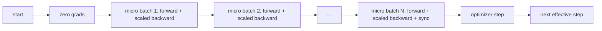
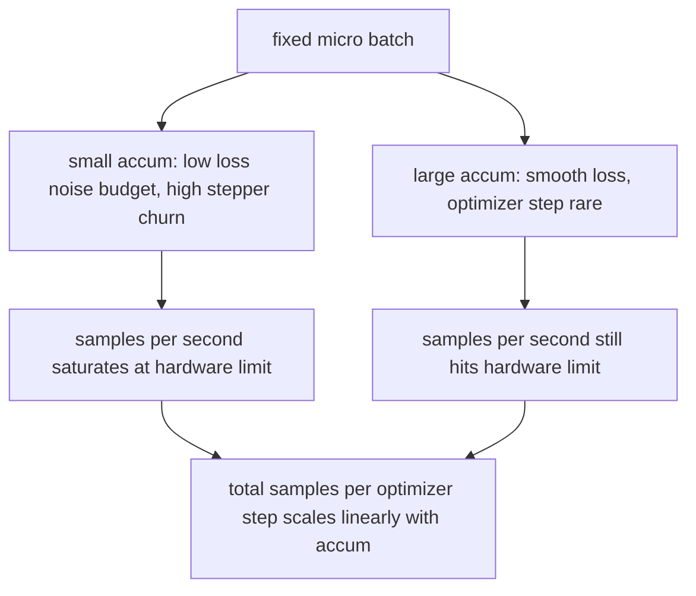

# 梯度累积

> 用你负担不起的有效批大小（effective batch）做训练，但一次只喂一个微批次（micro-batch）。把损失值缩放好，暂时不执行优化器更新步骤（optimizer step），让梯度一点点累起来。

**Type:** 构建
**Languages:** Python
**Prerequisites:** 第 19 阶段第 42 到 45 课
**Time:** 约 90 分钟

## 学习目标

- 推导有效批大小的恒等式：`effective_batch = micro_batch * accum_steps`。
- 实现按微批次缩放损失值，使累积后的梯度与一次完整整批反向传播（full-batch backward）相匹配。
- 直到最后一个微批次才执行优化器同步，也就是只在最后一步同步（sync-on-last-step）。
- 读懂吞吐量相对有效批大小的曲线，并解释为什么收益会递减。

## 问题

你想用 512 的有效批大小做训练，因为这样损失曲线（loss curve）更平滑，优化器更新步在这个尺度上也更合理。但桌上的加速器最多只能容纳 32 个样本，再大就会爆内存。把批大小翻倍不是选项，把模型砍半也不是选项。这个领域从 2017 年开始就一直在用的技巧，就是连续跑 16 次反向传播，让梯度在参数缓冲区里累加起来，直到次数达到目标后才真正执行优化器更新步。

风险在于，此时损失值已经不再是大批大小时的那个数。16 个小批次的交叉熵如果直接相加，会变成一次整批损失的 16 倍。不做缩放时，梯度方向虽然还是对的，但梯度大小会错掉，最终优化器更新步会大出 16 倍。修复只需要一个除法，但也恰恰最容易被忘记。

## 概念



这份约束其实很短：

- 每个微批次的损失值都要先除以 `accum_steps`，然后再调用 `backward()`。PyTorch 默认会把梯度累加到 `param.grad` 上，这个除法就是为了把累加总和拉回正确尺度。
- 优化器更新步只在每个有效批大小结束时执行一次，也就是最后一个微批次反向传播之后。若在累积中途就更新参数，会把后续整个运行依赖的参数都提前扰动掉。
- 优化器的内部状态，比如动量缓冲区和 Adam 的一、二阶矩，也应该每个有效批大小只推进一次，而不是每个微批次推进一次。否则指数滑动平均看到的时间尺度就错了，学习率调度也会被提前烧掉。
- 在单设备上，这只是记账问题；在多机多卡集群上，同样的模式会把非最终的微批次包进一个 `no_sync` 上下文，跳过梯度 all-reduce。最后一个微批次再一次性同步完整累积梯度，而不是把网络通信成本付 N 次。

### 代码中的等价性证明

```python
loss = criterion(model(x_full), y_full)
loss.backward()
opt.step()
```

等价于

```python
for x, y in chunks(x_full, y_full, n):
    scaled = criterion(model(x), y) / n
    scaled.backward()
opt.step()
```

循环结束时的累积梯度缓冲区，会与一次整批反向传播产生的梯度张量相同，区别只在浮点求和顺序。本课代码会在 `equivalence_check` 中断言这一点，要求最大绝对差小于 1e-4。

### 成本体现在何处

每个微批次都要付出一次前向传播和一次反向传播。梯度累积（gradient accumulation）的本质，就是用时间换内存。`outputs/accum-curve.json` 会展示：在固定微批次下，当有效批大小逐渐变大时，会发生什么：



没有免费午餐。把 `accum_steps` 翻倍，会让每次优化器更新步的墙钟时间（wall time）也翻倍。真正改变的是梯度估计的方差：在同样的墙钟预算里，你做的更新步变少了，但每一步都在更多样本上取了平均。文献里通常把大批大小和小批大小当作两类不同的优化问题；而本课讲的是它的机械实现，而不是统计性质。

```figure
cc-grad-accumulation
```

## 动手构建

`code/main.py` 是本课的可运行制品，它做三件事。

### 第 1 步：等价性检查

`equivalence_check()` 会构建两份参数完全一致、随机种子也一致的网络。一份一次性吃下 16 个样本；另一份把同一批数据拆成四个 4-sample chunk，并把损失值先除以四。函数会比较优化器更新前的梯度缓冲区，以及更新之后的参数。断言是 `max_abs_diff < 1e-4`。

### 第 2 步：仅最后一步同步模式

`train_one_optimizer_step` 会遍历微批次。除了最后一个之外，其余都会进入 `no_sync_context(model)`。在单进程里，这个上下文什么都不做；在 DDP 里，这正是跳过梯度 all-reduce 的地方。核心记账逻辑在两种环境里是一样的。`sync_counter` 会记录真正退出 no_sync 的次数；对 N 个微批次来说，每个有效批大小只应该发生 1 次同步，而不是 N 次。

### 第 3 步：吞吐曲线

`sweep_effective_batches` 会在固定微批次下，用一组不同的累积步数运行相同模型。

- `samples_per_sec`：总样本数除以 wall time
- `median_step_ms`：每个有效批大小更新步的 50 分位耗时
- `sync_calls`：实际触发的 collective 点数
- `avg_loss`：这轮 sweep 中各优化器更新步的平均损失值

输出会落到 `outputs/accum-curve.json`，后续可以直接被 notebook 重用。

运行它：

```bash
python3 code/main.py
```

脚本会打印等价性差值、sweep 表格以及 JSON 输出路径，并以 0 退出。

## 实际使用

在生产训练里，梯度累积通常藏在一个参数后面。PyTorch 里的典型公式是 `accumulation_steps = effective_batch // (micro_batch * world_size)`。那些本课不允许使用的高层框架，本质上也只是把这段循环包装了一层而已；底层步骤完全相同：缩放损失值，在非最终微批次上跳过同步，累积梯度，然后每个有效批大小才更新一次参数。

现实里常见的三条经验是：

- 微批次大小通常选到刚好吃满设备内存。再小会浪费加速器周期，再大会直接 OOM。
- 有效批大小通常由学习率调度反推出来。更大的有效批大小往往要求配套更大的学习率与预热，这就是从 2017 年就一直在讲的线性缩放规则（linear scaling rule）。
- accumulation count 就是连接两者的桥梁，也是运行时最容易调节、又不需要重写 dataloader 的那个 knob。

## 交付成果

`outputs/skill-gradient-accumulation.md` 会把这套配方压缩成一个可复用说明，让同事可以直接搬进新仓库：损失值先除以 `accum_steps`，非最终微批次跳过优化器同步，每个有效批大小只更新一次参数，并把吞吐量相对有效批大小的曲线写成 JSON，让这笔权衡变得可见。

## 练习

1. 用 `--num-steps 100` 重新跑 sweep，并把 samples per second 相对 effective batch 画出来。曲线在哪个位置开始变平？
2. 增加一个错误缩放的变体，也就是故意不做除法，然后在 step 1 上展示它相对正确实现的 parameter diff。
3. 把 SGD 换成 AdamW，并确认 optimizer state 只在每个 effective step 推进一次，而不是每个 micro-batch 都推进。
4. 引入真正的 `DistributedDataParallel` 包装，并把 `no_sync_context` 接到它的方法上。验证 sync_calls 会在每个 effective batch 中减少 N-1 次。
5. 修改 equivalence check，对比两种不同的微分方式，例如 2 by 8 与 4 by 4，并解释你是否需要放宽容忍误差。

## 关键术语

| 术语 | 常见说法 | 实际含义 |
|------|----------|----------|
| Micro batch | 你单次前向传播的那批数据 | 一次 forward pass 中能够装进内存的那一小片 batch |
| Accum steps | 每步对应的反向传播次数 | 在一次 optimizer step 之前连续累加的 backward 次数 |
| Effective batch | The batch | Micro batch 乘以 accum steps，再乘以数据并行 world size |
| Loss scaling | Divide by N | 对每个 micro-batch 先做除法，使累积梯度与 full batch 一致 |
| Sync on last | Skip the rest | 在一个 accumulation window 里，只在最后一次 backward 才做梯度同步 |

## 延伸阅读

- PyTorch 关于 `DistributedDataParallel.no_sync` 的文档，对应生产环境里的 sync-on-last-step 技巧。
- Goyal 等人在 2017 年关于大 batch 训练线性缩放的论文，也就是为什么要认真对待 effective batch。
- PyTorch issue tracker 上关于 gradient accumulation 与 mixed precision unscaling 交互的讨论。
- 第 19 阶段第 42 到 45 课，涵盖本课默认已经具备的模型、dataloader、optimizer 和 trainer 脚手架。
- 第 19 阶段第 47 课，会继续讲 checkpoint 与 resume，让长时间 accumulation run 能跨 wallclock 限制存活下来。
