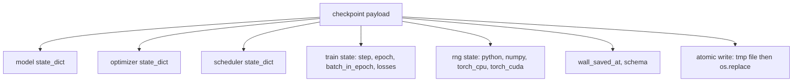
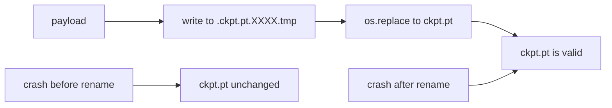
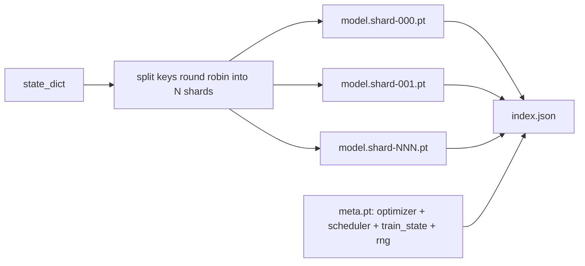

# 检查点保存与恢复

> 训练一旦被中断，整轮运行就可能报废；checkpoint 的作用，就是让训练从中断点继续。你必须把 model、optimizer、scheduler、loss history、step counter 和 RNG state 全部以原子方式写下去，这样无论在任何时刻被 kill，磁盘上都始终留下一个可用文件。

**Type:** 构建
**Languages:** Python
**Prerequisites:** 第 19 阶段第 42 到 45 课
**Time:** 约 90 分钟

## 学习目标

- 把完整训练状态封装成一个单一 payload，并且能够在一个全新的进程中恢复它。
- 实现 atomic save：先写临时文件，再 rename，确保崩溃时永远不会留下半写文件。
- 恢复 Python、NumPy 和 PyTorch 的 RNG state，使恢复后的 loss curve 能与未中断基线对齐。
- 为大到放不进单个文件的模型实现 sharded checkpoint 布局，并带上 hash 校验的 shards 和 JSON index。

## 问题

你启动了一个 18 小时的训练任务，但 wallclock 上限只有 4 小时。第 11 小时，集群因为某位比你级别高的人批准了内核升级而重启。没有 checkpoint，你就得从头开始。没有 resume，你连 optimizer 前 11 个小时“学到”的状态也会丢掉。即便 model weights 还在，AdamW 的 moments 已经没了，下一步优化就会朝训练轨迹早已越过的方向猛冲。

正确的产物应该是一个单文件，它装下继续训练所需的一切：model parameters、optimizer state、scheduler state、绘图需要的 loss history、当前的 step / epoch / batch-in-epoch 计数器，以及所有随机源的 RNG state。没有 RNG state，恢复后的 loss curve 就不是原来的那条曲线。模型相同，数据相同，但 shuffle 不同、dropout mask 不同，最后仪表板上的数字也不同。

atomic save 是这份 contract 的另一半。如果你直接写最终文件名，写到一半崩溃，就会留下损坏文件；resume 时读到的就是垃圾。正确做法是在同一目录下先写一个临时文件，再 rename 成目标文件。这样如果中途崩掉，旧的好文件还在。对 POSIX 文件系统来说，rename 是原子的。

## 概念



### 五类状态桶

| 状态桶 | 作用 |
|--------|------|
| Model | 权重和 buffers，也就是“模型是什么”。 |
| Optimizer | 动量和自适应 moments；没有它们，下一步优化就变成了另一个问题。 |
| Scheduler | 学习率当前位于曲线的什么位置；尤其 cosine schedule 很依赖这一点。 |
| Train counters | step、epoch、batch-in-epoch，以及绘制 dashboard 所需的 loss history。 |
| RNG state | 确保 dropout、data shuffling 和模型内部采样都能保持确定性。 |

### 原子保存



这里有两条硬规则。第一，临时文件必须和目标文件位于同一目录中，这样 rename 才发生在同一文件系统内；跨设备 rename 不是原子的。第二，临时文件名每次尝试都必须唯一，避免两个写入者互相踩掉对方。

### 分片 checkpoint

当模型变大之后，单文件 payload 会变得难以快速加载、难以检查，而且一旦网络共享存储在读取中途抖动，代价也会很痛。解决方案是把参数 state 拆成多个 shard，再写一个小的 index 把它们组织起来。



index 会记录 shard 数量、每个 shard 的 sha256，以及 meta file 的 sha256。任意一个 hash 对不上，loader 就必须大声失败。不同 shard 可以落在不同物理磁盘上；而 meta 很小，会最先读入。

### 从 epoch 中途恢复继续

如果 resume 只能回到“下一个 epoch 的开头”，你浪费的时间可能从几分钟到一天不等。解决方法就是保存 `(epoch, batch_in_epoch)` 再加上 RNG state。恢复后，训练循环会把随机数生成器快进到当前 epoch 已经消费过的 batch 之后，然后从 `batch_in_epoch` 继续。课程代码就是这么做的；它断言恢复后的 loss trajectory 与不中断的 baseline 在 1e-4 以内对齐。

```figure
cc-atomic-checkpoint
```

## 动手构建

`code/main.py` 提供了四个原语和一个 demo driver。

### 第 1 步：捕获与恢复 RNG state

`capture_rng_state` 会返回一个 dict，其中包括 Python 的 `random.getstate`、NumPy 的 `np.random.get_state`，以及 PyTorch 的 CPU 与 CUDA RNG bytes。`restore_rng_state` 则执行反向恢复。CPU tensor 这部分实际上是一个 uint8 byte buffer，PyTorch 的 RNG 能直接消费它。

### 第 2 步：atomic save

`atomic_save` 先把 payload 写到目标目录下的临时文件，再通过 `os.replace` 换成最终文件名。`atomic_write_json` 对 sharded index 也做完全一样的事。

### 第 3 步：完整 checkpoint 往返验证

`save_checkpoint` 把 model、optimizer、scheduler、train state 和 RNG 全部打进一个 dict。`load_checkpoint` 则做反向操作，并返回一个 `TrainState`。其中 schema 字段就是后续升级的挂点：未来格式变化时，只要 bump version string，loader 就能按版本分流。

### 第 4 步：sharded 变体

`save_sharded_checkpoint` 会把 parameter keys round-robin 分配到 N 个 shards，把每个 shard 各自做 atomic save，再额外写一个 meta file 用来保存 optimizer、scheduler 和 train state，最后再写带 sha256 的 JSON index。`load_sharded_checkpoint` 在 merge 之前会验证每个 shard。

### 第 5 步：resume 演示

`run_resume_demo` 会先训练一个小模型直到 `total_steps`，并在 `interrupt_at` 时刻保存 checkpoint，然后继续往后跑。另一个进程再从这个 checkpoint 恢复，并执行剩余步骤。函数最终返回两条 loss trajectory 在中断点之后的最大绝对差值。如果 RNG 恢复正确，这个差值应当是零，或者只剩浮点噪声。

运行它：

```bash
python3 code/main.py
```

单文件版本和 sharded 版本的 demo 都会断言 max-diff 小于 1e-4。摘要结果会写到 `outputs/resume-demo.json`。

## 实际使用

生产训练栈里的 checkpointing，本质上也是同一种形状：model + optimizer + scheduler + counters + RNG，以原子方式写盘，并按 step 命名，好让“最新的那个”容易找到。大模型通常会用 sharded layout 来支持并行读取，而 index.json 就是让这件事成立的关键。

部署时建议强制执行三条规则：

- **Schema 必须是 payload 里的一个字符串字段。** 迁移逻辑要靠它分支。没有它，你就无法在不打破老运行的前提下演进格式。
- **每个 shard 都做 sha256。** 悄悄截断的下载，是最糟糕的一类 bug；loader 必须尽早失败，而不是晚点炸。
- **Checkpoint cadence 要诚实。** 每 N steps 保存一次，并且每隔固定 wallclock 分钟也保存一次，取两者中更短的间隔。否则一旦长步训练崩掉，你会整窗地丢工作。

## 交付成果

`outputs/skill-checkpoint-save-resume.md` 就是任何新训练脚本都能复用的配方：payload shape、atomic write、RNG capture、sharded index。把 `save_checkpoint` 接到周期性保存点，把 `load_checkpoint` 接到启动流程，训练任务就能扛住中断。

## 练习

1. 把 round-robin sharding 改成按 parameter group 分片，例如 `.weight` 和 `.bias` 分开。什么场景下各自更合适？
2. 扩展保存循环，让它保留最近 K 个 checkpoints，并清理更早的。磁盘很小时，合理的 K 应该是多少？
3. 增加一个 `--ckpt-every-seconds` 参数，使保存能按 wallclock 间隔触发，而不只是按 step 数量。
4. 实现一个启动时 checksum verification 路径，扫描目录中所有 checkpoint，并报告哪些已经损坏。
5. 写一个 `migrate_v1_to_v2` 函数，给 payload 增加一个新字段并提升 schema string。让 load 同时兼容两个版本。

## 关键术语

| 术语 | 常见说法 | 实际含义 |
|------|----------|----------|
| Atomic save | "Write and pray" | 先写同目录下的临时文件，再 os.replace 到目标文件名 |
| State dict | "The weights" | 按参数名索引的模型参数和 buffers |
| Sharded checkpoint | "Big model file" | 多个 shard 文件，加一个 meta file，再加一个带 sha256 的 JSON index |
| RNG state | "Random seed" | 保存的是 python random、numpy、torch CPU、torch CUDA 的完整状态，而不只是 seed |
| Mid-epoch resume | "Restart" | 快进 RNG，并从同一 epoch 的下一批继续训练 |

## 延伸阅读

- POSIX `rename` 语义，解释 `os.replace` 所依赖的原子性保证。
- PyTorch 关于 `torch.save` 和 `torch.load` 的文档，包括用于跨设备恢复的 `map_location`。
- 第 19 阶段第 46 课，覆盖本课 checkpoint payload 需要跨越保存的梯度累积模式。
- 第 19 阶段第 48 课，覆盖本方案可兼容其 state dict 格式的分布式封装。
- Linux 内核关于 `fsync` 的文档，解释 atomic rename 背后的持久化保证。
