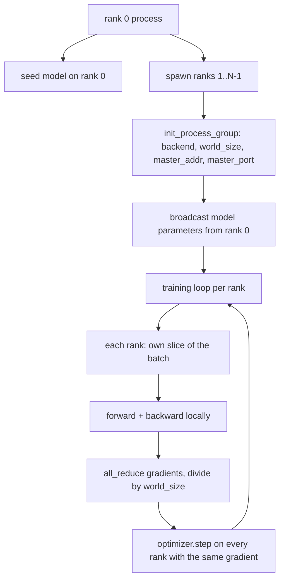
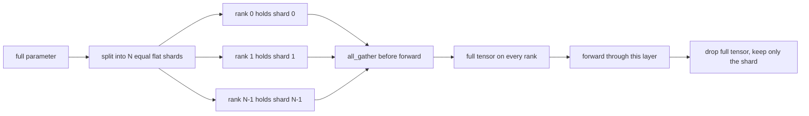

# 从零实现分布式数据并行（Distributed Data Parallel）与 FSDP

> 多 rank 训练归根结底就是两个集合通信操作（collective）加一条规则。启动时广播参数，反向传播之后平均梯度，并且永远不要让不同 rank 对当前训练步数产生分歧。

**Type:** 构建
**Languages:** Python
**Prerequisites:** 第 19 阶段第 42 到 45 课
**Time:** 约 90 分钟

## 学习目标

- 在不依赖特殊硬件的前提下，用 `gloo` 后端（backend）拉起一个包含 N 个 ranks 的进程组（process group）。
- 实现一个最小版 DDP 包装器（wrapper）：构造时广播参数，反向传播之后对梯度执行 all-reduce。
- 证明每个 rank 上的梯度做 all-reduce 后，结果与单进程在拼接输入上算出的梯度一致。
- 勾勒 FSDP 的参数分片机制：每个 rank 只保存参数的一部分，前向传播时把完整张量收集回来，用完后再丢掉。

## 问题

模型本身装得进一台设备，数据集却装不进。优化预算要求你每秒看到 N 倍样本，于是第一根杠杆就是数据并行：每个 rank 在批次的不同切片上运行同一个模型，然后在优化器更新前把梯度平均起来。第二根杠杆是 FSDP：如果连模型本身也装不进一台设备，那么每个 rank 就只持有每个参数的一部分，并在前向传播过程中按层重建完整张量。

真正让人头疼的不是概念，而是这些账到底怎么记。如果参数在各个 rank 之间漂移，整轮训练就会静默损坏。如果你平均了梯度，却没有对应处理损失值，监控面板上的数字就是假的。如果集合通信后端在拓扑上无法达成一致，训练会永远卡住。最可靠的解决办法，是先亲手把这些集合通信操作写一遍，然后再也不要盲信一个你自己都无法复现的包装器。

这一课完全基于 CPU，不假设 CUDA。`gloo` 是每个 PyTorch 构建都自带的 CPU 集合通信后端，也能和 `torch.multiprocessing` worker 一起工作；而这套代码切换到多 GPU 节点时，只需要改成 `nccl`，整体结构并不需要变。

## 概念



### 两个真正关键的集合通信操作

| Collective | 作用 | 时机 |
|------------|------|------|
| `broadcast` | 把一个 rank 上的 tensor 复制到所有其他 ranks | 参数初始化、scheduler state、任何 one-to-all 同步 |
| `all_reduce` | 对所有 ranks 上的 tensor 求和、平均或最大值，并让每个 rank 都拿到结果 | backward 之后做梯度平均 |
| `all_gather` | 每个 rank 提供一个 tensor，所有 rank 都拿到拼接后的结果 | 收集 logits，或执行 FSDP 参数 unshard |

DDP 的约定是：构造时 `broadcast`，反向传播之后 `all_reduce`。FSDP 则是在每一层前向传播之前再加一个 `all_gather`。

### 梯度平均必须等价于单进程梯度

一个模型在 N 个 ranks 上分别处理每 rank B 个样本时，最终得到的梯度必须与单进程直接在 N*B 个样本上训练的结果一致。关键在于：把各 rank 的梯度求和后除以 N，得到的正是平均损失值的梯度，也就是交叉熵在整批上采用 mean reduction 时的结果。课程代码用 `max-abs-diff < 1e-3` 来断言：手写 all-reduce 后的梯度与参考单进程梯度一致。

### FSDP 结构草图



它带来的内存收益是精确的：每个 rank 上参数内存会下降到原来的 1/N。代价则是收集，而且每次前向传播都要支付这一笔。生产级 FSDP 会把收集与前一层计算重叠起来，因此墙钟成本通常比天真估算小很多。课程代码会对每个参数做一次完整往返，并断言重建结果与原始参数逐位一致。

### CPU 与 `gloo` 后端

CUDA 是生产目标，但相同的代码路径在 CPU 上也能跑通。gloo 是 CPU 集合通信后端；它在 GPU 上当然比 `nccl` 慢几个数量级，但 API 形状完全一样。本课使用 `backend="gloo"` 初始化进程组，并通过 `torch.multiprocessing` 而不是 `torchrun` 生成各个 rank；最终大家都会落到相同的 `torch.distributed` API 调用。在多 GPU 节点中，只需切换成 `backend="nccl"`、把张量放到设备上，并改用 `torchrun` 启动。

```figure
cg-allreduce-ring
```

## 动手构建

`code/main.py` 是本课的可运行产物。

### 第 1 步：拉起 process group

```python
os.environ["MASTER_ADDR"] = "127.0.0.1"
os.environ["MASTER_PORT"] = str(port)
dist.init_process_group(backend="gloo", rank=rank, world_size=world_size)
```

`MASTER_ADDR` 和 `MASTER_PORT` 是 rendezvous 信息：每个 rank 都连到同一个主机和同一个端口。课程代码会用 bind-and-close 技巧先挑出一个空闲端口，避免同一台机器上多个运行互相冲突。

### 第 2 步：构造时广播参数

`MinimalDDP.__init__` 会遍历每个参数和 buffer，并调用 `dist.broadcast(tensor, src=0)`。rank 0 的值会成为标准初始化。如果少了这一步，每个 rank 都会按自己的随机种子初始化，训练从第一步起就开始发散。

### 第 3 步：backward 之后 all-reduce 梯度

```python
def all_reduce_grads_(module, world_size):
    for p in module.parameters():
        if p.grad is None:
            p.grad = torch.zeros_like(p.data)
        dist.all_reduce(p.grad.data, op=dist.ReduceOp.SUM)
        p.grad.data.div_(world_size)
```

这样每个 rank 最终都会拿到同样的平均梯度。optimizer step 于是变成了“在所有 rank 上对相同输入执行相同函数”，也正因此参数会在整个训练过程中保持同步。

### 第 4 步：证明等价性

`manual_all_reduce_matches_single_process` 会在 rank 0 上构建同一个模型，然后比较：all-reduce 之后的梯度，与单进程在拼接输入上直接算出的梯度之间的差异。课程里的最大绝对差大约在 1e-8。

### 第 5 步：FSDP 往返验证

`fsdp_round_trip_sketch` 会把每个参数压平，再补齐到 `world_size` 的整数倍，然后切片、all-gather、再去掉补齐部分。每个 rank 重建出来的结果都必须与原始参数一致。这一步对应 unshard；而它的逆过程，也就是前向传播之后重新收回本地分片，只差从收集结果里再切一刀。

运行它：

```bash
python3 code/main.py
```

默认 world size 是 2。程序会拉起两个 CPU 进程，通过 `gloo` 互相通信，并以零退出。输出文件 `outputs/ddp-demo.json` 会记录每个 rank 的参数和、all-reduce 后的梯度范数、FSDP 往返验证结果，以及手写实现与参考实现之间的梯度差异。

## 实际使用

生产训练栈其实也是建立在同样原语之上。PyTorch 的 `DistributedDataParallel` 额外提供了：反向传播后的梯度钩子，用于把 all-reduce 与反向传播重叠；分桶式 all-reduce，用一个集合通信操作合并多个小梯度；以及第 46 课中用到的 `no_sync` 上下文。

PyTorch 的 FSDP 也是同样的形状，只是做得更完整：每层使用扁平参数视图，让每个 rank 持有一段连续缓冲区；把下一层的 unshard 与当前层计算重叠；并支持可选的 CPU 卸载。

整体形状并没有变：启动时 broadcast，backward 之后 reduce，当参数再也装不下时就开始分片。

## 交付成果

`outputs/skill-distributed-fsdp-ddp.md` 给出的是新训练脚本的配方：CPU 时用 `gloo` 拉起进程组，GPU 时改用 `nccl`；用一个 DDP 外壳包住模型，在构造时广播参数，反向传播后再规约梯度；如果模型继续变大，就用 FSDP 草图中的 all_gather 模式做参数分片。

## 练习

1. 用 `--world-size 4` 跑起来，并确认整个训练过程中参数 spread 保持在 1e-3 以内。
2. 把手动平均改成 `dist.all_reduce(op=dist.ReduceOp.AVG)`，比较两种写法的时间差异。
3. 给 DDP wrapper 增加 post-backward hook，让 all-reduce 与剩余 backward 重叠起来；测量 wallclock 改善。
4. 实现 FSDP 的 re-shard 步骤：forward 完成后，用本地 shard 再次取代 full tensor，并确认每个 rank 的内存占用下降。
5. 在 CUDA 机器上把 backend 切换成 `nccl`。记录哪些环境变量需要改变，哪些保持不变。

## 关键术语

| 术语 | 常见说法 | 实际含义 |
|------|----------|----------|
| Backend | "gloo or nccl" | 实现 collective ops 的底层库；gloo 主要对应 CPU，nccl 主要对应 GPU |
| World size | "Total ranks" | 进程组中的总进程数；collective 以整个组为单位运行 |
| Rank | "Worker id" | 进程组内部的进程编号，从 0 开始 |
| All-reduce | "Sum the grads" | 把一个 tensor 在所有 ranks 上求和，并让每个 rank 都拿到相同结果 |
| Unshard | “收集参数” | 通过 all_gather 把各 rank 手里的参数切片重建成完整 tensor |

## 延伸阅读

- PyTorch `torch.distributed` 文档，覆盖本课依赖的 collective 语义。
- `gloo` 库的 collective 列表，其 API 形状与 CUDA 后端的 `nccl` 原语一致。
- 第 19 阶段第 46 课，介绍用 `no_sync` 包裹 DDP all-reduce 的梯度累积模式。
- 第 19 阶段第 47 课，介绍能跨 DDP 与 FSDP 运行继续生效的 checkpoint 布局。
- PyTorch FSDP 文档，说明本课中参数分片草图的生产级实现。
