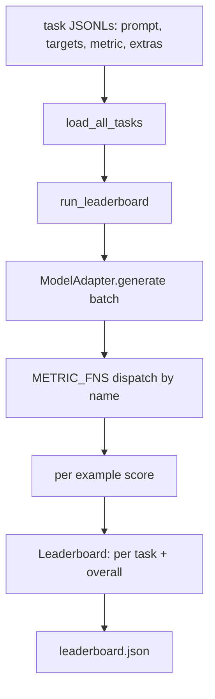
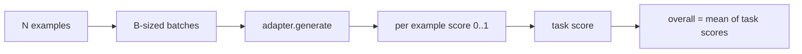

# 语言模型评测框架

> 一个模型如果在“你自己都说不清的任务”上表现很好，那它多半只是碰巧做对了。harness 本身就是任务定义、度量标准、运行器和排行榜的合体，而且应该是一个足够短、足够清晰、足够可替换的形状。

**Type:** 构建
**Languages:** Python
**Prerequisites:** 第 19 阶段第 42 到 45 课
**Time:** 约 90 分钟

## 学习目标

- 把一个任务定义成 JSONL 文件，其中每个样本都包含 `prompt`、`targets`、`metric`，以及可选的 `extras`。
- 实现五种 metric：exact match、rouge-l F1、executable check、multiple choice、substring contains。
- 写一个 runner，按任务批量处理样本，并把请求派发到可替换的 model adapter。
- 产出一个 leaderboard JSON，其中包含 per-task 分数、延迟，以及可复现实验所需的 overall average。

## 问题

几乎每周都会有一个新语言模型落地。营销文案永远说它“表现很好”。真正诚实的问题应该是：它到底在哪些任务上表现好？而最诚实的答案，只能是你自己写的 leaderboard，因为供应商那份 leaderboard 往往就是他们自己调过的目标。

如果你的 repo 里没有 eval harness，那你比较两个模型的方式就只剩下“感觉”。一旦有了 harness，你比较的就是同一组固定任务、固定 metric 上的分数，而且输出还是一个可以直接 diff 的 JSON。harness 就是“昨天那次运行”和“今天这次运行”之间的 contract。没有它，回归会悄悄上线。

最常见的陷阱，是把 harness 过度绑定到某个具体模型。反过来的解法也很简单：让 harness 小到十五分钟能读完，任务文件小到可以直接随 repo 提交，metric 都从零写出、能被同事审计，而 adapter 成为唯一承载模型特定逻辑的地方。换 adapter，排行榜可以动；换 tasks，排行榜也可以动。除此之外，任何其他部分都不应该动。

## 概念



### 任务规范

每个样本都是 JSONL 中的一行：

```json
{"id": "arith-00", "prompt": "compute: 2 + 2", "targets": ["4"], "metric": "exact_match"}
```

如果某个 metric 需要辅助信息，则由 `extras` 提供旁路 payload：

```json
{
  "id": "code-00",
  "prompt": "python: write a function f that doubles its input",
  "targets": ["ok"],
  "metric": "code_exec",
  "extras": {"io_pairs": [[1, 2], [3, 6]]}
}
```

一个任务就是一个 `.jsonl` 文件，放在 `outputs/tasks/` 下。文件名本身就是 task name。同一个文件中的所有样本共享同一种 metric。

### 五个固定任务

| 任务 | Metric | 测试内容 |
|------|--------|----------|
| arithmetic | exact_match | 对确定性答案的 token-level 正确性 |
| summary | rouge_l | 与单行参考摘要之间最长公共子序列的 F1 |
| code-exec | code_exec | 可执行测试：预测出的函数必须满足输入输出对列表 |
| multiple-choice | multiple_choice | 预测结果的第一个字母必须匹配允许选项 |
| generation | substring_contains | 自由文本中必须至少包含一个目标子串 |

### 指标契约

每个 metric 都是一个从 `(prediction, targets, extras) -> float in [0.0, 1.0]` 的函数。harness 先对每个样本求分，再取样本均值得到 task score，最后对所有任务求平均得到 overall score。五个 metric 都很小：

- `exact_match`：转小写、折叠空白、判断完全相等。
- `substring_contains`：同样做规范化，再做子串判断。
- `multiple_choice`：读取预测结果的首字符并转成大写。
- `rouge_l`：计算 LCS 长度，并对 prediction 与 reference 长度做 precision / recall，再合成为 F1。
- `code_exec`：在受限命名空间中执行预测结果，对每个输入输出对调用 `f(x)`，统计匹配数量。

这个 metric 会把预测结果放进一个裁剪过的 builtins namespace 里执行。课程测试会断言：`import os` 会直接报错，因为 `os` 根本不在命名空间内，也就不可能碰到文件系统。

### 模型适配器

```python
class ModelAdapter(Protocol):
    def generate(self, prompts: Sequence[str]) -> List[str]: ...
    @property
    def name(self) -> str: ...
```

adapter 就是唯一的缝。课程里附带了 `ToyAdapter`，它是一个确定性的模式匹配器，能够对五个固定任务里的每条 prompt 返回正确答案。真正的 adapter 则会去调用模型并返回输出。对于 harness 来说，两者没有区别。

### 运行器

`run_task` 会按 `batch_size` 对 prompt 分批，然后把结果发到对应 metric。`run_leaderboard` 负责遍历所有任务并求平均。`write_leaderboard` 则会输出带有 schema string 的 JSON，好让未来格式升级不会悄悄打坏 dashboard。



```figure
eval-harness-matrix
```

## 动手构建

`code/main.py` 是本课的可运行产物。

### 第 1 步：写入固定任务

`seed_fixture_tasks(target_dir)` 会写出五个 `.jsonl` 文件。第一次运行 `main.py` 时，如果目录为空，就会先自动 seed 这些 fixtures。

### 第 2 步：加载任务

`load_all_tasks(task_dir)` 会读取所有 `.jsonl`，并返回一个从任务名到 `Example` 列表的 dict。以 `#` 开头的注释行和空行都会被跳过，方便贡献者给任务文件加说明。

### 第 3 步：实现 metrics

每个 metric 都是一个小函数，并配套单元测试。课程测试套件中总共覆盖了 13 个 case，包括规范化、部分重叠、代码执行，以及不安全代码的拒绝。

### 第 4 步：编写 runner

`run_task` 会按批次遍历样本，并产出一个 `TaskResult`，其中包括 score、correct count、total count 和 latency。`run_leaderboard` 会遍历全部任务并返回一个 `Leaderboard`，里面带 overall average。

### 第 5 步：输出 JSON

`write_leaderboard` 负责序列化排行榜。`--include-per-example` 标志会额外输出每个样本的记录，这样当分数发生变化时，你就能直接 diff 当前预测和上一次运行的预测。

运行它：

```bash
python3 code/main.py
```

脚本第一次运行会先写入 fixtures，再用 toy adapter 打分，它会把每个固定任务都答对，然后写出 `outputs/leaderboard.json`。用 toy adapter 时，overall score 是 1.0；而 `test_main.py` 里那个 stub adapter 测试则展示了：同样的 harness，在模型完全答不上来时会给出 0.0。

## 实际使用

要接入真实模型，只需要写一个 adapter。形状如下：

```python
class HttpAdapter:
    name = "vendor.v1"

    def __init__(self, endpoint, api_key):
        self.endpoint = endpoint
        self.api_key = api_key

    def generate(self, prompts):
        out = []
        for prompt in prompts:
            response = http_post(self.endpoint, prompt, self.api_key)
            out.append(response["text"])
        return out
```

把 `ToyAdapter` 换成 `HttpAdapter` 即可，位置就在 `main()` 顶部。harness、tasks、metrics 和 leaderboard 其余部分完全不需要变。

把这套 harness 真正放进项目时，建议强制执行三条规则：

- **固定 task files。** leaderboard.json 要么携带哈希固定的 task 内容，要么把 JSONL 一起带上；否则 task 文件一改，分数也会跟着变，而你无法判断究竟是哪边动了。
- **不仅 diff 分数，也 diff 预测。** `--include-per-example` 可以让你看到分数下降那天模型究竟回答了什么。
- **限制 batch size。** 真实 adapter 往往受 rate limit 约束，小 batch 能让 harness 更容易跨供应商工作。

## 交付成果

`outputs/skill-lm-eval-harness.md` 给出的就是整套配方：JSONL task spec、五个 metrics、可替换 adapter、批处理 runner，以及带 schema string 的 leaderboard JSON。`outputs/tasks/` 下那几份 task 文件就是固定装置，可以直接复制到真实项目里作为起点。

## 练习

1. 增加第六个任务，并从零写一个自定义 metric，例如 BLEU-like overlap、BLEURT-like 参考打分，或者任何 contract 清晰的评分方式。
2. 扩展 `code_exec`，让它能捕获 stdout，并接受一组预期 stdout 作为 targets。
3. 增加 leaderboard diff 命令：输入两个 `leaderboard.json` 文件，输出哪些任务变了、变化了多少。
4. 给每个样本设置延迟上限。把 adapter 调用包进 timeout，并在 leaderboard 里额外输出 `timeouts` 列。
5. 在 leaderboard 中写入 task 内容的 sha256，让未来读者能验证自己跑的是同一批任务。

## 关键术语

| 术语 | 常见说法 | 实际含义 |
|------|----------|----------|
| Task spec | "The eval format" | 包含 prompt、targets、metric 和可选 extras 的 JSONL 文件 |
| Metric | "How you score" | 从 (prediction, targets, extras) 映射到 [0, 1] 浮点数的函数 |
| Adapter | "The model client" | 拥有 generate(prompts) -> list[str] 方法的对象；唯一承载模型特定逻辑的地方 |
| Leaderboard | "The scoreboard" | 包含 per-task 分数、总计数、延迟和 overall average 的 JSON |
| Code exec metric | "Run it and check" | 在受限命名空间中执行预测结果，并与输入输出对比较 |

## 延伸阅读

- 原始的 lm-evaluation-harness，可作为生产参考实现，规模更大但整体形状相同。
- HuggingFace 的 lighteval，提供同一契约的另一种实现方式。
- 第 19 阶段第 46 课，介绍被本 harness 评分的训练栈所使用的梯度累积模式。
- 第 19 阶段第 47 课，介绍你要评分的 checkpoint 格式；应把 checkpoint hash 固定进 leaderboard。
- 第 19 阶段第 48 课，介绍产出待测模型的分布式训练栈。
