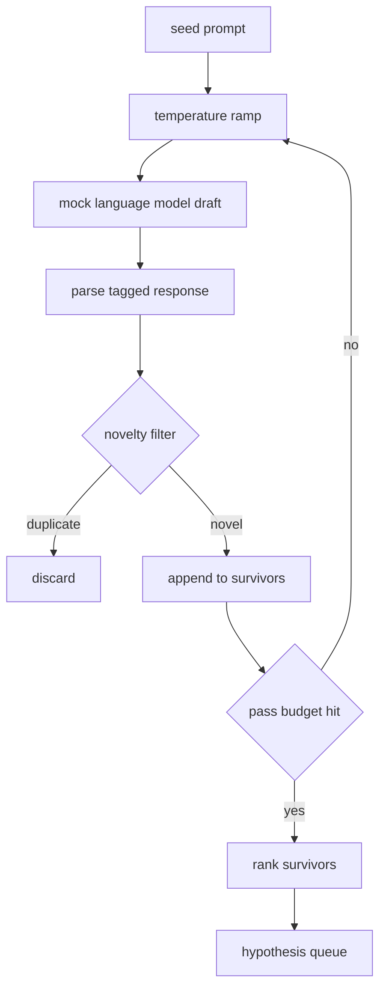

# 假设生成器

> 一个研究代理如果把同一个问题问两遍，本质上就是在浪费 token。真正的技巧，是强迫每一轮草案都落到一个新的位置上。

**Type:** 构建
**Languages:** Python
**Prerequisites:** 第 19 阶段 Track A 的第 20 到 29 课
**Time:** 约 90 分钟

## 学习目标
- 从 seed prompt 驱动一个 sampler，并把它的输出转成 typed hypothesis records。
- 在每次 pass 中提高 sampler temperature，让下一版草案比上一版更偏离原点。
- 用一个小 embedding model 和 cosine distance threshold 过滤近重复项。
- 用综合 novelty、specificity 和 testability 的评分函数对幸存假设排序。
- 让整个流程保持确定性，使同一个 seed 总能产出同一条队列。

## 为什么要先生成，再过滤

一个 planner 只问一次模型，只会得到一个 hypothesis。对讲解性的 worked example 来说这没问题，但对 research loop 来说，这就是错的形状。研究循环真正需要的是一条有深度的排序队列，这样当第一个 hypothesis 被实验否掉时，runner 可以立刻拿下一个，而不必重新支付完整的一轮采样成本。

这条队列来自两个想法的叠加。第一个是 temperature ramping：每一轮通过 sampler 时，都把温度稍微抬高一点，鼓励后续草案往外飘。第二个是 novelty filtering：每拿到一份草案，generator 都要计算它与所有已接受候选的 embedding 距离，只要还落在同一个簇里，就直接拒掉。

课程里附带了一个 mock language model，它会对固定 prompt 返回脚本化 token 序列。这个 mock 已经足以打通完整路径：seed prompt 输入、temperature ramp 应用、candidate 解析、novelty filter 运行、最终导出排序队列。

## 假设结构

```text
Hypothesis
  id             : int           (monotonic within a run)
  text           : str           (the claim)
  variables      : list[str]     (what changes between conditions)
  metric         : str           (what the runner will measure)
  baseline_ref   : str | None    (which paper or run the comparison cites)
  draft_pass     : int           (which sampler pass produced this)
  temperature    : float         (the sampler setting at draft time)
  novelty_score  : float         (distance from prior survivors, 0..1)
  rank_score     : float         (weighted sum used for ordering)
```

`variables` 和 `metric` 不是自由文本。parser 会从 tagged response 中把它们抽出来。第 52 课里的 runner 在构造实验配置时会直接读取这些字段。

`baseline_ref` 是可选字段，但强烈建议提供。第 53 课的 evaluator 需要一个 baseline 做对照；如果 hypothesis 没写，它就只能退回到“同一 metric 的上一轮运行”。

```figure
cg-novelty-ramp
```

## 架构



循环本身很直接，真正有意思的是：每一个盒子都有一份硬 contract。

## 温度爬坡

从 `t_min` 开始，到 `t_max` 结束，步长是 `(t_max - t_min) / (n_passes - 1)`。每一轮 pass 都在当前 temperature 下调用 sampler，因此 `n_passes` 个均匀分布的温度值来自 `GeneratorConfig.schedule()`。mock model 通过 `(prompt, temp_bucket)` 这一对键来切换不同脚本响应，从而“尊重”温度变化。bucket 是开区间，所以温度只要有一点变化，就可能掉进不同 bucket，进而给出不同草案。在生产环境里，这里会换成真实模型，并把 `temperature=t` 传进去。

默认 schedule 是 6 轮，从 `0.2` 到 `1.2`。六轮已经足够把队列填满，同时又不会为那些最后注定要被 novelty filter 拒掉的样本支付太多成本。低于 `0.2` 时，模型基本只会复述 seed；高于 `1.2` 时，回答又往往会偏题，最终过不了 parser。

## 新颖性过滤

每一份草案被解析后，generator 都会把文本 embed 一次，再与所有已接受 hypothesis 逐个比较。这里的 embedding 只是一个小型 hashed bag-of-word tokens，并做单位向量归一化。两个单位向量之间的 cosine distance 就是 `1 - dot(a, b)`。只有当它到任一已有 survivor 的最小距离大于 `novelty_threshold` 时，这个草案才会通过。默认阈值是 `0.25`。

这个 hashed embedding 并不高级。它的优点是确定性、零依赖，而且足以抓住最明显的重复场景：两个草案共用了大多数名词。生产级部署当然可以换成小型句向量模型，但接口可以保持不变。

## 排名分数

```text
rank_score = w_novelty * novelty_score
           + w_specificity * specificity_score
           + w_testability * testability_score
```

这里有三个子分数。`novelty_score` 是它与所有 survivor 之间的最小 embedding 距离。`specificity_score` 是 hypothesis 中具体变量数量除以目标数量得到的比例。`testability_score` 则是：如果 hypothesis 同时给出了 metric 和 baseline，就记 1；如果只写了 metric，就记 0.5；否则记 0。

默认权重分别是 `0.4`、`0.3`、`0.3`。这些权重保存在 generator config 里，因此后续课程如果想调整打分偏好，不需要 fork 代码。

## 模拟语言模型

```python
class MockLLM:
    def sample(self, prompt: str, temperature: float, seed: int) -> str:
        ...
```

这个 sampler 在给定 `(prompt, temperature, seed)` 三元组时是确定性的。mock 内部维护了一张脚本响应表，键是 `(prompt_signature, temperature_bucket)`。如果某个键没有命中，sampler 就返回一个 fallback，而这个 fallback 会故意让 parser 失败。测试里有专门路径覆盖这个分支。

seed 会被混入响应，因此相同的 `(prompt, temperature)` 在不同 seed 下可以产生不同草案。课程测试会把 seed 固定下来，以保持结果可复现；而在真实部署里，seed 往往来自系统时钟或计数器。

## 输出队列

最终输出是一组按 `Hypothesis` 记录的 `rank_score` 降序排列的队列。第 52 课里的 runner 会弹出队首，运行实验；第 53 课里的 evaluator 会把 verdict 写回来。如果 verdict 说明这个 hypothesis 错了，runner 就继续弹下一个。

队列本身是有限的。它一旦耗尽，orchestrator 可以选择放宽 seed prompt 再跑一轮 generator，也可以直接停止，并报告预算耗尽。

## 如何阅读代码

`code/main.py` 定义了 `Hypothesis`、`MockLLM`、`HypothesisGenerator` 以及一个确定性的 demo。generator 对外只暴露一个 `run(seed_prompt)` 方法，并返回排序后的队列；pass 数量来自 `GeneratorConfig.n_passes`，而不是作为函数参数外传。embedding 是一个 hashed token bag。novelty filter 是一个单独函数。rank score 也是一个单独函数。整个实现都不依赖 `numpy`，embedding 数学完全基于 stdlib，因此课程可以保持可移植性。

`code/tests/test_generator.py` 覆盖了正常路径、重复拒绝路径、parser 失败路径、temperature ramp 边界以及最终排序。

## 它在整个链路中的位置

第 50 课负责产出 hypothesis queue。第 51 课会拿队首做 literature search，判断这个假设是否其实早就被文献解决。第 52 课会拿同一个队首做真实实验。第 53 课会读取这两边的输出，并写出 verdict。这四课合起来，就构成了一个不需要人类持续介入的 research loop；当然，人也可以在任何边界插手。
