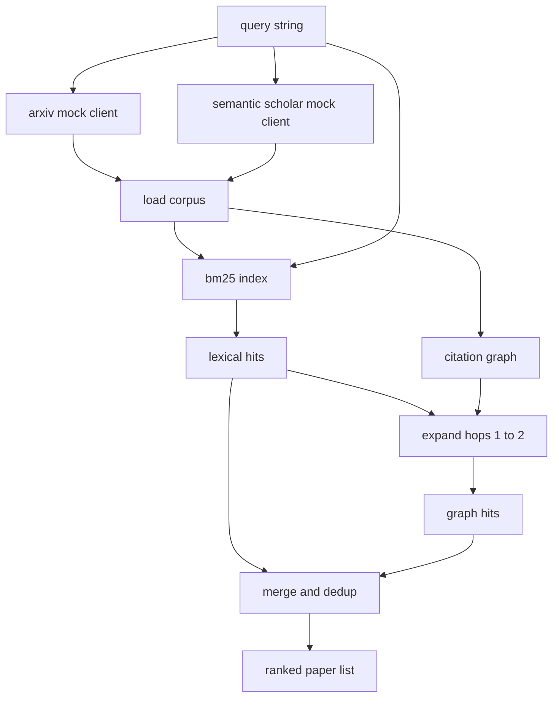

# 文献检索

> 假设很便宜。真正昂贵的是，你得先知道有没有人已经把它证明过。这个 retrieval layer 的职责，就是在 runner 拉起沙箱之前，先回答这个问题。

**Type:** 构建
**Languages:** Python
**Prerequisites:** 第 19 阶段 Track A 的第 20 到 29 课
**Time:** 约 90 分钟

## 学习目标
- 建模一个小型 paper record，并包含下游 loop 真正会读取的字段。
- 只用 stdlib 数据结构，在 abstracts 上构建一个 BM25 index。
- 通过遍历 citation graph，把 lexical search 漏掉的论文补出来。
- 用稳定 paper id 对 lexical 和 graph 两轮结果做去重。
- 把两个 mock 外部 API 封装在同一个 client 后面，这样以后换成真实 endpoint 时，上游调用点不需要改。

## 为什么要做两轮检索

只靠对摘要做关键词搜索，确实能找出与 query 共用词汇的论文，覆盖了大部分表层结果。但它会漏掉两类情况。第一类是 foundational paper 本身使用了不同词汇，例如你搜 “sparse attention”，却漏掉了一篇标题叫 “block selection in transformer routing” 的工作。第二类是相关论文本身是某篇已知 anchor 的 follow-up；这种情况下，与其暴力扫完整个 abstract pool，不如先找到 anchor，再顺着 citation graph 前后走。

这一课会同时实现这两轮。BM25 over abstracts 负责抓 lexical hit。引文图遍历则以这批 lexical hit 为 seed，向前向后扩张一到两跳。最后两轮结果取并集、按 paper id 去重，并根据一个小型 combined score 做排序。

## 论文结构

```text
Paper
  id          : str           (stable identifier, "p001" for the mock corpus)
  title       : str
  abstract    : str
  year        : int
  authors     : list[str]
  references  : list[str]     (paper ids this paper cites)
  citations   : list[str]     (paper ids that cite this paper)
  source      : str           (which mock api supplied it, "arxiv" or "s2")
```

references 和 citations 这两个字段一起构成了有向 citation graph。两个 mock API 返回的字段会部分重叠、部分不同，因此 corpus loader 会按 `id` 把它们合并起来。

```figure
cg-citation-hops
```

## 架构



retrieval client 自己持有两轮检索与 merge 逻辑。调用方只需要提交一个 query，拿回一组排好序的论文列表。每篇论文都会附带用于解释排序的 score 字段，例如 `bm25_score`、`graph_distance`、`recency_score` 和 `final_score`。

## 从零实现 BM25

这里实现的是标准 Okapi BM25，默认参数为 `k1=1.5` 和 `b=0.75`。index 只用两个字典：`term -> doc_frequency`，以及 `term -> list of (doc_id, term_count)`。文档长度就是摘要的 token 数。平均文档长度在构建 index 时一次性计算完成。对 query 打分时，就是对每个 query token 累加 `idf * tf_norm`，其中 `tf_norm` 就是标准 BM25 的长度归一化 term frequency。

tokeniser 非常简单：先 `lower`，再按非字母数字字符切分。没有 stemming。生产系统当然可以换成小型 stemmer，但外层接口不需要变。

```text
idf(t)      = log((N - df + 0.5) / (df + 0.5) + 1.0)
tf_norm(t)  = (f * (k1 + 1)) / (f + k1 * (1 - b + b * dl / avgdl))
score(d, q) = sum over t in q of idf(t) * tf_norm(t)
```

## 引用图遍历搜索

graph 是基于 corpus 一次性构建出来的。forward edge 从一篇 paper 指向它引用的 papers。backward edge 从一篇 paper 指向引用它的 papers。遍历策略是 breadth first search，seed 来自 BM25 的 top hits，最大深度限制在两跳。

两跳是一个有意设置的上限。一跳通常太浅，因为 agent 很多时候既想看直接祖先，也想看直接后代。三跳则会在一个连通图里迅速把结果数撑爆，并开始明显偏题。课程代码把 hop limit 暴露成一个 config knob，方便下游 loop 进一步收紧。

## 去重与排序

两轮检索会返回重叠集合。merge 的 key 是 paper id。对于每一篇 paper，最终分数是一个加权混合：

```text
final_score = w_bm25 * bm25_score_norm
            + w_graph * graph_score
            + w_recency * recency_score
```

`bm25_score_norm` 是 BM25 分数除以合并集合中的最大 BM25 分数，因此会被压到 0 到 1 之间。`graph_score` 则约定：直接 lexical hit 记 1，一跳记 `0.6`，两跳记 `0.3`，否则记 0。`recency_score` 是一个线性坡度：corpus 中最旧年份对应 0，最新年份对应 1。

默认权重是 `0.5`、`0.3`、`0.2`。这些权重都在 config 里。陈旧主题可能会把 recency 降低，而快速演化的话题会把它抬高。

## 模拟语料库

corpus 一共 100 篇论文，由 `build_corpus()` 生成。每篇论文都带有人工编写的标题和摘要，主题分布在五个方向：attention sparsity、retrieval augmentation、low rank adapters、dataset distillation 和 evaluation harnesses。references 与 citations 也都被预先连好，因此每个主题都形成一个局部连通子图，同时还夹带少量跨主题边。

两个 mock API client，也就是 `ArxivMockClient` 和 `SemanticScholarMockClient`，都从同一份 corpus 读数据，但暴露的字段不完全一样。Arxiv 返回 title、abstract、year、authors；Semantic Scholar 还会额外给 references 和 citations。retrieval client 会按 id 合并；至于跨 client 字段冲突怎么处理，则留给后续课程继续展开。

## 第 52 与 53 课会读什么

第 52 课里的 runner 会读取 `paper.id`、`paper.title`，以及 abstract 的前三句，作为实验上下文。第 53 课里的 evaluator 则会读取 `paper.year` 和 `paper.references`，把 baseline 归因到具体论文上。

retrieval client 返回的是一个 `RetrievalResult`，里面不仅有排序好的 paper list，还带有 per-query metrics，例如 hit count、average score、top score 和 total wall time。runner 会把这些数据记录下来，以便下游 observability 层绘制质量随时间变化的图。

## 如何阅读代码

`code/main.py` 定义了 `Paper`、`ArxivMockClient`、`SemanticScholarMockClient`、`BM25Index`、`CitationGraph`、`RetrievalClient` 以及一个确定性的 demo。mock client 和 corpus 都写在同一个文件里，这样课程本身保持可移植。BM25 的实现是一整个类，大约六十行。graph traversal 只是一种方法。

`code/tests/test_retrieval.py` 覆盖 lexical path、graph path、merge、dedup，以及 empty query。

## 它在整条链路里的位置

第 50 课负责产出 hypothesis。第 51 课负责搜索文献，判断这个 hypothesis 是否其实已经被解决。第 52 课在它尚未被解决时，真正跑实验。第 53 课则同时读取 retrieval result 与 experiment metrics，写出最后 verdict。retrieval client 是这四个阶段里最便宜的一环，因此总是由 orchestrator 最先执行。
