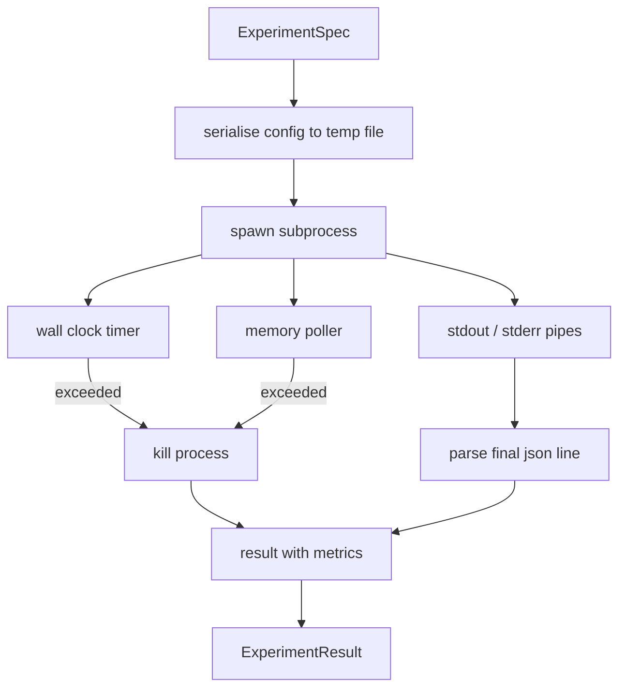

# 实验运行器

> 一个循环是否诚实，取决于它的测量是否可信。把这个 runner 搭出来：它接收一个 spec，在沙箱化的子进程里执行，并输出一份 evaluator 可以信任的 json metrics blob。

**Type:** 构建
**Languages:** Python
**Prerequisites:** 第 19 阶段 Track A 的第 20 到 29 课
**Time:** 约 90 分钟

## 学习目标
- 把一个实验编码成带类型的 spec，并能由 runner 序列化后传给子进程。
- 启动一个带硬 wall clock timeout 和软 memory cap 的子进程，并把这两者都作为明确的 terminal condition 上报。
- 把 stdout、stderr 与结构化 metrics blob 统一捕获进一条结果记录。
- 构建一个 ablation table，在固定 base spec 上一次只扫描一个配置旋钮。
- 保证给定 seed 时结果完全可复现，这样 evaluator 在多次运行里看到的是同一组数字。

## 为什么要用子进程

研究循环跑的是不可信代码。假设来自采样器，实验脚本也来自同一条链路；如果把其中任何一个当作“进程内安全”的代码来跑，本质上是在邀请一次崩溃直接把 orchestrator 一起带走。子进程是语言自带的最简单隔离层：独立进程、独立地址空间、父进程侧还能掌握 signal handle。

这里的 runner 并没有实现完整沙箱。没有 cgroup、没有 seccomp filter、没有 namespace remapping。它提供的是 wall clock timeout、一个轮询内存增长的 poller，以及在任一限制触发时 kill 进程的路径。这就是更复杂沙箱都会在其上扩展的运行时合同。课程把合同缩到一个人一坐就能读完的大小。

## 实验规格结构

```text
ExperimentSpec
  spec_id        : str            (stable id, "exp_001")
  hypothesis_id  : int            (link back to the queue from lesson 50)
  script_path    : str            (path to the python script to run)
  config         : dict           (passed to the script as one json arg)
  seed           : int            (deterministic seed for the experiment)
  wall_timeout_s : float          (hard timeout, killed on exceed)
  memory_cap_mb  : int            (soft cap, polled; killed on exceed)
  metric_keys    : list[str]      (which fields the evaluator will read)
```

脚本存放在磁盘上；runner 会把 config 写入一个临时文件路径，供脚本读取。脚本预期在 stdout 上打印一行单独的 json，其键必须覆盖 `metric_keys`。stdout 中的其他内容也会被捕获，但会被 metrics parser 忽略。

```figure
cg-runner-limits
```

## 架构



runner 是一个类，只有一个主方法。poller 是一个小线程，每隔一个 poll interval 唤醒一次，在平台支持时通过 proc filesystem 读取子进程的 `psutil` 等价信息；如果平台不暴露该能力，就退化为 no-op。

## 为什么是软内存上限

硬内存上限通常需要 `resource.setrlimit`，而且只在 POSIX 上工作。这门课提供的是一个可移植做法：从平台轮询 resident set size，如果超过上限就 kill 子进程。之所以叫“软上限”，是因为 poller 有非零间隔；一个进程可能在两次轮询间冲到上限以上又掉回来。runner 会记录最大观测 RSS，让 evaluator 看见这次运行到底离限制有多近。

在不支持进程检查的系统上，poller 会打一条一次性 warning，然后关闭自己。wall clock timeout 仍然生效。课程测试覆盖了这两种路径。

## 捕获 stdout 与 stderr

runner 会在进程结束后把两条 pipe 全部读空。stdout 会逐行扫描；最后一行如果能被解析为 json，且包含全部所需的 `metric_keys`，就被视为 metrics blob。更早出现的 json 行会作为 `intermediate_metrics` 存在结果里，evaluator 可以拿来画 learning curve。

runner 遇到非零 exit code 时不会抛异常；它只会把 code 记录进结果。任何非零退出都会被标记为 `"crash"`，即便脚本打印出了 metrics，evaluator 默认也会把这种部分运行视为失败。

## Ablation 表

```python
def ablate(base: ExperimentSpec, knob: str, values: list[Any]) -> list[ExperimentSpec]:
    ...
```

给定一个 base spec 和一个 knob 名称，这个 helper 会为每个值返回一个 spec，并覆写 `config[knob]`。每个 spec 都会得到一个派生的 `spec_id`（`f"{base.spec_id}_{knob}_{value}"`）。runner 还会提供一个 `AblationRunner`，按顺序执行这些 spec，并返回一个按 knob value 建索引的 `AblationTable`。

为什么是一次只扫一个 knob。因为 full factorial sweep 会指数爆炸，还会生成 evaluator 很难解释的结果。一次一个 knob 会形成 evaluator 能直接画图的单轴。课程只支持多 knob sweep 通过重复的单 knob ablation 由调用方自己组合。

## 确定性

每个 spec 都自带一个 seed。runner 会通过 config dict 把 seed 传给脚本（`config["__seed"] = spec.seed`）。`code/experiments/` 里的 mock experiment scripts 都会遵守这个 seed，因此多次运行能得到相同 metrics。第五十三课里的 evaluator 依赖这个性质；如果没有确定性，“regression” 也许只是一次不同的随机初始化。

## Mock 实验脚本

这门课附带一个实验脚本：`code/experiments/sparsity_experiment.py`。它是一个真实脚本，会读取 config file，模拟一次小型训练运行，然后打印一个 json metrics blob。脚本支持 `sleep_s` knob 用来测试 timeout，也支持 `allocate_mb` knob 用来测试 memory poller。

这个模拟并没有训练任何真实模型。它只是一个数值计算，用来模仿训练循环的形状：loss curve、final perplexity、wall time。课程重点是 runner，而不是模拟本身。真正的实验脚本在这里会去 import 模型。

## 结果结构

```text
ExperimentResult
  spec_id              : str
  hypothesis_id        : int
  exit_code            : int
  terminal             : "ok" | "timeout" | "oom" | "crash"
  wall_time_s          : float
  peak_rss_mb          : float | None
  metrics              : dict
  intermediate_metrics : list[dict]
  stdout_tail          : str
  stderr_tail          : str
```

evaluator 首先读的是 `metrics` 与 `terminal`。如果 terminal 不是 `"ok"`，实验就会被视为失败运行，evaluator 的 verdict 会直接走失败分支。否则，metrics 才会继续送入 significance test。

## 如何阅读代码

`code/main.py` 定义了 `ExperimentSpec`、`ExperimentResult`、`ExperimentRunner`、`AblationRunner` 以及一个 deterministic demo。subprocess management 集中在一个类里。memory poller 是一个小线程。ablation helper 是一个独立函数。

`code/experiments/sparsity_experiment.py` 是测试里使用的 mock experiment。它从 argv 读取 config file path，并在完成时输出一行 json metrics。

`code/tests/test_runner.py` 覆盖 success path、timeout path、crash path、ablation table，以及两次运行间的 determinism check。

## 它在整条链路里的位置

第五十课生成 hypothesis。第五十一课过滤掉文献已经解决的问题。第五十二课为剩下的假设运行实验。第五十三课读取结果、执行 significance test，并写出 orchestrator 会挂到 hypothesis id 上的 verdict。
