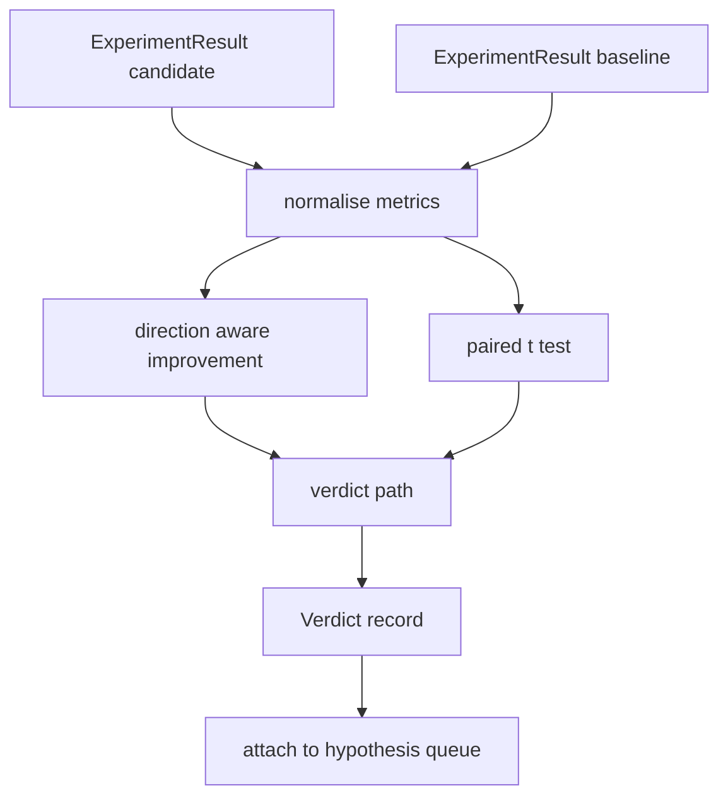

# 结果评估器

> runner 已经产出了一组数字。evaluator 的职责是判断这些数字到底意味着改进、退化，还是只是噪音。把这条 verdict path 搭出来，把 metrics 变成一句明确结论。

**Type:** 构建
**Languages:** Python
**Prerequisites:** 第 19 阶段 Track A 的第 20 到 29 课
**Time:** 约 90 分钟

## 学习目标
- 用方向感知的 improvement 规则和固定阈值，把 candidate run 与 baseline 做比较。
- 从零实现 paired t test，并读出对应的 p value。
- 对 log scaled metrics 做归一化，这样下游报告可以把它们与 linear metrics 混合展示。
- 为每个 hypothesis 发出一个 verdict，让 orchestrator 能把它附到第五十课里的队列上。
- 保持每一步都是 pure function，这样相同输入总会得到相同 verdict。

## 为什么要做配对检验

runner 给你的单个数字，并不足以说明变化是真的。相同配置换一个 seed，perplexity 也会不同。变化也许只是噪音。正确比较方式是成对比较：用相同 seeds、相同数据，一次跑 candidate，一次跑 baseline。每个 seed 都贡献一个差值。差值的平均值就是 effect，差值的 standard error 则是 noise floor。

这门课从零实现这个检验。没有 `scipy.stats`。数学规模小到一屏可以读完。

```text
diffs    = [a_i - b_i for i in seeds]
mean     = sum(diffs) / n
variance = sum((d - mean) ** 2 for d in diffs) / (n - 1)
t_stat   = mean / sqrt(variance / n)
df       = n - 1
p_value  = two_sided_p(t_stat, df)
```

two sided p value 使用 regularised incomplete beta function。课程附带一个基于 Lentz continued fraction 的小实现。整套逻辑大约就是 60 行 stdlib math。

## 方向感知的改进判断

有些指标越高越好，比如 accuracy、throughput。另一些指标越低越好，比如 loss、perplexity、wall time。evaluator 会在每个 metric 上带一个 `direction` 字段。

```text
if direction == "higher_is_better":
    improvement = (candidate - baseline) / abs(baseline)
elif direction == "lower_is_better":
    improvement = (baseline - candidate) / abs(baseline)
```

improvement 是带符号的。在 higher-is-better metric 上出现负 improvement，意味着 candidate 更差。verdict path 会同时读取它的符号和幅度。

一个固定阈值（`improvement_threshold=0.02`，也就是 2%）决定变化是否大到值得下判断。低于这个阈值时，不管 p value 如何，verdict 都是 “noise”；循环并不关心用户根本测不出来的变化。

```figure
cg-paired-verdict
```

## 架构



evaluator 会做三个彼此独立的计算，再在 verdict path 中汇合。每个计算都应当是没有共享状态的 pure function。

## 对数归一化

perplexity 是 loss 的指数形式。loss 降 0.1，往往意味着 perplexity 会有更大变化。直接比较 perplexity 没问题，但若要把它与 linear metrics 混合进一份统一报告，就需要做归一化。

课程会对任何 `scale` 字段为 `"log"` 的 metric，在计算 improvement 前先取自然对数。阈值也在 log space 中应用。perplexity 从 32 降到 28，在 lower-is-better metric 上对应 `log(28) - log(32) = -0.133`，明显超过 2% 的阈值。

```text
if scale == "log":
    a = log(candidate)
    b = log(baseline)
else:
    a = candidate
    b = baseline
```

而 `scale="linear"` 的 metrics 则跳过变换。两者走同一条代码路径。

## 按 seed 配对检验

第五十二课里的 runner 每次只会产出一个最终 metrics blob。要做 paired test，evaluator 需要 candidate 的每-seed 结果列表，以及 baseline 的每-seed 结果列表。orchestrator 会在两个配置下用同一组 seeds 重复运行实验，然后把两组 `ExperimentResult` records 交给 evaluator。

evaluator 会按 seed 做配对，seed 存在 `result.metrics["seed"]` 里，然后读取所请求的 metric。如果两边的 seeds 对不上，evaluator 就抛出一个 `PairingError`。这时 orchestrator 应该重跑。

## 结论结构

```text
Verdict
  hypothesis_id          : int
  metric                 : str
  direction              : "higher_is_better" | "lower_is_better"
  scale                  : "linear" | "log"
  candidate_mean         : float
  baseline_mean          : float
  improvement            : float       (signed, fraction; see direction rules)
  p_value                : float | None  (None if n < 2)
  significance_threshold : float
  improvement_threshold  : float
  verdict                : "improved" | "regressed" | "noise" | "failed"
  rationale              : str
```

verdict path 是一张很小的 decision table：

```text
1. If any candidate result has terminal != "ok": verdict = "failed"
2. else if |improvement| < improvement_threshold:  verdict = "noise"
3. else if p_value is None or p_value > significance: verdict = "noise"
4. else if improvement > 0:                          verdict = "improved"
5. else:                                             verdict = "regressed"
```

rationale 是一条单行、可供人类阅读的句子，orchestrator 可以把它记录到 hypothesis id 上。

## 如何阅读代码

`code/main.py` 定义了 `MetricSpec`、`Verdict`、`Evaluator`，以及 t statistic 和 incomplete beta helpers。t test 完全用 stdlib math 实现；numpy 只用于读取 metrics list 并计算 mean 和 variance。

`code/tests/test_evaluator.py` 覆盖 improved path、regressed path、noise path（小 improvement）、noise path（低 n）、failed terminal path、log normalised path、对已知参考值的 t test，以及 pairing error。

## 它在整条链路里的位置

第五十课生成 hypothesis queue。第五十一课过滤掉已被文献解决的问题。第五十二课在多个 seeds 下分别运行 candidate 和 baseline 配置。第五十三课读取这些运行结果并写出 verdict。orchestrator 会把四课串起来：

```text
for hypothesis in queue:
    literature = retrieval.search(hypothesis.text)
    if literature_settles(hypothesis, literature):
        attach(hypothesis, verdict="settled")
        continue
    candidates = runner.run_all(specs_for(hypothesis))
    baselines  = runner.run_all(baseline_specs_for(hypothesis))
    metric_spec = MetricSpec("perplexity", direction=LOWER, scale=LOG)
    verdict = evaluator.evaluate(hypothesis.id, metric_spec, candidates, baselines)
    attach(hypothesis, verdict)
```

这个 orchestrator 不在本课里；但四门课通过各自定义的 dataclasses，可以无缝拼成它。
