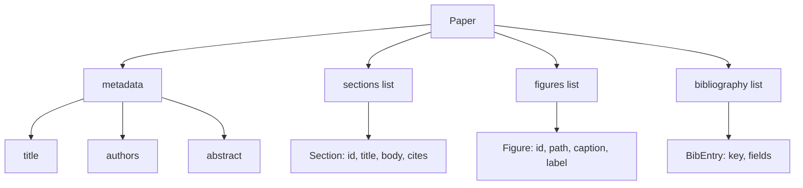
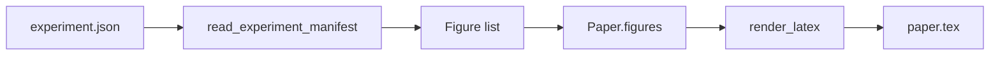
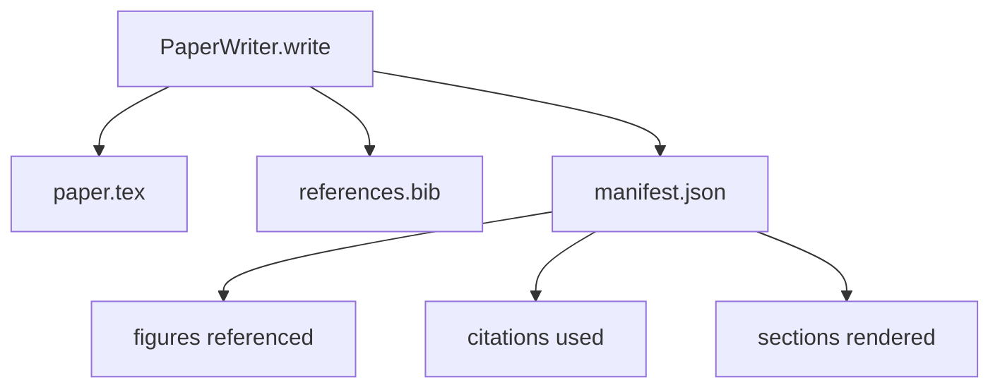

# 论文写作器

> 一个 LaTeX 骨架是研究者与排版系统之间的合同。如果合同被破坏，文档就无法编译，而且失败会非常直接。先把骨架搭出来，再往里填内容。

**Type:** 构建
**Languages:** Python
**Prerequisites:** 第 19 阶段第 50 到 53 课
**Time:** 约 90 分钟

## 学习目标

- 把研究论文视为一个拥有已知章节图的结构化产物，而不是自由形式文档。
- 在任何正文生成之前，先生成声明 abstract、sections、figure slots、bibliography keys 的 LaTeX 骨架。
- 通过确定性的 slot 机制，把实验输出中的 figures（paths 与 captions）注入骨架。
- 接上一套 mocked prose generator，根据结构化 outline 填充每一节，从而在无模型条件下测试 harness。
- 输出一个 `paper.tex`、一个 `references.bib`，以及一个列出所有被引用 figures 与 citations 的 manifest。

```figure
ch-paper-skeleton
```

## 为什么先搭骨架

一个从 prose 开始长出来的草稿，会不断积累结构债。Introduction 里会长出三段本该属于 related work 的内容。某张 figure 会先被引用，后面才被定义。bibliography 最终会给同一篇论文造出三个不同 key。等作者意识到时，重写成本已经高于写作成本。

骨架会把这个关系反过来。结构先作为数据声明。sections 是带名字和顺序的 slots。figures 是带 ids 与 captions 的 slots。bibliography keys 在顶部声明，并指出它们对应的 entries。prose 逐节填进这些 slots。这样一来，在一句 prose 都还没写之前，harness 就可以验证：每一张 figure 都有 slot，每一个 citation 都有 entry，每一节都会出现在目录中。

这和前面课程里对 plans、tool calls、traces 的处理是一致的。结构本身就是合同。

## 论文结构



每个字段都只是普通 Python 数据。renderer 是一个从 `Paper` 到 LaTeX 字符串的纯函数。harness 在 render 之前就能检查 paper：统计 sections、列出丢失的图像文件、验证每一个 `\cite{key}` 都有对应的 `BibEntry`。

## 渲染合同

renderer 保证三件事。第一，骨架中的每一个 figure slot 都会输出一个 `\begin{figure}` block，并带一个稳定标签 `fig:<id>`。第二，每一个 section 都会输出一个 `\section{}`，并带稳定标签 `sec:<id>`，这样 cross-reference 才能工作。第三，bibliography 会输出一个 `\bibliography` block，而 `references.bib` 里只包含 paper 上声明过的条目，不多也不少。

违反其中任一条都算 render error，而不是 warning。骨架就是合同；静默丢掉一张 figure 属于合同违约。

## 从实验结果注入图像

本 track 之前的课程会把 experiment outputs 写成 JSON manifests。每个 manifest 都带一组 artifacts，包括 path 与简短 caption。paper writer 会读这个 manifest，并生成 `Figure` records。



注入过程是确定性的。figure ids 来自 experiment name 加一个 monotonic counter。captions 来自 manifest。paths 会被归一化到 paper output directory 下，因此即便 experiment outputs 在磁盘上的其他位置，LaTeX 也能编译。

## 模拟正文生成器（Mock Prose Generator）

这门课并不会真的调用模型。`MockProseGenerator` 会读取一种提纲结构，然后确定性地产生正文。这份提纲对每一节只给一个短字符串。生成器会把这个字符串扩成两小段，并把章节标题自然织入其中。若提纲声明了 figures 和 citations，生成出的正文也会在相应位置准确提到它们。

这已经足够测试 writer 的全部行为。真正的实现只需要把生成器替换成模型调用即可，外围 harness 完全不用改。这正是把正文生成器抽象成可调用对象的价值：测试时替换成确定性的版本，生产时替换成模型版本，剩余流水线保持不变。

## 清单输出（Manifest）

writer 会向输出目录写出三个文件。



清单文件才是下游 evaluator 或 critic loop 要读取的内容。它们不会解析 LaTeX，而是直接读取清单。下一课的 critic loop 也会以这份清单作为输入，然后输出反馈列表。所以清单是合同的一部分，而 LaTeX 不是。

## 校验闸门

writer 在写出任何文件之前，会先过四道 gate。

1. 每个 figure id 在 paper 内必须唯一。
2. 每个 section 的 `cites` 字段都必须引用一个已在 paper 上声明的 bibliography key。
3. abstract 不能为空。
4. title 不能为空。

任一 gate 失败都要抛出 `PaperValidationError`，并包含精确原因。harness 会把这个原因作为 failure mode 直接暴露。没有 partial write：要么三个文件全写出，要么一个都不写。

## 如何阅读代码

`code/main.py` 定义了 `Paper`、`Section`、`Figure`、`BibEntry`、`PaperValidationError`、`MockProseGenerator`、`PaperWriter`，以及 `render_latex` 函数。`write` 方法接收一个 output directory，并输出 `paper.tex`、`references.bib`、`manifest.json`。`read_experiment_manifest` helper 会把一组 experiment manifests 转成 `Figure` records。

`code/tests/test_paper_writer.py` 覆盖：无 section 的骨架渲染、带两节两图的完整渲染、missing-citation gate、duplicate-figure-id gate、manifest content，以及 LaTeX-string contract（每个 section 都会输出一个 `\section{}`，每张 figure 都会输出一个 `\begin{figure}`）。

## 进一步扩展

真实实现通常还会要两个扩展。第一，多格式渲染：同一个 `Paper` shape 既能编译成 Markdown 供博客使用，也能编译成 HTML 做预览，这时 renderer 会变成 `Paper` 上的一种 strategy。第二，citation enrichment：writer 能在本地 DOI cache 的基础上，根据 citation key 自动拉取 BibTeX entries。这两点都很有价值，而且都不需要修改骨架合同。

骨架才是这个设计真正下注的地方。sections、figures、citations 作为数据先声明，prose 再被填进 slots，manifest 与 LaTeX 一起输出。之后的一切增强，都可以直接叠在这层合同之上。
