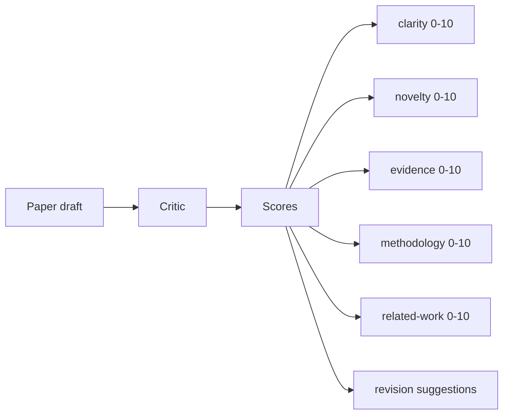
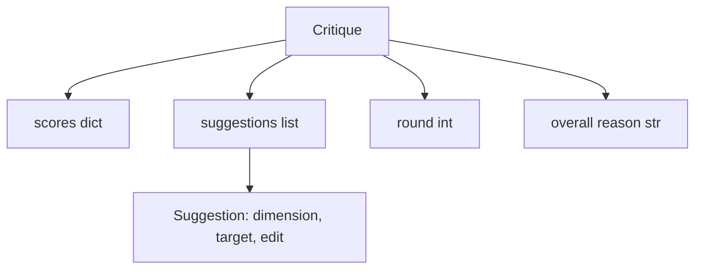
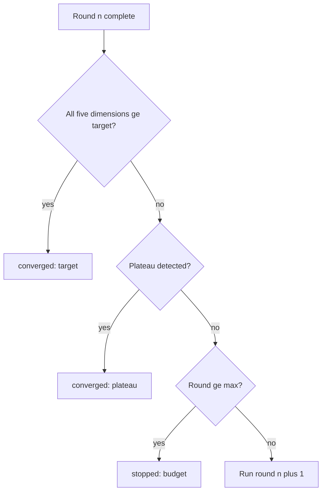
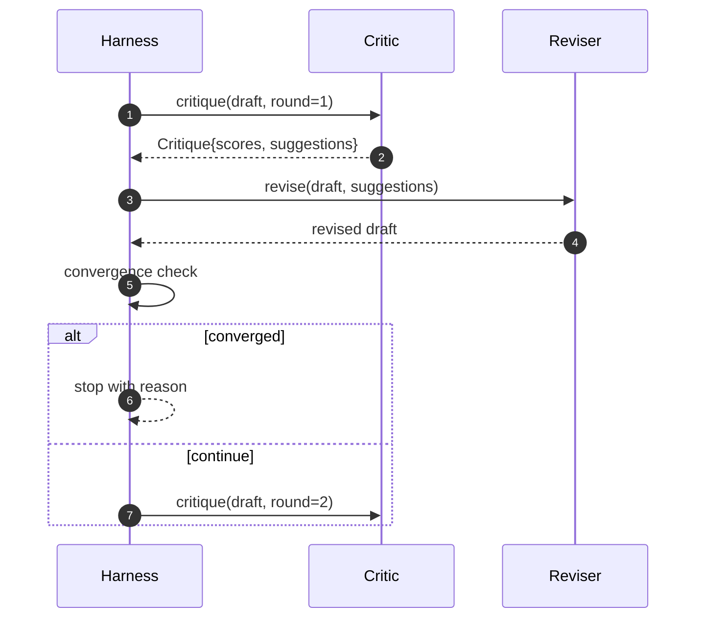

# 批评器循环

> 一个第一次就返回 “looks good” 的 critic 是坏的。一个永远只会返回 “needs work” 的 critic 也是坏的。真正有意思的批评器，是那个会收敛的批评器，而你必须亲手把这种收敛性工程化出来。

**Type:** 构建
**Languages:** Python
**Prerequisites:** 第 19 阶段第 50 到 53 课
**Time:** 约 90 分钟

## 学习目标

- 从五个固定维度给 paper draft 打分：clarity、novelty、evidence、methodology、related-work。
- 把每一轮 critique 应用为结构化 revision diff，而不是自由散文式重写。
- 通过比较多轮分数来检测 convergence；在 plateau、目标达成或预算耗尽时停止。
- 用 max-iteration budget 给轮数加上硬上限，避免一个不收敛的 critic 永远跑下去。
- 为每一轮输出 trace，让 dashboard 或下游阶段能渲染分数轨迹。

```figure
ch-critic-converge
```

## 为什么固定为五个维度

一个 freeform critic，本质上只是返回一段建议文字的模型。下一轮 revision 把这段文字当作环境上下文继续处理。最终这次重写到底有没有真正回应批评，是无法验证的，因为批评本身从来没有结构。

五个维度给 harness 建立了一份合同。



score 是一个向量。harness 会在多轮里跟踪每一个维度。某次 revision 也许提升了 clarity，但同时把 evidence 拉低了，这在 evidence 维度上就是一次 regression，而 convergence check 能看见它。纯模型式 critic 无法给出这种保证。

## 批评结构



每个 suggestion 都带上它要提升的维度、它指向的 section，以及 reviser 可以执行的 `edit` 指令。reviser 也是一个 callable。这门课附带的是确定性 reviser，它会把 edit 指令解释成 append-to-section 操作。一个模型驱动的 reviser 会把相同字段当作 prompt 来理解。合同本身不变。

## 收敛规则，按优先级排序

批评器循环会在以下三个条件中的任意一个触发时终止。



target 是最严格的情况：五个维度中的每一个，clarity、novelty、evidence、methodology、related_work，都必须在返回成功前达到 `>= target_score`（默认 `8.0`）。高平均分但某个单维度偏弱，不算成功。plateau detection 会比较当前轮 mean 与上一轮 mean；如果 improvement 连续两轮都低于 `plateau_epsilon`（默认 `0.1`），循环就以 `plateau` 退出。budget 则是轮数硬上限（默认 `5`），退出原因是 `budget`。

顺序很重要。target 的优先级高于 plateau，plateau 又高于 budget。如果第三轮刚好达成 target，同时也满足 plateau 条件，结果必须是 `target`，而不是 `plateau`。

## 为什么 plateau 检测要看连续两轮

一轮 plateau 只是噪音。即便是固定 draft，一个真实 critic 每轮也可能给出略有不同的分数，因为确定性 scoring 仍然取决于哪些 suggestions 被应用，以及应用顺序。要求连续两轮 plateau，正是为了把这类噪音滤掉。如果 harness 最终报告 plateau，那就说明 draft 的确已经停止改善。

## 本课中的确定性批评器

这门课不会调用模型。附带的 critic 是一个 callable，它依据三个信号给 draft 打分：平均 section body 长度（clarity）、figure count 与 citation count（evidence），以及 paper metadata 上的 `originality_tag`（novelty）。reviser 则知道如何把每个分数往上推。

```text
clarity      grows when the average section body length increases
novelty      grows when originality_tag is set to "high"
evidence     grows when a section's figure_refs is non-empty
methodology  grows when a section titled "Method" exists with body
related-work grows when a section titled "Related Work" exists with body
```

reviser 会把每条 suggestion 解释成一次定向追加。第一轮之后，harness 就能观察到分数开始上升。tests 正是利用这个性质来断言循环在缩小 gap。

## 完整循环合同



harness 拥有 round counter、trace 与 convergence check。critic 拥有 score。reviser 拥有 diff。三者都不应该触碰彼此的状态。

## 轨迹输出

每一轮都会发出一个 trace event，内容包括 round number、score vector、suggestion count，以及 convergence verdict。完整 trace 会和 final draft 一起返回。下游 dashboard 可以据此画出 score-per-round 图表。下一课 iteration scheduler 会读取这份 trace，决定这条 branch 是否值得保留。

## 防止坏批评器失控的预算

一个给出 suggestions 却永远无法提升分数的 critic，会把循环锁死在 max-iteration ceiling 上。trace 会把这件事暴露得很清楚：五轮、分数不动、verdict=`budget`。用户应该把这解读为 critic 的 bug，而不是 draft 的 bug。若只暴露 final draft，就会把这个诊断信息完全藏起来。trace-first design 正是为了把它显性化。

## 如何阅读代码

`code/main.py` 定义了 `Critique`、`Suggestion`、`Critic` protocol、`Reviser` protocol、`CriticLoop`，以及 `make_deterministic_critic_pair` factory，它会返回一个确定性 critic 和与之匹配的 reviser。还包含了一个最小版 `Paper` shape，因此本课是自洽的。

`code/tests/test_critic_loop.py` 覆盖：第一轮后的单调改善、在调优 draft 上达成 target convergence、两轮平坦后的 plateau detection、当 suggestions 不能改善分数时的 budget exhaustion、reviser 的 suggestion application，以及 trace shape。

## 进一步扩展

真实实现通常还会想要两个扩展。第一，dimension weights：workshop 论文会把 novelty 的权重看得高于 methodology，而 journal 论文可能反过来；这会让 convergence check 变成 weighted mean。第二，paired critics：一个 critic 打分，另一个 critic 在 reviser 看到 suggestions 之前先做裁决。这两种增强都很有价值，而且都可以直接复用相同的 `Critique` shape。

真正下注的地方是 score vector。一旦 critique 被结构化，之后再加任何改进、convergence rule、dashboard、paired critic，都不需要改变这个 loop 的核心结构。
