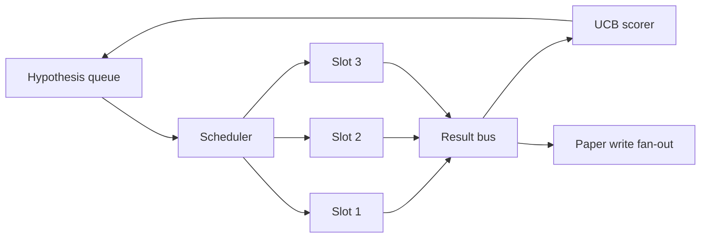
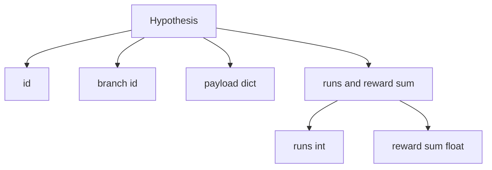
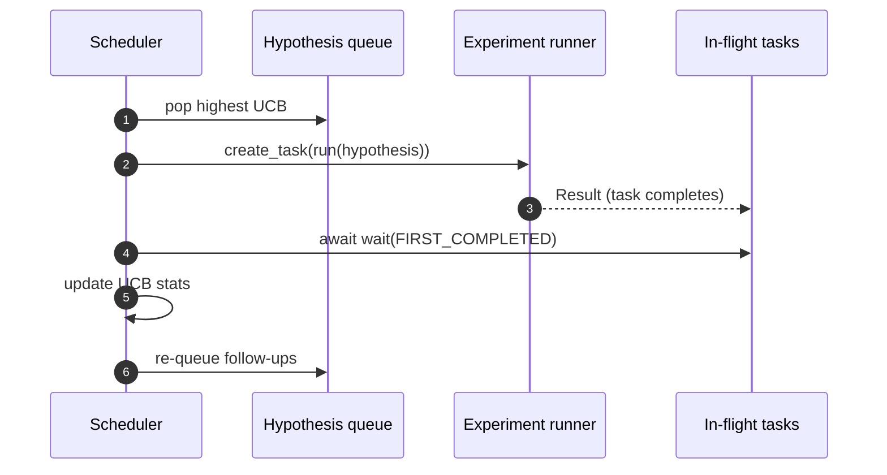

# 迭代调度器

> 没有调度器的研究循环，只是一条自我感觉良好的队列。调度器才是循环决定“该停止探索什么”的地方，而这个决定本身就是整场游戏的核心。

**Type:** 构建
**Languages:** Python
**Prerequisites:** 第 19 阶段第 50 到 53 课
**Time:** 约 90 分钟

## 学习目标

- 把研究工作流建模成一条 hypothesis queue，向多个并行 experiment slots 投喂任务，并让结果再 fan back in。
- 用 asyncio 并发运行多个实验，让调度器始终把所有 slots 填满。
- 用 UCB 给每个 hypothesis branch 打分，使调度器能在不放弃探索的前提下剪掉低收益分支。
- 把完成结果 fan out 到 paper-write stage 与 re-queue stage，让高收益分支继续生成 follow-up hypotheses。
- 输出 per-iteration trace，包含 branch scores、slot occupancy、pruning decisions。

```figure
ch-ucb-scheduler
```

## 为什么需要调度器，而不是工作清单

一个平铺的 worklist 只会按提交顺序跑作业。当每个作业都彼此独立时，这没问题。但研究任务并不独立：实验三的发现，会直接改变实验四和实验五的优先级。真正有价值的调度器必须读取 result fan-in，再动态重排队列，这样每单位算力才能做出更有用的工作。

真正有意思的设计选择在于 scoring rule。greedy scorer 会永远选当前领先者，从而完全停止探索。uniform scorer 则永远不利用已有发现。UCB（upper confidence bound）正好走中间路线：一边利用当前领先分支，一边给试得还不够多的分支保留探索机会。

## 系统结构



queue 里保存 hypotheses。当某个 slot 空出来时，scheduler 会挑出 UCB 最高的 hypothesis。每个 slot 都异步运行一个 experiment。完成的 experiment 会把结果推回 bus。bus 会更新该 branch 的 UCB 统计数据，并在分支收益越过阈值时，把事件 fan out 到 paper-write stage。

## 假设结构



`branch` 是 UCB 统计的关键键。多个 hypotheses 可以共享同一个 branch，branch 代表研究方向，而 hypothesis 只是这个方向里的一次具体试验。`runs` 是该 branch 完成的实验数，`reward_sum` 是累积 reward。UCB 需要同时读取这两项。

## UCB 打分

本课使用的 UCB 公式是经典 UCB1。

```text
ucb(branch) = mean_reward(branch) + c * sqrt( ln(total_runs) / runs(branch) )
```

`total_runs` 是所有 branches 上已完成实验的总数。`c` 是 exploration weight；本课默认是 `sqrt(2)`。一个从未运行过的 branch 会得到 `+inf`，因此未尝试分支总是最先被调度。高 mean reward 的 branch 会一直维持较高得分，直到其他分支追上；而一个跑了很多次却收益不高的分支，则会被尝试更少的分支逐步压过去。

pruning gate 和 picker 是分离的。当某条 branch 的 mean reward 低于绝对下限（默认 `0.2`），且已经至少完成 `prune_after_runs` 次试验（默认 `3`）后，它就会被从未来调度中移除。这样可以把 queue 规模维持在可控范围内。

## 用 asyncio 实现并行 slots

scheduler 用 `asyncio.create_task` 驱动实验。每个 task 都执行 experiment runner，这个 runner 是一个 `async def` callable，返回 `Result`。主循环会对 in-flight tasks 执行 `asyncio.wait(..., return_when=asyncio.FIRST_COMPLETED)`，并在每次 task 完成时更新分数。



三个 slots 会并发运行。主循环永远不会因为某一个实验而整段阻塞。scheduler 会在 slot 一释放出来时就立刻补进新任务，直到 queue 已空且没有任何 in-flight tasks。

## 扇出：论文触发器

当某条 branch 的 mean reward 超过 `paper_threshold`（默认 `0.7`），且该 branch 还没有产出过论文时，scheduler 就会向输出列表发出一个 `paper.trigger` 事件。下游第五十四课的 paper writer 会接收它。本课里这个 trigger 只被存成一个列表，方便 tests 断言。

## 扇出：后续假设

当一个高收益结果落地时，scheduler 可以调用用户提供的 `expander`，在同一 branch 上生成一个或多个 follow-up hypotheses。expander 是一个从 `Result` 到 `list[Hypothesis]` 的 pure function。本课附带一个确定性 expander：只要 reward 超过 paper threshold，它就会生成两个 follow-ups。

## 预算

两个预算保护 scheduler 不会跑成失控循环。

```text
max_experiments    : total count of experiments run across all branches
max_seconds        : wall-clock cap (asyncio time)
```

一旦任何一个预算触发，scheduler 会停止调度新任务，等待已在飞行中的 tasks 完成，然后返回最终 trace。trace 中会包含 `stop_reason`。

## 轨迹与最终报告

每一次调度决策，无论是 pick、dispatch、result、prune 还是 fan-out，都会发出一个 event。最终报告会汇总 per-branch stats、total runs、total wall-clock，以及所有触发过的 paper triggers。下一个 end-to-end demo lesson 会读取这份报告来驱动 paper writer。

## 如何阅读代码

`code/main.py` 定义了 `Hypothesis`、`Result`、`BranchStats`、`IterationScheduler`，以及 `make_deterministic_runner` factory，它会返回一个 reward 可预测的 asyncio experiment runner。这个 runner 会固定 sleep 一小段 `delay_ms`（默认 `5ms`），从而让并发性在测试里可见。

`code/tests/test_scheduler.py` 覆盖：UCB 优先挑选未试过的分支、parallel slot occupancy、越过阈值时的 paper triggers、低收益分支在多轮后被 prune、fan-out 生成 follow-up hypotheses，以及两类 budget exit（实验总数与 wall clock）。

## 进一步扩展

真实实现通常还需要三个扩展。第一，跨会话持久化 UCB 统计：当前统计只保存在内存中，而真正的 scheduler 应该 checkpoint 它们，使重启不会丢掉已经花出去的探索预算。第二，多目标评分：结果不再是标量 reward，而是向量，UCB 会演变成 Pareto 风格的 picker。第三，contextual bandits：picker 会根据 hypothesis features（例如长度、复杂度）做条件选择，让相似 hypotheses 共享探索经验。

scheduler 正是研究流程不再只是 worklist 的地方。一旦 UCB 接上、slots 并发跑起来，其他一切改进都可以直接叠在这个骨架上。
