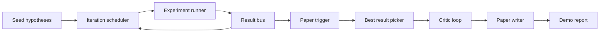
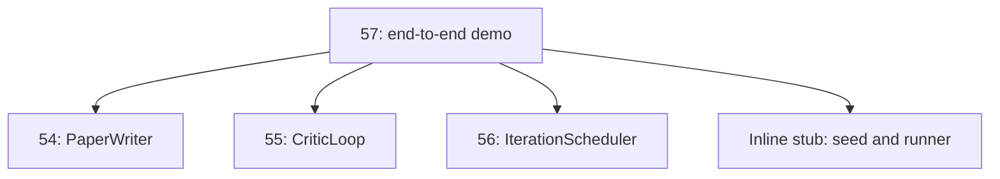
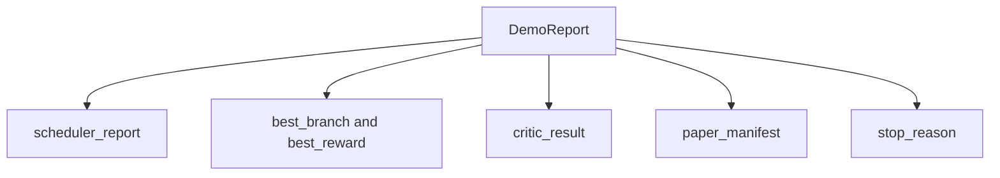

# 端到端研究演示

> Demo 是前面写下的每一份 contract 真正开始组合的地方。只要其中任何一份有泄漏，最先把问题抓出来的，往往就是这节 Demo 课。

**Type:** 构建
**Languages:** Python
**Prerequisites:** 第 19 阶段第 50 到 53 课
**Time:** 约 90 分钟

## 学习目标

- 把自动研究循环完整串起来：hypothesis seed、experiment runner、scheduler、critic loop、paper writer。
- 通过普通 Python imports 组合前面四节 Track D 课程中的 primitives，而不是引入框架。
- 让整个循环跑到一个会自行终止的结束状态，并输出一份单独的 demo report，列出每个阶段的产物。
- 保持 demo 的确定性，使测试套件能够断言最终输出形状。
- 当任一阶段的 contract 断裂时，暴露清晰的 failure mode，避免下一阶段在坏输入上继续运行。

```figure
ch-research-pipeline
```

## 这里会组合什么



一共五个阶段。seed 是一个包含三个 hypotheses 的列表。scheduler 会在它们上面运行六次实验，并提供三个并行 slots。bus 会报告一个或多个 paper triggers。picker 会从中挑出单个最佳结果。critic loop 会围绕这个结果生成的草稿继续迭代。最后，paper writer 会输出最终的 LaTeX、BibTeX 和 manifest。

## 为什么用 import，而不是 copy

前面每一课都交付了一个 `main.py`，里面包含公开 dataclasses 和 functions。这个 demo 通过把每一课的父目录加入 `sys.path` 来 import 它们。这不是框架级 wiring；它和前面课程测试文件已经在使用的 import 方式完全一样。



这里的 inline stub 代替了第 50 到 53 课：一个很小的 seed hypotheses 生成器，加上一个同步 reward function。用户只需要改两条 import，就可以把这个 inline stub 换成那些课程里的真实 primitives。

## 确定性保证

这个 demo 从构造上就是确定性的。experiment runner 使用带种子的 numpy。critic loop 的 reviser 会按固定顺序遍历固定维度。paper writer 的 prose generator 使用的是第 54 课里的 mocked 版本。scheduler 的 UCB picker 在并列时按迭代顺序打破平局，而不是随机选择。

在相同 seed 下，demo 会输出完全相同的 report。测试通过把 demo 连续运行两次并比较 manifest，来钉住这一性质。

## Demo 报告的结构



每个字段都原样来自上游阶段。demo 不会改写任何输出；它只是把这些输出组合起来。而这正是这个 demo 想验证的东西。

## 失败模式处理

每个阶段要么成功，要么抛出一种 typed error。

```text
Scheduler ........ returns SchedulerReport with stop_reason
                   in {queue_empty, max_experiments, deadline}
Best-result pick . raises NoTriggerError if no paper trigger fired
Critic loop ...... returns LoopResult with status converged or stopped
Paper writer ..... raises PaperValidationError on contract break
```

任何一个阶段失败，demo 都会以 typed exception 直接短路。测试把这个 contract 固定住了：`test_no_triggers_raises_typed_error` 和 `test_best_picker_raises_when_no_triggers` 会断言，当没有任何 branch 触发 trigger 时，picker 必须抛出 `NoTriggerError` / `BestResultError`，而 writer 永远不会被调用。

## 最佳结果选择器

scheduler 会按 branch 发出 paper triggers。picker 会选择 mean reward 最高的 branch。若分数并列，则按 branch id 的字母顺序打破平局，以保证 demo 仍然是确定性的。picker 本身是一个很小的纯函数；测试会用固定的 scheduler report 把它钉住。

## 给批评器循环接线

第 55 课里的 critic loop 工作在 `MiniPaper` 上。demo 会根据选中的 branch 构造一个 `MiniPaper`：把 branch id 写进 abstract，预先放入两个 section，也就是 Introduction 和 Results，并依据该 branch 的 mean reward 设置 `originality_tag`。规则是：如果 `>= 0.8` 就是 high；如果 `>= 0.6` 就是 medium；否则就是 low。

接着 reviser 会把这份草稿迭代到收敛，输出再交给 paper writer。

## 给论文写作器接线

第 54 课里的 paper writer 工作在完整的 `Paper` 形状上，包含 figures 和 bibliography。demo 会把收敛后的 `MiniPaper` 通过 `mini_to_full_paper` 升级：为选中的 branch 挂上一张 figure，并基于 critic 建议的 cite keys 并集构造一份很小的 synthetic bibliography。demo 添加的每一个 cite，也都会同步加入 bibliography 列表，因此验证能够通过。

## 如何阅读代码

`code/main.py` 定义了 `BestResultError`、`NoTriggerError`、`DemoReport`、`pick_best_branch`、`build_mini_paper`、`mini_to_full_paper` 和 `run_demo`。文件顶部会一次性调整 `sys.path`，并从相应课程里导入 `PaperWriter`、`CriticLoop` 和 `IterationScheduler`。

`code/tests/test_e2e.py` 覆盖：demo 能端到端跑通，并输出五个字段都已填充的 report；连续两次运行保持确定性；当没有任何 branch 越过阈值时会抛出对应的类型化错误；当 writer 的 contract 断裂时也会直接失败；paper manifest 包含被选中 branch 对应的 figure；以及 scheduler 的 stop reason 属于预期值集合。

## 继续往前做

一旦这个 demo 变绿，有三个扩展值得继续接线。第一，持久化状态：把每个阶段的结果写到一个小型 JSON store 中，让重启可以从中断点继续，而不必重跑便宜阶段。第二，dashboard：把 scheduler 和 critic loop 的 trace events 渲染成一条统一时间线。第三，真实模型调用：把 mocked prose generator 和 deterministic critic 换成 model-driven 版本；而 wiring 本身完全不变。

这个 demo 的工作，就是证明 composition 本身就是 architecture。五节课，四条 import，一份 report。下一次你再加一个阶段，wiring 只会多长一行。
