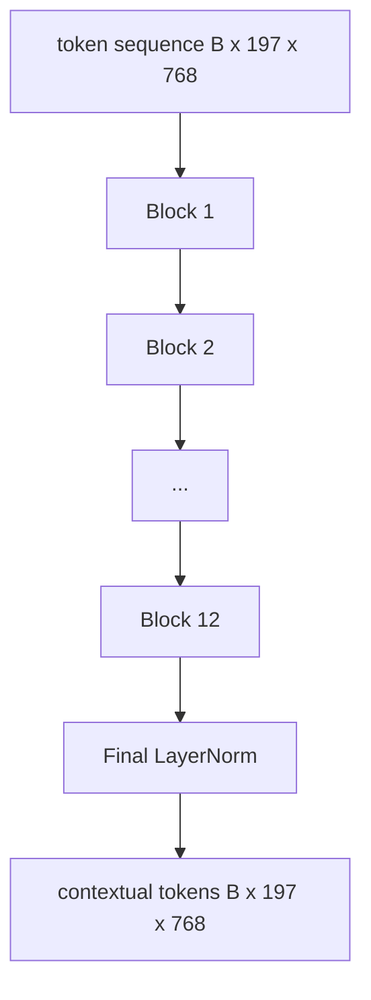
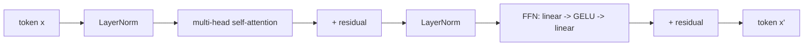

# 视觉 Transformer（Vision Transformer）编码器

> patch 本身不会“看见”任何东西。把 patch tokens 变成带上下文的 tokens，依赖的是一个 12 层、pre-LN、12 个 attention heads 的 transformer；CLS token 则在自己的最终隐藏状态里聚合整张图像的信息。这一课就是现代视觉语言模型的发动机舱。

**Type:** 构建
**Languages:** Python
**Prerequisites:** 第 19 阶段第 30–37 课（Track B 基础课）
**Time:** 约 90 分钟

## 学习目标

- 实现一个带 multi-head self-attention 和 feed-forward sub-layer 的 pre-LN transformer block。
- 堆叠 12 个 blocks，组成一个 ViT-Base 编码器。
- 把第 58 课的 patch front end 接入编码器，并跑通一次 forward pass。
- 验证 CLS token 的确会从每一个 patch 聚合信息。

## 问题

patch embedding 会产出一个长度为 197 的 token 序列，其中每个 token 都只是一个向量，对其他 patches 一无所知。一张猫的图片，需要每一个 patch 知道哪些 patches 包含胡须，哪些包含背景，哪些包含眼睛。真正建立这种感知的机制，就是 transformer，它会一层一层地把上下文织进序列里。没有它，patch front end 只是一个聪明的 tokenizer，并不真正理解图像。

标准配方是 12 个 block 的深度、12 个 head 的宽度、pre-LayerNorm 放置、GELU 激活，以及 4x 的 feed-forward expansion。这个配方构成了 CLIP ViT-L、SigLIP、DINOv2、Qwen-VL 系列、InternVL，以及 2025-2026 年几乎所有开源视觉编码器的脊梁。它已经稳定到一种程度：只要论文没有明确声明别的设计，你通常就可以默认它在使用这个 block 形状。

## 概念





### Pre-LN 和 post-LN

原始 Transformer 把 LayerNorm 放在 residual 之后。Pre-LN，也就是在每个 sub-layer 之前先做 LayerNorm，才是现代视觉语言模型广泛使用的版本，因为它训练更稳定，不需要依赖学习率 warm-up 小技巧。前向实现上只差一行代码，但到了 12 层以上，梯度流的质量差异会非常明显。

### Multi-head self-attention

每个 head 都会把 token 向量投影成自己的 `(query, key, value)` 三元组，其中 `head_dim = hidden / num_heads`。当 `hidden = 768` 且 `heads = 12` 时，每个 head 的维度是 `dim = 64`。12 个 heads 会并行执行 attention，然后把输出拼回 768 维，并通过输出投影。多头的意义在于：一个 head 可以学会“关注猫眼睛”，另一个可以学会“关注背景梯度”，彼此之间不互相干扰。

### 为什么是 4x feed-forward expansion

FFN 的形状是 `hidden -> 4 * hidden -> hidden`，中间使用 GELU。这个 4 倍系数是经验上收敛出来的，自 2017 年以来几乎一直沿用于语言和视觉 transformer。更小的扩张，比如 2x，通常容易欠拟合；更大的扩张，比如 8x，则更容易在固定数据预算下过拟合。MLP 其实是模型存放大量“事实”的地方，而更宽的中间层，就是这些信息停留的位置。

| 组件 | ViT-Base 规模下的参数量 |
|-----------|------------------------------|
| 单个 block 的 qkv 投影 | `3 * 768 * 768 = 1.77M` |
| 单个 block 的输出投影 | `768 * 768 = 590K` |
| 单个 block 的 FFN（4 倍扩展） | `2 * 768 * 4 * 768 = 4.72M` |
| 单个 block 的 LayerNorm | `4 * 768 = 3K` |
| 单个 block 总计 | 约 7.1M |
| 12 个 block | 约 85M |
| 包含前端 | 总计约 86M |

ViT-Base 是一个 86M 参数量级的编码器。按 2026 年标准，这已经算小模型了，SigLIP-So400M 是 400M，Qwen-VL 的 ViT 是 675M；但除宽度和深度之外，它们在架构上和这里是同一种形状。

### 需要 causal mask 吗？

Vision Transformer 是 encoder-only，而且是双向的：任意 token `i` 都可以 attend 到任意 token `j`。不需要 mask。第 61 课里的 decoder-side cross-attention 会使用 causal mask，但在 vision encoder 内部，attention 是全连接的。

### CLS token 学到了什么

CLS token 一开始只是一个可学习参数，本身不携带任何 patch 内容。它通过每一层 attention 从整张图像中不断吸收信息。到了最后一层，CLS 这一行就变成了整张图像的向量摘要；下游 heads 再把这个单一向量投影成 class logits、contrastive embeddings，或者文本解码器 cross-attention 所需的 keys。

```figure
ch-cls-funnel
```

## 动手实现

`code/main.py` 实现了：

- `MultiHeadSelfAttention`，包含 `qkv` 和输出投影、scaled-dot-product attention 数学，以及形状断言。
- `FeedForward`，即 4x-expansion 的 GELU MLP。
- `Block`，一个 pre-LN block，把 attention 和 feed-forward sub-layers 通过 residual 组合起来。
- `ViT`，12 个 blocks 的堆叠，并在最后加一个 LayerNorm。
- `VisionEncoder`，把第 58 课的 `VisionFrontEnd` 接到 `ViT` stack 上，并暴露一个 `forward()`，返回 contextual sequence 和 pooled CLS vector。
- 一个 demo：把一张合成的 224x224 fixture image 跑过完整编码器，并每隔一层打印输入形状、输出形状、参数数量，以及 CLS norm。

运行它：

```bash
python3 code/main.py
```

输出：这张 fixture 会被编码成一个 `(1, 197, 768)` tensor。随着层层组合，CLS norm 会逐渐升高，然后在最终的 LayerNorm 处稳定下来。总参数量大约是 86M。

## 实际使用

这里定义的 encoder，在宽度和深度之外，基本就是 2025-2026 年所有开源 VLM 内部正在使用的那套 block stack。不同之处主要体现在：

- **Width and depth.** ViT-Large 是 `hidden=1024, depth=24, heads=16`；SigLIP So400M 是 `hidden=1152, depth=27, heads=16`。block 形状完全相同。
- **Pooling head.** 有的使用 CLS pooling，也就是本课；有的使用 average pooling，例如 SigLIP；后来的 VLM 里还会看到 attention pooling。
- **Position handling.** 可以是固定 sinusoidal（第 58 课），也可以是 learned 1D、ALiBi 或 2D RoPE。block 内部数学并不变化。
- **Register tokens.** DINOv2 会在 CLS 前再 prepend 4 个额外的 learned tokens。代码上只是一行改动。

这套 block stack 就是底座。后面的课程（60-63）都会站在它上面继续搭建。

## 测试

`code/test_main.py` 覆盖：

- 单个 block 是否保持形状不变，并且对输入 batch size 不敏感
- attention scores 是否沿 key 轴归一到 1，也就是 softmax sanity check
- residual path 是否正确接线，因此即便零输入也会通过 CLS token 产生非零输出
- 一个 4 层 stack 的 forward pass 是否产出正确形状
- 从 CLS 输出回传的梯度是否会流到 patch projection

运行它们：

```bash
python3 -m unittest code/test_main.py
```

## 练习

1. 增加 register tokens，也就是在 CLS 后面 prepend 4 个 learned vectors，再运行一次。通过最后一层 softmax 分布的熵来比较 attention map 的平滑度。

2. 把 pre-LN 换成 post-LN，并在一个合成形状分类任务上训练一个 epoch。观察哪一种能在没有 LR warm-up 的情况下稳定训练。

3. 把 causal masking 做成一个 `attn_mask` 参数，这样同一个 block 也能复用为 decoder block。mask 的形状是 `(seq, seq)`，并且是 lower-triangular。

4. 用 `torch.profiler` profile batch size 为 1、8、64 时的一次 forward pass。真正主导 wall time 的通常不是 attention，而是 MLP layer。

5. 把某一个 attention head 的 q-k-v projections 换成低秩 LoRA adapter，并冻结其余参数，验证梯度是否只会流向你预期的位置。

## 关键术语

| 术语 | 含义 |
|------|---------------|
| Pre-LN | 在每个子层之前而非之后应用 LayerNorm |
| Self-attention | 每个 token 都会关注同一序列中的其他所有 token |
| Multi-head | 将隐藏维度拆分给 `H` 个彼此独立的 attention head |
| FFN expansion | 前馈层先扩展到 `4 * hidden`，再收缩回原维度 |
| CLS pooling | 使用第一个 token 的最终隐藏状态作为整张图像的摘要 |

## 延伸阅读

- An Image is Worth 16x16 Words (ViT, 2021) 介绍了标准 encoder 配方。
- DINOv2 (2023) 可用于继续查看 register tokens 和 self-supervised pretraining objective。
- SigLIP (2023) 介绍了 average-pooling 变体，以及第 62 课会用到的 sigmoid contrastive loss。
