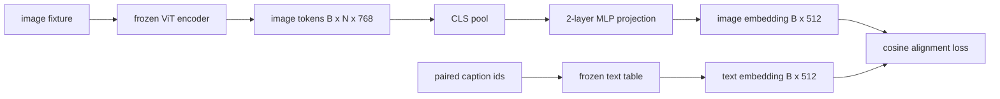

# 模态对齐的投影层

> 视觉编码器会生成图像 token，文本解码器会接收文本 token。两者位于不同的向量空间中。一个小型的两层 MLP 会把图像 token 投影到文本嵌入空间里，再通过与配对图像描述之间的余弦对齐损失，把两个空间拉到一致。这个投影层是视觉语言模型里最小的一块，也是迁移阶段最关键的一块。

**Type:** 构建
**Languages:** Python
**Prerequisites:** 第 19 阶段第 30–37 课（Track B 基础课）
**Time:** 约 90 分钟

## 学习目标

- 构建一个两层 MLP 投影层，把图像特征映射到文本嵌入空间中。
- 构造一个模拟文本嵌入表，不依赖预训练 tokenizer，也不依赖真实语料。
- 计算投影后图像 token 与对应图像描述嵌入之间的余弦对齐损失。
- 在冻结的视觉编码器和冻结的文本表之上，只训练投影层本身。

## 问题

你已经有了一个视觉编码器，也就是第 58-59 课，输出维度为 `vision_hidden = 768` 的 token。你还想接上一个文本解码器，它的嵌入维度是 `text_hidden = 512`，当然换成别的数字也完全合理。问题在于：解码器期望看到“长得像文本”的 token，而图像 token 并不是文本形状。它们处在视觉预训练阶段学到的那套基底里，和解码器的词向量空间没有天然关系。

两层 MLP 投影层，也就是 linear、GELU、linear，可以把这个缺口补起来。它只需要大约 `768 * 1024 + 1024 * 512 = 1.3M` 个参数，单卡几分钟就能训练完；同时它也是对齐阶段唯一真正需要学习的部分。视觉编码器保持冻结，文本嵌入表也保持冻结，只有这层投影在更新。这正是 LLaVA 在 2023 年采用的配方，也是 BLIP-2 用 Q-Former 重新表达过的思路，自那以后几乎所有开放权重 VLM 都以某种形式沿用了它。

## 概念



### 先池化，再投影

视觉编码器会发出 197 个 token，而文本侧这里只有一个图像描述级嵌入。要把两边对齐，你需要每个样本恰好对应一个图像级向量。CLS 池化是最简单的做法：取编码器输出的第一个 token，再把它投影出去。对全部 197 个 token 做均值池化也是另一种选择，SigLIP 就是这么做的。无论哪种做法，本质上都是把 197 个向量压成一个。

### 为什么是两层，而不是一层

单层线性投影可以做旋转和缩放，但如果两个空间之间存在“曲率”层面的不匹配，它就无能为力了。两层线性之间插入 GELU，相当于给这条投影增加一次非线性弯折；经验上，这已经足以把 CLIP 风格的视觉特征拉到语言模型的嵌入空间。更深的投影当然也有，比如 LLaVA-NeXT 使用 GLU，Qwen-VL 使用多层 attention；但两层 MLP 仍然是公认的基线，也是 BLIP-2 的 Q-Former projection head 在底层真正采用的形状。

| 层 | 形状 | 参数量 |
|-------|-------|------------|
| fc1 | `(vision_hidden, projection_hidden)` | `768 * 1024 + 1024` |
| 激活函数 | GELU | 0 |
| fc2 | `(projection_hidden, text_hidden)` | `1024 * 512 + 512` |

对一个 `768 -> 1024 -> 512` 的投影头来说，总参数量大约是 1.3M。

### 余弦对齐损失

“对齐”并不意味着 `image_emb == text_emb`。对齐的意思是，`image_emb` 在联合空间里要与 `text_emb` 指向相同方向。余弦损失是 `1 - cos_sim(image, text)`，范围从 0 到 2：0 表示完全对齐，2 表示方向完全相反。训练的目标，就是把每一对样本的这个值往 0 压。第 62 课会把它推广成一个对比学习批次，也就是 InfoNCE，让每张图都必须比批次里的其他图像描述更接近自己的图像描述；而本课先使用逐对版本，这样训练动力学最容易看清楚。

### 冻结编码器才是诀窍

视觉编码器有 86M 参数，文本表还有额外几百万。拿一个模拟语料去同时训练它们，根本不现实。把两边都冻结之后，真正变化的参数就只剩投影层这 1.3M；在合成样本对上跑几百步，就足以把损失往下压。这正是所有 adapter-based VLM 的运行形态：重的部分保持冻结，轻的桥梁负责学习。

```figure
ch-projection-bridge
```

## 动手实现

`code/main.py` 实现了：

- `MLPProjector(in_dim, hidden_dim, out_dim)`，一个带 GELU 激活的两层线性 MLP。
- `MockTextEmbedding(vocab_size, dim)`，一个冻结的嵌入表，使用固定 seed 做确定性初始化。
- `make_pair(seed, vocab_size)`，它会合成一条图像与描述配对的样本。描述是一段简短的 id 序列；图像描述嵌入通过对 token embedding 做均值池化得到。
- `cosine_alignment_loss(image_emb, text_emb)`，也就是逐对的 `1 - cos_sim` 目标。
- 一个训练循环：在 32 条合成样本对上循环训练投影层共 200 步，视觉编码器和文本表保持冻结，并每 25 步打印一次损失。

运行它：

```bash
python3 code/main.py
```

输出：训练会把初始大约 1.07 的损失，在 200 步内压到约 0.80，说明只训练投影层，就已经能够把图像 token 拉向文本空间。每对样本最终的 cosine similarity 也会一并打印出来。

## 实际使用

同样的模式出现在每一个开放权重 VLM 中：

- **LLaVA 1.5.** 使用双层 GELU MLP，把 CLIP-ViT-L hidden 映射到 LLaMA 的 embedding dim。视觉编码器冻结，LLM 冻结，第一阶段只训练投影层，第二阶段再解冻 LLM。
- **BLIP-2.** Q-Former 会让 32 个 learned query token 通过 cross-attention 读取图像 token，然后再投影到 LLM embedding dim。Q-Former 最后那个 projection head，就是本课 MLP 的对应物。
- **MiniGPT-4.** 使用单层线性投影，把 BLIP-2 Q-Former 的输出映射到 Vicuna embedding dim。
- **Qwen-VL.** 使用多层 cross-attention adapter，但最后那一步依然是投影到 LM embedding dim。

形状可能不同，但职责完全一样：先汇聚图像 token，再投影到文本 embedding dim，然后单独训练。

## 测试

`code/test_main.py` 覆盖：

- 投影器输出形状是否匹配配置好的 `out_dim`
- 冻结文本嵌入表是否真的让所有参数 `requires_grad` 为零
- 余弦损失在两个相同向量上是否为零，在两个反平行向量上是否为 2
- 一次 backward 之后投影器是否有梯度流动
- 训练循环是否能让 step 0 到 step 200 之间的损失下降

运行它们：

```bash
python3 -m unittest code/test_main.py
```

## 练习

1. 把 CLS pooling 换成对 196 个 patch token 做均值池化，并比较 200 步后的最终损失。均值池化通常在合成数据上收敛更快；CLS 在自然图像上通常具有更高的样本效率。

2. 给余弦损失加一个可学习的标量 temperature，也就是 `cos / tau`，然后观察当 `tau` 太小和太大时分别会发生什么。前者通常带来梯度噪声，后者则容易让损失长时间停在高位。

3. 把两层 MLP 换成单层线性层，量化最终损失的差距。非线性在自然图像特征上通常更重要，在合成特征上则没那么关键。

4. 给投影器权重加一个小小的 L2 penalty，并观察它与余弦对齐的相互作用。因为 cosine 本身尺度不变，所以这个 penalty 主要会把那些没被利用的方向压缩掉。

5. 把投影器权重持久化，再重新加载，并在不经过视觉编码器 backward pass 的情况下跑 inference，验证部署时真正需要的只有投影器。

## 关键术语

| 术语 | 含义 |
|------|---------------|
| 模态对齐 | 让图像嵌入和文本嵌入能够在同一个共享空间中比较 |
| 投影头 | 把一个空间映射到另一个空间的小模块，通常是一个两层 MLP |
| 余弦相似度 | 点积除以两个向量的 L2 范数之积 |
| 冻结编码器 | 视觉模型或文本模型的所有参数都设置为 `requires_grad=False` |
| 模拟语料 | 使用合成样本对，使训练不依赖下载真实数据集 |

## 延伸阅读

- LLaVA 论文介绍了两阶段训练法，也就是先训练投影层，再解冻 LM。
- BLIP-2 论文介绍了作为可学习投影替代方案的 Q-Former。
- Qwen-VL 技术报告展示了如何把 cross-attention adapter 做成更深的投影头。
