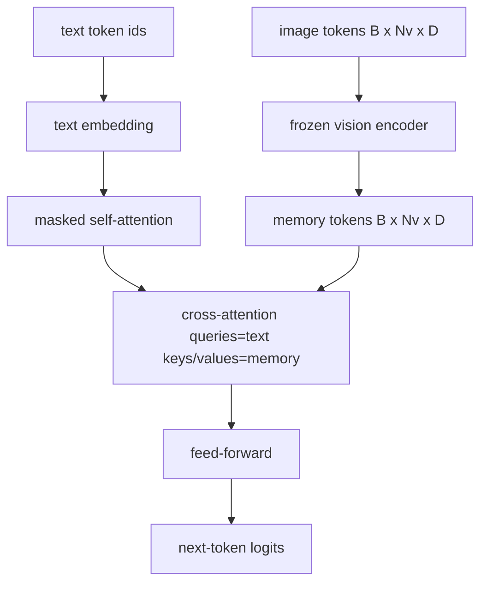
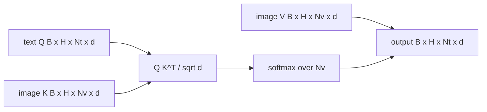

# 跨注意力融合

> 投影层（projection layer）只能把一个图像向量和一个图像描述向量对齐。真正的视觉语言解码器需要让每个文本 token 都能看到每个 patch token，这样模型才能把每个词落到具体区域上。跨注意力（cross-attention）就是这种落地对应关系真正发生的地方。文本负责提问；视觉侧的键和值（keys and values）负责回答。这一课会把跨注意力模块、带因果约束的文本自注意力，以及保证两者都合法的掩码形状一起搭起来。

**Type:** 构建
**Languages:** Python
**Prerequisites:** 第 19 阶段第 30–37 课（Track B 基础课）
**Time:** 约 90 分钟

## 学习目标

- 实现多头跨注意力，其中查询流来自文本，键/值流来自视觉。
- 组合一个解码器模块：因果自注意力 + 跨注意力 + 前馈层。
- 把掩码形状做对：自注意力用因果掩码，跨注意力不使用掩码。
- 在成批文本 token 和固定图像 token 池上跑通一次前向传播。

## 问题

把图像 token 和文本 token 直接拼成一个序列，是一种融合方式，也就是早期融合（early fusion），Chameleon 和 Emu3 走的是这条路。另一条路是跨注意力，也就是后期融合（late fusion），Flamingo 最先把它系统化，此后几乎所有 Flamingo 形状的解码器都在复用这条思路。在后期融合中，文本解码器只在纯文本 token 上运行，并在每一层通过跨注意力伸手去读取图像流。

后期融合有两个明显好处。第一，文本流保持干净，模型的纯文本能力更容易保住。第二，图像流每张图只需要计算一次，之后每个解码步骤都可以反复复用，因此即使图像描述很长，生成开销也不高。代价则是：每个模块都会多出一层注意力子层。

## 概念





### Mask 形状

解码器模块里的两种注意力需要不同的掩码：

| 注意力类型 | 查询长度 | 键长度 | 掩码 | 原因 |
|-----------|--------------|------------|------|-----|
| Self-attention | `Nt`（文本） | `Nt`（文本） | 因果掩码：下三角矩阵 `(Nt, Nt)` | 自回归生成时，文本 token 不能查看未来位置 |
| Cross-attention | `Nt`（文本） | `Nv`（视觉） | 无掩码 | 每个文本位置都可以看到整张图像 |

本课还包含一个形状校验函数，因此一旦把两种掩码搞混，会直接抛出 `ValueError`，而不是悄悄得到一条已经损坏的损失曲线。

### 为什么跨注意力不需要掩码

在生成任何文本之前，整张图像已经是完全可见的。图像描述中的第 `t` 个 token 可以看到图像里的任意一个 patch；图像 patch 本身不存在时间顺序。某些 Flamingo 变体在交织多个图像与多个文本片段时，会加上按样本变化的掩码模式；但对于“一张图像 + 一条图像描述”这一最基本情况，跨注意力就应该看到全部视觉内容。

### 键值缓存

图像的键和值会在解码开始时计算一次，然后放进缓存。之后每来一个新的文本 token，都直接复用这个缓存，而不重新计算。这正是图像描述任务在推理阶段足够快的原因：重的 ViT 只运行一次；跨注意力在后续每一步都只重复利用现成的键和值。本课会显式暴露缓存，并测试命中缓存的路径。

### Block 组合方式

一个解码器模块的顺序是：pre-LN -> self-attention -> residual -> pre-LN -> cross-attention -> residual -> pre-LN -> feed-forward -> residual。总共三个子层，每一个都有自己的 LayerNorm。Flamingo 论文曾在跨注意力上加了一个可学习门控，让模型可以在付出训练稳定性代价的前提下选择退出图像路径；本课采用的是最标准的基线做法，不加门控。

```python
class DecoderBlock:
  def forward(self, text_tokens, image_tokens, text_mask, cross_mask):
      text_tokens = text_tokens + self.self_attn(self.ln1(text_tokens),
                                                 mask=text_mask)
      text_tokens = text_tokens + self.cross_attn(self.ln2(text_tokens),
                                                  image_tokens,
                                                  mask=cross_mask)
      text_tokens = text_tokens + self.ffn(self.ln3(text_tokens))
      return text_tokens
```

```figure
ch-crossattn-fan
```

## 动手实现

`code/main.py` 实现了：

- `CrossAttention(hidden, heads)`，一个带独立 `q` 和 `kv` projections 的 multi-head cross-attention。
- `CausalSelfAttention(hidden, heads)`，也就是标准 decoder 里的 masked self-attention。
- `DecoderBlock`，把三个 sub-layers 按 pre-LN residual 方式组合起来。
- `VisionLanguageDecoder`，一个四层 decoder，输入来自 mock vision encoder 输出和一个很小的文本 embedding table。
- `causal_mask(length)`，返回一个 `(length, length)` 的 lower-triangular boolean tensor。
- 一个 demo：给入 batch size 为 2、长度为 10 的文本序列，以及长度为 197 的图像记忆张量，并打印输出形状、自注意力掩码形状，以及每个位置的跨注意力输出范数。

运行它：

```bash
python3 code/main.py
```

输出：解码器会产生一个 `(2, 10, text_vocab)` 的 logits 张量。掩码形状是 `(10, 10)`。KV 缓存的复用检查会确认使用缓存和不使用缓存两条路径产出的 logits 完全一致。

## 实际使用

跨注意力主要出现在两大生产模型家族中：

- **Flamingo 和 IDEFICS。** 每隔 K 个语言模型模块插入一个跨注意力子层，并保持 LM 冻结。视觉语言适配器就是这块跨注意力再加上它的门控。
- **BLIP-2。** Q-Former 会用一组固定的 32 个查询 token 通过跨注意力去读取图像特征，然后再把这些查询向量投影到 LM 的嵌入空间。

本课这个模块的形状，能够直接映射到这两类实现上。掩码纪律也是一样的：自注意力上用因果掩码，跨注意力上不用。

## 测试

`code/test_main.py` 覆盖：

- causal mask 是否真的是下三角，并且匹配预期的布尔形状
- cross-attention 输出形状是否始终等于 `(B, Nt, hidden)`，不受键长度影响
- KV-cache 路径是否在浮点容差内与未使用缓存的路径一致
- 文本流和图像流之间发生形状不匹配时，是否会抛出清晰的 `ValueError`
- 一个完整解码器前向传播是否产出正确的批次和序列形状

运行它们：

```bash
python3 -m unittest code/test_main.py
```

## 练习

1. 给跨注意力残差增加一个可学习的 tanh 门控，也就是 Flamingo 的那套技巧，并验证从接近零的初始门控出发仍然可以收敛。门控从 0 开始时，模型会先恢复纯文本行为，再逐步把图像流混进来。

2. 实现交错式注意力，使同一个解码器能同时消费多张图像和多个文本片段。构造按样本变化的跨注意力掩码，确保文本片段 2 不会看到图像 1。

3. profile 跨注意力与自注意力在 `Nt=64, Nv=576`，也就是更高分辨率下 24x24 网格时的耗时。跨注意力的复杂度是 `Nt * Nv`，在图像分辨率较高时会成为主导开销。

4. 给跨注意力图加一个查询侧 dropout，并在 demo 上测量图像描述的多样性。随着跨注意力图中的 dropout 增强，图像描述样本方差通常会上升。

5. 把跨注意力层换成一个 Q-Former 风格的注意力模块，让固定的 32-token 查询池在每层只读取一次图像特征。

## 关键术语

| 术语 | 含义 |
|------|---------------|
| Late fusion | 文本和视觉分别保留在独立的数据流中，由 cross-attention 在每个 block 连接两者 |
| Cross-attention | Q 来自一条数据流，K 和 V 来自另一条数据流 |
| Causal mask | 防止自回归生成时查看未来位置的下三角布尔掩码 |
| KV cache | 图像的键和值只存储一次，并在每个解码步骤中复用 |
| Memory tokens | 解码器反复读取的冻结图像 token |

## 延伸阅读

- Flamingo (2022) 介绍了带 gated cross-attention 的标准 late-fusion 设计。
- BLIP-2 (2023) 展示了 Q-Former，它本质上是披着 learned query pool 外衣的 cross-attention block。
- IDEFICS (2023) 是 Flamingo 配方的一份开源复现。
