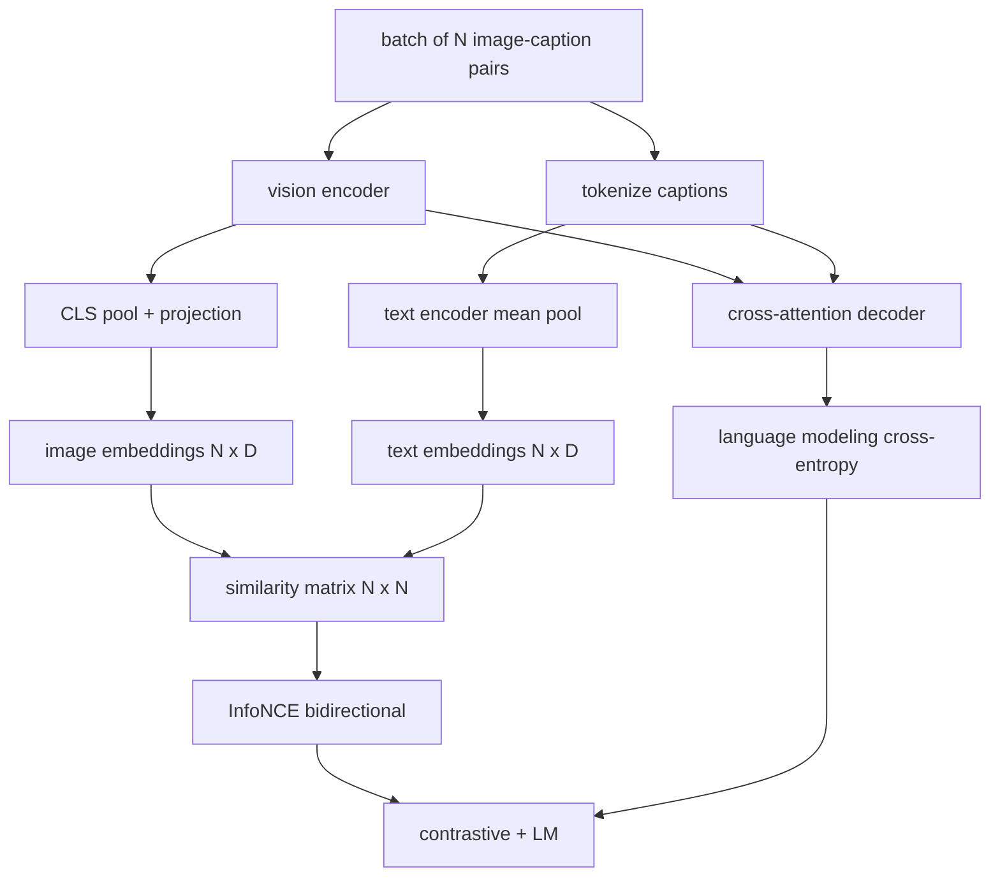

# 视觉-语言预训练

> 编码器、投影层和解码器现在都已经接好线了。接下来要做的是把它们一起训练起来。学习由两个目标共同驱动：其一是对比式图文损失 InfoNCE，它会在联合嵌入空间里把匹配的图文对拉近；其二是语言建模损失，它要求解码器为每张图像生成标题。二者结合后，网络既学会“给定标题找到正确图像”，也学会“给定图像写出标题”。

**Type:** 构建
**Languages:** Python
**Prerequisites:** 第 19 阶段第 30–37 课（Track B 基础课）
**Time:** 约 90 分钟

## 学习目标

- 在一批图像-标题对上实现 InfoNCE 对比损失。
- 把对比损失与自回归语言建模损失组合起来。
- 合成一个 200 对的模拟图像-标题语料，而不下载任何真实数据集。
- 运行一个 50 步的演示训练循环，并观察两种损失都下降。

## 问题

视觉-语言模型需要掌握两种能力。它必须会排序：给定一个标题，在很多图像里找出正确的那一张。它也必须会生成：给定一张图像，写出相应标题。只在其中一种能力上做预训练，你得到的都只是半套系统。CLIP 把排序做得很好，但不会生成标题。GPT-4V 可以生成标题，但排序依赖独立的检索头。多目标预训练则能一次把两者都学到。

InfoNCE 负责其中的排序一半。对一个大小为 N 的 batch，模型会把 N 个匹配对视作正样本，把 `N^2 - N` 个不匹配对视作负样本，然后在得到的 `(N, N)` 相似度矩阵上计算交叉熵损失。LM 损失负责生成一半：它是在图像条件下做标准的 next-token prediction。这两个损失都是可微的，而且可以共享编码器、投影层和解码器参数。

## 概念



### 一段话说清 InfoNCE

把 N 个图像嵌入按行堆起来，把 N 个文本嵌入也按行堆起来。对两者都做 L2 归一化。然后计算 `N x N` 矩阵 `S = I T^T / tau`，其中 `tau` 是一个可学习温度。对角线元素对应匹配对，非对角线元素对应负样本。接着以对角线为目标做交叉熵，让 `argmax` 沿对角线向下运行：第 `i` 行的最大值应该落在第 `i` 列。再沿列方向对称地做一遍。最后取两者平均。这就是 CLIP 损失，核心代码只要八行。

### 温度为什么重要

温度 `tau` 决定 softmax 有多尖锐。太小，例如 `tau = 0.01`，梯度几乎只来自最难的那个负样本，训练会很噪。太大，softmax 会变平，梯度就会消失。CLIP 把 `tau` 作为一个可学习参数，本课的演示也采用同样做法。

### 语言建模损失

解码器通过 cross-attention 读取图像 memory tokens，并在每个位置预测下一个文本 token。损失是标准的交叉熵，目标是下一个位置的 token。padding 位置会从损失中屏蔽掉。

### 组合损失

`total = contrastive + lm_weight * lm`，其中 `lm_weight` 是一个标量，通常取 1.0。两种损失都会把梯度送回编码器和投影层；只有解码器会接收到 LM loss 的梯度。这正是 CoCa、BLIP 和 SigLIP 风格模型使用的多任务配方，只是各家权重配置不同。

| 组件 | 损失表面 | 影响 |
|-----------|--------------|---------|
| InfoNCE | 联合空间中的对排名 | 编码器+投影+文字头 |
| LM | 在图像条件下做 token 预测 | 编码器 + 投影层 + 解码器 |
| Combined | 多任务 | 整个模型栈 |

### 为什么50步足以演示

模拟语料是一个由随机图像和随机标题 id 构成的 200 对合成集合。用 batch size 16 跑 50 个 SGD step 后，即便绝对损失值仍高于真实数据模型能达到的水平，两种损失都会出现明显下降。这个演示的重点不是做到多强，而是确认梯度管线已经端到端打通，并且加入 LM 损失不会破坏对比目标的稳定性。

```figure
ch-infonce-diagonal
```

## 动手实现

`code/main.py` 实现了：

- `MultimodalModel`，它把一个小型 ViT 编码器、MLP 投影层、一个文本侧小编码器（对嵌入后的 id 做 mean-pool）以及第 61 课的 cross-attention 解码器组合起来。
- `info_nce_loss(image_emb, text_emb, temperature)`，也就是双向 CLIP 风格对比损失。
- `lm_loss(logits, target_ids, padding_id)`，即屏蔽 padding 的 next-token 交叉熵。
- `make_mock_corpus(seed, n_pairs)`，返回 200 个确定性的 (image, caption_ids) 对。
- 一个训练循环：运行 50 step，batch size 为 16，使用 Adam 优化器，并学习一个 log-temperature 参数。每 5 step 打印一次两种损失。

运行它:

```bash
python3 code/main.py
```

输出表现为：对比损失会从大约 `ln(16) = 2.77` 降到接近 2.4；LM 损失会从随机均匀基线 `ln(512) ≈ 6.24` 降到大约 4.7。两者都下降，说明梯度接线是正确的。真实模型会训练数百万步，但动力学形状是一样的。

## 实际应用

这套损失配方就是这些实际系统在用的那一套：

- **CLIP (2021).** 只有图文对比，没有原生标题生成，只能靠单独的 caption probe。
- **CoCa (2022).** 在一个模型中同时做图文对比和图像标题 LM。它和本课最接近。
- **BLIP (2022) and BLIP-2.** 对比损失加上 LM，再加图文匹配头，三种损失一起训练。
- **SigLIP (2023).** 把 InfoNCE 换成 sigmoid pair loss；对比目标不变，只是函数形式变了。
- **LLaVA family.** 两阶段训练：第一阶段做 alignment，第二阶段在解冻 LM 后加入 LM loss。第 60 课对应第一阶段，本课对应第二阶段。

## 测试

`code/test_main.py` 覆盖：

- InfoNCE 损失在图像/文本两个方向上是对称的
- 当相似度矩阵是大正数构成的完美对角阵时，InfoNCE 损失返回 0
- LM 损失会正确屏蔽 padding 位置
- 模型前向传播能无报错地产生两项损失
- 5 步训练循环会让总损失下降

运行它们:

```bash
python3 -m unittest code/test_main.py
```

## 练习

1. 把 InfoNCE 换成 SigLIP 风格的 sigmoid pair loss，并比较它在模拟语料上的收敛情况。

2. 加一个 hard-negative mining 步骤：每隔一个 batch，从前一个 batch 中选最难的 off-diagonal pair 拼进当前训练。观察对比损失是否下降更快。

3. 在联合嵌入之上加一个图文匹配二分类头，也就是判断“这对是否匹配”，作为第三个损失，复刻 BLIP 的三头训练配置。

4. 把模拟语料换成从一个 Markov chain 采样出的 caption-id 序列，并让转移矩阵依赖图像 hash。这样标题损失应该还能降得更多，因为数据里真的有可学习结构。

5. 用 `lm_weight = 0` 训练一次，再用 `lm_weight = 1` 训练一次。比较对比损失；LM loss 不应该把排序目标带偏。

## 关键术语

| 术语 | 含义 |
|------|---------------|
| InfoNCE | Noise contrastive estimation：在相似度矩阵上做交叉熵 |
| Temperature | 控制对比 softmax 尖锐程度的标量 |
| Hard negative | 模型觉得很容易混淆的非对角样本，适合重点采样 |
| LM loss | 标题生成一侧的标准 next-token 交叉熵 |
| Joint embedding space | 图像与文本向量投影后共同落入的共享空间 |

## 进一步阅读

- CLIP 论文，了解最初的图文对比训练配方。
- CoCa 论文，了解如何在一个模型里同时做对比与标题生成。
- SigLIP 论文，了解 sigmoid pair-loss 变体及其更好扩展性的原因。
