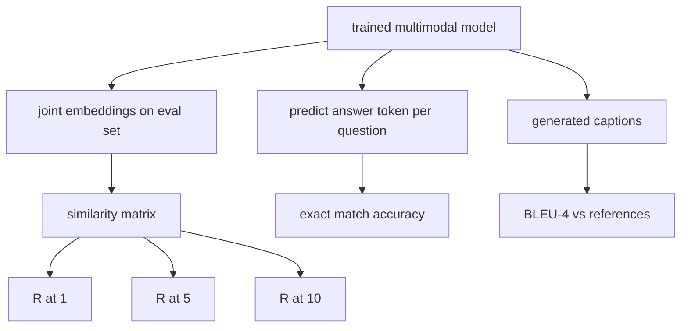

# 多模态评估

> 训练只完成了一半闭环，另一半是测量。本课从最基础的原语出发，搭起三个评估面：图像-标题检索，用 R@1、R@5、R@10 报告；视觉问答，用 exact match accuracy 报告；图像标题生成，用 BLEU-4 报告。每个指标本质上都是一个作用于模型输出的函数，再配上一个几秒内就能跑完的合成评估套件。

**Type:** 构建
**Languages:** Python
**Prerequisites:** 第 19 阶段第 58–62 课（Track E 基础课：encoder、transformer、projection、cross-attention fusion、pretraining）
**Time:** 约 90 分钟

## 学习目标

- 从图像嵌入与标题嵌入的相似度矩阵中计算 Recall@K。
- 对一个把 (image, question) 映射到固定答案词表的模型，计算 exact-match VQA accuracy。
- 在不依赖任何外部库的前提下，根据生成序列与参考序列计算 BLEU-4。
- 把这三个评估都运行在一个建立于第 62 课训练模型之上的合成评估套件上。

## 问题

当训练损失进入平台期时，很容易误以为一个多模态模型已经“完成”了。但训练损失衡量的是模型对训练分布的拟合，并不直接说明它是否能在留出的 batch 上正确排序图文对、回答问题，或者写出人能接受的标题。标准上通常要看三个评估面：

- **Retrieval (R@1, R@5, R@10).** 构造查询标题的联合嵌入；按 cosine 对评估池中的所有图像排序；报告对应图像是否落在 top 1、top 5、top 10。对称的 image-to-text 评估也是同样思路。
- **Visual question answering (exact match).** 给定 (image, question)，模型输出一个答案 token。exact match 是逐样本的一比特评分：预测答案是否等于参考答案。对整个评估集求平均。
- **Captioning (BLEU-4).** 生成一个标题。然后计算它相对参考标题的 1-gram 到 4-gram precision 几何平均值，并乘上 brevity penalty。标准形式通常支持 multi-reference，也就是一张图像对应多个参考标题。

每个指标本质上都只是一个薄薄的函数。本课把它们全部手写出来，让数学保持具体、可控。真实基准套件，例如 MS-COCO、VQA v2、GQA、OK-VQA，也都是把数据接到同样的函数形状里。

## 概念



### 从相似度矩阵计算 Recall@K

先构造图像嵌入和标题嵌入之间的 `(N, N)` cosine similarity matrix。对每一行，按相似度从高到低排序列。Recall@K 指的是：对角线上对应的那一列，是否落在前 K 个位置之内。对称的 Recall@K（caption-to-image）则是在转置矩阵上计算。两个方向都要报告。对于一个 N=100 的评估集，如果 R@1 = 0.6，就表示 100 个标题里有 60 个把正确图像排在了第一位。

### VQA 的 Exact Match

对于每个 (image, question, answer)，先编码图像，再嵌入问题，通过解码器融合，并读出下一个 token。预测出的 token id 与参考 id 做比较；相等则算正确。最后对整个评估集求平均。真实 VQA 数据集通常会为同一个问题提供多个人工答案，并采用 soft-accuracy 公式，例如 VQA v2 会在至少 3 个标注者同意时给到 1.0，低于这个数量则按比例缩放。本课为了保持清晰，只使用单参考答案的 exact match。

### BLEU-4

```text
BLEU-4 = BP * exp(mean(log p1, log p2, log p3, log p4))
```

其中 `p_n` 是 modified n-gram precision，也就是：生成序列中出现在任一参考里的 n-gram 个数，按 clip 之后除以生成出的 n-gram 总数；而 `BP` 是 brevity penalty：

```text
BP = 1                if generated length > reference length
   = exp(1 - r/g)     otherwise, where r is reference length and g is generated
```

在小样本场景下需要 smoothing，因为有些 `p_n` 可能为零。实现中使用 Chen and Cherry 的 “method 1”，也就是当某一阶计数为零时，给分子分母都加 1。这是低计数 regime 里最稳妥的默认方案。

### 合成评估套件
一个 50 样本的评估套件会在内存里构造出来，模式沿用第 62 课的 mock corpus，但使用不同的 held-out seed。这个套件由三组列表组成：

- `pairs`: 50 个 (image, caption_ids) 对，用于 retrieval。
- `vqa`: 50 个 (image, question_ids, answer_id) 三元组。
- `caps`: 50 个 (image, [reference_caption_ids, ...]) 条目，每张图像最多有 3 个参考标题。

这个套件由 seed 决定，是确定性的，并且与训练语料分离，所以所有指标都计算在模型从未见过的数据上。把这套评估样本持久化成 JSON 被留作练习题。

| 指标 | 取值范围 | 随机基线 (N=50) |
|--------|-------|------------------------|
| R@1 | 0 to 1 | 0.02 (1 / N) |
| R@5 | 0 to 1 | 0.10 |
| R@10 | 0 to 1 | 0.20 |
| VQA EM | 0 to 1 | 1 / vocab |
| BLEU-4 | 0 to 1 | 较小但不为零 |

对于一个只在合成数据上训练了 50 step 的模型，我们不期待这些指标很高；我们期待的是它们能高于随机基线，而这正是演示在验证的事情。

```figure
ch-recall-window
```

## 动手实现

`code/main.py` 实现了：

- `recall_at_k(sim_matrix, k)`，返回 `[0, 1]` 区间内的浮点数，并对两个方向都计算。
- `vqa_exact_match(predictions, references)`，返回 `int` 相等关系的平均值。
- `bleu4(generated, references, smoothing=True)`，支持 multi-reference。
- `build_eval_suite(seed, n_samples, vocab_size, max_len)`，返回三个确定性的评估列表。
- `evaluate(model, suite)`，运行三个指标并返回一个 `dict`，里面装的都是数字。
- 一个 demo：它会加载第 62 课中一个刚初始化好的多模态模型，先评估，再训练 50 step，再评估，并打印前后对比指标。

运行它:

```bash
python3 code/main.py
```

输出中会看到一张 before/after 指标表：retrieval 会从接近随机逐步抬升到能反映已学到信号的水平，VQA 会高于随机，BLEU-4 也会提升，因为合成数据结构已经足够带来 4-gram precision 的改善。

## 实际应用

每个指标都可以直接映射到真实生产基准：

- **Retrieval.** MS-COCO 5K val、Flickr30K、ImageNet zero-shot，本质上都是在同样的相似度矩阵上做 R@K。把合成 eval 换成真实数据文件，函数签名并不需要改。
- **VQA.** VQA v2、GQA、OK-VQA 用的也是同样的 exact-match 外形，只不过 VQA v2 把 single-answer EM 换成了 soft-acc。
- **BLEU-4.** MS-COCO captioning、NoCaps、Flickr30K captioning 都会用 BLEU-4，再加上 CIDEr 和 METEOR。要加 CIDEr，只需要再补一个函数。

面对真实 benchmark，你需要替换的是 `build_eval_suite`，而不是评估函数体本身。数学是 benchmark-agnostic 的。

## 测试

`code/test_main.py` 覆盖：

- 在完美 identity similarity matrix 上，recall@k 返回 1.0；在完全翻转矩阵上，当 k < N 时返回 0.0
- recall@k 会遵守 `k <= N` 的上界
- 当生成序列与某个参考完全一致时，bleu4 返回 1.0
- 当词表完全不相交时，bleu4 返回 0.0
- vqa exact match 的结果等于相等样本对的比例
- build_eval_suite 会返回预期数量的 pairs、vqa 项和 caption entries

运行它们:

```bash
python3 -m unittest code/test_main.py
```

## 练习

1. 给 captioning metrics 增加 CIDEr。CIDEr 会对 n-gram 使用 TF-IDF 权重，因此更奖励信息量大的 token。

2. 实现 soft-accuracy VQA：每个问题对应多个人工答案，当预测命中任一答案时，得分为 `min(human_count / 3, 1)`。这就是 VQA v2 的做法。

3. 给 `bleu4` 增加一个 NaN-safe 版本，使它在面对空生成序列时不会崩溃。

4. 在 R@K 之外计算 mean reciprocal rank (MRR)。MRR 对正确项落在 top K 外的具体位置敏感；R@K 只关心它是否落入 top K。

5. 在训练的五个 checkpoint 上运行评估，也就是 step 0、10、20、30、40、50，并画出 learning curve。验证指标轨迹是否跟损失轨迹同步变化。

## 关键术语

| 术语 | 含义 |
|------|---------------|
| R@K | 查询中正确匹配落在前 K 个结果内的比例 |
| Exact match | 最简单的 VQA 计分方式：预测答案等于参考答案 |
| BLEU-4 | 带 brevity penalty 的 1 到 4-gram precision 几何平均值 |
| Multi-reference | 一个标题指标允许每张图像对应多个参考标题 |
| Held-out | 评估集使用的 seed 与训练语料不同，彼此隔离 |

## 进一步阅读

- VQA v2 论文，了解 soft-accuracy 公式与数据集统计。
- CIDEr 论文，了解对 n-gram 做 TF-IDF 加权的 captioning 评分。
- BLEU 原始论文（Papineni et al., 2002），了解不同 smoothing 变体。
- MS-COCO captioning eval scripts，了解规范参考实现。
