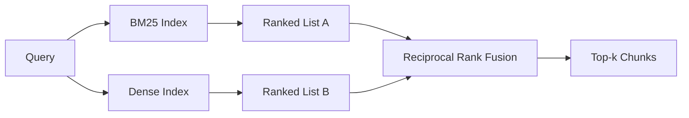

# 用 BM25 与 Dense Embeddings 实现混合检索

> lexical retrieval 和 semantic retrieval 会分别在相反的查询分布上失效。用 reciprocal rank fusion 做 hybrid retrieval，不是在两者之间做插值，而是让它们投票，而这种投票机制能在各类查询上都占优。

**Type:** 构建
**Languages:** Python
**Prerequisites:** 第 11 阶段第 04 课（embeddings）、第 06 课（RAG）；第 19 阶段 Track B 基础课（第 20–29 课）；第 19 阶段第 64 课（chunking strategies）
**Time:** 约 90 分钟

## 学习目标
- 按 Robertson 和 Sparck Jones 的公式从零实现 BM25，包含 field weighting、document length normalization，以及可调的 k1 和 b。
- 基于一个确定性的 mock embedding 构建 dense retriever，使整个循环可离线运行。
- 严格按 Cormack、Clarke、Buettcher 在 2009 年发表的形式实现 reciprocal rank fusion，并解释它为什么优于基于分数权重的插值。
- 调节 RRF 的 k 常量和各模态权重，并在一个小型 fixture corpus 上读出其中的权衡。

## 问题

当查询里带有语料中逐字出现的 identifier 时，lexical search 会赢。比如针对 `AbortMultipartOnFail` 的查询，BM25 能在微秒级把正确的 Go 函数排到前面。同样的查询如果走 embedding，会落在三个相似 cluster 的边缘，dense retriever 反而可能把错误文件排在第一位。

而当查询是对原文的 paraphrase 时，dense search 会赢。一个用户问 “how do we handle cancelled uploads”，并没有显式出现 abort 或 multipart。BM25 会因为 uploads 这个词，把 “uploading large files” 的文档 chunk 提上来。dense retrieval 则更可能找到那个摘要里提到了 cancellation 的 abort function。

两者之间并不是做一次静态选择就结束了。变化项在于 query distribution。一个生产级 RAG 系统要在同一个 endpoint 上同时处理这两类查询，因此检索层必须能同时覆盖它们。这就是 hybrid retrieval，而真正必须做对的部分，是 merge step。

## 概念



### 用一段话说清 BM25
BM25 的打分方式是：对查询里的每个 term，计算一个 inverse document frequency，再乘上一个会饱和的 term-frequency 因子，并附带 document length normalization。它有两个旋钮。`k1` 控制 term frequency 的饱和速度；默认值 1.5 是论文推荐值，没有 benchmark 就不该乱动。`b` 控制文档长度在多大程度上参与惩罚；默认值 0.75 表示长文档会受罚，但不是线性受罚。

IDF 采用带平滑的 Robertson and Sparck Jones 形式，也就是 `log((N - df + 0.5) / (df + 0.5) + 1)`。log 里面额外加的 1 很关键，它保证了当某个 term 出现在超过半数语料中时，IDF 仍然保持正值。在小语料里，这一点尤其重要，因为 stopwords 往往在统计意义上并没有高到足以被自然压平。

field weighting 允许你告诉 BM25：symbol name 上的命中，比正文里的命中更值钱。实现方式是在索引阶段对 term count 做乘法，而不是在打分阶段再去加权。这样数学形状保持不变，也不用为每个 field 再单独维护一套分数。

### 用一段话说清 Dense Retrieval
对每个 chunk，用 embedding model 把它映射到固定维度的向量。查询时，对 query 也做 embedding，然后按 cosine similarity 对所有 chunk 排序，取 top-k。真正决定质量的是 model 本身；retrieval 算法本身只有两步：dot product 和 sort。

本课用的是一个确定性的 hash-based embedding，这样你可以在完全离线的情况下看清 fusion 的数学。这个 hash 会把 token-keyed offsets 累加到一个 96 维向量里，然后做归一化。因为跨运行是确定性的，所以测试套件才能稳定断言排序结果。

### Reciprocal Rank Fusion 的正式公式
两份 ranked list。对于出现在任意一份列表中的每个 candidate，把它在每个列表里的 reciprocal-rank contribution 加起来。2009 年论文用的公式是 `1 / (k + rank)`，默认 k 取 60。最后按总分排序。算法本体就这么简单。

论文里给出的 k = 60 不是随手拍的。取 k = 60 时，rank-1 的贡献是 1 / 61，rank-10 的贡献是 1 / 70。也就是说，贡献衰减得比较慢，排位较深的候选项依然保有投票权。较小的 k 会让最前面的结果更占主导；较大的 k 会把整条贡献曲线压平。

我们的实现里还有两个可调旋钮。一个是 `k` 常量本身，另一个是每个 modality 的权重，这样当你已经有证据知道某个模态在你的 corpus 上更强时，就可以适度 boost BM25 或 dense。最直接、也最合理的实现方式，是把每个 rank contribution 乘上该模态的权重；这样既保留了 rank-decay 的形状，也仍然是 scale-free 的。

### 为什么它优于分数插值
BM25 的分数没有上界，而且高度依赖 corpus。cosine similarity 则被限制在 -1 到 1 之间。像 `alpha * bm25 + (1 - alpha) * cosine` 这样的线性插值，意味着你得按 corpus 调 alpha，而且每次 reindex 之后都可能要重调。rank-based fusion 则没有这个问题，因为 rank 在不同 modality 之间天然可比较。RRF 这条基线，自 2010 年以来在公开 TREC track 上一直比 score interpolation 更稳。

这也是你在 Vespa 和 Weaviate 文档里会反复听到的结论：除非你手里有非常强的证据表明应该融合分数，否则就坚持 rank-based fusion。

```figure
rrf-fusion
```

## 动手实现

`code/main.py` 实现了：

- `tokenize(text)`，一个快速 regex tokenizer。
- `BM25Index`，支持 field weighting，提供 `add` 与 `search`，并允许调节 k1 与 b。
- `mock_embed` 和 `DenseIndex`，使用与第 64 课相同的确定性 embedding，这样 chunk 可直接比较。
- `rrf(rankings, k, weights)`，即带 multi-modality weights 的 published fusion 公式。
- `HybridRetriever`，把 BM25 和 dense 组合起来。
- 一个 demo `main()`：它会加载一个小型 fixture corpus，运行三种分别针对各 retriever 强项和短板的查询，然后打印每个 modality 的 ranking 以及融合后的 fused list。

运行它:

```bash
python3 code/main.py
```

把 demo 输出并排读一遍。literal identifier 查询会落在 BM25 rank 1、dense rank 4、RRF rank 1。paraphrased query 会落在 BM25 rank 6、dense rank 1、RRF rank 1。ambiguous query 会落在 BM25 rank 3、dense rank 3、RRF rank 1。fusion 不是一个 tie-breaker，它本身就是那个能在各类查询上都赢的系统。

## 调参旋钮

| 旋钮 | 默认值 | 适合调高的情况 | 适合调低的情况 |
|------|---------|----------------|------------------|
| BM25 k1 | 1.5 | 术语在文档中频繁重复，而且你希望词频更有影响力 | 文档很短，重复更多只是噪音 |
| BM25 b | 0.75 | 长文档确实平均每个词承载更少信息 | 文档长度与主题关系不大 |
| RRF k | 60 | 希望排位较深的候选仍然保有投票权 | 希望 top-1 更强势地主导结果 |
| BM25 weight | 1.0 | 语料里有大量字面 identifier，且查询会直接命中它们 | 查询更多是用户自己的转述 |
| Dense weight | 1.0 | 查询以转述为主 | 查询大多是字面表达 |

调参要靠重新运行第 68 课的 eval harness，基于你的 held-out query set，而不是靠直觉。

## Demo 无法暴露的失败模式

**Out-of-vocabulary tokens.** BM25 的 IDF 完全来自语料，因此只出现在 query 里的词不会带来任何贡献。dense embeddings 则会给同样的 term“幻觉出”一个向量。对于语料外 identifier，这往往会返回看起来很合理但实际错误的 neighbors。fusion 能部分吸收这个问题，因为 BM25 什么也没返回时，它的 rank contribution 就自然缺席了，但前提是你做的是按 document 去重，而不是按 chunk 去重。

**Stop-token domination.** 如果 query 是 the 这种词，BM25 会在全语料上给出几乎均匀的排序。要么在 indexer 里过滤 stop tokens，要么接受高-IDF terms 会自然占主导。

**Identical content across modalities.** 如果你的语料小到 BM25 的 top-1 也是 dense 的 top-1，那么 RRF 也只会给你同样的 top-1 和相近邻居。这不是失败，而是正确行为，但它会让 fusion 看起来像是“没起作用”。在 eval 里补一组 adversarial query pair，才能验证 fusion 真的在工作。

## 用它

生产实践：

- 在进程内建立 BM25 index；瓶颈是 term-frequency 字典，不是向量。
- 在单独的 store 里维护 dense vectors。本课里我们用 flat list，生产里一般会用 HNSW。
- 两路查询并行发出；fusion 只是在 union 上做常数时间级别的 merge。
- 记录每个 hit 是由哪个 modality 投票支持的，这样下游 reranker 才能利用这些信息。

## 放进系统里

第 66 课会接收本课 fused top-k 的输出，再用 cross-encoder 做 rerank。第 68 课会用 precision、recall、MRR、nDCG 对整个 pipeline 做评估。本课里的 hybrid retriever，是第 69 课端到端系统的第一阶段。

## 练习

1. 把 `mock_embed` 换成你 provider 的真实模型。重新跑 demo，并报告 paraphrased query 上 dense-only ranking 发生了什么变化。
2. 增加第三个 modality：单独索引 chunk summaries，然后把它作为第三个 ranked list 融合进去。测量增益。
3. 把 RRF k 扫过 10、30、60、100、200。用第 68 课的 eval harness 画 recall@k 曲线，并报告你语料上曲线的峰值出现在什么 k。
4. 正式实现 BM25F，也就是 per-field length normalization，而不是当前这个 multiplier trick。然后在一个 symbol match 特别重要的语料上比较两者。

## 关键术语

| 术语 | 人们常说的话 | 它真正表示什么 |
|------|-----------------|------------------------|
| BM25 | "Lexical search" | idf x 饱和 tf x 长度归一化的概率排序 |
| RRF | "Rank fusion" | 在 ranked list 上求 1 / (k + rank) 之和；默认 k = 60 |
| k1 | "TF saturation" | 控制重复 term 多快停止继续增加分数 |
| b | "Length penalty" | 0 表示忽略文档长度，1 表示完全归一化 |
| Field weighting | "字段加权" | 在索引时重复某 field 中的 token，以抬高该 field 的命中 |
| 基于排名与基于分数的融合 | "为什么 RRF 胜过线性融合" | rank 在不同 modality 间可比较，而 raw score 不可比较 |

## 进一步阅读

- Cormack、Clarke、Buettcher，《Reciprocal Rank Fusion outperforms Condorcet and individual rank learning methods》，SIGIR 2009
- Robertson、Walker、Beaulieu、Gatford、Payne，《Okapi at TREC-3》（最早的 BM25 论文）
- [Vespa: Hybrid Retrieval with BM25 and Embeddings](https://docs.vespa.ai/en/tutorials/hybrid-search.html)
- [Weaviate: Hybrid Search](https://weaviate.io/developers/weaviate/search/hybrid)
- 第 11 阶段第 06 课 - RAG 基础
- 第 19 阶段第 64 课 - 其输出会在这里被编入索引的 chunker
- 第 19 阶段第 66 课 - 消费融合后 top-k 结果的 cross-encoder reranker
